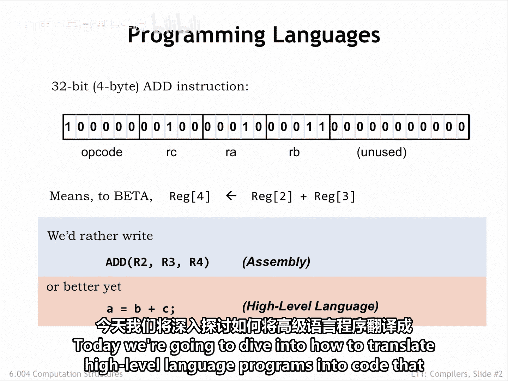
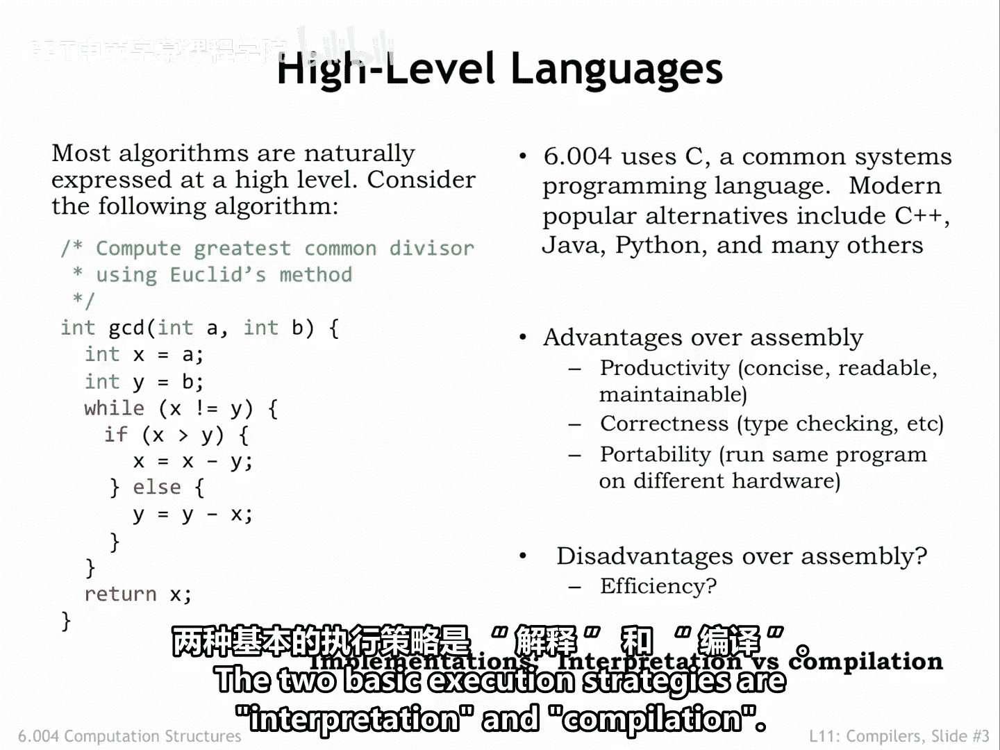
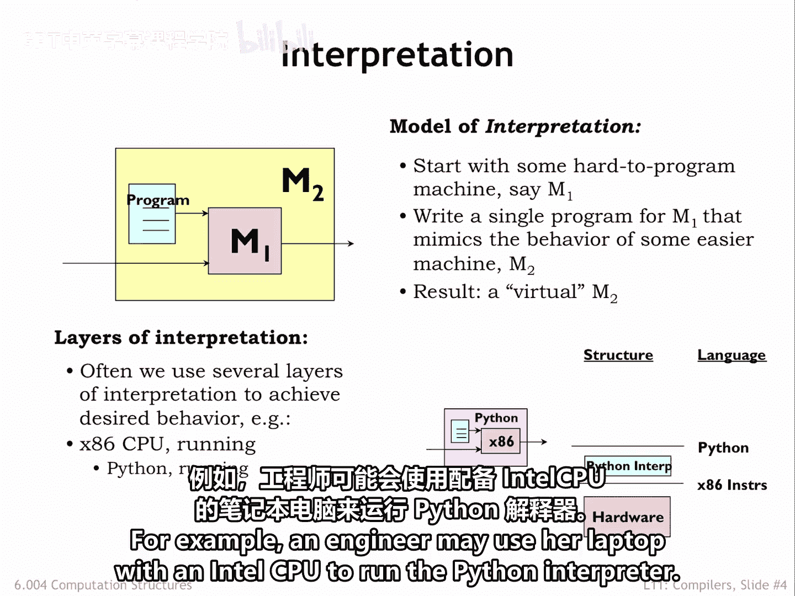
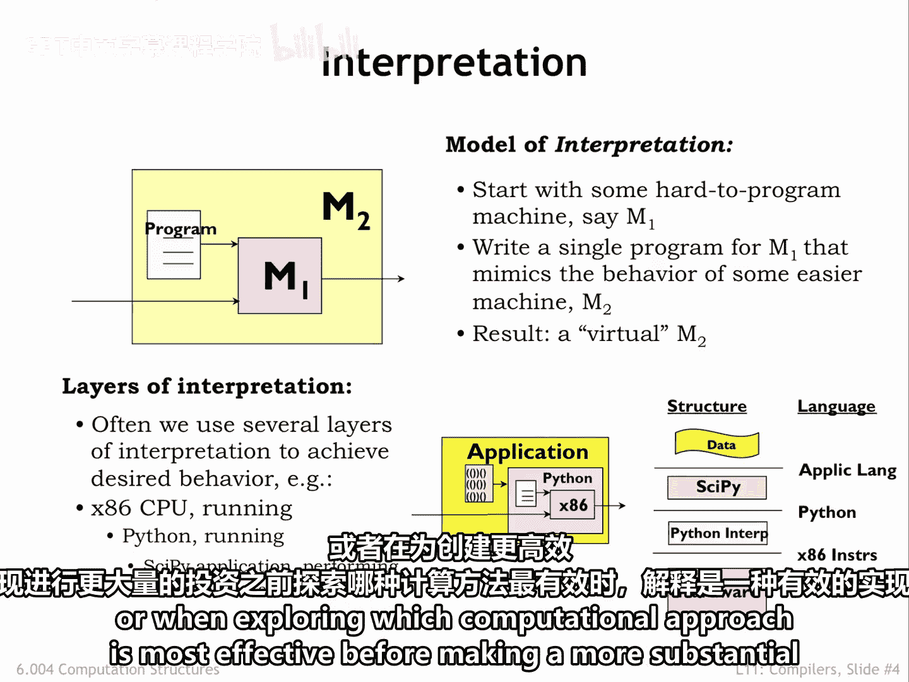
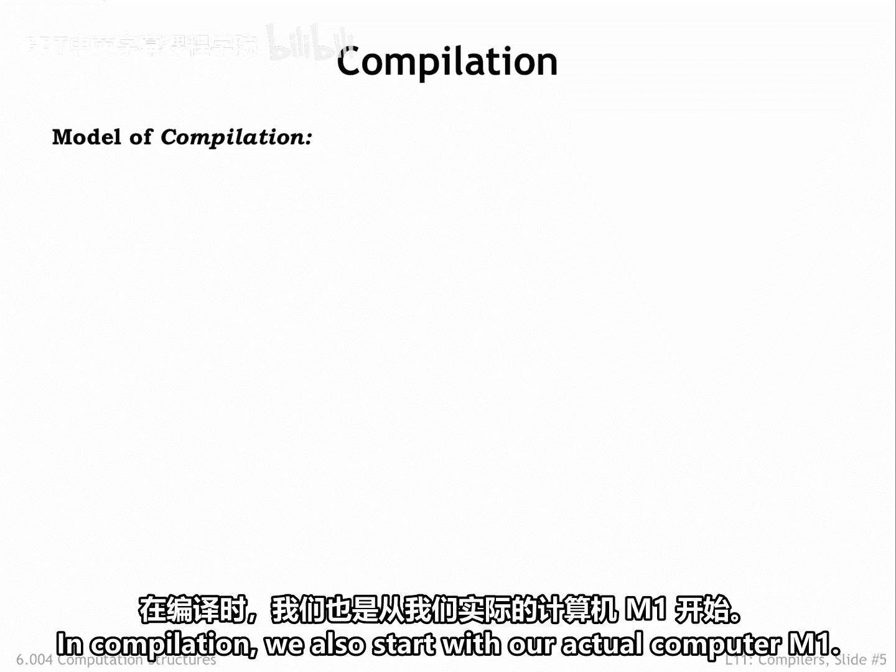
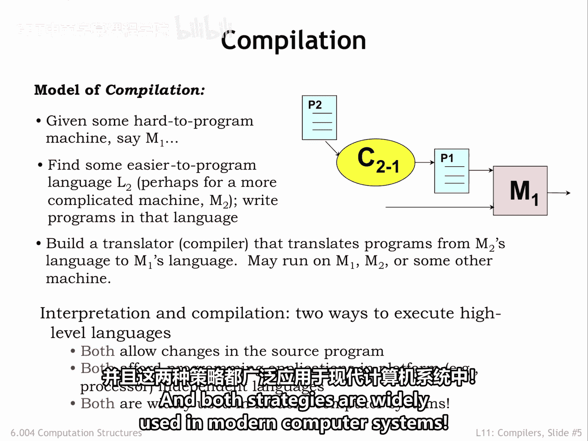
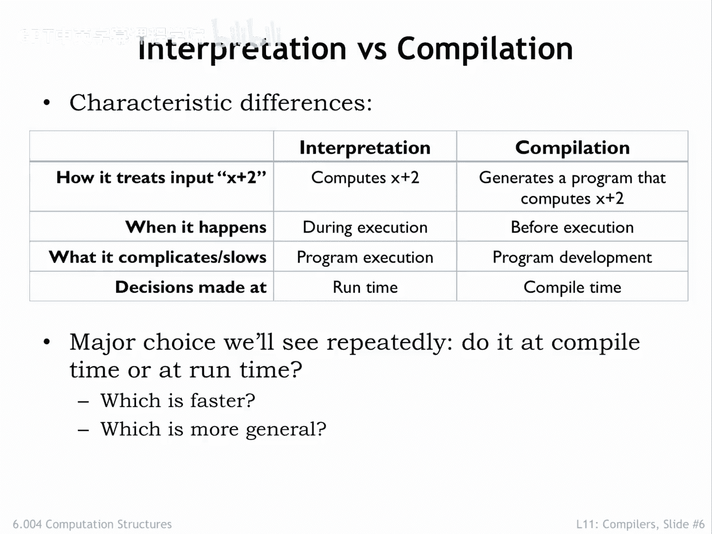

# 001：高级语言的执行策略 🚀

在本节课中，我们将要学习如何将高级语言翻译成计算机可以执行的代码。我们将探讨两种主要的执行策略：解释和编译，并分析它们各自的优缺点。

到目前为止，我们已经了解了Beta指令集架构（ISA），它包含了控制数据通路操作的指令，这些操作处理存储在寄存器中的32位数据。此外，还有访问主存和改变程序计数器的指令。这些指令被格式化为操作码、源和目的字段，在主存中构成32位的值。

为了简化工作，我们开发了汇编语言来指定指令序列。每条汇编语言语句对应一条指令。作为汇编语言程序员，我们需要负责管理哪些值在寄存器中，哪些在主存中，并且需要弄清楚如何将复杂的操作（例如访问数组元素）分解成正确的Beta指令序列。

我们可以更进一步，使用高级语言来描述我们想要执行的计算。这些语言使用变量和其他数据结构，抽象掉了存储分配以及数据进出主存的细节。我们可以直接通过名称引用数据对象，让语言处理器处理细节。同样地，我们可以编写表达式和其他操作符（如赋值）来高效地描述在汇编语言中需要许多语句才能完成的操作。

今天，我们将深入探讨如何将高级语言程序翻译成可以在Beta上运行的代码。

---

## 高级语言的优势 ✨

高级语言（如C语言）使我们能够在不涉及任何Beta ISA细节（如寄存器、特定Beta指令等）的情况下描述计算。这种抽象意味着创建程序所需的工作量更少，并且使其他人更容易阅读和理解程序实现的算法。

使用高级语言有许多优点：
*   **提高生产力**：程序简洁且可读性强，使程序员效率更高。
*   **易于维护**：代码的可读性使其易于维护。
*   **减少错误**：语言本身可以帮助检查某些类型的错误，例如将字符串值存储到数值变量中。
*   **自动化复杂任务**：动态分配和释放存储等复杂任务可以完全自动化。

因此，使用高级语言创建正确程序所需的时间可能远少于编写汇编语言程序。由于高级语言抽象了特定ISA的细节，程序具有可移植性，我们可以在不同的ISA上运行相同的代码，而无需重写代码。

那么，使用高级语言会失去什么呢？我们是否应该担心，由于无法手工精心设计每条指令，我们会在效率和性能方面付出代价？答案取决于我们选择如何运行高级语言程序。两种基本的执行策略是**解释**和**编译**。

---

## 解释执行策略 🔍

解释高级语言程序时，我们需要编写一个特殊的程序，称为**解释器**，它在实际的计算机M1上运行。解释器模拟某个抽象的、易于编程的机器M2的行为，并为每个M2操作执行一系列M1指令以达到预期效果。我们可以将解释器与M1一起视为M2的一个实现。换句话说，给定一个为M2编写的程序，解释器将逐步模拟M2指令的效果。

在处理计算任务时，我们经常使用多层解释。例如，一位工程师可能使用她的带Intel CPU的笔记本电脑来运行Python解释器。在Python中，她加载SciPy工具包，该工具包为矩阵和数据的数值分析提供了一个类似计算器的接口。对于每个SciPy命令（例如，查找数据集的最大值），SciPy工具包会执行许多Python语句（例如，循环遍历数组的每个元素，记住最大值）。对于每个Python语句，Python解释器又会执行许多x86指令（例如，递增循环索引并检查循环终止条件）。执行单个SciPy命令可能需要执行数十条Python语句，而这又可能需要执行数百条x86指令。工程师很高兴她不必自己编写每一条指令。

当计算只需执行一次，或者在投入更多精力创建更高效的实现之前探索哪种计算方法最有效时，解释是一种有效的实现策略。

---

## 编译执行策略 ⚙️

当我们有需要重复执行的计算任务，并因此愿意预先投入更多时间以获得长期更高的效率时，我们会使用编译实现策略。

在编译中，我们同样从实际的计算机M1开始。然后，我们将高级语言程序P2逐句翻译成M1的程序P1。请注意，我们实际上并没有运行P2程序。相反，我们将其用作模板来创建一个可以在M1上直接执行的等效P1程序。这个翻译过程称为**编译**，执行翻译的程序称为**编译器**。我们编译P2程序一次以获得翻译后的P1，然后每当想要执行P2时，就在M1上运行P1。

运行P1避免了处理P2源代码的开销，也避免了执行任何中间解释层的成本。它不是在遇到每个P2语句时动态地找出必要的机器指令，而是预先捕获了那串机器指令并将其保存为P1程序以供后续执行。如果我们愿意支付编译的前期成本，我们将获得更高效的执行。通过不同的编译器，我们可以在许多不同的机器（M2、M3等）上运行P2，而无需重写P2。

因此，现在我们有两种执行高级语言程序的方法：解释和编译。两者都允许我们修改原始源代码，都允许我们抽象掉用于运行程序的实际计算机的细节，并且这两种策略在现代计算机系统中都得到了广泛使用。

---

## 解释与编译的对比 📊

上一节我们介绍了两种执行策略，本节中我们来看看它们的具体区别。

假设高级程序中出现语句 `x + 2`：
*   当**解释器**处理该语句时，它会立即获取变量`x`的值并为其加2。
*   另一方面，**编译器**会生成Beta指令，这些指令将变量`x`加载到寄存器中，然后为该值加2。

解释器在处理每条语句时立即执行它，实际上，如果语句在循环中，它可能会多次处理和执行同一条语句。编译器则只是生成指令，以便在稍后某个时间执行。

解释器在执行过程中有处理高级源代码的开销，并且这种开销在循环中可能会发生多次。编译器只承担一次处理开销，使得最终执行更高效。但在开发过程中，程序员可能必须多次编译和运行程序，常常只为程序的单次执行而承担编译成本，这使得“编译-运行-调试”循环可能花费更多时间。

解释器在运行时（即程序运行时）决定`x`的数据类型和必要的操作类型。编译器则在编译过程中做出这些决定。

哪种方法更好？通常，执行编译后的代码比以解释方式运行代码要快得多。但由于解释器在运行时做决定，它可以根据数据（例如变量`x`的类型）改变其行为，从而在处理不同类型数据时使用相同算法，提供了相当大的灵活性。编译器则为了快速执行而牺牲了这种灵活性。

---

## 总结 📝

本节课中我们一起学习了高级语言程序执行的两种核心策略：解释和编译。解释通过一个在真实机器上运行的解释器程序，动态地模拟并执行高级语言语句，适合快速开发和探索。编译则通过编译器将高级语言程序预先翻译成目标机器的指令，生成可独立执行的程序，适合需要重复运行以获得高性能的场景。两者各有优劣，共同构成了现代计算生态的基础。