# 004：编译器前端

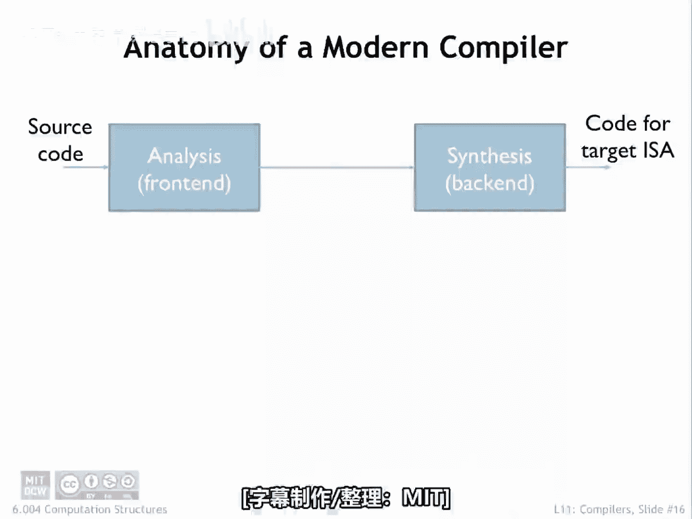

## 概述

在本节课中，我们将要学习现代编译器如何将高级语言编写的源代码转换为计算机可以执行的指令。我们将重点关注编译器的**前端**部分，即分析和理解源代码的阶段。

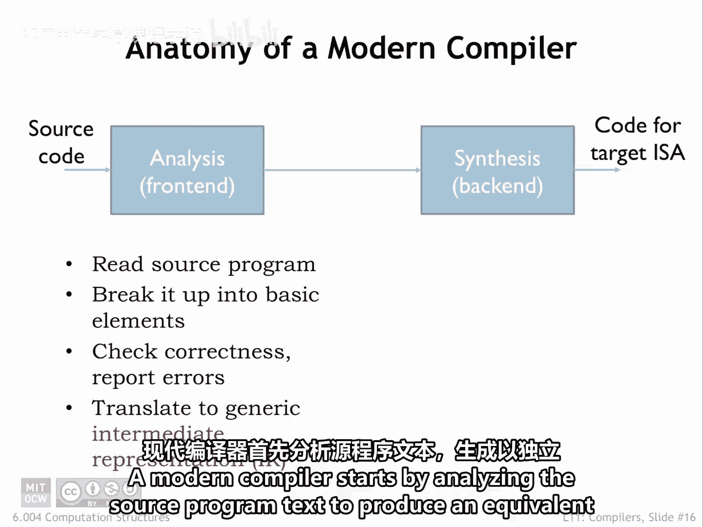

---

## 编译器结构概览

现代编译器首先分析源程序文本，生成一个等价的、用与语言和机器无关的**中间表示**来表达的操作序列。

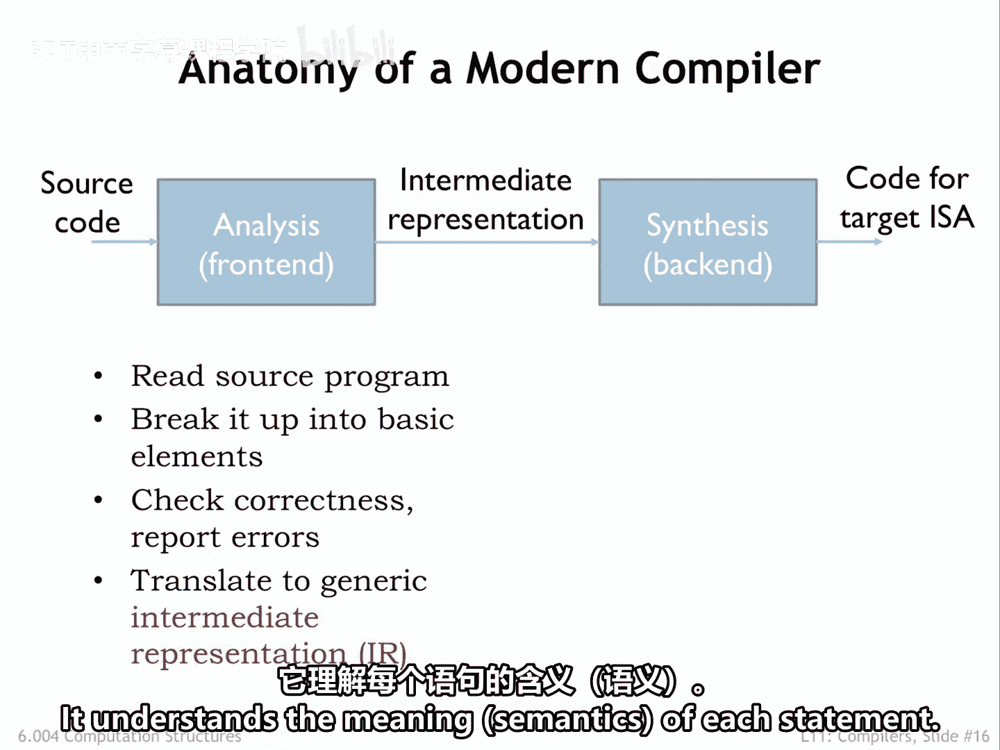

编译过程通常分为两个主要阶段：**分析阶段**（前端）和**综合阶段**（后端）。前端负责理解程序，后端负责生成高效代码。

---

## 分析阶段（前端）

分析或前端阶段检查程序是否格式良好。换句话说，它检查每个高级语言语句的**语法**是否正确。

它理解每个语句的**语义**，即其含义。

许多高级语言包含变量**类型**的声明，例如整数、浮点数、字符串等。前端会验证所有操作是否正确应用。

它确保数值操作的操作数是数值类型，字符串操作的操作数是字符串类型，依此类推。

本质上，分析阶段将源程序的文本转换为一个内部数据结构，该结构指定了要执行的操作序列和类型。

通常存在一系列前端程序，它们将各种高级语言（例如 C、C++、Java）翻译成一种**公共的中间表示**。

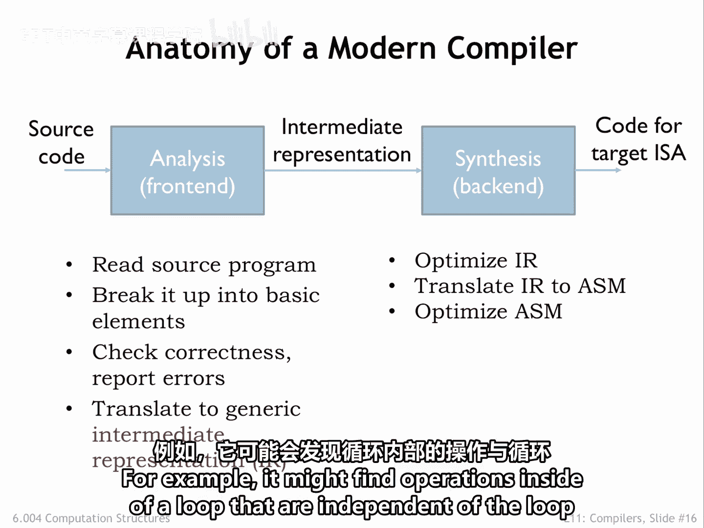

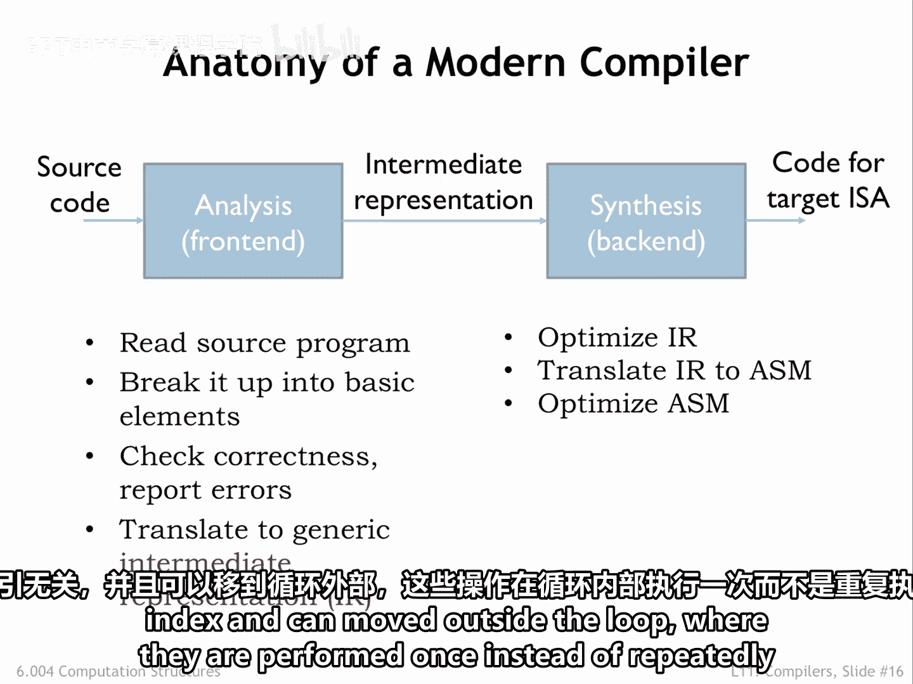

---

## 综合阶段（后端）

综合或后端阶段随后优化中间表示，以减少最终代码运行时执行的操作数量。

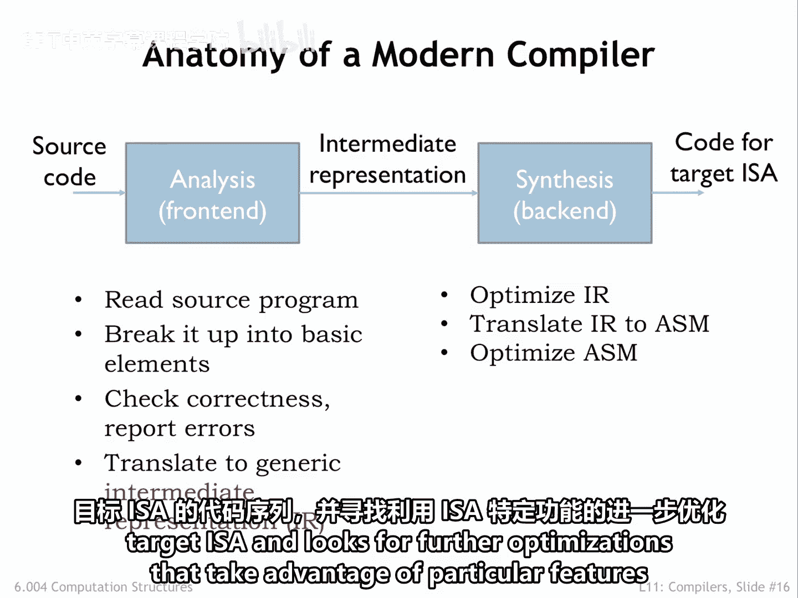

例如，它可能发现循环内部有一些与循环索引无关的操作，这些操作可以被移到循环外部，从而只执行一次，而不是在循环内重复执行。

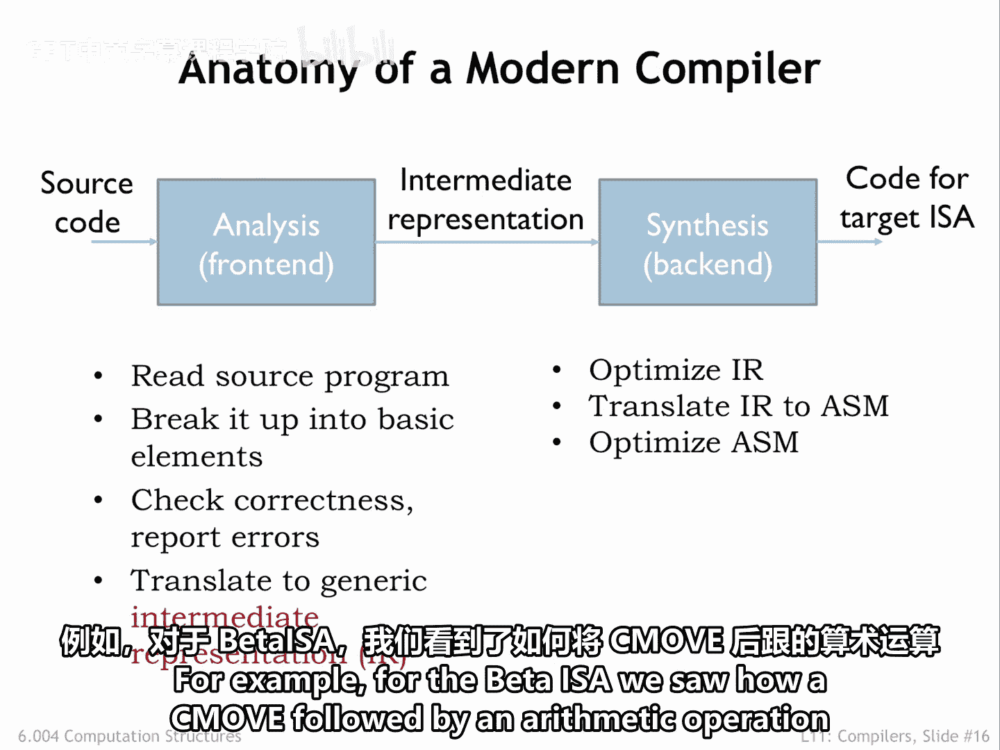

一旦中间表示达到最终优化形式，后端就会为目标指令集架构生成代码序列，并寻找可以利用该 ISA 特定特性的进一步优化。

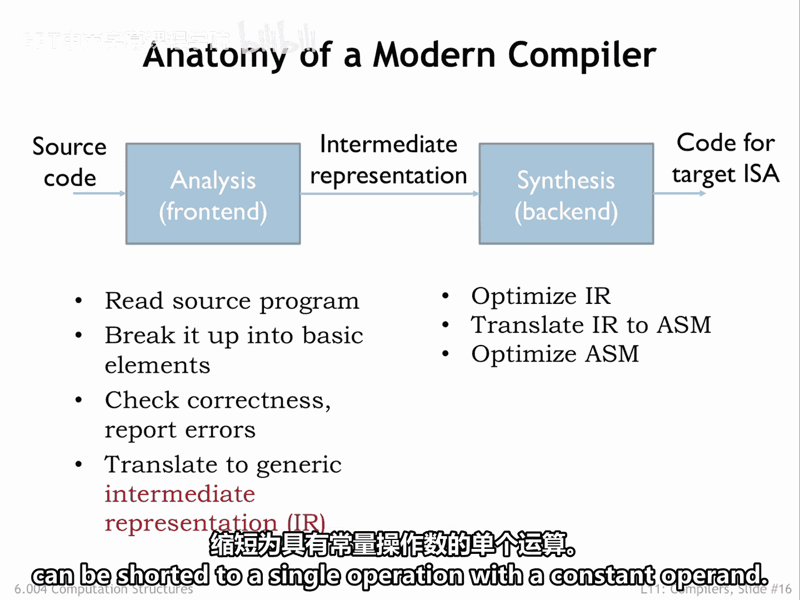

例如，对于 Beta ISA，我们曾看到如何将一个 C 语言中的移动操作，后跟一个算术操作，缩短为带有一个常量操作数的单一操作。

---

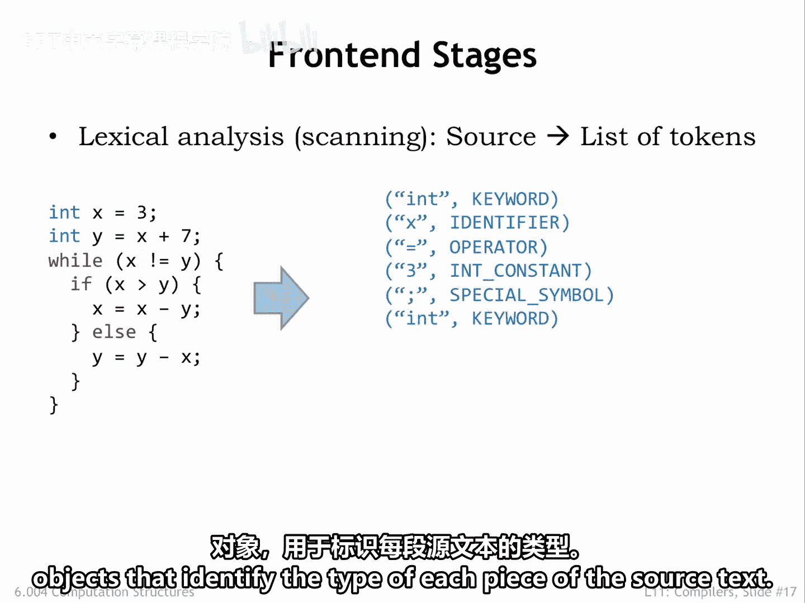

## 词法分析（扫描）

分析阶段从扫描源文本开始，生成一系列**词法单元**对象，这些对象标识源文本中每一部分的类型。

源文本中用于分隔词法单元的空格、制表符、换行符等，在扫描过程中都已被移除。

为了支持有用的错误报告，词法单元对象还包含关于每个词法单元在源文本中位置的信息，例如文件名、行号和列号。

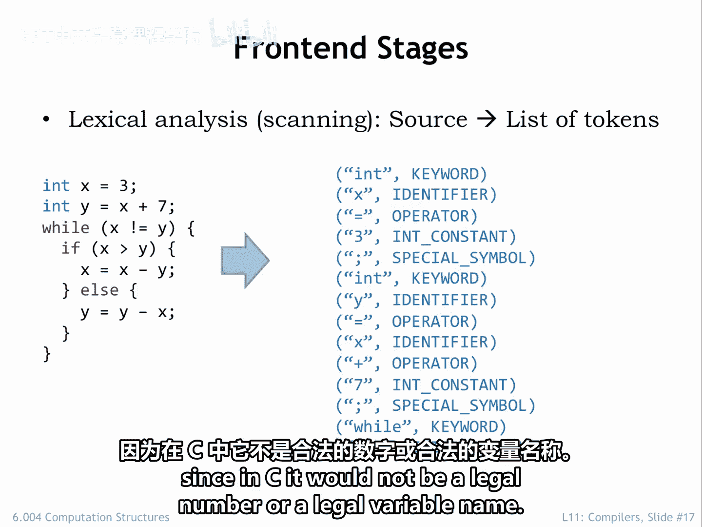

扫描阶段会报告非法的词法单元。例如，词法单元 `3x` 会导致错误，因为在 C 语言中，它既不是合法的数字，也不是合法的变量名。

---

## 语法分析（解析）

解析阶段处理词法单元序列以构建**语法树**，该树以一种方便的数据结构捕获原始程序的结构。

每个一元和二元操作的操作数已被组织好。每个语句的组成部分已被找到并标记。源文本中每个词法单元的角色已被确定，并且这些信息被捕获在语法树中。

将树中节点的标签与我们上一节讨论的模板进行比较，我们可以看到，编写一个程序来进行深度优先的树遍历是很容易的，该程序使用每个树节点的标签来选择适当的代码生成模板。

我们暂时还不会这样做，因为分析和转换树还有一些工作要做。

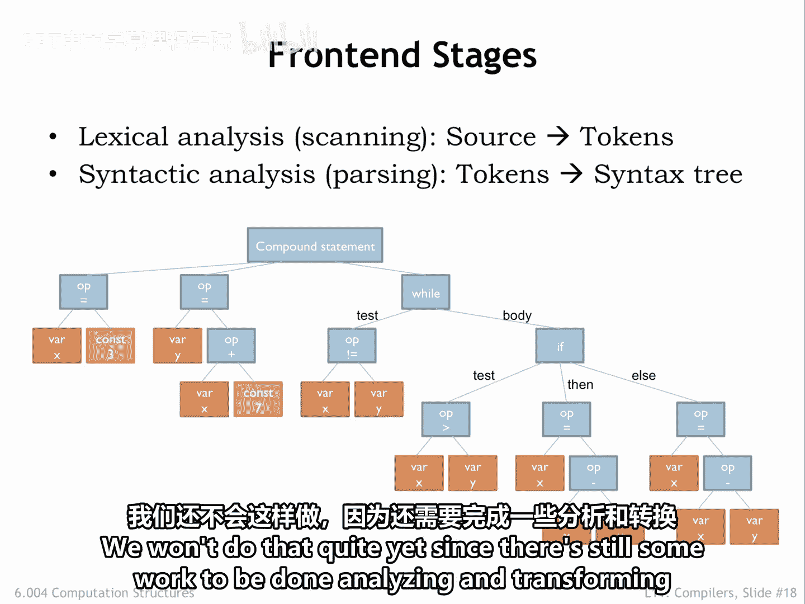

---

## 语义分析

语法树使得验证程序的语义正确性变得容易，例如，检查操作数的类型是否与请求的操作兼容。

例如，考虑语句 `x = "bananas"`。

赋值操作的语法是正确的：左边有一个变量，右边有一个表达式。但至少在 C 语言中，其语义是不正确的。

通过查找其符号表来检查变量 `x` 的声明类型（例如 `int`），并将其与表达式（字符串）的类型进行比较，`op=` 树节点的语义检查器将检测到类型不兼容。

换句话说，我们不能将字符串值存储到整数变量中。

当语义分析完成时，我们知道语法树代表了一个语法正确且语义有效的程序，并且我们完成了将源程序转换为等价的、与语言无关的操作序列的过程。

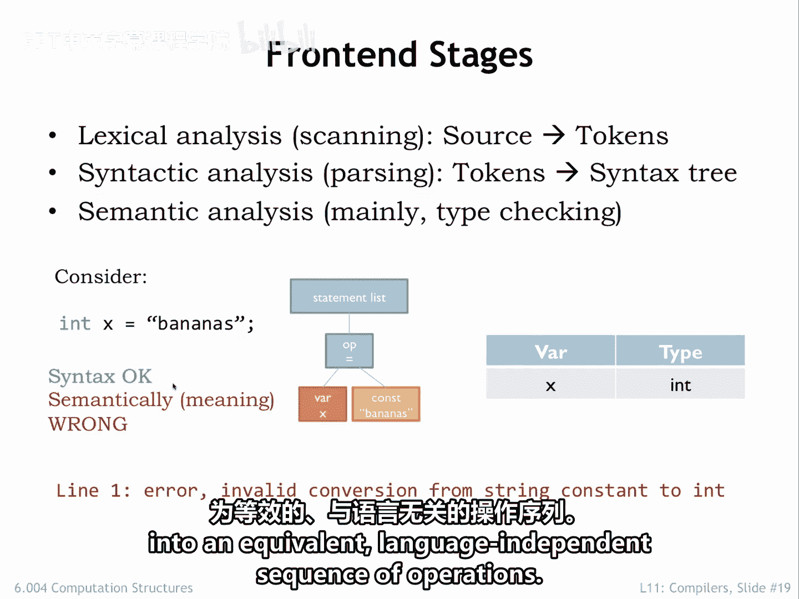

---

## 总结

本节课中我们一起学习了编译器前端的工作流程。我们了解到，编译器前端通过**词法分析**将源代码分解为词法单元，通过**语法分析**构建语法树以理解程序结构，最后通过**语义分析**确保程序的类型和操作是正确且兼容的。这个过程将高级语言源代码转换为一个清晰、结构化的中间表示，为后端的优化和代码生成做好准备。