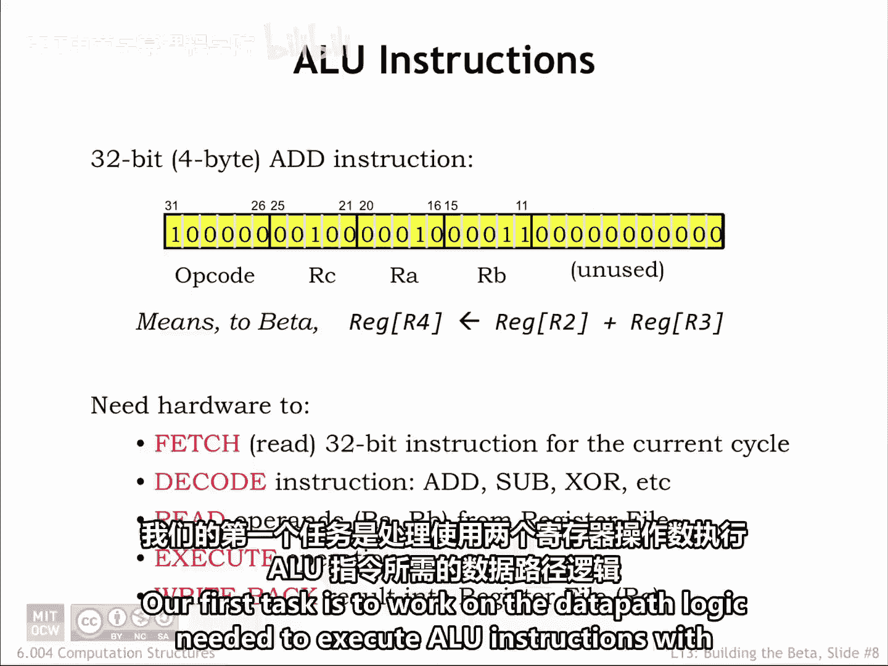
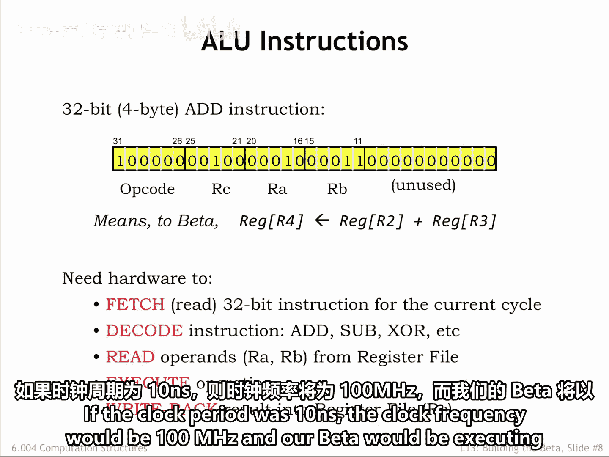
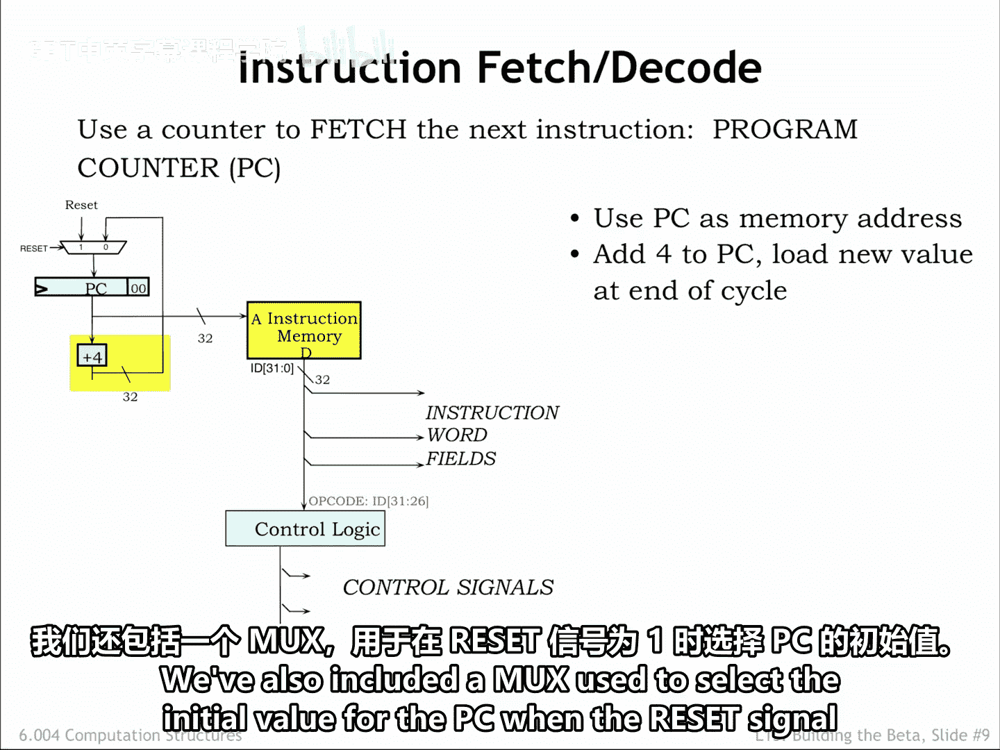
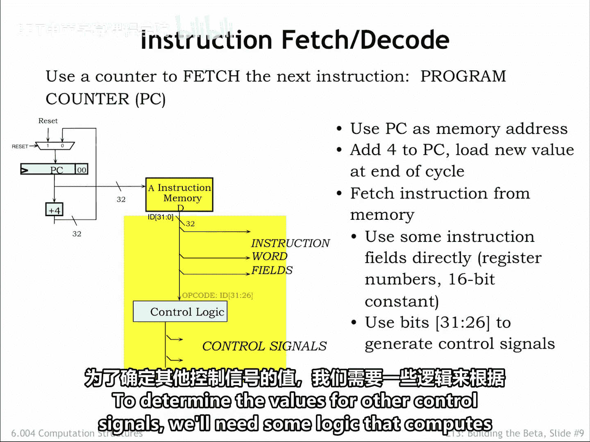
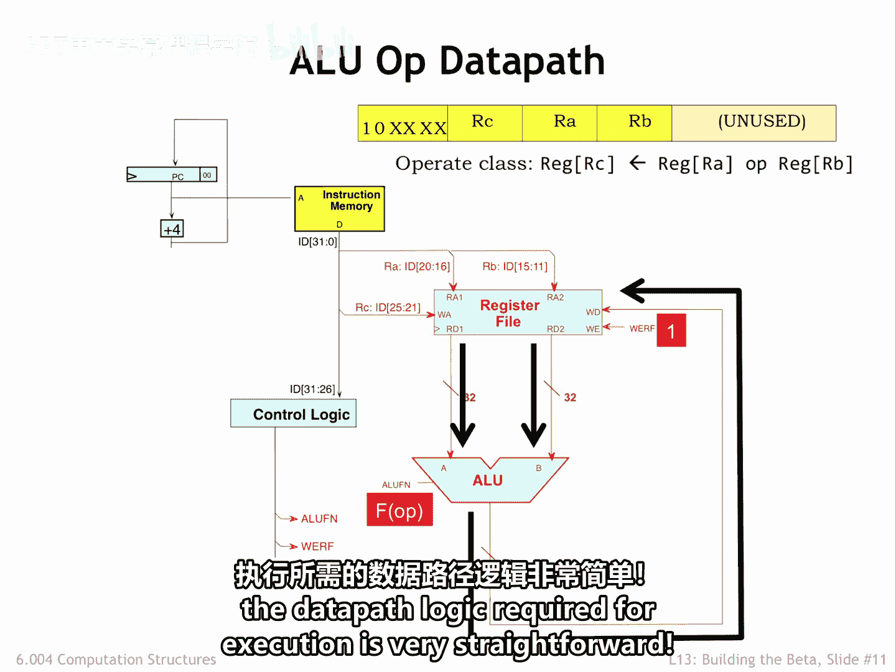
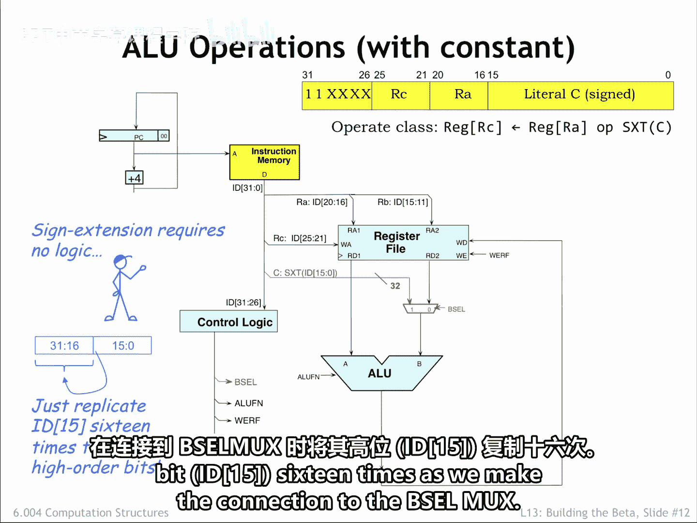
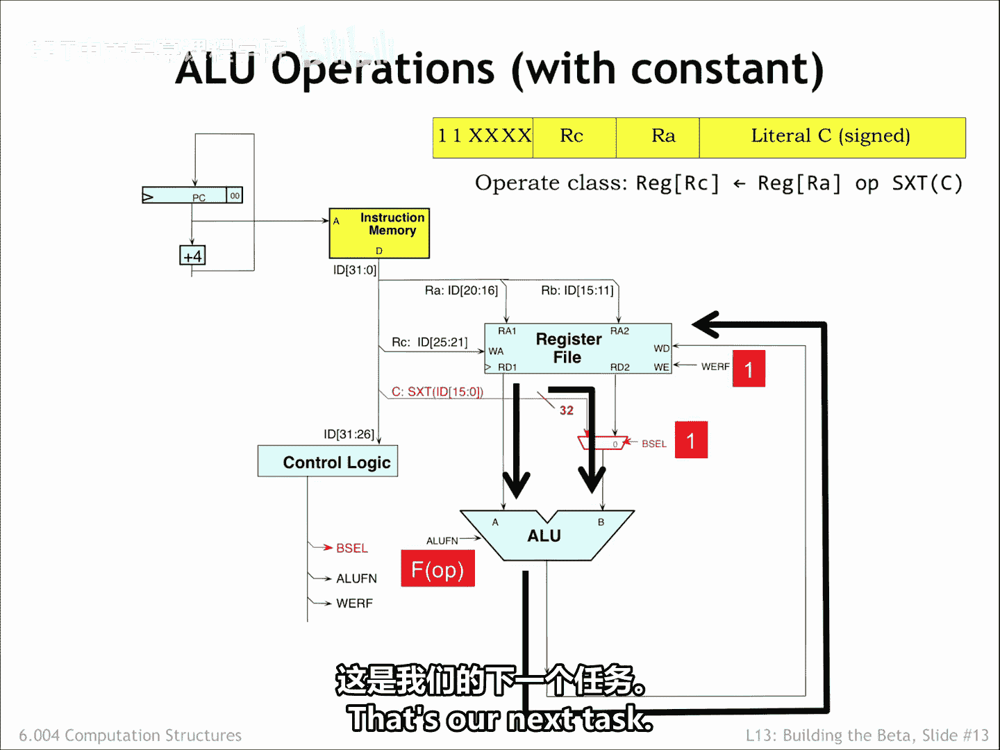

# 014：6.4 ALU指令执行数据通路

在本节课中，我们将学习如何为执行ALU（算术逻辑单元）指令构建数据通路。我们将重点关注处理两个寄存器操作数的指令，并理解从取指到写回的完整执行流程。

## 概述

我们的首要任务是构建执行ALU指令所需的数据通路逻辑。每条指令都遵循相同的处理步骤。我们将详细探讨这些步骤，并了解如何用硬件实现它们。

## 取指与译码步骤

上一节我们介绍了指令执行的基本概念，本节中我们来看看取指和译码的具体硬件实现。

当前程序计数器（PC）寄存器的值被送往主存储器，作为要获取指令的地址。对于ALU指令，下一条指令的地址就是当前指令地址加4。我们使用一个专用的加法器来计算PC+4，并将该值送回，作为PC的下一个值。图中还包含了一个多路复用器（Mux），用于在复位信号为1时选择PC的初始值。

经过存储器的传播延迟后，指令位（ID 31 至 0）准备就绪，处理步骤可以开始。部分指令字段可以直接使用，而其他控制信号的值则需要通过操作码（Opcode）字段的位，由一些逻辑电路计算得出。

## 执行双寄存器操作数ALU指令

现在，让我们填充执行带有两个寄存器操作数的ALU指令所需的数据通路逻辑。

以下是实现该数据通路的关键组件：

1.  **寄存器文件连接**：指令中5位的RA、RB和RC字段可以直接连接到寄存器文件的相应地址输入端口。RA和RB字段提供两个读端口的地址，RC字段提供写端口的地址。
2.  **ALU操作数**：两个读数据端口的输出被路由到ALU的输入，作为两个操作数。
3.  **控制信号生成**：ALUFN控制信号告诉ALU执行何种操作。这些信号由控制逻辑根据6位操作码字段确定。具体来说，我们可以假设控制逻辑使用只读存储器（ROM）实现，操作码位作为ROM的地址，ROM的输出就是控制信号。由于有6位操作码，我们需要一个2^6=64个位置的ROM。我们将对ROM的内容进行编程，为64种可能的操作码提供正确的控制信号值。
4.  **结果写回**：ALU的输出被路由回寄存器文件的写数据端口，以便在周期结束时写入RC寄存器。我们还需要另一个控制信号`Wr`（写寄存器文件），当我们想写入RC寄存器时，该信号应设为1。

让我向你介绍Wr，6.004的吉祥物，她当然是以她最喜欢的控制信号命名的，并且她经常提到它。

让我们跟踪执行ADD指令时的数据流。取指后，提供了RA和RB指令字段，RA和RB寄存器的值出现在寄存器文件的读数据端口上。控制逻辑已解码操作码位，并提供了相应的ALU功能码。你可以在Beta图表的右上角找到可能的功能码列表。ALU计算的结果被送回寄存器文件，准备写入RC寄存器。当然，我们需要将`Wr`设为1以启用写入。

这里我们看到了精简指令集计算机（RISC）架构的主要优势之一：执行所需的数据通路非常直接明了。

## 执行常量操作数ALU指令

另一种形式的ALU指令使用常量作为第二个ALU操作数。这个32位操作数是通过对指令中字面量字段（位15至0）存储的16位二进制补码常量进行符号扩展而形成的。

为了选择符号扩展后的常量作为第二个操作数，我们在数据通路中添加了一个多路复用器（Mux）。

以下是该数据通路的工作原理：

1.  **操作数选择**：当多路复用器的`BSel`控制信号为0时，选择寄存器文件的输出作为操作数。当`BSel`为1时，选择符号扩展后的常量作为操作数。
2.  **符号扩展实现**：数据通路的其余部分与之前相同。请注意，执行符号扩展不需要逻辑门，全部通过布线完成。要对一个二进制补码数进行符号扩展，我们只需要根据需要复制其高位（即符号位）多次。你可能需要回顾课程第一部分第1讲中关于二进制补码的讨论。
3.  **常量形成**：要从一个16位常量形成一个32位操作数，我们只需将其高位（位15）复制16次，然后连接到`BSel`多路复用器。

在执行带有常量的ALU指令期间，数据流与之前大致相同。唯一的区别是控制逻辑将`BSel`控制信号设置为1，从而选择符号扩展后的常量作为第二个ALU操作数。和之前一样，控制逻辑生成适当的ALU功能码，ALU的输出被路由到寄存器文件，准备写回RC寄存器。

## 时钟与执行时序

系统的时钟信号连接到寄存器文件和PC寄存器。在时钟上升沿，执行阶段计算出的新值被写入这些寄存器。因此，时钟上升沿标志着当前指令执行的结束和下一条指令执行的开始。

时钟周期，即两个时钟上升沿之间的时间，需要足够长，以适应实现上述五个步骤的逻辑电路的累积传播延迟。

由于每个时钟周期执行一条指令，时钟频率就告诉了我们指令的执行速率。如果时钟周期是10纳秒，那么时钟频率就是100兆赫，我们的Beta处理器将以**100 MIPS**（每秒百万条指令）的速度执行指令。

## 总结

本节课中，我们一起学习了为Beta ISA执行ALU指令构建数据通路。我们详细探讨了取指、译码、读取操作数、执行运算和写回结果这五个步骤的硬件实现。我们看到了如何处理两种类型的ALU操作数：寄存器-寄存器和寄存器-常量。令人惊讶的是，这个数据通路足以执行Beta指令集架构中的大部分指令。我们只剩下存储器和分支指令需要实现，这将是我们的下一个任务。

