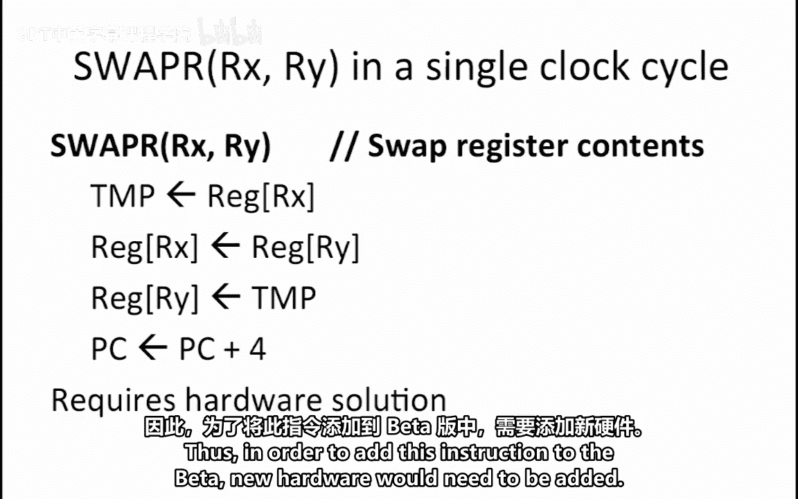
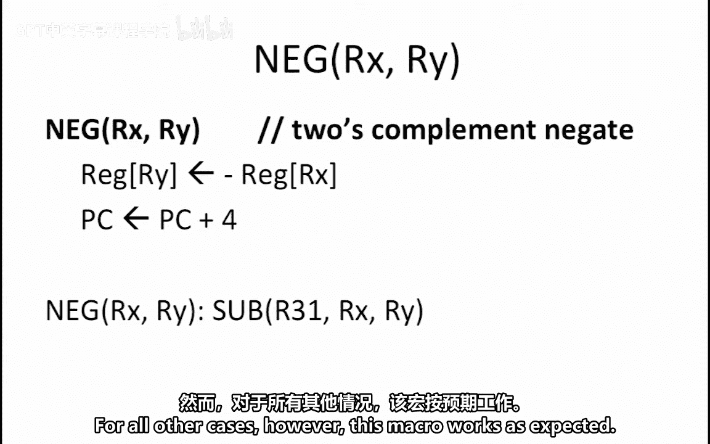
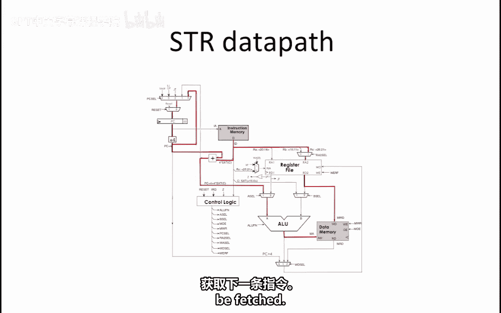
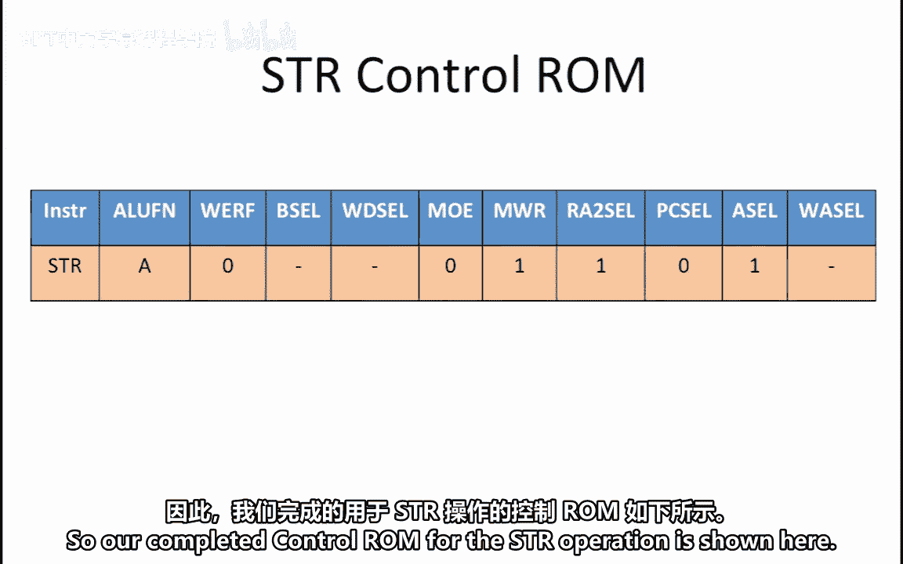
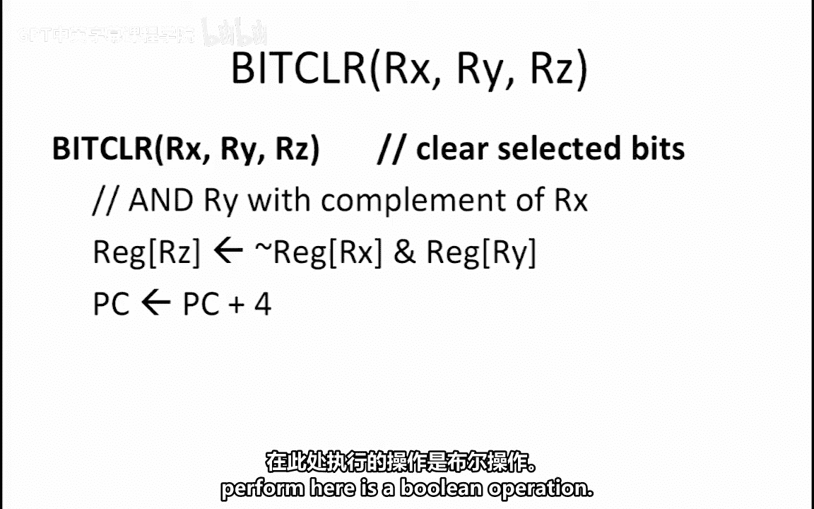
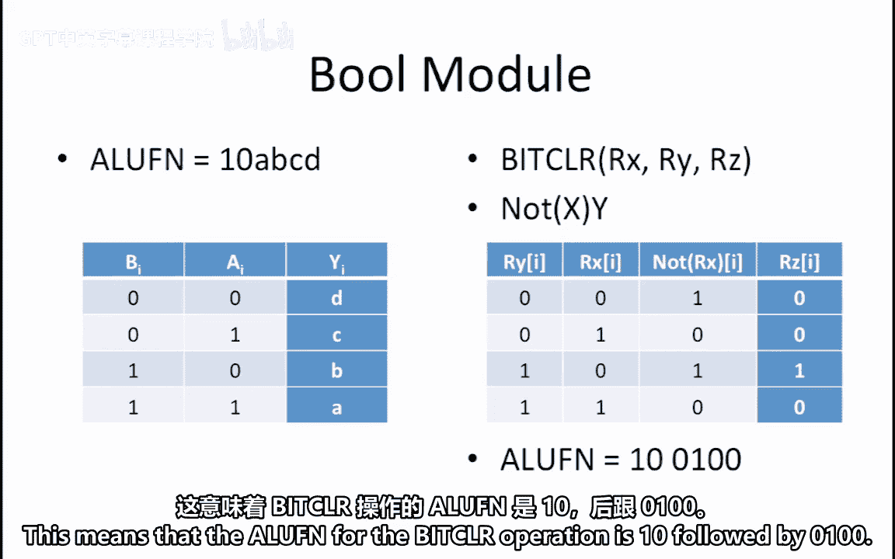
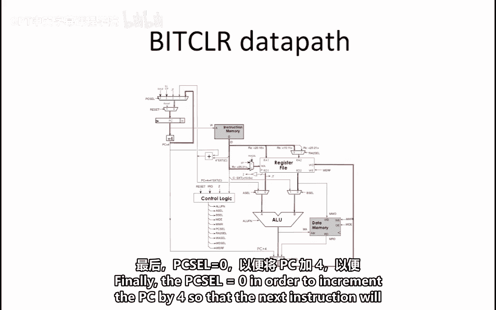
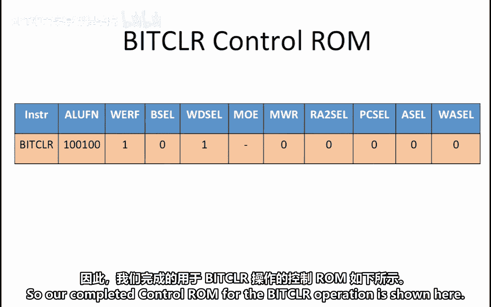

# 019：一个更好的Beta处理器 🧠

在本节课程中，我们将学习如何为Beta处理器添加新的指令。我们将分析几种候选指令，并判断实现它们所需的最小硬件或软件改动。具体来说，我们将探讨三种实现方式：使用宏指令、修改控制ROM信号，或者必须进行硬件改动。

---

## 指令一：SWAP指令 🔄

上一节我们介绍了评估新指令的基本框架，本节中我们首先来看一个`SWAP`指令。该指令的目标是在一个时钟周期内交换寄存器`RX`和`RY`的内容。

**核心约束**：Beta处理器的硬件无法在同一个时钟周期内向两个不同的寄存器写入数据。因此，仅通过宏指令或修改控制信号无法实现此指令。



**结论**：要实现`SWAP`指令，必须对Beta处理器进行硬件改动。


---

## 指令二：NEG指令 ➖

接下来，我们考虑添加一个`NEG`指令。该指令的功能是计算寄存器`RX`的二进制补码负数，并将结果存入寄存器`RY`。



我们首先需要判断是否能用宏指令实现它。

**核心思路**：计算一个值的负数，可以通过从0减去该值来实现。在Beta指令集中，我们可以用`R31`（其值恒为0）减去`RX`。

以下是实现该功能的宏指令代码：
```assembly
NEG(RX, RY) -> SUB(R31, RX, RY)
```

**注意事项**：此宏指令对于最大的可表示负数的特殊情况无效，因为其负数无法用32位二进制补码表示。但对于所有其他情况，该宏指令都能正常工作。


---

## 指令三：PC相对存储指令 💾

现在，我们分析一个更复杂的指令：PC相对存储指令（`STR`）。该指令将寄存器`RX`的内容写入内存，其目标地址由公式 `PC + 4 + 4 * SEXT(C)` 计算得出。

由于Beta处理器现有的存储指令使用 `RY + SEXT(C)` 计算地址，行为不同，因此无法用宏指令实现。

接下来，我们检查是否能在现有数据通路上，通过修改控制ROM信号来实现它。

以下是实现`STR`指令所需的数据通路和控制信号设置：

1.  **地址计算**：指令内存下方的额外加法器用于计算有效地址 `PC + 4 + 4 * SEXT(C)`。设置 `ASEL = 1`，将此地址值送入ALU的A操作数端。
2.  **ALU功能**：设置 `ALUFN = A`，使ALU直接将A操作数（即计算出的地址）传递到输出端，作为数据内存的地址（`MA`）。
3.  **写入数据**：存储操作中，第一个操作数对应寄存器`RC`（即`RX`）。设置 `RA2SEL = 1`，以选择`RC`。其值通过寄存器文件的`RD2`端口输出，成为内存写入数据（`MWD`）。
4.  **内存控制信号**：
    *   `MWR = 1`：使能数据内存的写入功能。
    *   `MOE = 0`：禁用内存输出。这允许读写数据共享同一总线（图中未明确显示，但需如此设置）。
5.  **寄存器文件控制**：设置 `WE = 0`，确保不写回寄存器文件。因此，`WDSEL`和`WASEL`可设为无关项（`X`）。
6.  **其他信号**：`BSEL`为无关项，因为此指令中ALU忽略B操作数。`PCSEL = 0`，使PC正常加4，以获取下一条指令。




最终，`STR`指令完整的控制ROM信号配置如下：




---


## 指令四：位清除指令 🧹


最后，我们考虑添加位清除指令 `BITCLR(RX, RY, RZ)`。其功能是计算 `RY & ~RX` 的结果（即`RY`与`RX`的反码进行按位与），并存入`RZ`。

没有现有的Beta指令能直接完成此功能，因此宏指令不可行。我们需要判断能否通过修改控制ROM，在现有数据通路上实现它。

**核心概念**：此操作是一个布尔运算。回顾ALU中的逻辑单元（LU），其功能由`ALUFN[5:0]`控制。当`ALUFN[5:4] = 10`时，ALU对每对输入位`Ai`和`Bi`执行由`ALUFN[3:0]`（即`A, B, C, D`）定义的布尔函数。

以下是位清除操作的真值表推导：
| `RXi` | `~RXi` | `RYi` | `RZi` = `RYi & ~RXi` |
| :--- | :--- | :--- | :--- |
| 0 | 1 | 0 | 0 |
| 0 | 1 | 1 | 1 |
| 1 | 0 | 0 | 0 |
| 1 | 0 | 1 | 0 |



对比标准LU功能表可知，实现 `F = B & ~A` 需要设置 `A=0, B=1, C=0, D=0`。因此，`ALUFN[3:0] = 0100`。

所以，位清除指令的完整`ALUFN`代码为：`ALUFN = 10_0100`。




以下是实现位清除指令所需的其他控制信号设置：


1.  **操作数选择**：指令字指定了寄存器`RX`(`RA`), `RY`(`RB`), `RZ`(`RC`)。设置 `RA2SEL=0`，从`RB`(`RY`)读取第二个操作数。设置 `ASEL=0, BSEL=0`，将`RX`和`RY`的值送入ALU。
2.  **ALU功能**：如上所述，设置 `ALUFN = 10_0100`。
3.  **结果写回**：设置 `WDSEL=1`，将ALU结果送回寄存器文件。`RC`(`RZ`)是目标寄存器，因此设置 `WASEL=0`（选择`RC`）和 `WE=1`（使能写入）。
4.  **内存控制**：设置 `MWR=0`，避免写入数据内存。`MOE`为无关项，`WDSEL=1`也使得内存读取数据（`MRD`）被忽略。
5.  **PC更新**：设置 `PCSEL=0`，使PC加4。




最终，位清除指令完整的控制ROM信号配置如下：




---

## 总结 📚

本节课中我们一起学习了为处理器添加新指令的系统性分析方法。我们通过四个实例了解到：
1.  **`SWAP`指令**：需要硬件改动，因为单周期双写寄存器超出当前数据通路能力。
2.  **`NEG`指令**：可通过宏指令 `SUB(R31, RX, RY)` 实现（除边界情况外）。
3.  **PC相对存储指令(`STR`)**：可通过合理配置现有数据通路（利用额外加法器、设置`ASEL=1`和`ALUFN=A`等）并修改控制ROM信号来实现，无需硬件改动。
4.  **位清除指令(`BITCLR`)**：通过深入理解ALU逻辑单元的功能表，找到对应的`ALUFN`代码(`10_0100`)，并配置其他控制信号，即可在现有数据通路上实现。


这种方法强调了计算机架构中硬件与软件（微指令）协同设计的核心思想。