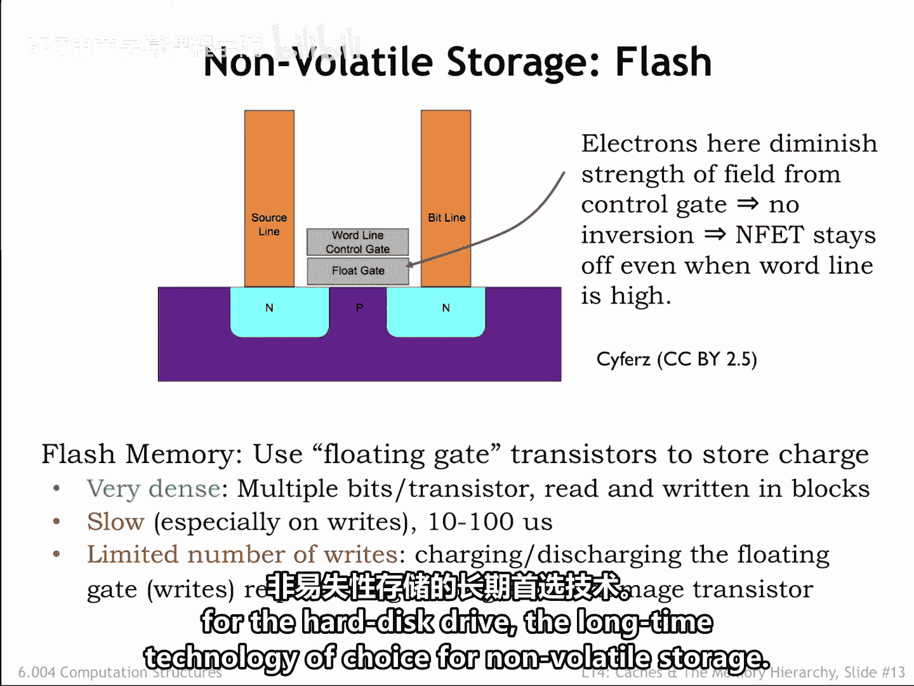
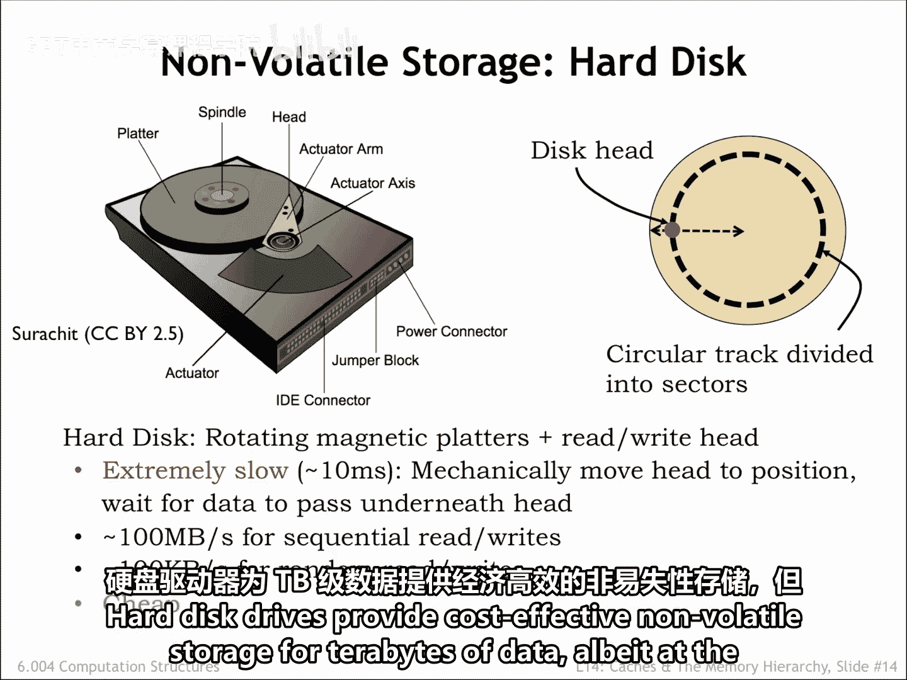
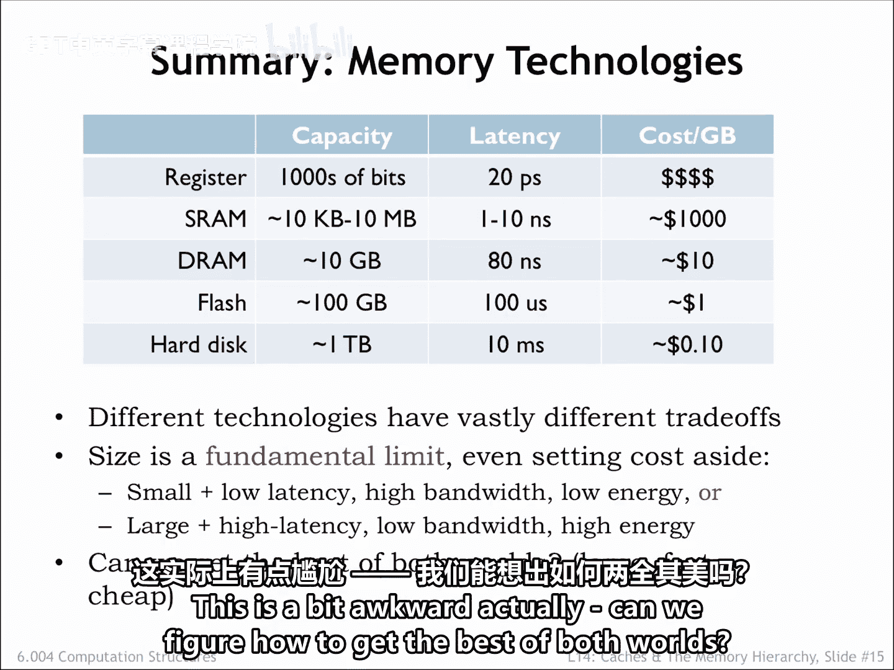
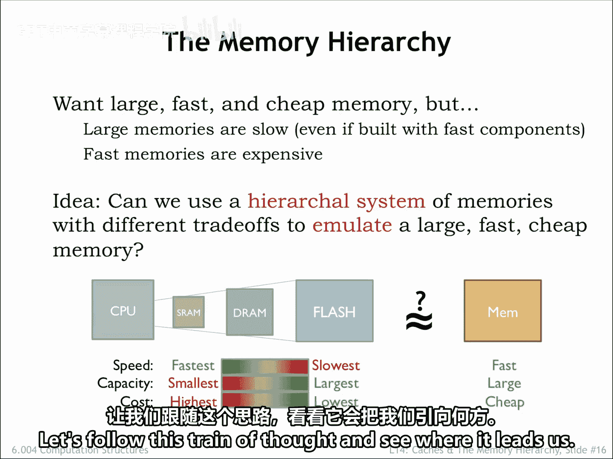
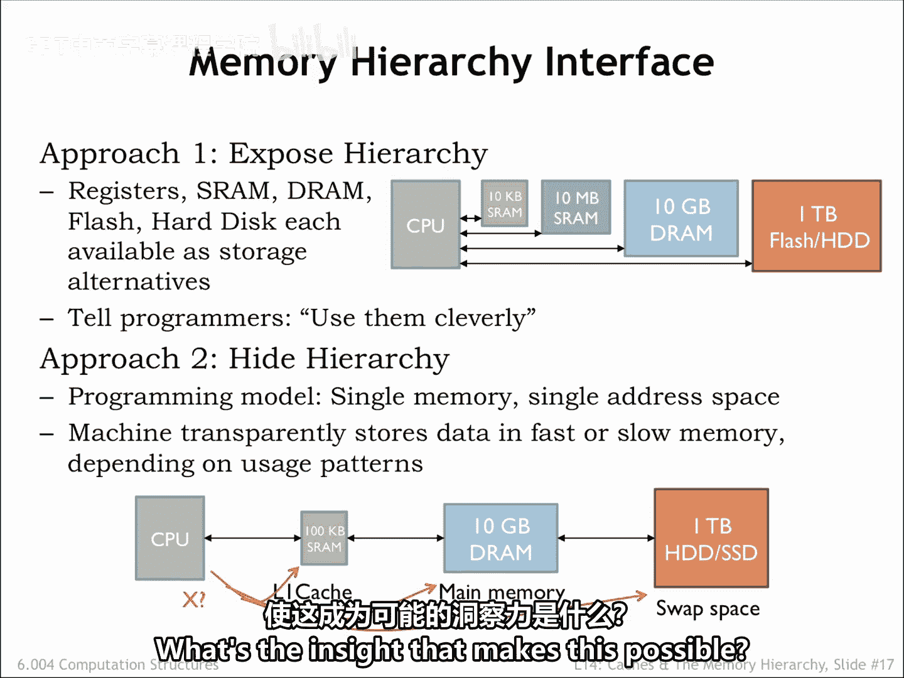

# 024：6.4 非易失性存储与存储层次结构的使用

在本节课中，我们将要学习非易失性存储技术，特别是闪存和硬盘驱动器的工作原理与特性。我们还将探讨如何利用由不同速度和容量的存储器组成的层次结构，来构建一个既大又快的存储系统。

## 非易失性存储器

上一节我们介绍了易失性存储器，本节中我们来看看非易失性存储器。非易失性存储器用于在系统断电时维持系统状态。

在闪存中，长期存储是通过在一个被称为浮栅的绝缘良好的导体上存储电荷来实现的，这些电荷可以稳定保持数年。浮栅被集成在一个标准的MOSFET中，位于MOSFET的栅极和沟道之间。

以下是其工作原理：
*   如果浮栅上没有存储电荷，MOSFET可以被开启。换句话说，通过在栅极端施加电压 **V1**，可以形成一个连接MOSFET源极和漏极的反型层，使其导通。
*   如果浮栅上存储了电荷，则需要一个更高的电压 **V2** 才能开启MOSFET。通过将栅极电压设置在 **V1** 和 **V2** 之间，我们可以测试MOSFET是否导通，从而判断浮栅是否带电。
*   实际上，如果我们能测量流过MOSFET的电流，就可以确定浮栅上存储了多少电荷。这使得通过改变浮栅上的电荷量，在一个闪存单元中存储多个比特的信息成为可能。

闪存单元可以并联或串联连接，形成类似于CMOS或非门或与非门的电路，从而允许设计出适用于随机访问或顺序访问的各种访问架构。

闪存的密度非常高，接近DRAM的面积密度，尤其是在每个单元存储多位信息时。NOR闪存的读取访问时间与DRAM相似，为几十纳秒。NAND闪存的读取时间则要长得多，大约为10微秒。

所有类型闪存的写入时间都相当长，因为必须使用高电压迫使电子穿过浮栅周围的绝缘屏障。闪存只能写入有限次数，超过后绝缘层会受损，导致浮栅无法可靠存储电荷。目前，保证的写入次数在10万到100万次之间。

为了克服这一限制，闪存芯片内部包含巧妙的地址映射算法，使得对同一地址的连续写入实际上被映射到不同的闪存单元上。总而言之，闪存是一种高性能但高成本的替代方案，用于取代作为长期非易失性存储选择的硬盘驱动器。

## 硬盘驱动器

了解了基于半导体的闪存后，我们再来看看传统的机械式存储设备。硬盘驱动器包含一个或多个旋转的盘片，盘片表面涂有磁性材料。盘片以每分钟5400到15000转的速度旋转。

一个位于盘片表面上方的读写磁头可以检测或改变下方磁性材料的磁化方向。读写磁头安装在一个致动器上，使其能够定位到不同的圆形磁道上。

以下是读取数据的过程：
*   要读取特定的数据扇区，磁头必须径向移动到正确的磁道上。
*   然后等待盘片旋转，直到磁头位于目标扇区上方。

正确放置磁头所需的平均总时间大约为10毫秒，因此硬盘访问时间相当长。然而，一旦读写磁头定位正确，数据可以以每秒100兆字节的可观速率传输。如果每次访问之间都需要重新定位磁头，有效的传输速率会因磁头重新定位的时间而下降1000倍。

硬盘驱动器为太字节级的数据提供了经济高效的非易失性存储，代价是访问速度较慢。

## 存储技术总结与挑战

至此，我们完成了对存储技术的快速浏览。如果你想了解更多，维基百科上有关于每种设备的有用文章。

SRAM的容量和访问时间一直与集成电路规模和速度的改进保持同步。有趣的是，尽管DRAM和硬盘驱动器的容量和传输速率有所提高，但它们的初始访问时间并没有得到同等快速的改善。值得庆幸的是，在过去十年中，闪存帮助填补了处理器速度和硬盘驱动器之间的性能差距。

但是，处理器周期时间和DRAM访问时间之间的差距继续扩大，这增加了设计低延迟、高容量存储系统的挑战。可用存储技术的容量差异超过10个数量级，延迟差异超过8个数量级。这在如何权衡速度与容量方面构成了相当大的挑战。

存储层次结构中的每一次转换都体现了相同的基本设计选择：我们可以选择更小更快，或者更大更慢。这有点尴尬。实际上，我们能想办法两全其美吗？

## 构建理想的存储系统

我们希望系统表现得好像拥有一个**大、快、便宜**的主存储器。显然，使用任何单一的存储技术都无法实现这一目标。那么，我们有一个想法：能否使用一个具有不同权衡特性的层次化存储系统，来达到接近大、快、便宜内存的效果？

以下是可能的思路：
*   能否将我们经常使用的内存位置存储在SRAM中，使这些访问具有低延迟？
*   其余的数据能否存储在更大更慢的存储组件中，并在必要时在各级之间移动？

让我们顺着这个思路，看看它会将我们引向何处。

## 管理存储层次结构的两种方法

有两种方法可以管理存储层次结构。

第一种方法是**暴露层次结构**，提供一定数量的每种存储类型，让程序员根据特定计算的需求，决定如何最佳地分配各种内存资源。程序将编写代码，在适当时将数据移入快速存储，当不再需要低延迟访问时再移回更大更慢的内存。最快的存储器数量很少，因此随着计算焦点的变化，数据需要不断移动。这种方法有著名的倡导者，其中最有影响力的或许是超级计算机领域的“史蒂夫·乔布斯”——西摩·克雷。他的见解是将数据组织为向量，并在程序控制下将向量移入和移出快速内存。这对于某些类型的科学计算是一个很好的数据抽象。

第二种方法是**隐藏层次结构**，简单地告诉程序员他们有一个大的、统一的地址空间可以随意使用。存储系统在幕后根据检测到的使用模式，在存储层次结构的各个级别之间移动数据。这需要电路来检查CPU发出的每个内存访问，以确定在层次结构中的何处找到请求的位置。然后，如果某个地址区域被频繁访问（例如在循环中取指令），内存系统会安排将这些访问映射到最快的存储组件，并自动将循环指令移到那里。所有这些机制对程序员都是透明的，程序只需取指令和访问数据，内存系统会处理其余的事情。

克雷对这种自动管理的方法深表怀疑，他有一句名言：“你无法伪装你没有的东西。”难道了解特定程序如何使用数据的程序员，不能通过显式管理存储层次结构来做得更好吗？事实证明，在运行通用程序时，有可能构建一个自动管理的、低延迟、高容量的层次化存储系统，它看起来就像一个大的统一内存。是什么见解使这成为可能？这就是下一节的主题。

本节课中我们一起学习了非易失性存储技术（闪存和硬盘）的特性与局限，理解了不同存储技术在速度、容量和成本上的巨大差异。我们探讨了通过构建存储层次结构来逼近“大、快、便宜”理想内存的目标，并介绍了管理这种层次结构的两种基本方法：由程序员显式管理和由硬件自动管理，为下一节深入探讨自动管理的原理做好了准备。