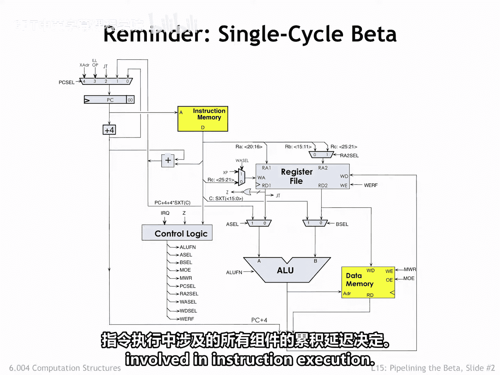
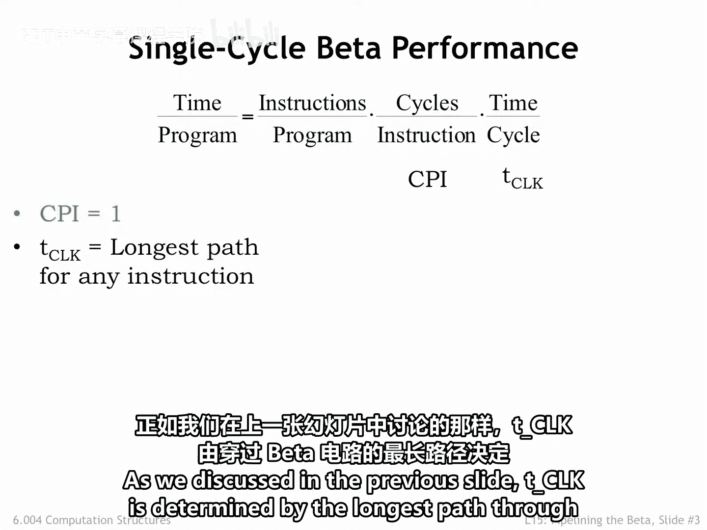
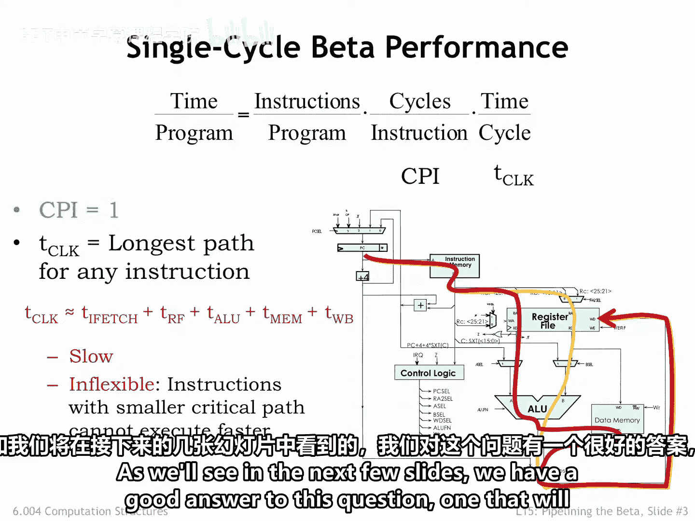
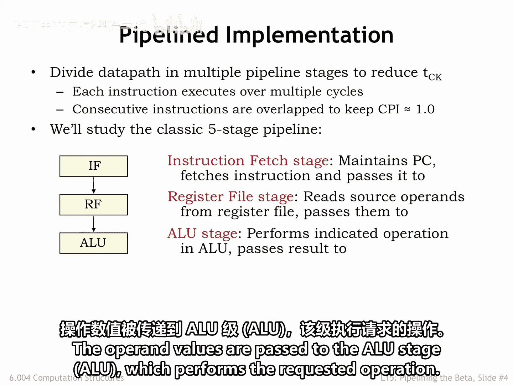
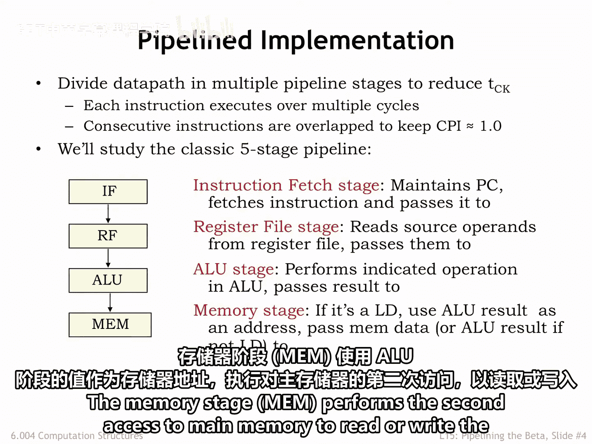
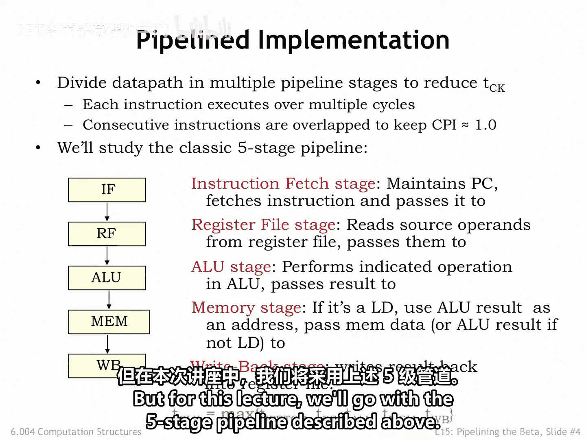
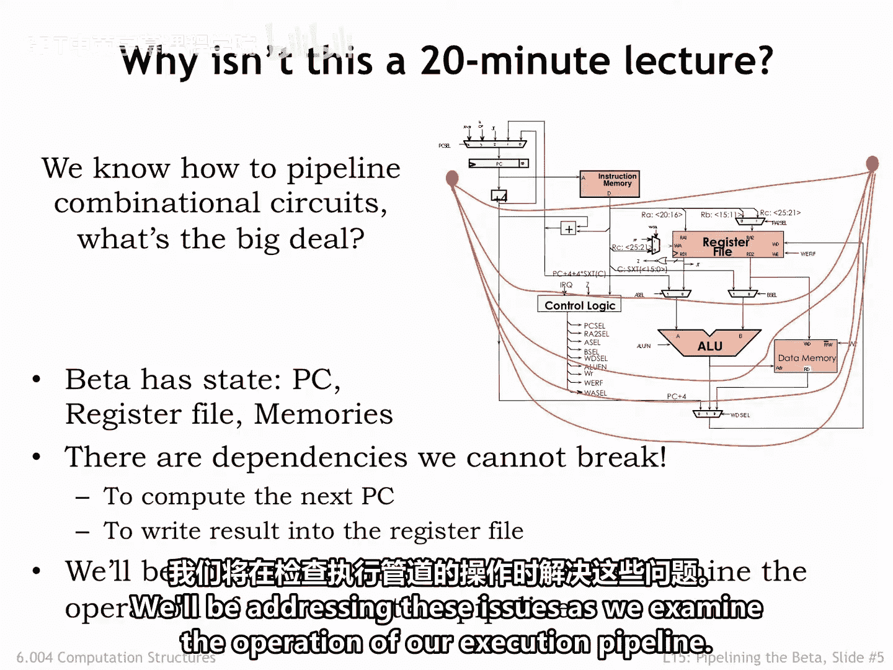
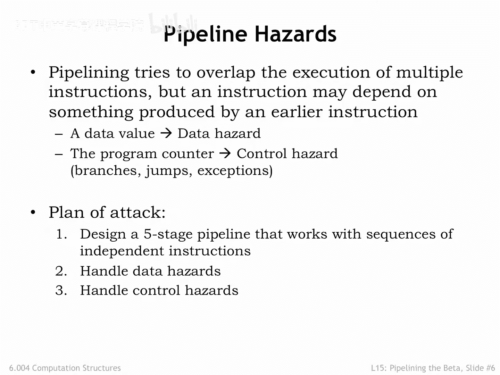

# 033：6.4 提升Beta性能 🚀

在本节课中，我们将运用课程第一部分学到的流水线技术，来提升我们在课程第二部分开发的32位Beta CPU设计的性能。

## 概述

我们之前设计的Beta CPU每个时钟周期执行一条指令。其时钟周期由指令执行路径中所有组件的累积延迟决定。为了提升性能，我们需要减少每条指令的平均时钟周期数（CPI）或缩短时钟周期本身。本节课我们将重点探讨如何通过流水线技术来缩短时钟周期，从而提高指令吞吐量。

## 性能瓶颈分析

上一节我们回顾了Beta CPU的基本设计。本节中我们来看看其性能瓶颈。

执行程序所花费的时间可以表示为三个项的乘积：
1.  执行指令的总数。
2.  执行单条指令所需的平均时钟周期数（CPI）。
3.  单个时钟周期的持续时间（T_clock）。

作为CPU设计者，我们可以控制后两项：CPI和时钟周期。在我们的Beta设计中，每条指令在一个时钟周期内完成，因此CPI为1。时钟周期T_clock则由Beta电路中**最长路径**的延迟决定。

例如，考虑执行一条OP类指令（涉及两个寄存器操作数和ALU运算）的路径。除了几个多路选择器，主存储器、寄存器文件和ALU都必须有时间完成其工作。

最坏情况的执行时间是LOAD指令。在一个时钟周期内，我们需要：
1.  从主存取指令。
2.  从寄存器文件读操作数。
3.  在ALU中执行地址计算。
4.  从主存读取请求的数据。
5.  将数据写入目标寄存器。

这些组件的延迟累加起来，导致了一个相当长的时钟周期，从而程序运行时间也较长。

我们的两个示例执行路径还说明了另一个问题：我们被迫选择能适应最坏情况执行时间的时钟周期，即使某些指令（其执行路径更短）可以执行得更快。我们让所有指令都变慢，仅仅因为有一条指令具有很长的关键路径。

## 引入流水线技术

那么，为什么不简单的指令用一个时钟周期执行，而更复杂的指令用多个周期执行，而不是强迫所有指令都在一个长时钟周期内执行呢？在接下来的几张幻灯片中，我们将看到一个很好的答案，它将允许我们以更短的时钟周期执行所有指令。

我们将使用**流水线技术**来解决这些问题。我们将指令的执行划分为一系列步骤，每个步骤在流水线的连续阶段中执行。

因此，一条指令在流经执行流水线的各个阶段时，需要多个时钟周期才能完成。但由于流水线的每个阶段只有一两个组件，时钟周期可以大大缩短，CPU的吞吐量可以大大提高。

吞吐量的提高是**重叠执行连续指令**的结果。在任何给定时间，CPU中都会有多个指令，每个指令都处于其执行的不同阶段。执行特定指令所有步骤的时间（即指令延迟）可能比我们非流水线实现中的要高一些，但我们将在每个时钟周期完成执行某条指令的最后一步，因此指令吞吐量是每个时钟周期一条。由于流水线CPU的时钟周期要短得多，指令吞吐量也就高得多。

## 经典五级流水线

这听起来很棒，但不出所料，我们还需要处理一些问题。流水线化指令执行的方法有很多。我们将研究经典的**五级指令执行流水线**的设计，该设计在20世纪80年代的集成电路CPU设计中得到广泛应用。

这五个流水线阶段对应于冯·诺依曼存储程序架构中执行指令的步骤：

1.  **取指阶段**：负责从程序计数器指示的主存位置获取二进制编码的指令。
2.  **寄存器读取/译码阶段**：从寄存器文件中读取所需的寄存器操作数。
3.  **执行阶段**：执行请求的操作（如ALU运算）。
4.  **访存阶段**：对主存进行第二次访问，以读取或写入LOAD、LDR或STORE指令的数据，使用ALU阶段的值作为内存地址。
5.  **写回阶段**：将前面阶段的结果写入寄存器文件中的目标寄存器。

观察之前幻灯片中的执行路径，我们看到非流水线设计的每个主要组件现在都在自己的流水线阶段中。因此，时钟周期现在将由这些组件中最慢的一个决定。

将指令执行分为五个阶段后，我们是否期望时钟周期变为原始值的五分之一？这只有在我们将执行划分得使每个阶段恰好完成总工作量的五分之一时才会发生。实际上，主要组件的延迟略有不同，因此指令吞吐量的提升将略低于理想五级流水线所能达到的5倍因子。如果我们有一个慢速组件（例如ALU），我们可以选择将该组件进一步流水线化，或交错使用多个ALU以达到相同的效果。但在本讲座中，我们将采用上述的五级流水线。

## 流水线的挑战

那么，为什么这不是一个20分钟的讲座呢？毕竟，我们知道如何流水线化组合电路。我们可以通过在电路图上画K条等高线，并在等高线与信号相交的任何地方添加流水线寄存器，来构建一个有效的K级流水线。这里有什么大问题吗？

问题是，这个电路是组合电路吗？**不是**，寄存器文件和内存中都有状态。这意味着执行给定指令的结果可能依赖于先前指令的结果。

电路中存在环路，来自后面流水线阶段的数据会影响前面流水线阶段的执行。例如，在WB阶段结束时对寄存器文件的写入，将改变在RF阶段从寄存器文件读取的值。换句话说，指令之间存在**执行依赖关系**，当我们尝试流水线化指令执行时，需要考虑这些依赖关系。

## 数据冒险与控制冒险

我们将通过检查执行流水线的操作来解决这些问题。

有时，给定指令的执行将依赖于执行先前指令的结果。有两种类型的问题依赖：

1.  **数据冒险**：当当前指令的执行依赖于先前指令产生的数据时发生。例如，一条读取寄存器R0的指令将依赖于先前写入R0的指令的执行。
2.  **控制冒险**：当分支、跳转或异常改变执行顺序时发生。例如，在BEQ指令之后执行哪条指令的选择取决于分支是否被采纳。

当指令所依赖的指令也在流水线中时（换句话说，前面的指令尚未完成执行），指令执行就会触发冒险。我们需要调整流水线中的执行以避免这些冒险。

## 行动计划

以下是我们的行动计划：

1.  首先设计一个五级流水线，使其能够处理**不触发冒险**的指令序列（即指令执行不依赖于仍在流水线中的先前指令）。
2.  然后修复我们的流水线，以正确处理**数据冒险**。
3.  最后，解决**控制冒险**。

## 总结

本节课中我们一起学习了如何通过引入流水线技术来提升CPU性能。我们分析了非流水线设计的性能瓶颈，介绍了经典的五级流水线结构（IF、RF、EX、MEM、WB），并指出了在流水线设计中需要解决的关键挑战：数据冒险和控制冒险。在接下来的课程中，我们将按照行动计划，逐步构建并完善能够高效处理这些冒险的流水线CPU。