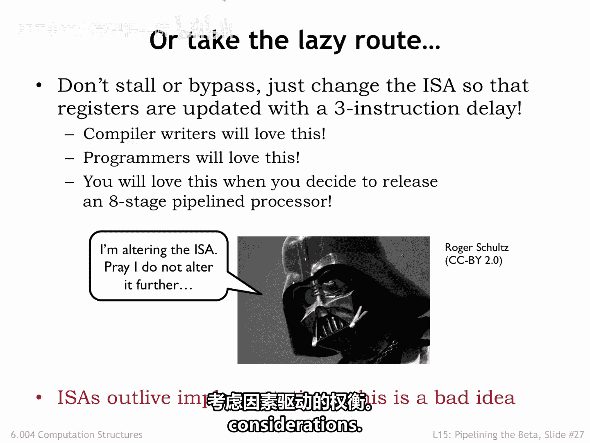

# 035：数据冒险

在本节课中，我们将要学习流水线CPU设计中的一个核心挑战：数据冒险。我们将了解数据冒险产生的原因，并探讨两种主要的解决策略：**停顿**和**旁路**。通过本课，你将理解如何确保流水线CPU与无流水线CPU产生相同的程序结果。

## 流水线图

上一节我们介绍了数据通路图，但它在描述指令序列的流水线执行时并不十分方便，因为每个时钟周期都需要一张新的图。

课程第一部分介绍的流水线图提供了更紧凑、更易读的流水线执行表示方法。图中每一行代表一个流水线阶段，每一列代表一个执行周期。表格中的条目显示了在正常操作下，每个周期每个流水线阶段正在处理的指令。一条特定指令在经历五个流水线阶段的过程中，会沿着对角线在图中移动。

## 寄存器读写时机

为了理解数据冒险，我们首先需要回顾特定指令在何时读写寄存器文件。

寄存器读取发生在指令处于RF（取寄存器）阶段时，也就是我们读取指令操作数寄存器的时候。

寄存器写入发生在指令处于WB（写回）阶段结束的那个周期。例如，对于第一条加载指令，我们在周期2读取R1，并在周期5结束时写入R2。

考虑周期6中的寄存器文件操作：我们为处于RF阶段的`MUL`指令读取R12和R13，同时为处于WB阶段的加载指令在周期结束时写入R4。

## 数据冒险的产生

现在，让我们看看当指令序列中存在数据冒险时会发生什么。`ADD`指令将其结果写入R2，而紧随其后的`SUB`指令会立即读取R2。

`SUB`指令的执行显然依赖于`ADD`指令的结果。我们称之为**写后读依赖**。

流水线图展示了周期性的执行过程，我们圈出了`ADD`写入R2和`SUB`读取R2的周期。问题在于：`ADD`直到周期5结束时才写入R2，但`SUB`试图在周期3读取R2值。周期3时寄存器文件中的R2值尚未反映`ADD`指令的执行结果。因此，按照当前情况，流水线将无法正确执行该指令序列。这个指令序列触发了一个**数据冒险**。

我们希望流水线CPU能产生与无流水线CPU相同的程序结果，因此需要找到解决方案。

## 解决数据冒险的策略

有三种通用策略可用于解决流水线冒险。任何技术都有效，但正如我们将看到的，它们在指令吞吐量和电路复杂性方面有不同的权衡。

**第一种策略**是让指令在RF阶段**停顿**，直到它们所需的结果被写入寄存器文件。“停顿”意味着我们在周期结束时**不重新加载**指令寄存器，因此下个周期将尝试执行同一条指令。如果我们停顿一个流水线阶段，所有更早的阶段也必须停顿，因为它们被停顿的指令阻塞了。如果一条指令在RF阶段停顿，那么IF阶段也会停顿。停顿总是有效，但会对指令吞吐量产生负面影响。停顿太多周期会丧失流水线执行的性能优势。

**第二种策略**是**旁路**或**转发**，即在结果计算出来后立即将其路由到更早的流水线阶段。事实证明，我们需要的值通常存在于流水线数据通路的某个地方，只是尚未写入寄存器文件。如果该值存在并能转发到需要的地方，我们就不需要停顿。我们将能够使用此策略来避免大多数类型的数据冒险导致的停顿。

**第三种策略**是**推测**，即对所需值进行智能猜测并继续执行。一旦确定了实际值，如果我们猜对了，就万事大吉；如果猜错了，就必须回退执行并用正确的值重新开始。显然，只有在能够做出准确猜测的情况下，推测才有意义。我们将能够使用此策略来避免控制冒险导致的停顿。

接下来，让我们看看前两种策略在处理数据冒险时如何工作。

## 策略一：停顿

将停顿策略应用于我们的数据冒险，我们需要让`SUB`指令在RF阶段停顿，直到`ADD`指令将其结果写入R2。

在流水线图中，`SUB`在RF阶段停顿了三次，直到它最终能在周期6从寄存器文件访问R2值。每当RF阶段停顿时，IF阶段也会停顿。但当RF停顿时，AOU阶段在下个周期应该做什么？RF阶段尚未完成工作，因此无法将其指令传递下去。

解决方案是让RF阶段为AOU阶段生成一条无害的指令，称为**空操作**指令。空操作指令对CPU状态没有影响，即不改变寄存器文件或主存储器的内容。例如，任何以R31作为目标寄存器的OP类或OPSY类指令都是空操作。由停顿的RF阶段引入流水线的空操作在图中以红色显示。由于`SUB`在RF阶段停顿了三个周期，因此有三个空操作被引入流水线，我们有时将这些空操作称为流水线中的“气泡”。

流水线如何知道何时停顿？它可以比较RF阶段指令的RA和RB字段中的寄存器编号，与AOU、MEM、WB阶段指令的RC字段中的寄存器编号。如果匹配，则存在数据冒险，RF阶段应停顿。停顿将持续到检测不到冒险为止。这里有一些细节需要注意：有些指令不读取两个寄存器；存储指令不使用其RC字段；我们不希望R31匹配，因为从寄存器文件读取R31总是安全的。

停顿将确保正确的流水线执行，但确实会增加有效CPI。如果CPI的增加大于流水线化带来的周期时间减少，将导致更长的执行时间。

为了实现停顿，我们只需要对流水线数据通路进行两处简单的修改：
1.  生成一个新的控制信号`STALL`，当它有效时，禁止加载IF和RF阶段输入端的三个流水线寄存器，这意味着它们下个周期的值将与本周期的值相同。
2.  引入一个多路选择器来选择发送给AOU阶段的指令。如果`STALL`为1，我们选择一条空操作指令（例如，目标寄存器为R31的`ADD`指令）。如果`STALL`为0，则RF阶段未停顿，因此它将当前指令传递给AOU。

以下是计算`STALL`信号的方法（如前一张幻灯片所述）：
```verilog
// 简化逻辑示例：检测RAW冒险
stall = (RA == RC_AOU || RB == RC_AOU || RA == RC_MEM || RB == RC_MEM) && (RA != 31 && RB != 31);
```
实现停顿所需的额外逻辑相当简单，因此真正的设计权衡在于：因停顿而增加的CPI与因流水线化而减少的周期时间之间的权衡。这样我们有了一个解决方案，尽管它可能带来一些性能成本。

## 策略二：旁路

现在考虑我们的第二种策略：旁路。如果RF阶段需要的数据存在于流水线数据通路中的某个地方，则此策略适用。在我们的例子中，尽管`ADD`直到周期5结束时才写入R2，但将要写入的值是在周期3`ADD`处于AOU阶段时计算出来的。在周期3，AOU的输出正是同一周期处于RF阶段的`SUB`所需的值。

因此，如果我们检测到R阶段指令的RA字段与ALU阶段指令的RC字段相同，我们就可以使用ALU的输出，来代替从寄存器文件读取的过时RA值。无需停顿。在我们的例子中，在周期3，我们希望将ALU的输出路由到RF阶段，作为R2的值。我们用一条红色的旁路箭头表示数据从AOU阶段路由到RF阶段。

为了实现旁路，我们将在寄存器文件的读端口添加一个多输入多路选择器，以便我们可以从其他流水线阶段选择适当的值。这里我们展示了来自AOU、MEM和WB阶段的组合旁路路径。对于之前幻灯片中的旁路示例，我们在周期3使用蓝色旁路路径来获取R2的正确值。

旁路多路选择器由匹配源寄存器编号与AOU、MEM、WB阶段目标寄存器编号的逻辑控制，并需处理R31的常见复杂情况。如果存在多个匹配怎么办？换句话说，如果RF阶段试图读取的寄存器同时是AOU和MEM阶段指令的目标寄存器。没问题，我们希望选择来自**最近指令**的结果。因此，如果有AOU匹配，则选择它，然后是MEM匹配，接着是WB匹配，最后才是寄存器文件的输出。

下图展示了所有需要的旁路路径。


请注意，分支和跳转指令将其PC+4值写入寄存器文件，因此我们也需要从它们各自阶段的PC+4值以及AOU值进行旁路。

旁路发生在周期结束时，例如，在ALU计算出结果之后。为了适应旁路多路选择器的额外传输延迟，我们必须将时钟周期稍微延长。因此，这里再次存在设计权衡：停顿带来的CPI增加与旁路带来的周期时间略微增加。当然，在旁路的情况下，还需要额外的布线面积和多路选择器。

我们可以通过减少旁路的数量来降低成本，例如，只旁路来自AOU阶段的AOU结果，并使用停顿来处理所有其他数据冒险。

## 旁路无法完全解决的问题：加载-使用冒险

如果我们实现了完全旁路，是否还需要停顿逻辑？事实证明，需要。有一种数据冒险是旁路无法完全解决的。

考虑试图立即使用加载指令结果的情况。在下面展示的例子中，`SUB`试图使用紧接其前的加载指令写入R2的值。这被称为**加载-使用冒险**。

回想一下，加载数据直到加载指令到达WB阶段的那个周期才在数据通路中可用。因此，即使有完全旁路，我们也需要让`SUB`在RF阶段停顿直到周期5，从而在流水线中引入两个空操作。如果没有来自WB阶段的旁路，我们需要停顿直到周期6。

## 总结与扩展

本节课中我们一起学习了处理数据冒险的两种主要策略。

1.  **停顿**：我们可以让IF和RF阶段停顿，直到RF阶段指令所需的寄存器值在寄存器文件中可用。所需硬件简单，但引入流水线的空操作浪费了CPU周期，导致更高的有效CPI。
2.  **旁路**：我们可以使用旁路路径将所需值路由到RF阶段，前提是它们存在于流水线数据通路中的某个地方。这种方法比停顿需要更多的硬件，但不会降低有效CPI。

即使实现了旁路，我们仍然需要停顿来处理加载-使用冒险。

我们能否通过添加更多流水线阶段来进一步减少时钟周期？更多的流水线阶段意味着同时有更多的指令在流水线中，这反过来增加了数据冒险的机会和停顿的必要性，从而增加了CPI。

编译器可以通过重组它们生成的汇编代码来帮助减少依赖。这是我们之前看到的加载-使用冒险示例。即使有完全旁路，我们也需要停顿两个周期。但如果编译器或汇编语言程序员注意到`MUL`和`XOR`指令独立于`SUB`指令，因此可以移到`SUB`之前，那么依赖关系就变成了：当`SUB`处于RF阶段时，加载指令自然处于WB阶段，因此不需要停顿。这种优化仅在编译器能够找到可以移动的独立指令时才有效。不幸的是，在许多程序中很难找到这样的指令。

还有一种最终方法：改变指令集架构，使数据冒险成为ISA的一部分。换句话说，直接规定对目标寄存器的写入有**三条指令的延迟**。如果需要空操作，就让程序员将它们添加到程序中。以让编译器工作更复杂为微小代价，来简化硬件。你可以想象编译器编写者会有多喜欢这个建议，更不用说汇编语言程序员了。而且当你添加更多流水线阶段时，你还可以再次更改ISA。这就是编译器编写者如何看待那些单方面更改ISA以节省几个逻辑门的CPU架构师。


成功的ISA具有非常长的生命周期，因此不应包含由短期实现考虑驱动的权衡。最好不要走那条路。