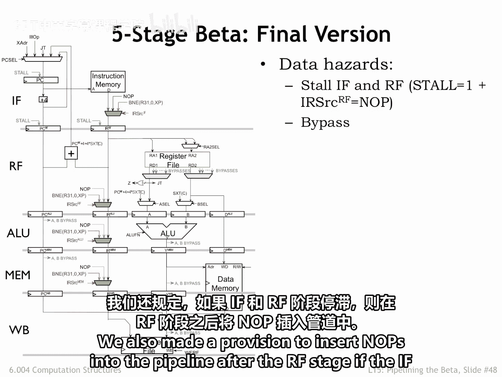
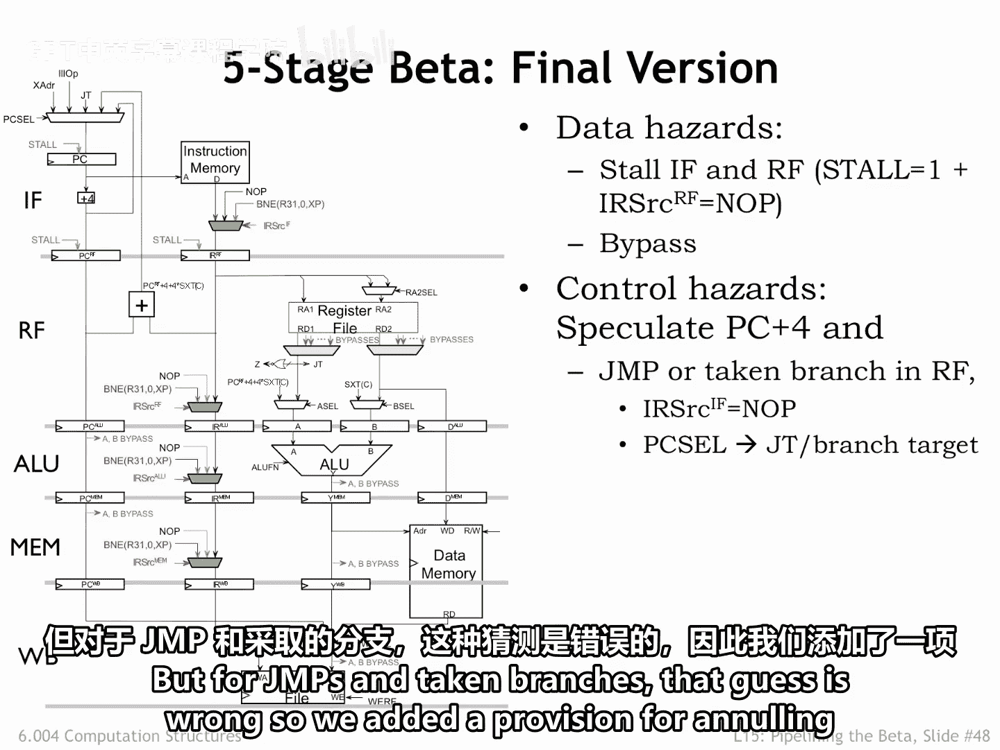
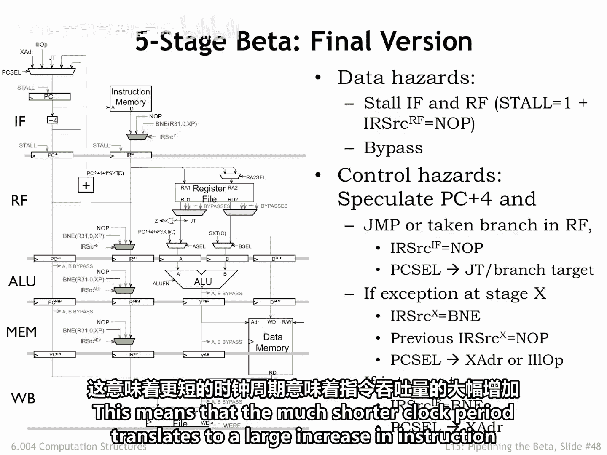
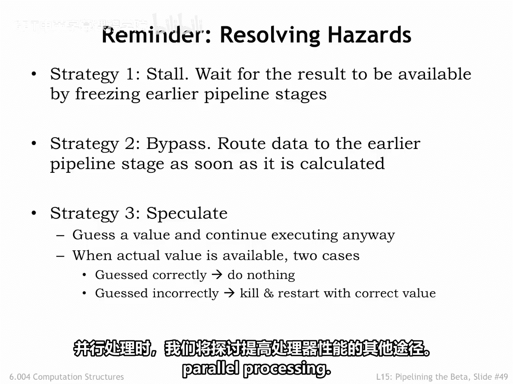

# 038：15.2.6 流水线总结 🚀

在本节课中，我们将学习五级流水线数据通路的最终版本，并回顾我们为处理数据冒险、控制冒险以及异常和中断所添加的硬件逻辑。我们还将总结用于提升流水线性能的核心策略。

## 五级流水线数据通路最终版

上一节我们讨论了流水线中的各类冒险，本节中我们来看看为应对这些挑战而设计的完整数据通路。

下图展示了我们最终的五级流水线数据通路设计。

## 处理数据冒险

为了处理数据冒险，我们在数据通路中增加了两处关键设计。

以下是具体的硬件修改：
*   我们在 **IF**（取指）和 **RF**（寄存器读取）阶段的输入寄存器处添加了**暂停逻辑**。
*   我们在寄存器文件读端口的输出处添加了**旁路多路选择器**。这样，如果需要访问一个已计算但尚未写回寄存器文件的值，我们可以从数据通路中更靠后的阶段（如 ALU 输出或内存读取结果）直接获取该值。
*   我们还规定，当 IF 和 RF 阶段被暂停时，可以在 RF 阶段之后向流水线中插入**空操作指令**。

## 处理控制冒险

为了处理控制冒险，我们采用了推测执行策略。

我们默认推测下一条指令的地址是 **PC + 4**。然而，对于跳转指令和条件分支指令（当分支被采纳时），这个猜测是错误的。

因此，我们增加了相应的机制，用于**作废** IF 阶段中取出的错误指令。下图说明了这一过程。

## 处理异常与中断

为了处理异常和中断，我们在除最后一级流水线外的所有阶段都添加了指令作废逻辑。

具体的处理流程如下：
*   一条引发异常的指令会被替换为一条特殊的 `trap` 指令，以捕获其 **PC + 4** 的值。
*   所有位于该异常指令之前、尚在流水线更早阶段中的指令都会被作废。

## 性能与策略总结

所有增加的这些额外电路，都是为了确保流水线执行的结果与非流水线执行的结果完全相同。

通过使用**旁路**和**分支预测**，我们确保了数据和**控制冒险**对有效 **CPI** 只产生很小的负面影响。这意味着，虽然每条指令的周期数可能略有增加，但大幅缩短的时钟周期最终带来了指令吞吐量的巨大提升。

下图概括了性能提升的关键。

值得牢记我们用来处理冒险的三大策略：**暂停**、**旁路**和**推测**。大多数执行问题都可以通过其中一种策略来解决。如果你未来需要设计高性能流水线系统，请务必记住这些策略。

## 课程总结

本节课中我们一起学习了五级流水线设计的最终形态，回顾了应对数据冒险、控制冒险及异常中断的硬件机制，并总结了提升流水线性能的核心策略。

关于流水线的讨论到此结束。在最后一讲中，我们将探索提升处理器性能的其他途径，即讨论**并行处理**。

