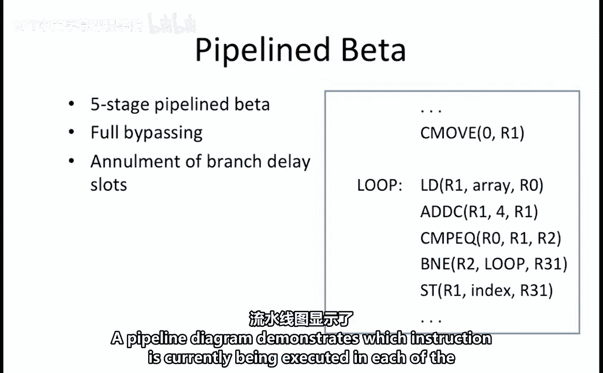
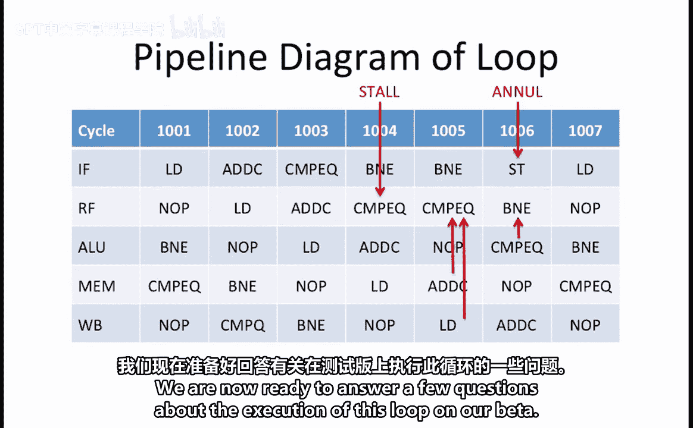
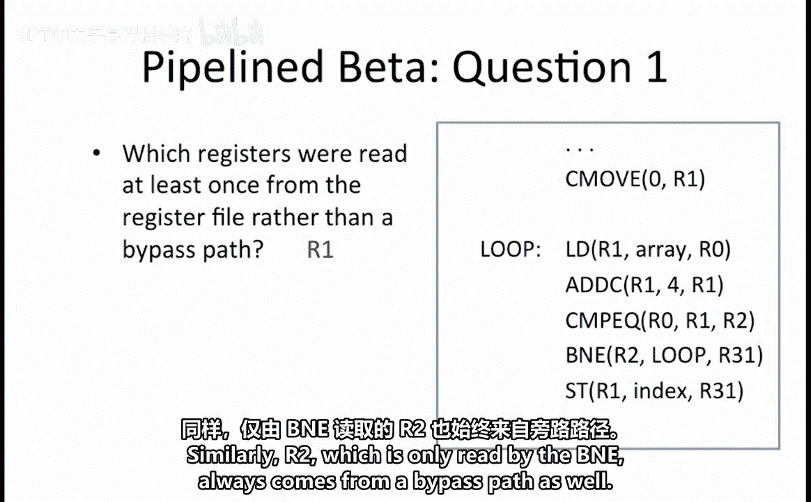
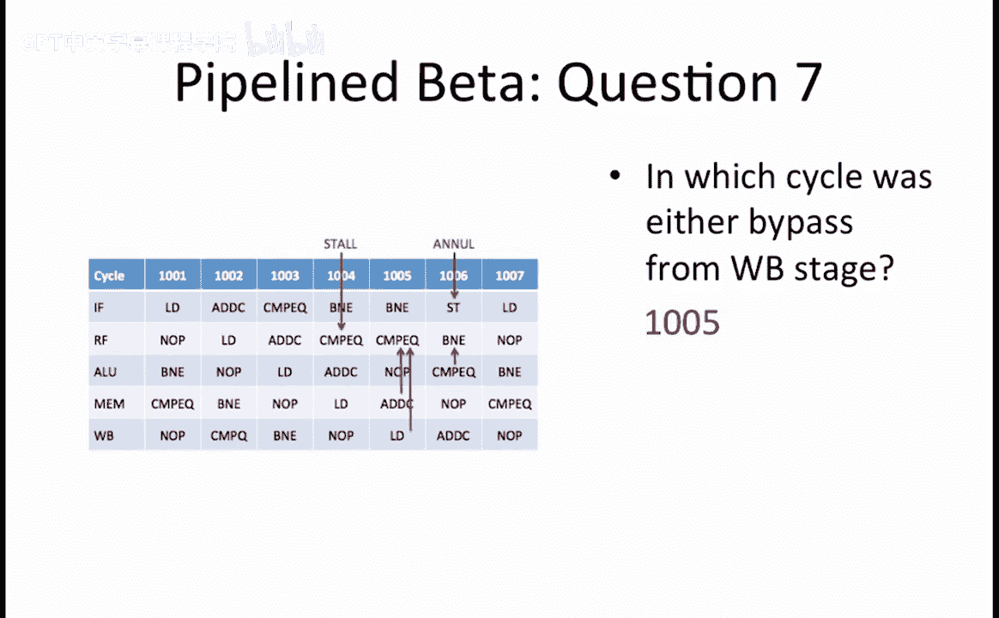

# 039：流水线Beta处理器工作示例解析 🧠

在本节课中，我们将学习如何分析一个在五级流水线Beta处理器上运行的程序。我们将通过绘制流水线图，来理解指令如何流经各个阶段，以及如何处理数据冒险、流水线停顿和分支延迟槽的取消。

## 概述

我们假设有一个功能完整的五级流水线Beta处理器，它具备完整的旁路（Bypassing）和分支延迟槽取消（Annulment）机制，正如课程中所介绍的那样。这个处理器已经运行了下面展示的程序一段时间。虽然程序的具体功能对本问题并不重要，但我们还是快速回顾一下。

程序开始时，先将寄存器R1初始化为0，然后进入循环。R1代表当前正在访问的数组元素的索引。在循环内部，该数组元素的值被加载到寄存器R0中。接着，R1的值增加4，以指向数组中的下一个元素。然后，程序将刚刚加载到R0的数组元素值与更新后的R1索引值进行比较。如果它们相等，则重复循环；如果不相等，则将当前R1的值存储到名为`index`的内存位置，以记录满足比较条件的索引值。

我们的目标是理解这个程序在Beta处理器上的运行情况。为此，我们将创建一个流水线图来展示程序的执行过程。

## 流水线图解析

流水线图展示了在五个流水线阶段中，每个阶段当前正在执行哪条指令。行代表指令所处的流水线阶段，共有五个阶段：

1.  **IF（取指阶段）**：从内存中获取下一条指令。
2.  **RF（寄存器文件阶段）**：读取指令的源操作数。
3.  **ALU（算术逻辑单元阶段）**：执行所有需要的算术和逻辑单元操作。
4.  **MEM（内存访问阶段）**：可以开始为加载或存储操作访问内存，因为内存地址已在ALU阶段计算出来。
5.  **WB（写回阶段）**：将结果写回寄存器文件。

流水线图的列代表执行周期。

我们的循环以一条加载（LOAD）指令开始。因此，我们在周期1001的IF阶段看到了这条LOAD指令。接着，LOAD指令依次通过流水线的五个阶段。

下一条是ADDC指令。由于LOAD和ADDC指令之间没有数据依赖，ADDC指令在周期1002开始，并同样通过Beta流水线的所有五个阶段。

接下来是CMPEQ（比较相等）指令。当我们到达CMPEQ指令时，遇到了第一个数据冒险。这是因为LOAD指令正在更新R0，而CMPEQ指令需要读取R0的这个新值。

回忆一下，LOAD指令直到流水线的写回（WB）阶段才会产生其值。这意味着，即使有完整的旁路逻辑，CMPEQ指令也无法读取寄存器R0，除非LOAD指令处于写回阶段。因此，我们必须在周期1004启动流水线停顿。

在我们的流水线图中，可以在周期1005看到这个停顿：CMPEQ指令仍停留在RF阶段，并且我们在原本早一个周期进入流水线的CMPEQ指令的位置插入了一个空操作（NOP）。

CMPEQ之后的下一条指令是BNE（若不相等则分支）。注意，它在周期1004进入了IF阶段，但它也同样被CMPEQ指令的停顿所阻塞。因此，当CMPEQ卡在RF阶段时，BNE停留在IF阶段。

在周期1005，CMPEQ能够通过使用从写回阶段到RF阶段的旁路路径来读取R0的更新值，以及使用从MEM阶段到RF阶段的旁路路径来读取ADDC指令产生的R1更新值，从而完成对其操作数的读取。

在周期1006，CMPEQ指令进入ALU阶段，而BNE指令可以进入RF阶段。由于CMPEQ将要更新R2的值（这是BNE试图读取的寄存器），我们需要利用从ALU阶段到RF阶段的旁路路径，以便在周期1006为BNE提供CMPEQ指令的结果。

RF阶段也是生成Z信号的阶段。Z信号告诉Beta处理器一个寄存器是否等于0。这意味着，到周期1006的RF阶段结束时，BNE将知道是否应该重复循环。

我们现在说明如果循环在周期1006重复，流水线图会发生什么。在周期1006，存储（STORE）指令进入了流水线的IF阶段，因为在确定分支是否被采纳之前，我们假设应该继续取下一条指令。如果BNE确定应该分支回循环起点，那么这条刚刚取出的STORE指令必须被取消，方法是在其位置插入一个空操作（NOP）。这个取消操作在周期1006启动，并在周期1007的RF阶段显示为一个NOP。

在周期1007，我们还看到现在取出了循环的第一条指令，即LOAD指令，以便我们可以重复循环。

下图是一个完整的流水线图，展示了我们的示例代码中循环的重复执行，以及所使用的旁路路径、流水线停顿的启动和分支延迟槽的取消。

## 问题与解答

现在，我们准备回答几个关于该循环在Beta处理器上执行的问题。

### 问题一：寄存器读取方式

第一个问题是：寄存器R0、R1和/或R2中，哪些至少有一次是直接从寄存器文件读取的，而不是通过旁路路径？

回顾我们完整的流水线图，我们看到LOAD和ADDC指令没有通过旁路路径读取它们的操作数。由于这两条指令都读取了R1，这意味着寄存器R1至少有一次是直接从寄存器文件读取的。R0仅被CMPEQ读取，且总是来自旁路路径。同样，R2仅被BNE读取，也总是来自旁路路径。

**答案**：只有寄存器 **R1** 至少有一次是直接从寄存器文件读取的。

### 问题二：控制信号周期分析

接下来，我们想确定流水线Beta硬件中，控制信号在哪些周期被设置为特定值。

以下是具体问题与答案：

1.  **在哪个周期 `stall` 信号被设置为1？**
    这发生在停顿启动的周期，即**周期1004**。在该周期结束时，通过不允许新的值加载到该流水线阶段的指令寄存器中，当前处于IF和RF阶段的指令被停顿。

2.  **在哪个周期 `annul_IF` 不等于0？**
    `annul_stage` 控制信号指定在特定阶段何时启动取消操作。为了启动取消，当前在IF阶段的指令会被一个NOP替换。当我们需要取消一个分支延迟槽时，这发生在IF阶段。在我们的例子中，这发生在**周期1006**。

3.  **在哪个周期 `annul_RF` 不等于0？**
    这个问题是问在RF阶段何时启动了取消操作。这发生在CMPEQ指令需要被停顿在RF阶段以填充流水线气泡时。在周期1004，一个NOP被插入流水线，取代了当时在RF阶段的CMPEQ指令。因此，停顿以及 `annul_RF` 不等于0的设置，发生在**周期1004**。

4.  **在哪个周期 `annul_ALU` 不等于0？**
    换句话说，在哪个周期我们启动了用NOP替换ALU阶段指令的操作？在我们的示例中，**这没有发生**。

### 问题三：旁路路径使用分析

现在，我们考虑旁路路径的使用情况。

1.  **在哪个周期使用了来自ALU阶段的任一旁路路径？**
    在周期1006，BNE通过来自ALU阶段的旁路路径读取了CMPEQ指令的结果。

2.  **在哪个周期使用了来自MEM阶段的任一旁路路径？**
    在周期1005，CMPEQ通过来自MEM阶段的旁路路径读取了ADDC指令的结果。

3.  **在哪个周期使用了来自写回（WB）阶段的任一旁路路径？**
    在周期1005，CMPEQ通过来自写回阶段的旁路路径读取了LOAD指令的结果。

## 总结

在本节课中，我们一起学习了如何为运行在五级流水线Beta处理器上的程序绘制和分析流水线图。我们看到了指令如何流经IF、RF、ALU、MEM和WB阶段，并重点分析了数据冒险的处理：通过使用来自ALU、MEM和WB阶段的旁路路径来避免停顿，以及在无法避免时如何插入停顿周期（Stall）。我们还了解了分支预测错误时的处理机制，即通过将错误取入流水线的指令替换为空操作（NOP）来取消分支延迟槽。通过回答具体问题，我们巩固了对寄存器读取方式、控制信号生效时机以及旁路路径使用场景的理解。掌握这些知识对于深入理解处理器流水线的工作原理和性能分析至关重要。