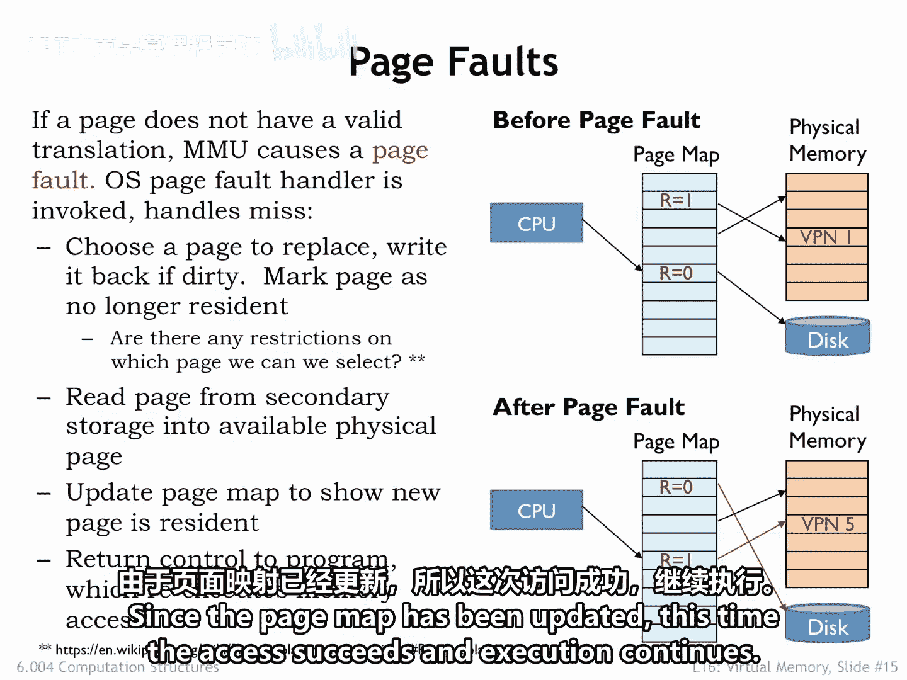
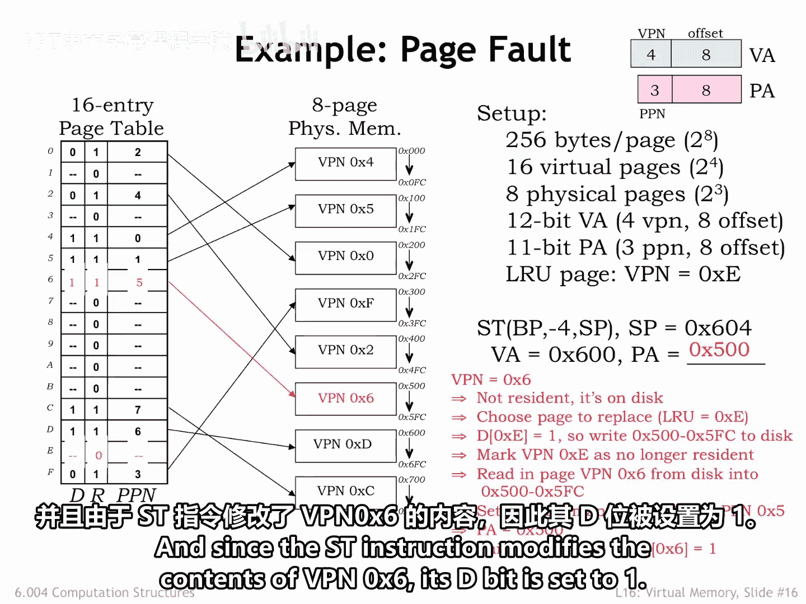
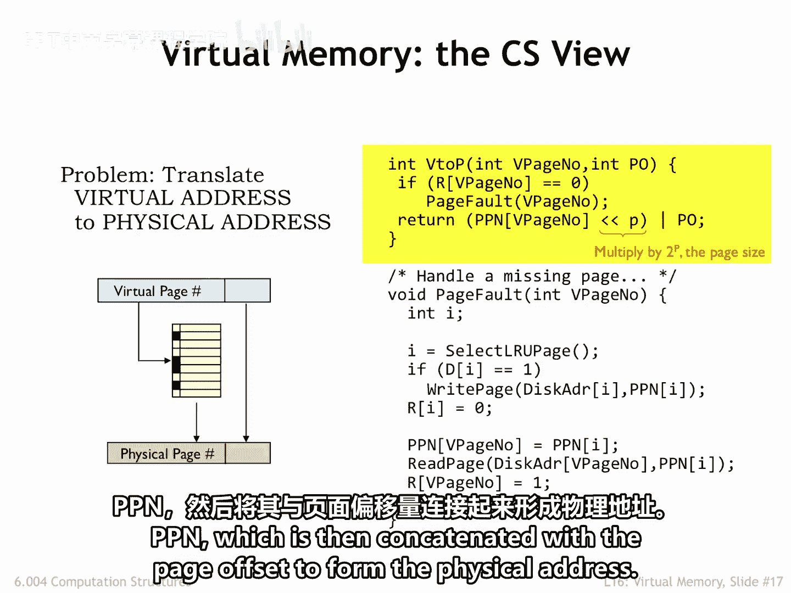
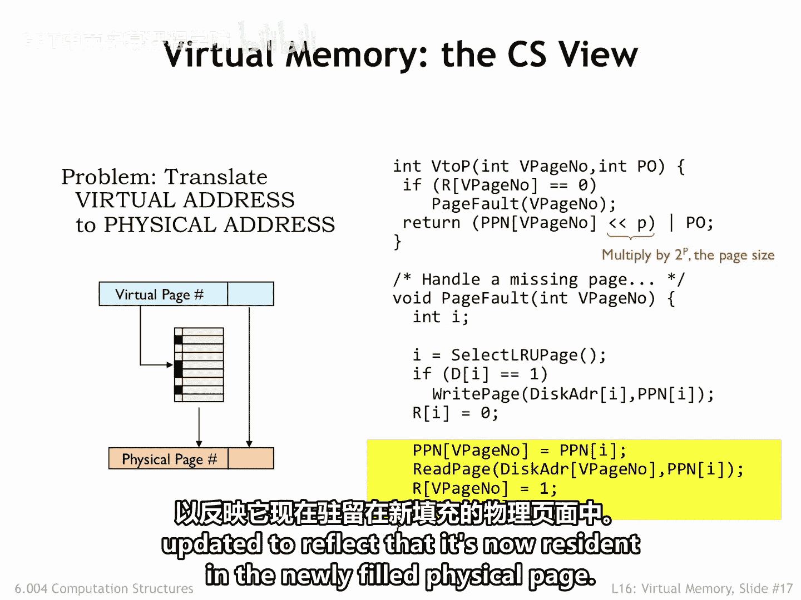
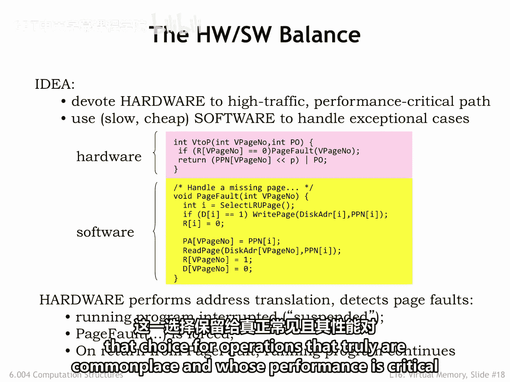

# 043：16.2.3 缺页异常 📄

在本节课中，我们将要学习当CPU访问一个不在物理内存中的虚拟页时会发生什么，这个过程被称为“缺页异常”。我们将详细拆解缺页处理的全过程，并通过一个具体例子来加深理解。

## 缺页异常处理流程 🔄

上一节我们介绍了虚拟内存的基本概念，本节中我们来看看当CPU试图访问一个驻留位（R位）为0的非驻留虚拟页时，系统如何响应。

以下是缺页异常处理的标准步骤：

1.  **触发异常**：CPU访问一个R位为0的虚拟页，内存管理单元（MMU）会发出一个缺页异常信号。
2.  **切换处理器**：CPU暂停当前程序的执行，转而运行操作系统中的缺页异常处理程序。
3.  **选择替换页**：处理程序首先需要找到一个可用的物理页。它可能直接找到一个空闲页，或者通过选择一个正在使用的页并将其内容移出来“创造”一个空闲页。
4.  **写回脏页**：如果被选中的替换页是“脏的”（即其D位为1，表示自上次从二级存储读入后内容已被修改），则必须将其内容写回二级存储（如硬盘）。
5.  **更新页表**：将选中的虚拟页标记为非驻留（将其R位设为0）。
6.  **加载目标页**：将目标虚拟页的内容从二级存储读入到刚刚腾出的物理页中。
7.  **更新目标页表项**：更新目标虚拟页的页表项，将其R位设为1，并填入正确的物理页号（PPN）。
8.  **恢复执行**：处理程序结束，CPU恢复执行原程序，并重新执行那条引发缺页异常的指令。此时，由于页表已更新，内存访问将成功。

## 页面替换策略 🤔

在步骤3中，我们需要选择一个页面进行替换。这里存在一个关键问题：我们应该选择哪个页面？

*   **限制**：有些页面不能被选择，例如存放缺页处理程序代码本身的页面（称为“有线”页面）。选择刚刚触发访问的页面也非常低效。
*   **理想策略**：最优策略是选择那个在未来最长时间内都不会被再次使用的页面。但这需要预知未来的执行路径，因此无法实现。
*   **实际策略**：存在多种权衡实现难度与缺页率的替换策略。幻灯片底部提供的维基百科链接对此有详细描述。其中描述的“老化算法”因其能以适中的实现成本提供接近最优的性能而被频繁使用。

## 实例分析：深入理解缺页 📝

为了双重确认我们对缺页的理解，让我们通过一个具体例子来演练一遍。

假设当前状态如上图所示。现在，考虑一条存储指令正在访问虚拟地址 `0x600`，该地址位于虚拟页6（VPN 6）上。

1.  **检查页表**：查看VPN 6的页表项，发现其R位为0，表明它不在主存中。这触发了缺页异常。
2.  **选择替换页**：根据题目设定，缺页处理程序选择最近最少使用的VPN 4作为替换页。
3.  **处理脏页**：VPN 4的页表项中D=1，因此处理程序将物理页5中的内容（即VPN 4的内容）写回二级存储。
4.  **更新替换页状态**：更新页表，将VPN 4标记为非驻留（R位设为0）。
5.  **加载目标页**：将VPN 6的内容从二级存储读入现在可用的物理页5。
6.  **更新目标页状态**：更新VPN 6的页表项，指明它现在驻留在物理页5中（R=1，PPN=5）。
7.  **恢复与执行**：缺页处理程序完成工作，程序恢复执行，重新执行那条存储指令。这次，MMU成功将虚拟地址 `0x600` 转换为物理地址 `0x500`。由于存储指令修改了VPN 6的内容，其D位被设置为1。

## 硬件与软件的分工 ⚙️

我们可以将MMU的工作分为两个任务，用计算机科学的术语来说，就是两个过程。

*   **`V2P` 过程（地址转换）**：每次内存访问时都会调用，负责将虚拟地址转换为物理地址。它使用页表信息（驻留位数组、脏位数组、物理页号数组）进行查找。如果请求的虚拟页未驻留，则调用 `page_fault` 过程。
*   **`page_fault` 过程（缺页处理）**：当 `V2P` 发现缺页时被调用。它负责选择替换页、必要时写回脏页、从二级存储加载目标页，并更新页表信息。

在实现上，我们采用了一个良好的策略：

*   **硬件实现 `V2P`**：因为每次内存访问都需要它，必须追求速度。
*   **软件实现 `page_fault`**：通过缺页异常机制，引导CPU去执行包含 `page_fault` 过程的处理程序软件。缺页是希望不常发生的异常情况，用软件处理更为灵活。

这本质上是在专用硬件（如MMU）和通用硬件（如CPU）之间进行权衡。我们通常对使用专用硬件的提议持怀疑态度，只将其留给那些确实非常频繁且对系统整体性能至关重要的操作。

## 总结 📚

本节课中我们一起学习了缺页异常的处理机制。我们了解到，当CPU访问一个不在物理内存中的页面时，会触发缺页异常，由操作系统的处理程序接管。该处理程序负责选择一个物理页进行替换、必要时保存其内容、从硬盘加载所需页面，并更新页表。最后，原程序得以恢复执行。整个系统通过硬件实现快速的常规地址转换，而通过软件异常处理不常见的缺页情况，实现了效率与灵活性的平衡。