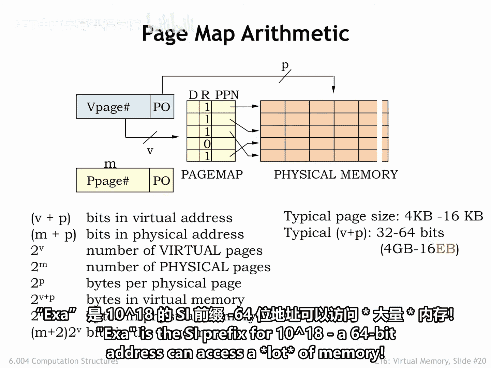
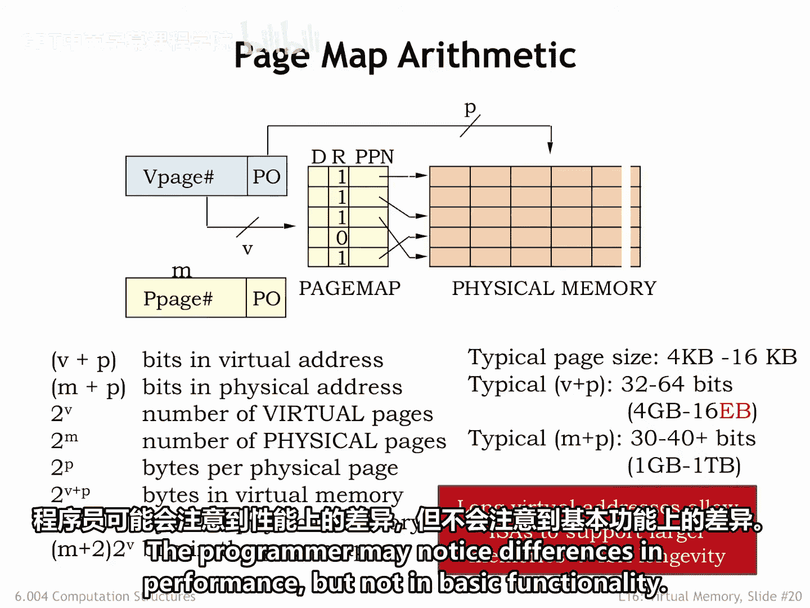
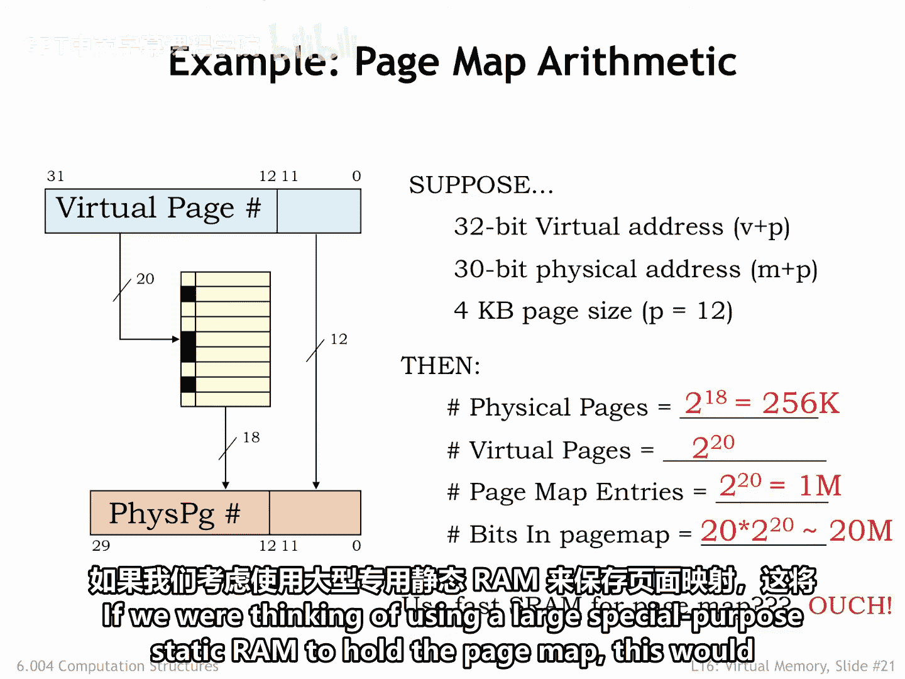
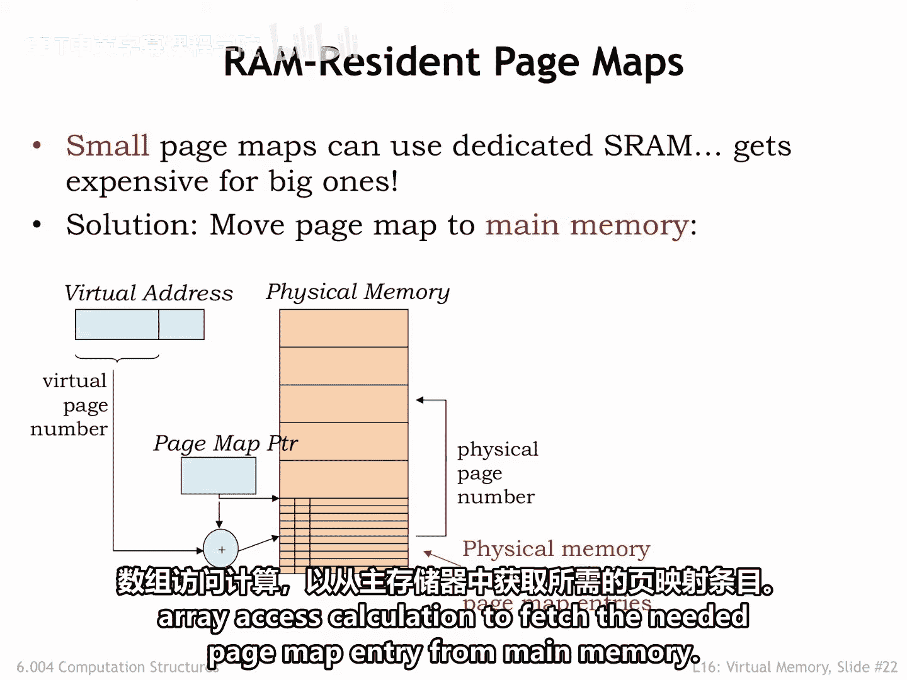
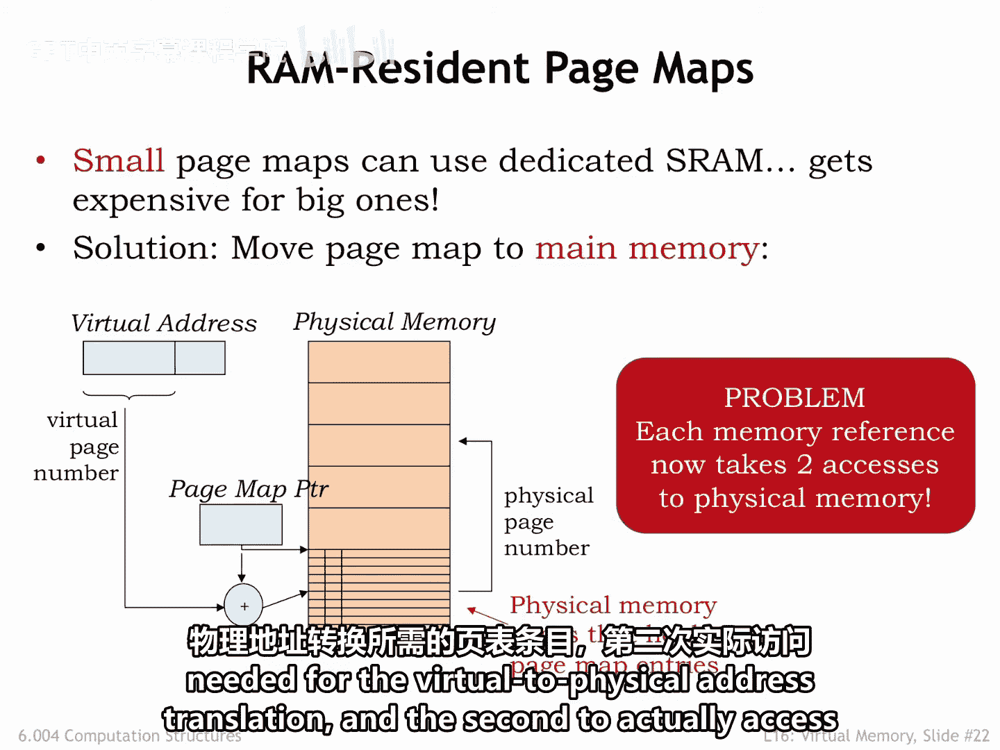
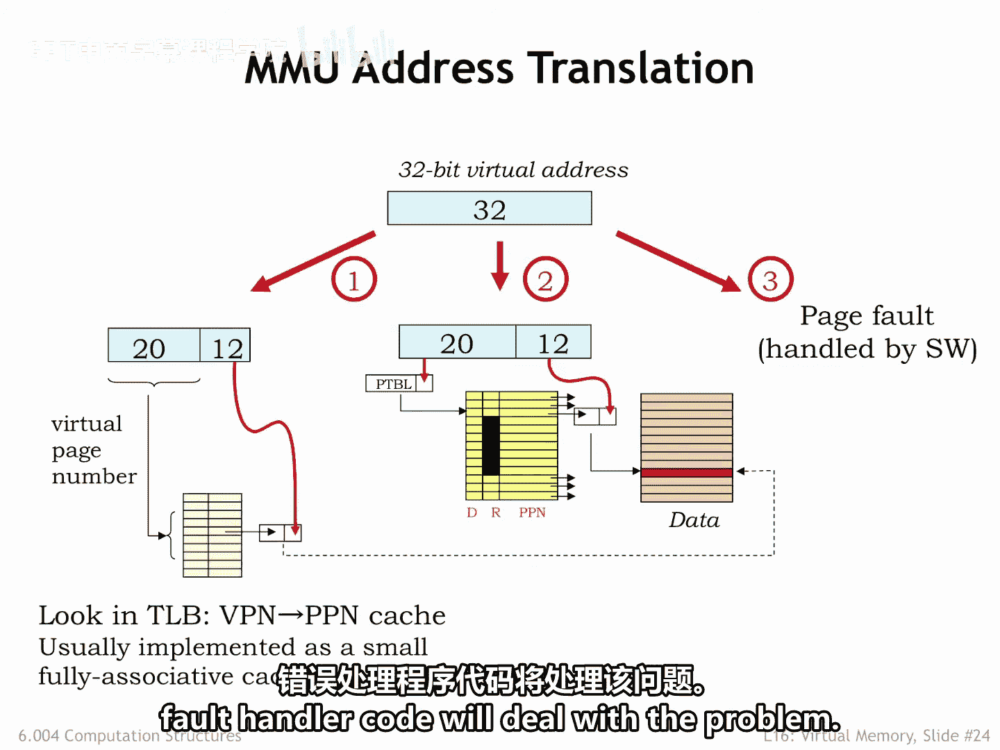
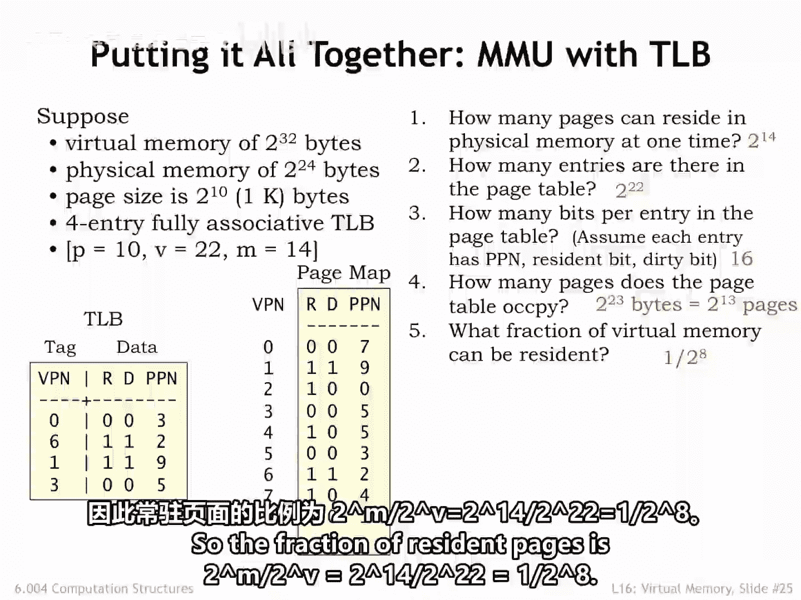
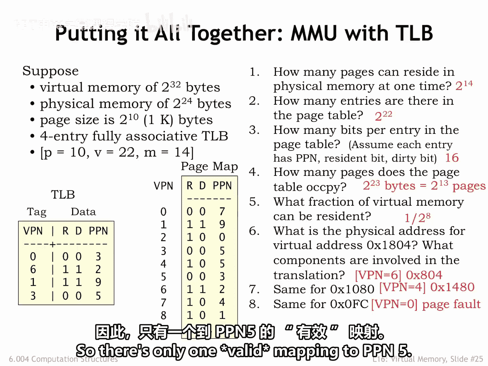

# 044：6.2.4 构建内存管理单元（MMU）🚀

在本节中，我们将学习如何构建一个内存管理单元（MMU）。我们将了解定义虚拟内存系统的三个关键架构参数，并探讨如何利用页表、转换后备缓冲器（TLB）和主存来实现高效的地址转换。

---

虚拟内存系统由三个架构参数定义，它们也决定了MMU的架构。

*   **P**：用于虚拟地址和物理地址中**页内偏移量**的地址位数。
*   **V**：用于**虚拟页号**的地址位数。
*   **M**：用于**物理页号**的地址位数。

右侧列出的所有其他参数都源自这三个参数。

---

上一节我们介绍了MMU的基本参数，本节中我们来看看这些参数的实际应用场景。

典型的页大小在4KB到16KB之间。这个大小的选择是在权衡利弊后找到的平衡点：一方面，使用物理内存存放不常用的页会带来浪费；另一方面，从二级存储（如硬盘）读取数据时，我们希望尽可能多地读取连续数据，以分摊访问初始字的高昂成本。

虚拟地址的大小由指令集架构决定。目前，我们正从支持4GB虚拟地址空间的32位架构，过渡到支持16EB虚拟地址空间的64位架构。Exa是国际单位制前缀，代表10的18次方。

一个64位地址可以访问海量内存。虚拟地址空间过小曾是许多指令集架构扩展的主要原因。当然，每一代工程师都认为他们所做的过渡将是最终版本。我记得我们都曾认为32位是一个难以想象的大地址空间。那时我们按兆字节购买内存，只有在幻想中才认为系统能有几千兆字节的内存。如今，CPU架构师对64位感到相当满意。我们将在几十年后看看他们的感受。

物理地址的大小目前介于30位（用于内存需求适中的嵌入式处理器）和40位以上（用于处理大型数据集的服务器）之间。由于CPU实现预计每几年就会更新，物理内存大小的选择可以调整以适应当前技术。由于程序员使用虚拟地址，他们与这个实现选择是隔离的。MMU确保现有软件在不同大小的物理内存下都能继续正常运行。程序员可能会注意到性能差异，但基本功能不会改变。

---

为了更具体地理解这些参数，让我们来看一个例子。

假设我们的系统支持32位虚拟地址、30位物理地址和4KB页大小。这意味着：
*   P = 12
*   V = 32 - 12 = 20
*   M = 30 - 12 = 18

根据这些参数，我们可以推导出：
*   物理页数量 = 2^M = 2^18（在本例中）。
*   虚拟页数量 = 2^V = 2^20（在本例中）。
*   由于页表中每个虚拟页都有一个条目，因此页表条目数 = 2^20，约100万个。
*   每个页表条目包含一个物理页号、一个R位和一个D位，总共 M + 2 位，在本例中是20位。
*   因此，页表总大小约为2000万位。

如果我们考虑使用一个大型专用静态RAM来存放页表，这将非常昂贵。

---

既然使用专用内存存放页表成本高昂，我们自然会想到替代方案。为什么不使用主存的一部分呢？我们拥有大量主存并且已经为其付费。

我们可以使用一个称为**页表指针**的寄存器来存放主存中页表数组的地址。换句话说，页表将占用一些专用的物理页。硬件可以使用所需的虚拟页号作为索引，执行常规的数组访问计算，从主存中获取所需的页表条目。

这种实现方案的缺点是，现在执行一次虚拟访问需要进行两次物理内存访问：第一次是获取虚拟到物理地址转换所需的页表条目，第二次才是实际访问请求的位置。

---

再次，缓存来拯救我们。大多数系统包含一个称为**转换后备缓冲器**的特殊用途缓存，它映射虚拟页号到物理页号。TLB通常很小且速度很快。它通常是全相联的，以避免冲突，从而确保尽可能高的命中率。

如果使用TLB找到了物理页号，就可以避免为获取页表条目而访问主存，这样我们又回到了每次虚拟访问只需一次物理访问的状态。TLB的命中率非常高，通常超过99%。这并不奇怪，因为局部性和工作集的概念表明，在短时间内只有少量页面处于活跃使用状态。正如我们将在后面几张幻灯片中看到的，这个简单的TLB、页表和主存架构有一些有趣的变体，但基本策略保持不变。

---

现在，让我们把所有部分整合起来，看看完整的地址转换流程。

CPU生成的虚拟地址首先由TLB处理，以查看是否已缓存了从VPN到PPN的适当转换。如果是，则可以直接进行主存访问。如果所需的映射不在TLB中，则访问主存中的页表相应条目。如果该页是常驻的，则使用页表条目的PPN字段来完成地址转换。当然，这个转换会被缓存在TLB中，以便后续对该页的访问可以避免访问页表。如果所需的页面非常驻，MMU会触发一个**缺页异常**，缺页异常处理程序代码将处理此问题。

---

最后，我们通过一个完整的例子来展示所有组件如何协同工作。

在这个例子中，P = 10，V = 22，M = 14。
*   **物理内存中一次可以存放多少页？**
    有 2^M 个物理页，所以是 2^14 页。
*   **页表中有多少个条目？**
    每个虚拟页有一个条目，有 2^V 个虚拟页，所以页表中有 2^22 个条目。
*   **页表中每个条目有多少位？**
    假设每个条目包含PPN、常驻位和脏位。由于PPN是M位，每个条目有 M + 2 位，所以是16位。
*   **页表占用了多少页？**
    有 2^V 个页表条目，每个占用 (M+2)/8 字节，所以本例中页表总大小为 2^23 字节。每页容纳 2^P 或 2^10 字节，因此页表占用 2^23 / 2^10 = 2^13 页。
*   **在任何给定时间，可以访问的虚拟内存比例是多少？**
    有 2^V 个虚拟页，其中 2^M 个可以是常驻的，所以常驻页的比例是 2^M / 2^V = 2^14 / 2^22 = 1 / 2^8。

---

让我们进行一些具体的地址转换，并指出涉及的MMU组件。

**虚拟地址 0x1804 对应的物理地址是什么？**
首先，我们必须将虚拟地址分解为VPN和偏移量。偏移量是低10位，因此在本例中是 0x4。VPN是剩余的地址位，所以VPN是6。首先查看TLB，我们发现VPN 6 到 PPN 2 的映射已被缓存，因此我们可以通过将PPN 2 与10位偏移量 0x4 拼接起来，得到物理地址 0x804。

**虚拟地址 0x1080 呢？**
对于这个地址，VPN是4，偏移量是 0x80。VPN 4 的转换未在TLB中缓存，因此我们必须检查页表，页表告诉我们该页常驻在物理页5。拼接PPN和偏移量，我们得到物理地址 0x1480。

**最后，虚拟地址 0xFC 呢？**
这里VPN是0，偏移量是 0xFC。在TLB中未找到VPN 0 的映射，检查页表显示VPN 0 非常驻在主存中，因此触发缺页异常。

关于示例中的TLB和页表内容，有几点需要注意：TLB条目可能无效（其R位为0）。当虚拟页被替换时会发生这种情况。因此，当我们在页表中将R改为0时，我们也必须在TLB中做同样的事情。我们应该担心PPN 5 在页表中出现两次吗？请注意，VPN 3 的条目无关紧要，因为它的R位是0。通常，当标记一个页面非常驻时，我们不会费心清除条目中的其他字段，因为当R=0时它们不会被使用。所以，实际上只有一个有效的映射指向PPN 5。

---

本节课中我们一起学习了构建MMU的核心概念。我们定义了关键参数P、V、M，并理解了它们如何决定系统规模。我们探讨了使用主存存放页表的经济性方案，以及引入TLB缓存来避免性能下降的巧妙方法。最后，我们通过一个完整示例，演练了从虚拟地址到物理地址的转换全过程，包括TLB命中、TLB未命中访问页表以及触发缺页异常的情况。理解这些机制是掌握现代计算机内存管理的基础。