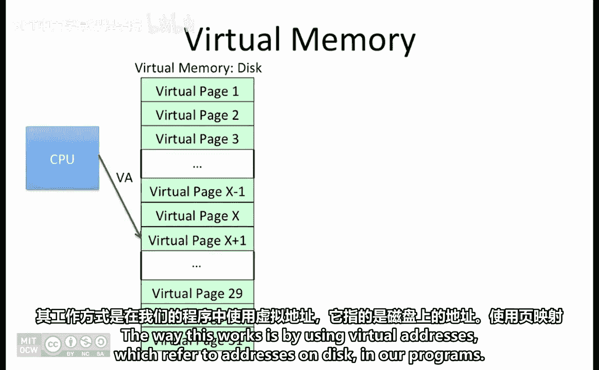
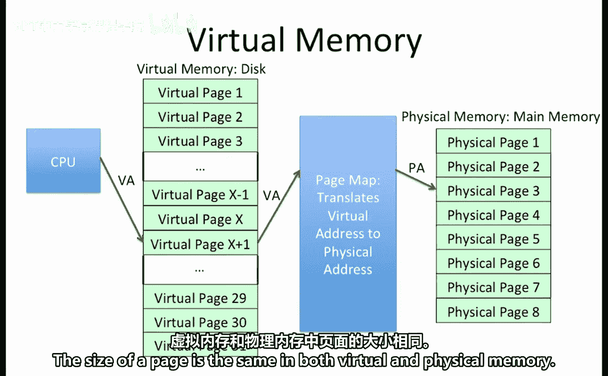
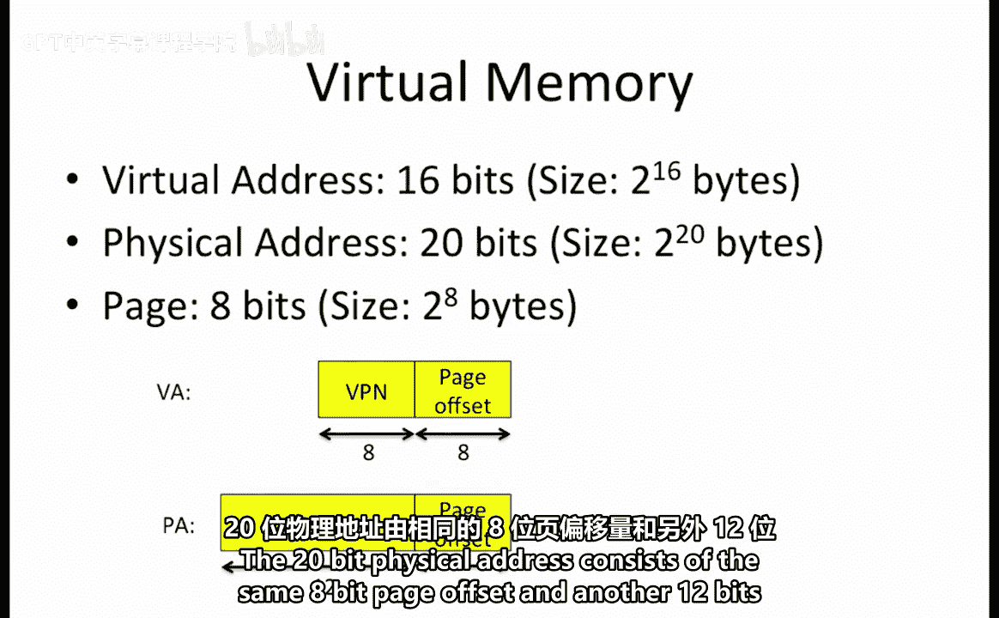
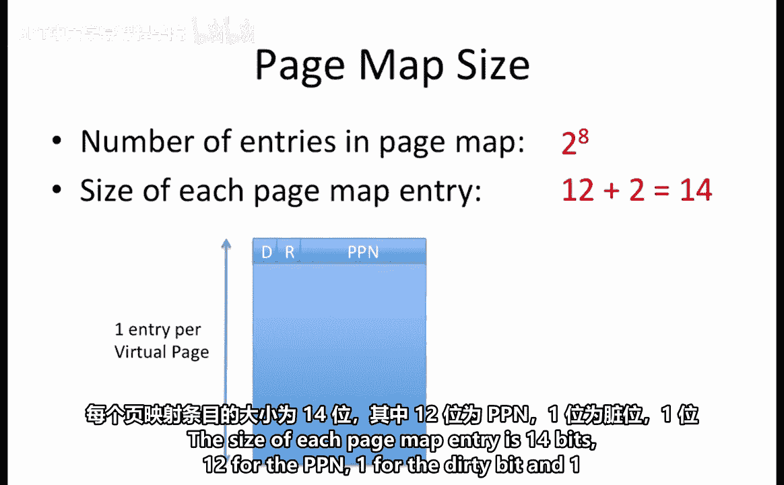
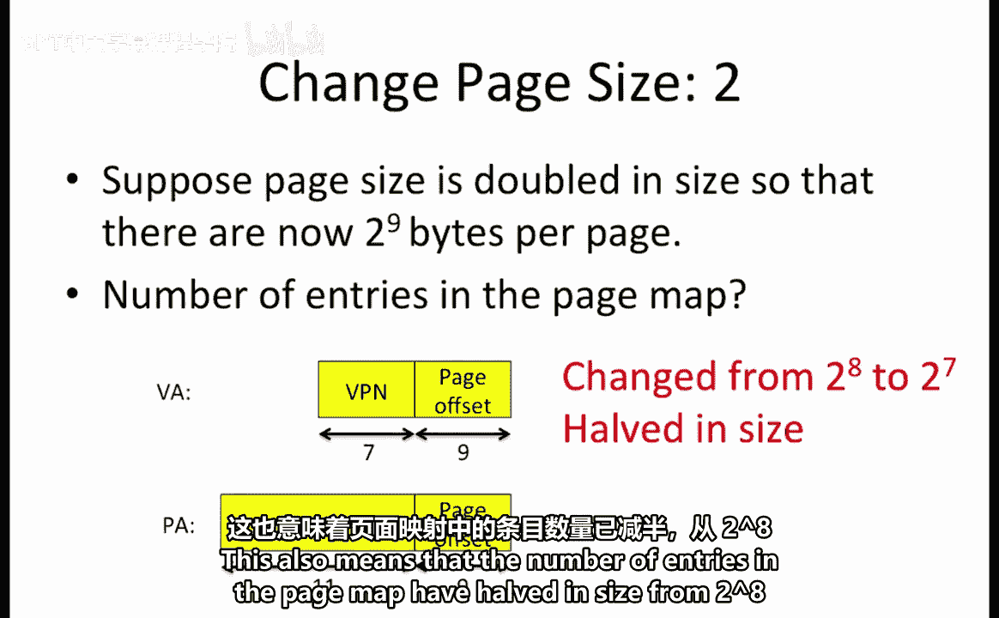
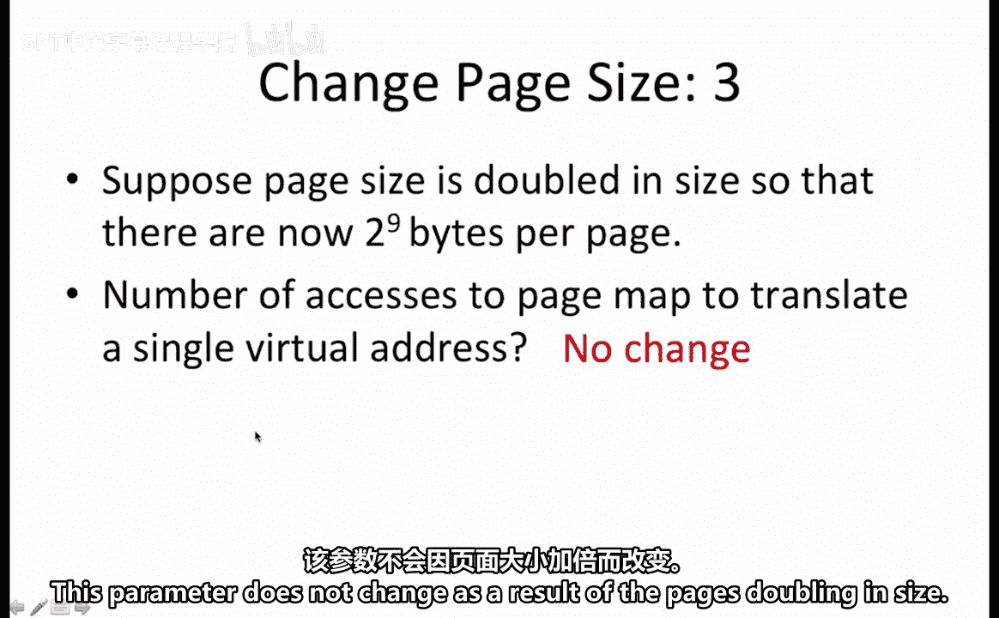
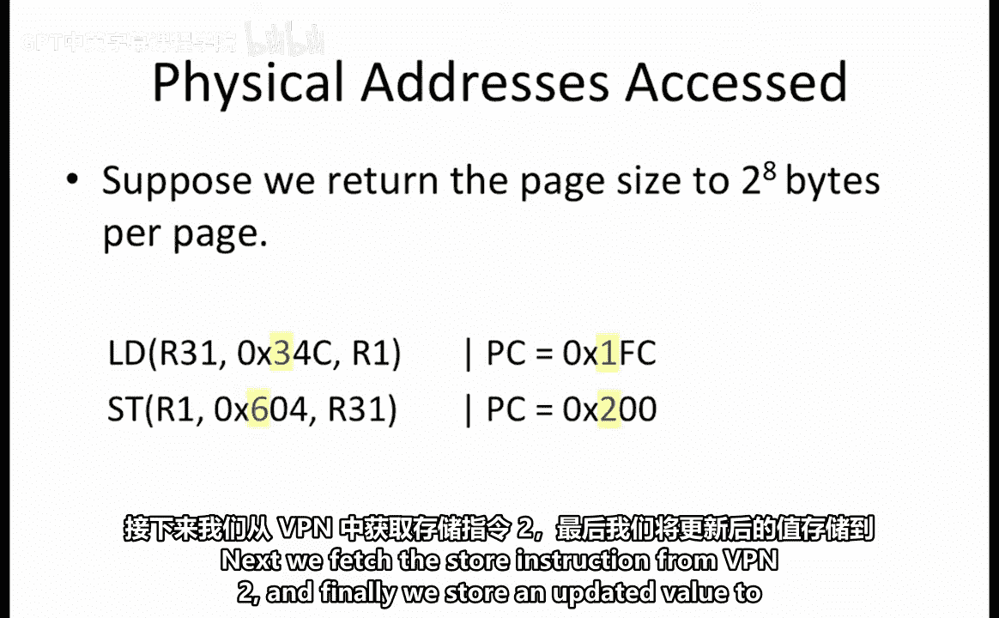
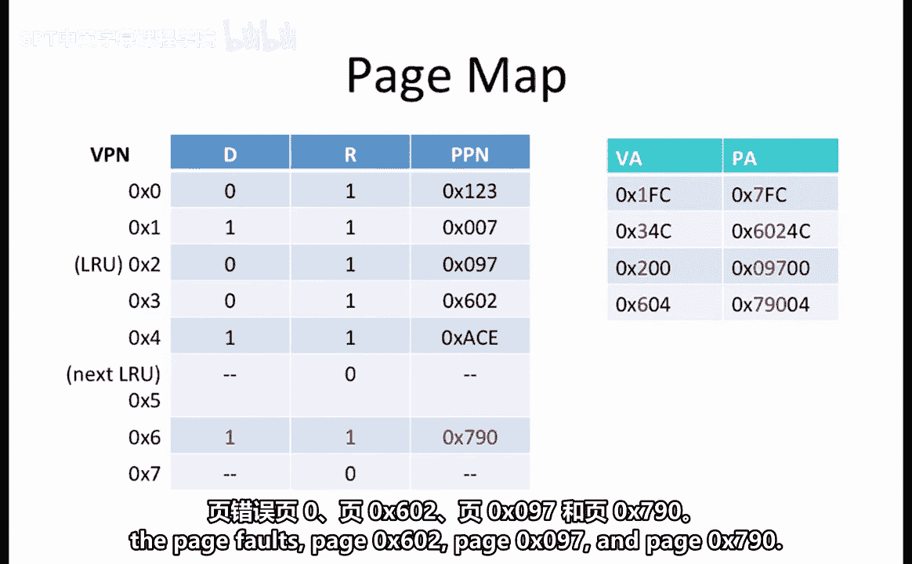

# 047：虚拟内存工作示例 🧠




在本节课中，我们将学习虚拟内存的工作原理，并通过一个具体示例来理解虚拟地址到物理地址的转换过程，以及处理缺页中断的步骤。

## 概述

虚拟内存允许程序表现得好像拥有比实际物理内存更大的内存空间。其工作原理是程序使用虚拟地址，这些地址通过页表映射到物理内存或磁盘上的实际位置。

## 虚拟内存基础

虚拟地址通过页表转换为物理地址。页表是一个查找表，每个虚拟页对应一个条目。页表记录了虚拟页是否在物理内存中。如果在，则立即返回物理页号。如果不在，则会发生缺页中断，此时必须将所需的虚拟页从磁盘调入物理内存。

为了给新页面腾出空间，物理内存中最近最少使用的页面会被移除。页表也会随之更新，建立新的虚拟页到物理页的映射。



由于磁盘读写操作成本高昂，数据以块为单位进行传输。这基于局部性原理，即靠近当前地址的指令或数据很可能也会被访问，因此一次性获取多个数据字是合理的。

数据以页为单位在磁盘和内存之间移动。虚拟内存和物理内存中的页大小相同。

## 工作示例分析



让我们通过一个示例来具体了解虚拟内存的使用。

### 系统参数设定



通常虚拟地址空间大于物理地址空间，但这不是必须的。在本问题中，虚拟地址空间恰好小于物理地址空间。

具体参数如下：
*   虚拟地址长度为 **16位**，可寻址 **2^16 字节**。
*   物理地址长度为 **20位**，物理内存大小为 **2^20 字节**。
*   页大小为 **2^8 字节**，即每页 **256 字节**。

这意味着：
*   **16位虚拟地址** 由 **8位页内偏移** 和 **8位虚拟页号** 组成。
    *   公式：`虚拟地址 = VPN (8位) | 页内偏移 (8位)`
*   **20位物理地址** 由相同的 **8位页内偏移** 和 **12位物理页号** 组成。
    *   公式：`物理地址 = PPN (12位) | 页内偏移 (8位)`

### 页表大小计算

我们首先考虑页表的大小。页表为每个虚拟页设置一个条目，用于映射到物理页。



因此，页表条目数等于虚拟页的数量，即 **2^8** 个条目（因为VPN是8位）。每个页表条目的大小为 **14位**：12位用于存储物理页号，1位脏位，1位驻留位。



### 页大小变化的影响

假设页大小加倍至 **2^9 字节/页**，但虚拟和物理地址长度保持不变。

以下是页表属性的变化：

**1. 页表条目大小的变化**
由于物理地址长度仍为20位，页内偏移从8位增至9位，意味着物理页号减少1位，从12位变为11位。因此，每个页表条目的大小也减少1位。



**2. 页表条目数量的变化**
页表条目数等于虚拟页数。如果每页大小加倍，则虚拟页数量减半。这体现在虚拟页号从8位减少到7位。因此，页表条目数从 **2^8** 个减少到 **2^7** 个。

**3. 地址转换所需的页表访问次数**
此参数不随页大小变化而改变。

### 代码执行与地址转换

现在我们回到原始的256字节/页的设置，并执行以下两行代码：
```assembly
LOAD  R1, 0x34C(R0)  // PC = 0x1FC
STORE R1, 0x604(R0)  // PC = 0x200
```
注释显示了每条指令执行时的程序计数器值，即LOAD指令位于地址`0x1FC`，STORE指令位于地址`0x200`。

执行这两行代码需要先取指令，然后执行指令要求的数据访问。由于页大小为2^8字节，地址的低8位是页内偏移。注意地址以十六进制表示，8位对应最低两位十六进制字符。

因此，访问的虚拟地址及其对应的虚拟页号如下：
1.  取LOAD指令：地址 `0x1FC` -> VPN = `1`
2.  执行LOAD数据访问：地址 `0x34C` -> VPN = `3`
3.  取STORE指令：地址 `0x200` -> VPN = `2`
4.  执行STORE数据访问：地址 `0x604` -> VPN = `6`

### 确定访问的物理地址

给定如下页表，我们需要确定这段代码访问的**唯一物理地址**以及访问顺序。假设处理缺页中断的代码和数据位于物理页0。

| VPN | 驻留位 | 脏位 | PPN   |
|-----|--------|------|-------|
| 0   | 1      | 0    | 0x004 |
| 1   | 1      | 0    | 0x007 |
| 2   | 1      | 0    | 0x602 |
| 3   | 0      | 0    | -     |
| 4   | 1      | 1    | 0x033 |
| 5   | 1      | 1    | 0x097 |
| 6   | 1      | 1    | 0x790 |
| 7   | 1      | 0    | 0x220 |

以下是访问过程分析：

**第一步：取LOAD指令 (VPN 1)**
*   查页表，VPN 1的驻留位为1，在物理内存中，PPN为`0x007`。
*   **访问的第一个物理页是 0x007**。
*   物理地址 = PPN + 页内偏移 = `0x007` << 8 | `0xFC` = `0x7FC`。

**第二步：加载数据 (VPN 3)**
*   查页表，VPN 3的驻留位为0，不在物理内存中，触发缺页中断。
*   需要移除物理内存中最近最少使用的页以腾出空间。LRU页是VPN 2（映射到PPN `0x602`），其脏位为0，说明在内存期间未被修改，内存与磁盘内容一致。
*   因此，将VPN 2的驻留位置0，腾出物理页`0x602`。
*   处理缺页中断的代码在物理页0，因此**访问的第二个物理页是 0x000**。
*   将VPN 3调入物理页`0x602`，更新页表：VPN 3的驻留位置1，PPN设为`0x602`，脏位置0（因为是加载操作）。
*   此时，虚拟地址`0x34C`对应的物理地址为 `0x602` << 8 | `0x4C` = `0x6024C`。
*   **访问的第三个物理页是 0x602**。

**第三步：取STORE指令 (VPN 2)**
*   查页表，VPN 2的驻留位已在上一步被置0，再次触发缺页中断。
*   移除下一个LRU页（VPN 5，映射到PPN `0x097`）。其脏位为1，说明该页被修改过。
*   缺页处理程序需要先将物理页`0x097`的内容写回磁盘上的虚拟页5，然后才能将物理页`0x097`用于VPN 2。
*   更新页表：VPN 5驻留位置0；VPN 2驻留位置1，PPN设为`0x097`，脏位置0（尚未修改）。
*   虚拟地址`0x200`对应的物理地址为 `0x097` << 8 | `0x00` = `0x09700`。
*   **访问的第四个物理页是 0x097**。

**第四步：执行STORE操作 (VPN 6)**
*   查页表，VPN 6的驻留位为1，在物理内存中，PPN为`0x790`。
*   虚拟地址`0x604`对应的物理地址为 `0x790` << 8 | `0x04` = `0x79004`。
*   由于VPN 6的脏位已经是1，执行存储操作后无需修改页表。如果脏位原是0，则需将其置1。
*   **访问的第五个物理页是 0x790**。

## 总结



本节课中，我们一起学习了虚拟内存的工作机制。通过一个具体示例，我们逐步分析了虚拟地址到物理地址的转换过程，包括查页表、处理缺页中断、选择替换页面以及更新页表映射。这段代码最终访问了五个不同的物理页，按顺序分别是：**0x007, 0x000, 0x602, 0x097, 0x790**。理解这个过程对于掌握计算机如何管理内存和高效运行程序至关重要。