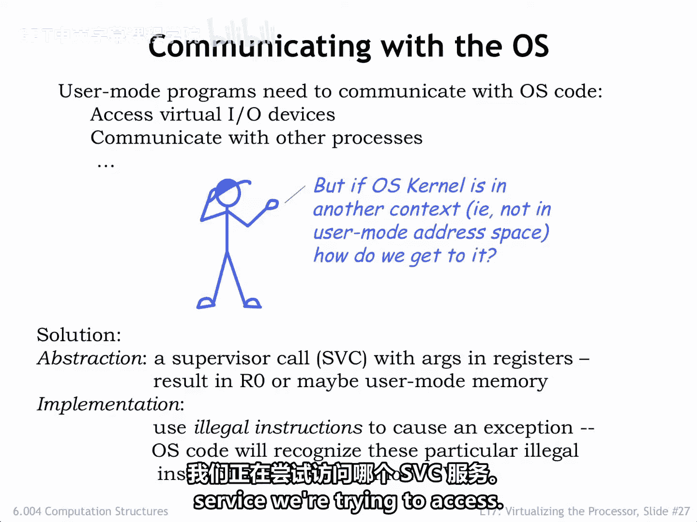
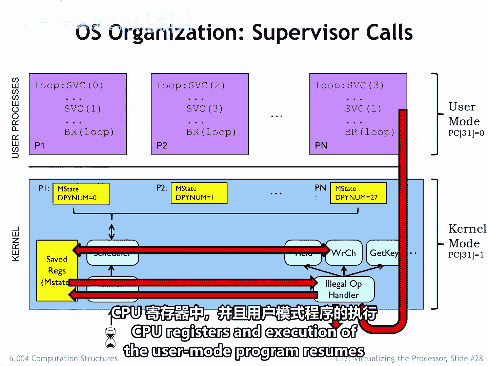
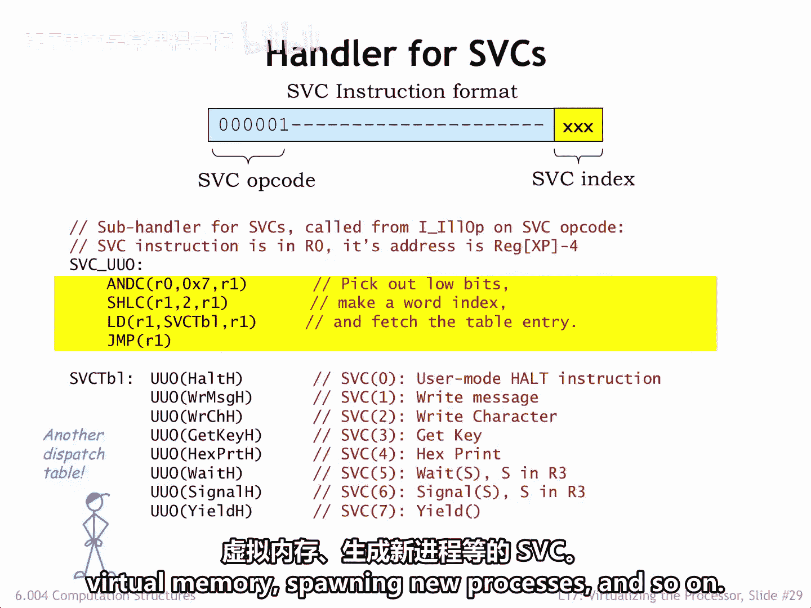
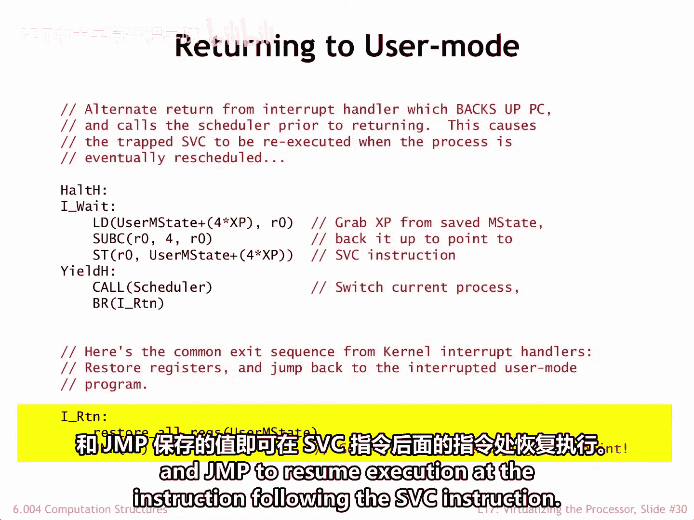
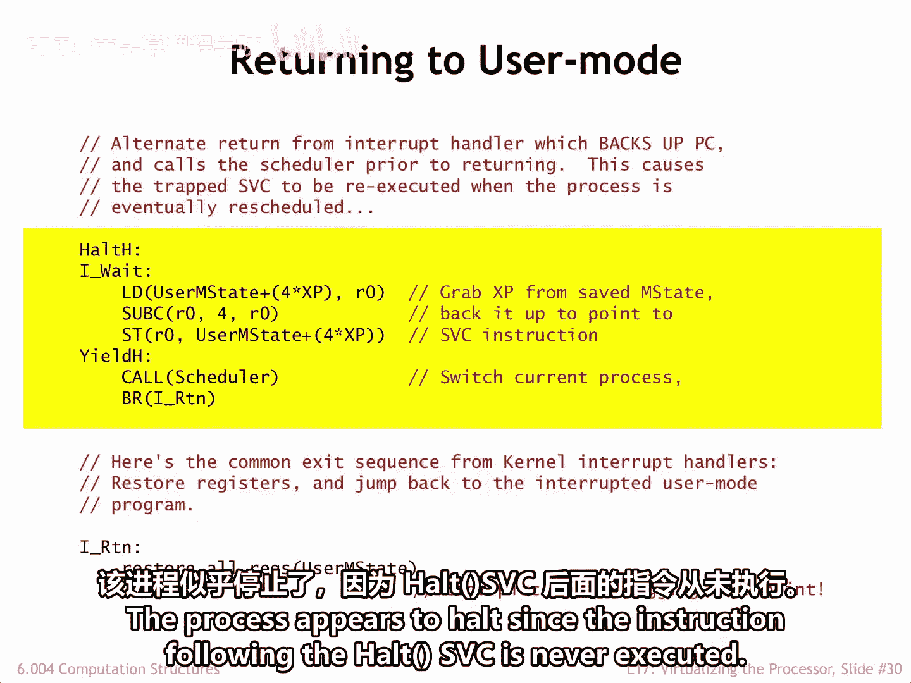
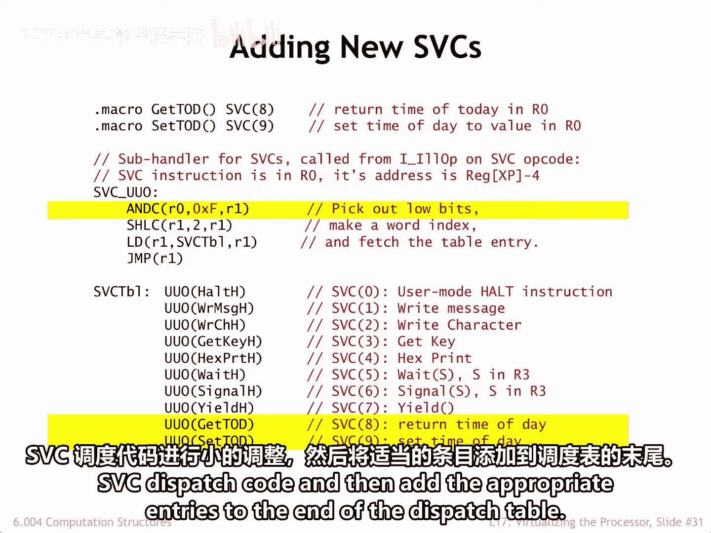
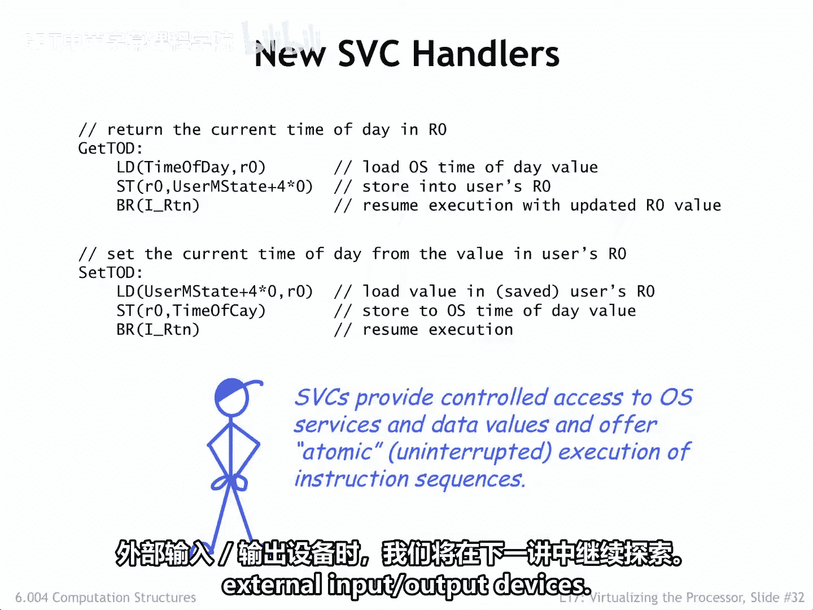

# 052：6.004 2017 第52讲 17.2.5 管理程序调用

在本节课中，我们将要学习用户模式程序如何通过一种称为“管理程序调用”的机制，安全地与操作系统进行通信以请求服务或获取数据。

## 概述

用户模式程序需要与操作系统通信，以请求服务或获取有用的操作系统数据，例如当前时间。但是，由于它们在不同于操作系统的内存管理单元上下文中运行，因此无法直接访问操作系统的代码和数据。无论如何，这都不是一个好主意，因为操作系统通常负责实现安全和访问策略。如果任何随机的用户程序都能绕过这些保护，系统的其他用户会感到不满。

因此，需要一种机制，允许用户模式程序在特定的入口点调用操作系统代码，并使用寄存器或用户模式虚拟内存来发送或接收信息。我们将使用这些管理程序调用来访问一个文档齐全且安全的操作系统应用程序编程接口。此类接口的一个例子是POSIX，这是许多类Unix操作系统实现的标准接口。

## 管理程序调用机制

事实证明，我们有一种方法可以将控制权从用户模式程序转移到特定的操作系统处理程序：只需执行一条非法指令。我们将采用一种约定，使用操作码字段为1的非法指令来作为管理程序调用。这些SVC指令的低位将包含一个索引，指示我们试图访问哪项SVC服务。

以下是该机制的工作原理。再次查看我们的用户模式-内核模式示意图。请注意，用户模式程序中包含具有不同索引的管理程序调用，当执行这些调用时，它们旨在请求不同的操作系统服务。

当执行一条SVC指令时，硬件会检测到操作码字段为1，将其视为非法指令，并触发一个异常，该异常会运行操作系统的非法指令处理程序，正如我们在上一节中看到的那样。处理程序将处理器状态保存在临时存储区中，然后根据操作码字段分派到相应的处理程序。

此处理程序可以访问临时存储区中的用户寄存器，或者使用适当的操作系统子程序，可以访问任何用户模式虚拟地址的内容。如果要将信息返回给用户，可以将返回值存储在临时存储区中，或者覆盖用户R0寄存器的内容。然后，当处理程序完成时，可能已更新的已保存寄存器值将被重新加载到CPU寄存器中，用户模式程序将在管理程序调用之后的指令处恢复执行。

## 调度与处理程序

在上一节中，我们看到了非法指令处理程序如何使用调度表，根据非法指令的操作码字段选择相应的子处理程序。

在本幻灯片中，我们看到的是SVC指令（即操作码字段为1的指令）的子处理程序。这段代码使用指令的低位访问另一个调度表，为八个可能的管理程序调用中的每一个选择相应的代码。我们的小型操作系统只提供了一组简单的服务。一个真正的操作系统将拥有用于访问文件、处理网络连接、管理虚拟内存、生成新进程等的管理程序调用。

以下是当管理程序调用处理程序完成后，恢复用户模式进程执行的代码。它简单地恢复寄存器的保存值，并跳转到SVC指令之后的指令处恢复执行。

## 特殊情况处理

有时，由于某些原因，SVC请求无法完成，需要在未来重试该请求。例如，`READ_CHAR`管理程序调用返回用户输入的下一个字符。但如果尚未输入任何字符，操作系统此时无法完成请求。在这种情况下，SVC处理程序应分支到`yield`，该分支会安排在下一次此进程运行时重新执行SVC指令，然后调用`Scheduler`来运行下一个进程。这给了所有其他进程在SVC再次尝试之前运行的机会，希望这次能成功。

您可以看到，这段代码也作为两个不同SVC的实现。一个进程可以通过调用`yield`管理程序调用来放弃其当前剩余的执行时间片。这只会导致操作系统调用调度器，暂停当前进程的执行，直到其在轮转调度过程中下一次轮到为止。

要停止执行，进程可以调用`halt` SVC。查看其实现，我们发现`halt`这个名称有点用词不当。实际发生的情况是，系统安排每次调度该进程时都重新执行`halt` SVC，这会导致操作系统调度下一个进程执行。该进程看起来像是停止了，因为`halt` SVC之后的指令永远不会被执行。

## 添加新的SVC处理程序

添加新的SVC处理程序很简单。首先，我们需要为用户模式程序定义新的SVC宏。在这个例子中，我们正在定义用于获取和设置时间的SVC。由于这些是第8个和第9个SVC，我们需要对SVC调度代码进行小的调整，然后将适当的条目添加到调度表的末尾。新处理程序的代码同样简单直接。

处理程序可以通过查看用户状态临时保存区中的正确条目来访问程序的R0值。只需几条指令即可实现所需的操作。

## SVC机制的优势

SVC机制提供了对操作系统服务和数据的受控访问。正如我们将在后续课程中看到的，SVC处理程序不能被中断这一点很有用，因为它们运行在中断被禁用的管理模式下。因此，例如，如果我们需要使用加载-加-存储序列来递增主内存中的一个值，但我们希望确保在加载和存储之间没有其他进程执行介入，我们可以将所需的功能封装为一个SVC，它保证是不可中断的。

## 总结

本节课中，我们一起探索了实现一个简单分时操作系统的良好开端。我们详细了解了管理程序调用机制，它如何允许用户程序安全地请求内核服务，包括其工作原理、调度方式、特殊情况处理以及如何扩展新的调用。在下一讲中，我们将继续探索操作系统如何处理外部输入/输出设备。