# 053：6.004 2017 操作系统工作示例 🖥️

在本节课中，我们将学习操作系统如何管理多个进程在共享地址空间上运行。我们将通过一个具体的例子，深入探讨Beta计算机操作系统的核心机制，包括进程状态管理、调度以及一个名为`samplePC`的监控调用是如何工作的。

---

为了让多个进程能够在同一台计算机上使用共享地址空间运行，我们需要一个操作系统。该操作系统负责控制在任何给定时间点哪个进程可以运行，并确保当前加载到系统中的状态是当前进程的状态。

通过以下示例，我们将更仔细地了解Beta操作系统的运作方式。我们首先从负责维护当前处理器状态以及调度在任意时间点应运行哪个进程的代码开始分析。

## 进程状态管理 📊

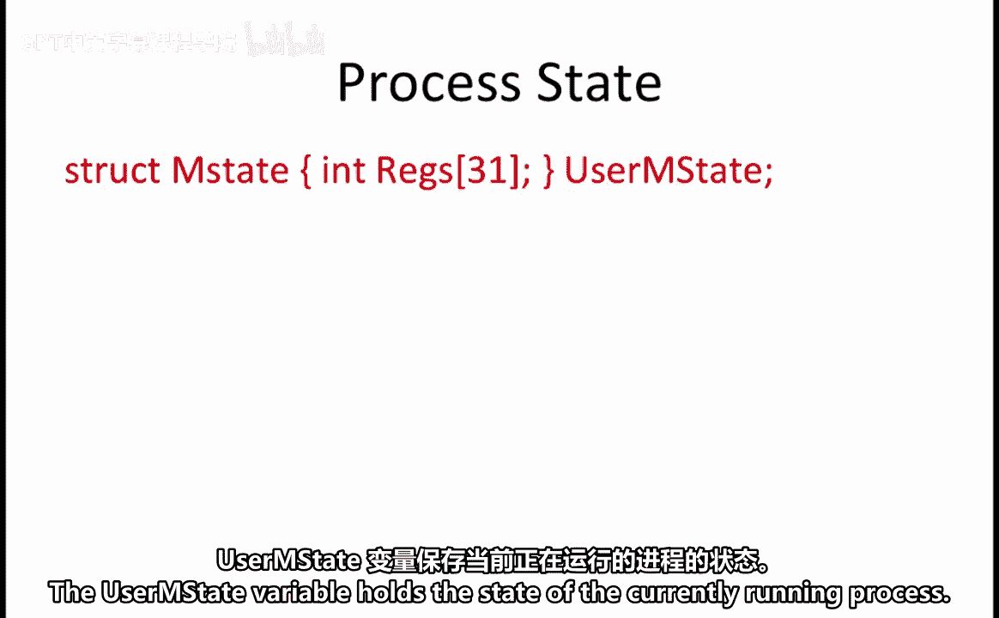

操作系统使用一个名为`Mstate`的结构来跟踪每个运行进程中32个寄存器的值。变量`userMstate`保存着当前正在运行的进程的状态。

进程表（`proc table`）保存了机器上运行的每个进程所需的所有状态。对于每个进程，它将其所有寄存器的值存储在`state`变量中。每个进程还可以存储额外的状态，例如，如果我们想使用虚拟内存，每个进程的页表；另一个例子是键盘标识符，它将硬件与特定进程关联起来。

变量`current`保存着当前运行进程的索引。

## 进程调度 🔄

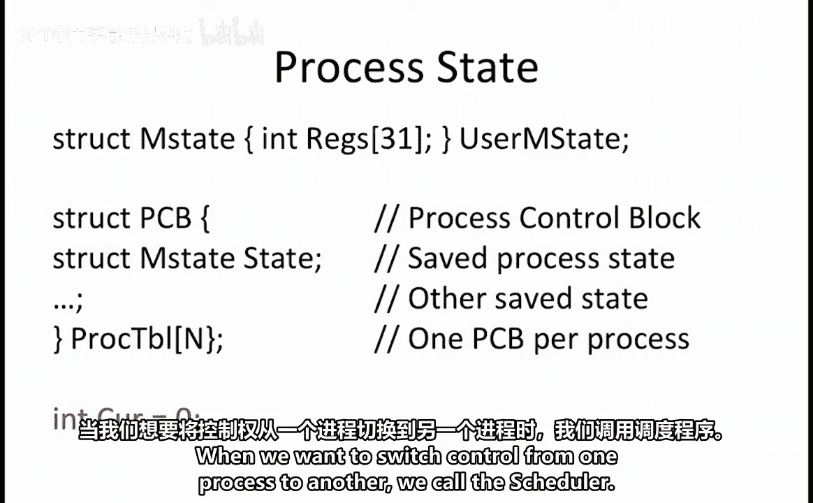

当我们想将控制权从一个进程切换到另一个进程时，会调用调度器（`scheduler`）。

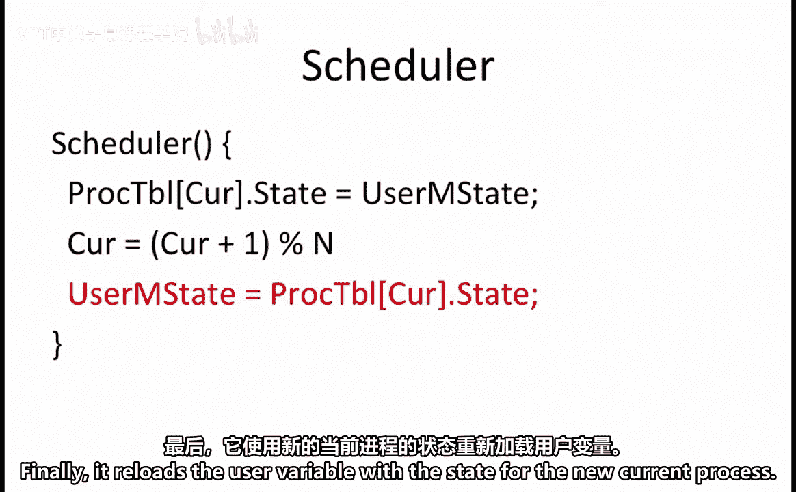

调度器首先将当前运行进程的状态存储到进程表中。接着，它将`current`进程索引加1。如果当前进程是第`n-1`个进程，则它会回到进程0。最后，它将`userMstate`变量重新加载为新当前进程的状态。

## 示例：`samplePC` 监控调用 🔍

为了能够在一个进程上运行诊断程序，以采样另一个进程程序计数器（PC）中的值，系统提供了一个名为`samplePC`的监控调用。

以下是为你提供的监控调用处理程序的C语言部分。它是不完整的，因此我们的第一个目标是确定应该用什么来替换代码中的问号（`???`）。

我们被告知`samplePC`监控调用的工作方式是：它从R0寄存器获取一个进程号`P`，并在R1寄存器中返回进程`P`当前程序计数器的值。

此处显示的处理程序从`userMstate`数据结构中读取寄存器R0的值，并将其存储到变量`P`中。这是要监控的进程编号。

为了确定进程`P`的PC值，可以查找为进程`P`保存的`XP`寄存器的值（即上次进程`P`运行时保存的）。`XP`寄存器保存着下一条PC地址的值，因此从进程表`procTable[P]`中读取`XP`寄存器就能告诉我们进程`P`的下一个PC值。

PC值需要返回到当前程序的寄存器R1中。这意味着缺失的代码是 `userMstate.regs[1] = PC;`。

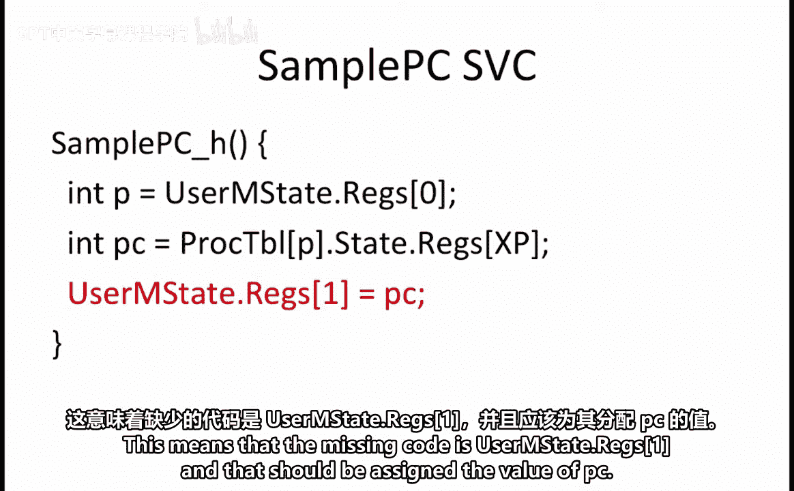

## 避免重复采样 🚫

假设你有一个计算密集型进程，它由一个包含10,000条指令的单一循环构成。在运行此循环时，你使用`samplePC`监控调用来采样PC值。你注意到`samplePC`代码的结果中有许多重复值。

你意识到发生这种情况的原因是，每次你的性能分析进程被调度运行时，它会进行多次`samplePC`调用，但其他进程并未运行，因此你多次获得了相同的采样PC值。

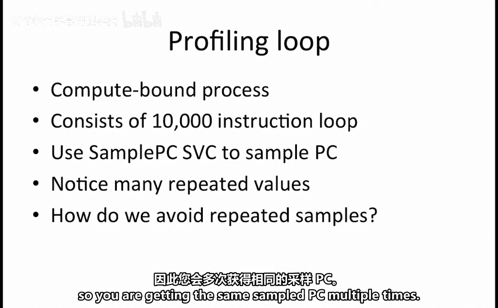

如何避免重复采样？为了避免重复采样，我们在`samplePC`处理程序中添加一个对调度器`Scheduler`的调用。这确保了每次性能分析进程被调度时，它只采样一个PC值，然后就让另一个进程运行。

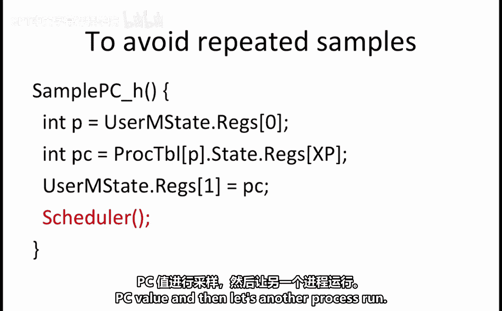

## 分析I/O密集型代码 📝

假设你继续使用原始版本的`samplePC`处理程序（即不调用调度器的版本），并用它来测试以下代码：该代码反复调用`getKey`监控调用来从键盘读取一个字符，然后调用`writeChar`监控调用来写入刚刚读取的字符。

我们想回答的问题是：哪个PC值会被报告得最频繁？地址`0x100`（即`getKey`调用的地址）被报告得最频繁，因为大多数时候当调用`getKey`时，并没有待处理的按键。这意味着`getKey`调用会被反复处理，直到最终有一个按键需要处理。结果是，出现最频繁的PC值是`0x100`。

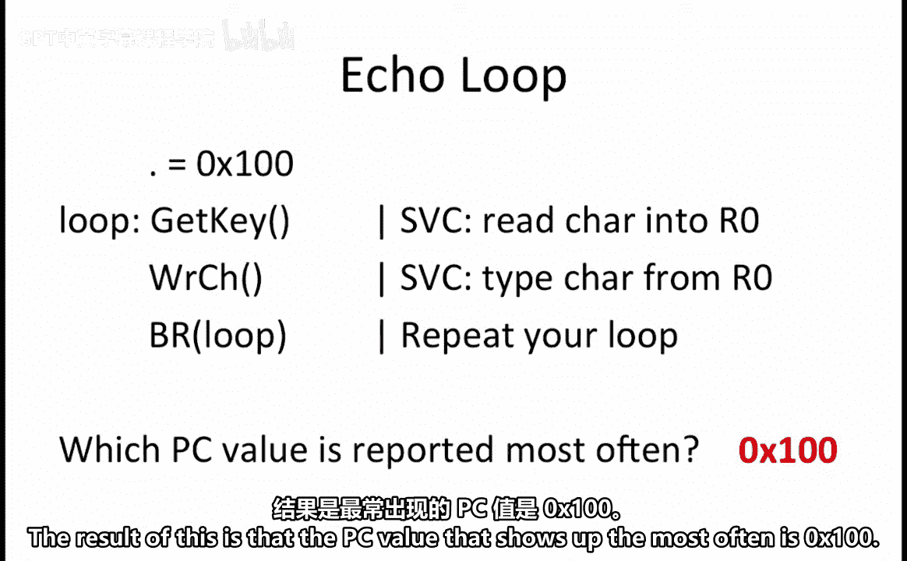

## 进程自我监控的挑战 🤔

我们考虑的最后一个问题是：当运行在进程0中的性能分析器（profiler）监控进程0自身时，会观察到什么行为？

假设性能分析器代码主要由一个大循环构成，该循环在指令`0x1000`处包含一个`samplePC`监控调用。循环的其余部分处理由`samplePC`调用收集的数据。我们想回答的问题是：在`samplePC`结果中观察到了什么？我们有四个选项可供选择。

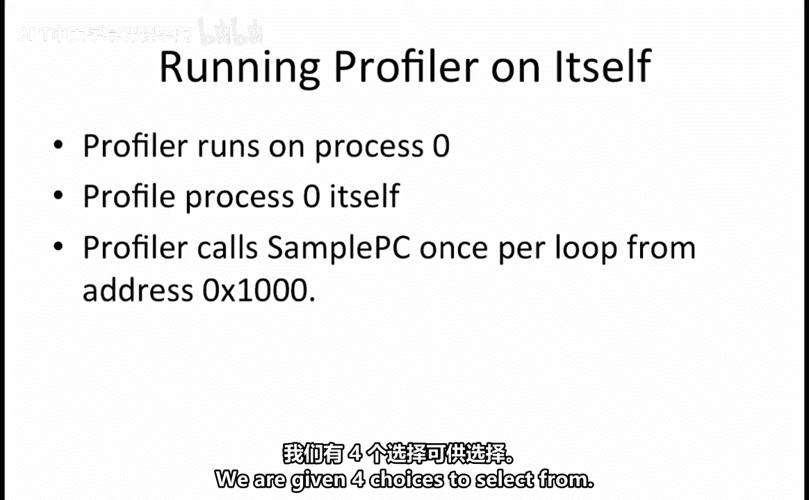

需要考虑的第一个选项是：是否所有采样的PC值都指向内核OS代码？这个选项是错误的，因为如果成立，将意味着你设法中断了内核代码，而这是Beta系统不允许的。

下一个要考虑的选项是：采样的PC是否总是`0x1004`？这看起来可能是正确的，因为`samplePC`监控调用位于地址`0x1000`，所以存储`PC+4`将导致`0x1004`被存储到`userMstate.regs[XP]`中。

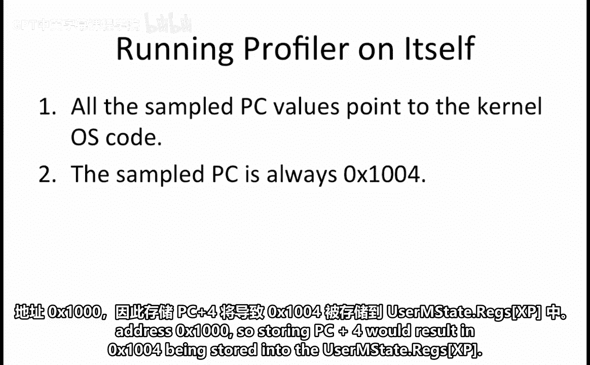

然而，如果你仔细观察`samplePC`处理程序，会发现`XP`寄存器是从进程表（`procTable`）中读取的，但`userMstate.regs`仅在调用调度器`Scheduler`时才被写入进程表。因此，从进程表读取的值将是进程0上次被中断时的最后一个PC值。要获得正确的值，你需要读取`userMstate.regs[XP]`。

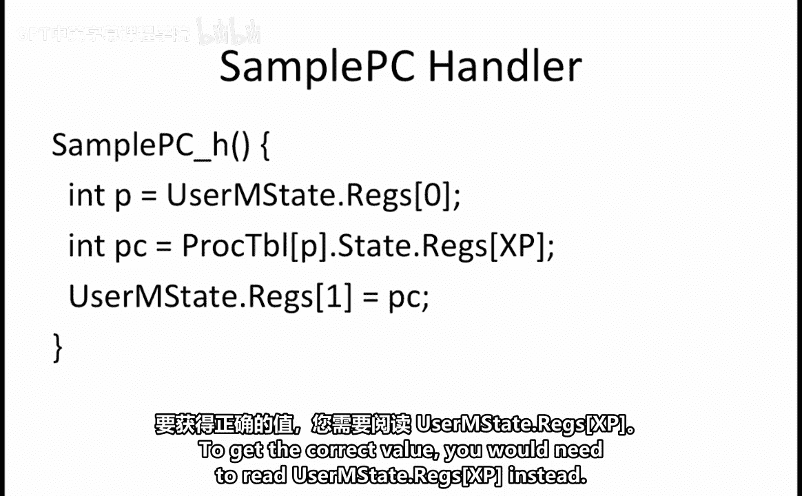

第三个选项是：`samplePC`调用永不返回。没有理由认为这是真的。

最后，最后一个选项是：以上都不是。由于其他选项都不正确，因此这是正确答案。

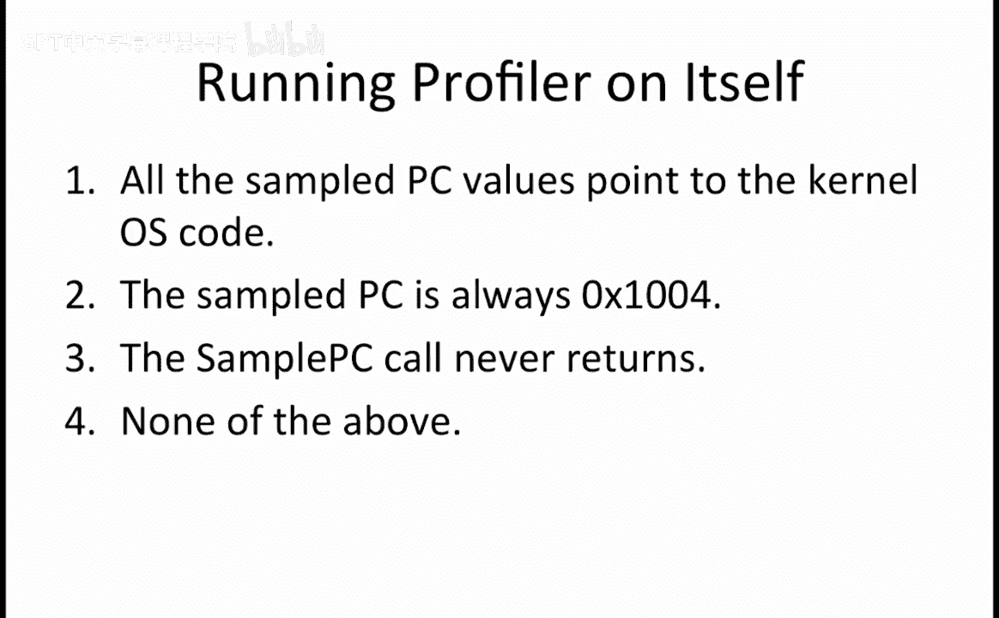

---

## 总结 📚

本节课中，我们一起学习了操作系统管理多进程的核心机制。我们探讨了如何使用`Mstate`和进程表来维护进程状态，以及调度器如何实现进程间的切换。通过分析`samplePC`监控调用的工作示例，我们理解了如何采样其他进程的PC值，并解决了在采样过程中可能遇到的重复采样问题。最后，我们分析了进程自我监控时的特殊行为，认识到正确读取状态信息的重要性。这些概念是理解现代操作系统进程管理和调度的基础。