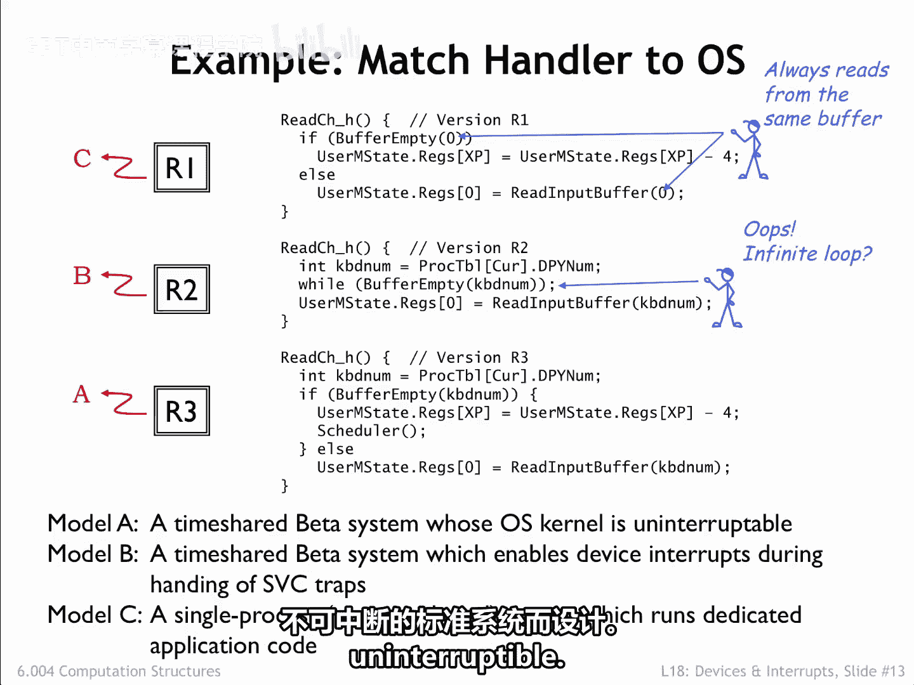
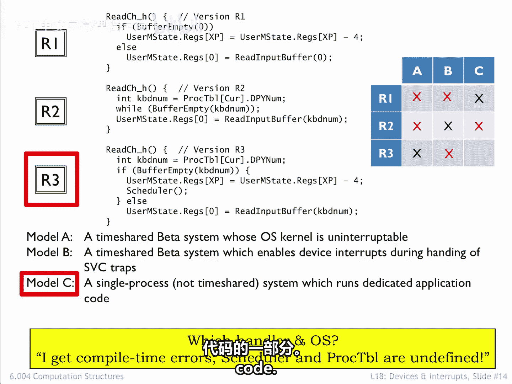
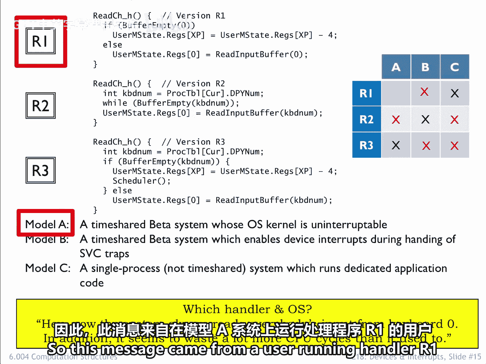
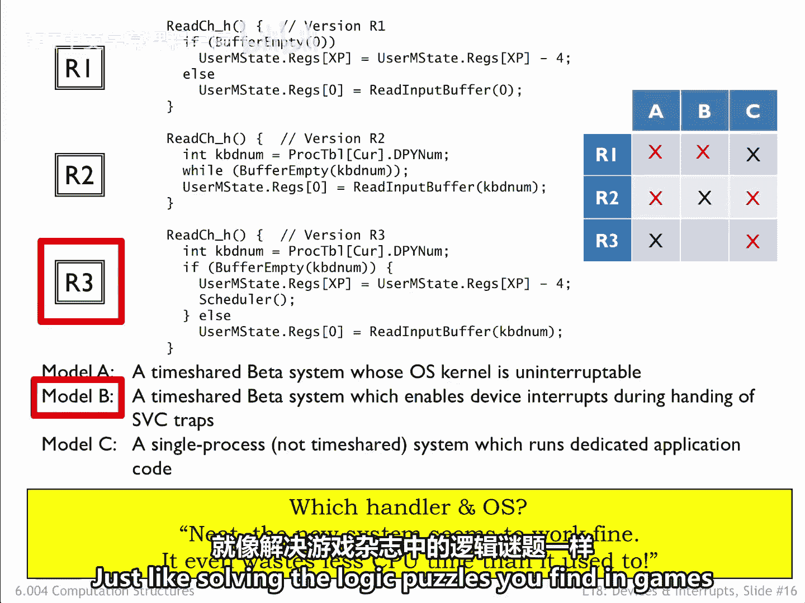

# 056：操作系统中的匹配处理程序 🧩

在本节中，我们将通过一个具体的示例来测试对“读取按键”SVC（超级用户调用）代码最终设计的理解。我们将分析三个不同版本的处理程序（R1、R2、R3）与三种不同系统模型（A、B、C）的匹配关系，并解读用户反馈信息以推断实际部署情况。

## 处理程序与系统模型匹配

上一节我们探讨了“读取按键”SVC的几种设计尝试。本节中，我们来看看如何将它们与不同的系统模型相匹配。

以下是三种系统模型和处理程序的简要说明：
*   **系统模型A**：标准系统，内核不可中断。
*   **系统模型B**：允许设备中断，即使CPU正在执行SVC调用。
*   **系统模型C**：单进程系统，不支持分时共享。
*   **处理程序R1**：类似于上一节的尝试2，但始终从同一个键盘缓冲区读取，无视发起请求的进程。
*   **处理程序R2**：类似于上一节的尝试1，如果尝试从空缓冲区读取，可能导致无限循环。
*   **处理程序R3**：类似于上一节的尝试3，专为内核不可中断的标准系统设计。

根据设计逻辑，我们可以进行初步匹配：
1.  **R1** 总是从同一键盘读取，这在分时共享系统中没有意义，会导致所有进程共享同一个输入流。因此，它必须用于**模型C**（单进程）系统。
2.  **R2** 存在潜在无限循环的风险。只有在**模型B**系统中，键盘中断可以打断这个循环，填充缓冲区，代码才能成功运行。
3.  通过排除法，**R3** 应与**模型A**系统配对，因为它专为不可中断的内核设计。

## 解读用户反馈信息

一位实习生错误地将未知版本的处理程序磁盘分发给了运行三种不同模型的用户。现在，我们需要根据用户反馈的信息，推断出他们各自使用的是哪种处理程序和系统模型。

以下是所有可能的组合表格，其中已排除了上一节中正确的匹配（即新旧处理程序相同，用户不会发送消息的情况）：

| 处理程序 | 模型A | 模型B | 模型C |
| :--- | :--- | :--- | :--- |
| **R1** | ❓ | ❓ | ✅ (已匹配) |
| **R2** | ❓ | ✅ (已匹配) | ❓ |
| **R3** | ✅ (已匹配) | ❓ | ❓ |

### 反馈一：编译时错误

第一条用户消息是：“我遇到了编译时错误，调度器（scheduler）和进程表（proc table）未定义。”

*   **分析**：短语“调度器和进程表未定义”不适用于分时共享系统，因为这类系统会包含这些符号。因此，可以排除前两列（模型A和B）。
*   **进一步排除**：也可以排除第二行（处理程序R2），因为R2代码中不包含对调度器（`Sched`）的调用。
*   **结论**：这条消息来自一个尝试在**模型C**系统上运行**处理程序R3**的用户。因为模型C不支持分时共享，其操作系统代码中既没有调度器也没有进程表。

### 反馈二：共享输入与性能下降

第二条消息是：“嘿，现在系统总是从 keyboard0 读取所有人的输入。除此之外，它似乎比原来浪费了更多的CPU周期。”

*   **分析**：R1是唯一始终从 keyboard0 读取的处理程序，因此可以排除第2行和第3行（R2和R3）。
*   **区分模型**：R1处理程序会在等待字符到达时进行循环，浪费大量CPU周期。用户抱怨性能下降，这意味着与他们之前使用的处理程序相比，这是一个显著变化。
    *   如果用户之前在模型B系统上运行R2，他们早已习惯了循环等待的性能，切换到R1时不会注意到明显的性能差异。
    *   因此，可以排除模型B。
*   **结论**：这条消息来自一个在**模型A**系统上运行**处理程序R1**的用户。

### 反馈三：运行正常且性能提升

最后一条消息是：“不错，新系统似乎运行良好，甚至比原来浪费的CPU时间更少了。”

*   **分析**：既然系统与新处理程序一起能按预期工作，我们可以排除许多可能性。
    *   **排除R1**：R1在分时共享系统上无法“运行良好”，因为用户会察觉到所有进程现在都从同一个键盘缓冲区读取。因此排除模型A和B下的R1。
    *   **排除模型C下的R2/R3**：模型C不包含进程表或调度功能，因此排除最右侧一列（模型C）下的R2和R3。
    *   **排除模型A下的R2**：在模型A（内核不可中断）系统上，处理程序R2在尝试从空缓冲区读取时会导致无限循环，无法工作。
*   **结论**：这条消息一定是由一个现在运行**处理程序R3**的**模型B**用户发送的。

## 总结

本节课中，我们一起学习了如何通过逻辑推理，将特定的SVC处理程序代码与不同的操作系统模型进行匹配。我们首先基于设计原理进行了理论匹配，然后通过分析用户反馈的具体问题（如编译错误、功能异常和性能变化），在排除所有不可能选项后，确定了每个用户实际使用的处理程序和系统模型组合。这个过程就像解决逻辑谜题，巩固了我们对操作系统内核中断处理、进程管理和系统调用交互的理解。