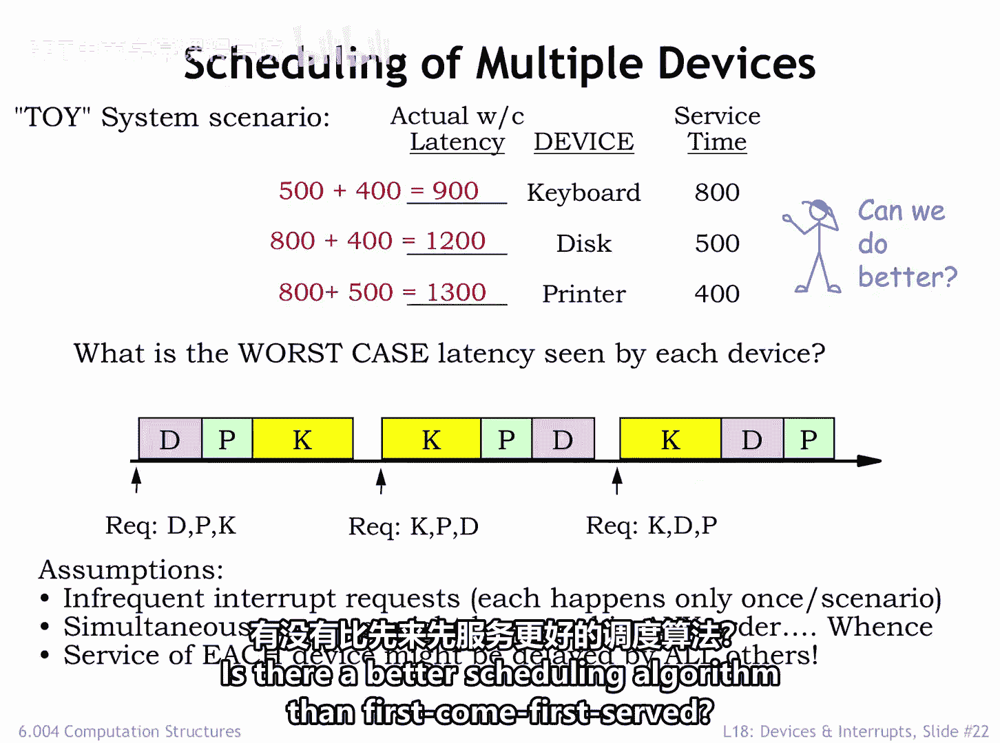
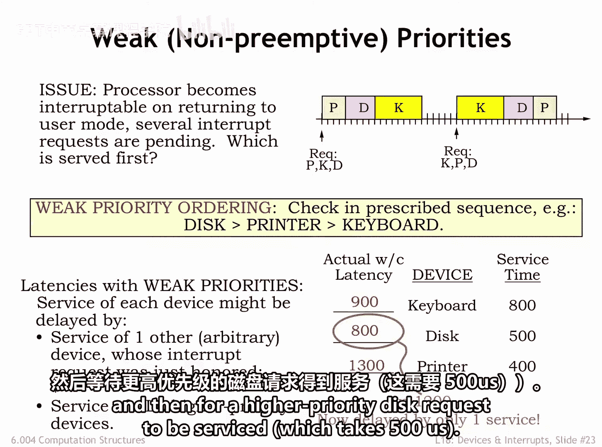
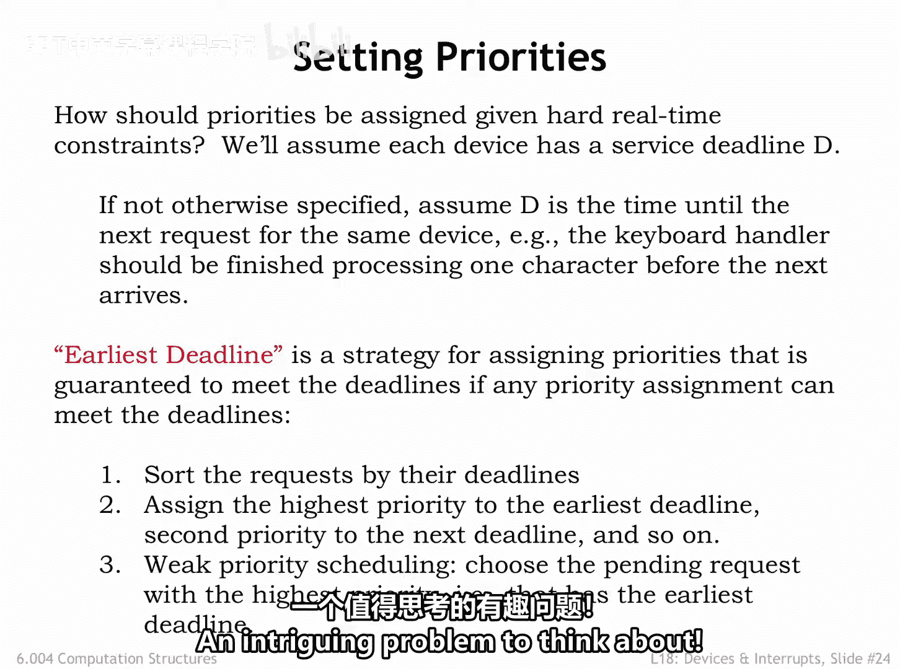

# 058：弱优先级调度 🧩

在本节课中，我们将学习实时系统中的中断处理与调度策略。我们将探讨“先到先服务”调度的问题，并引入“弱优先级”调度算法来优化最坏情况延迟。课程将使用一个包含键盘、磁盘和打印机的系统作为示例，分析不同调度策略对设备响应时间的影响。

---

## 先到先服务调度的延迟问题

假设我们有一个实时系统，支持三个设备：
*   一个键盘，其中断处理程序的服务时间为800微秒。
*   一个磁盘，服务时间为500微秒。
*   一个打印机，服务时间为400微秒。

我们首先需要计算每个设备在最坏情况下可能经历的延迟。目前，我们假设请求并不频繁，即每个场景下每个设备只发出一次请求。请求可以在任何时间以任何顺序到达。

如果我们采用**先到先服务**的顺序处理请求，每个设备都可能被所有其他设备的服务所延迟。

以下是具体分析：
*   键盘处理程序的开始可能被磁盘和打印机处理程序的执行所延迟，最坏情况延迟为 `500 + 400 = 900` 微秒。
*   磁盘处理程序的开始可能被键盘和打印机处理程序的执行所延迟，最坏情况延迟为 `800 + 400 = 1200` 微秒。
*   打印机处理程序的开始可能被键盘和磁盘处理程序的执行所延迟，最坏情况延迟为 `800 + 500 = 1300` 微秒。

在这个场景中，我们发现运行时间长的处理程序（如键盘）对其他设备的最坏情况延迟产生了巨大影响。

那么，有哪些可能性可以减少最坏情况延迟呢？是否存在比先到先服务更好的调度算法？

---

## 引入弱优先级调度

一种策略是为待处理的请求分配优先级，并按照优先级顺序提供服务。如果处理程序是**不可中断的**，优先级将用于在当前任务完成时选择下一个要运行的任务。

请注意，在此策略下，当前任务总是会运行到完成，即使有更高优先级的请求在其执行期间到达。这被称为**非抢占式**或**弱优先级**系统。

在弱优先级系统中，每个设备的最坏情况延迟计算如下：
*   所有其他设备的最坏情况服务时间（因为新请求到达时，那个处理程序可能刚刚开始运行）。
*   加上所有更高优先级设备的服务时间（因为它们会被优先运行）。

在我们的示例中，假设我们分配最高优先级给磁盘，次优先级给打印机，最低优先级给键盘。

以下是各设备的最坏情况延迟分析：
*   **键盘**：由于优先级最低，其延迟不变，仍可能被更高优先级的磁盘和打印机处理程序延迟，最坏延迟为 `500 + 400 = 900` 微秒。
*   **磁盘**：拥有最高优先级，因此总是在当前处理程序完成后被选中执行。其最坏情况延迟就是当前运行处理程序的最坏情况服务时间，在本例中是键盘的800微秒。相比先到先服务的1200微秒，这是一个显著的改进。
*   **打印机**：其最坏情况是，可能必须等待键盘处理程序完成（最多800微秒），然后等待一个更高优先级的磁盘请求被服务（500微秒），总延迟为 `800 + 500 = 1300` 微秒。

---

## 如何分配优先级：最早截止时间优先策略

在给定严格的实时约束下，应该如何分配优先级？我们假设每个设备在其服务请求到达后，都有一个服务截止时间 **D**。如果没有特别说明，通常假设 **D** 是同一设备下一个请求到达之前的时间。这是一个相当保守的假设，可以防止系统越来越落后。例如，键盘处理程序理应在下一个字符到达前完成对当前字符的处理。

**最早截止时间优先** 是一种分配优先级的策略，其原则是：如果存在任何优先级分配方案能够满足所有截止时间，那么该策略就能保证满足截止时间。它非常简单：按照请求的截止时间排序，将最高优先级分配给截止时间最早的请求，次优先级给下一个截止时间，依此类推。弱优先级系统将选择优先级最高（即截止时间最早）的待处理请求。

最早截止时间优先策略具有直观的吸引力。想象一下在机场排长队过安检，优先处理航班最早的乘客是合理的，前提是在他们的航班起飞前有足够的时间处理所有人。如果先处理10个航班在30分钟后起飞的乘客，而让一个航班在5分钟后起飞的乘客等待，将导致后者错过航班。但如果先处理后者，其他乘客可能稍有延迟，但每个人都能赶上航班。这正是弱优先级系统中的最早截止时间调度可以解决的问题。

虽然超出了我们讨论的范围，但思考一下如果某些航班注定要错过该怎么办也很有趣。如果系统过载，按最早截止时间优先可能意味着所有人都会错过航班。在这种情况下，更好的策略可能是分配优先级以最小化错过航班的总数。这使问题变得复杂，因为优先级的分配现在取决于具体有哪些待处理请求以及服务它们需要多长时间，这是一个值得深思的有趣问题。

---

## 总结

本节课我们一起学习了实时系统中的调度策略。我们首先分析了**先到先服务**调度算法导致的长处理程序严重拖累系统响应时间的问题。接着，我们引入了**弱优先级（非抢占式）** 调度，通过为中断请求分配优先级来优化高优先级设备的延迟。最后，我们探讨了在严格实时约束下，如何采用**最早截止时间优先**策略来分配优先级，以确保系统能够满足所有关键任务的截止时间要求。理解这些基础调度概念对于设计高效、可靠的实时系统至关重要。