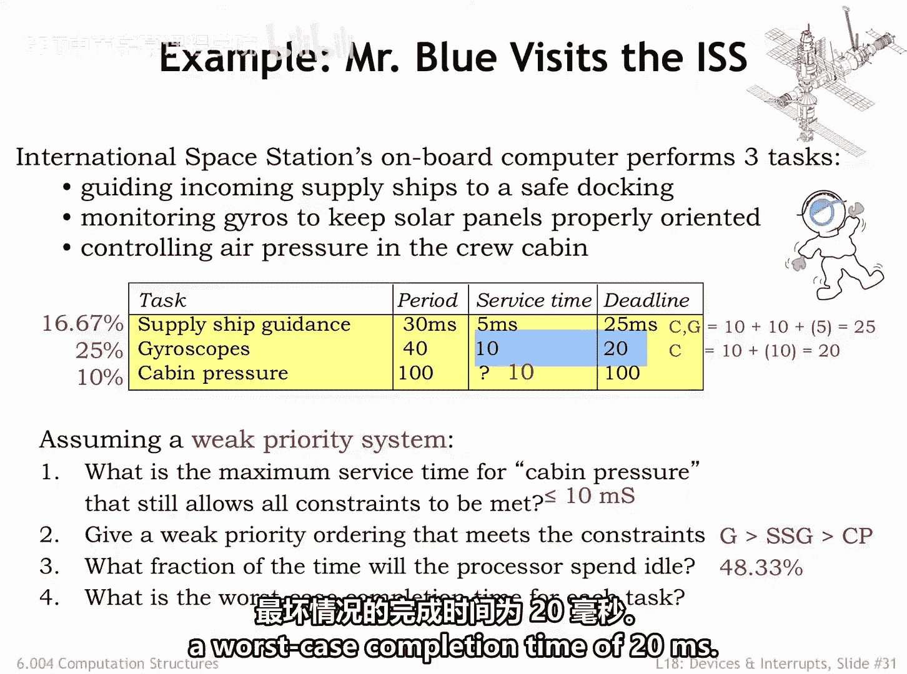
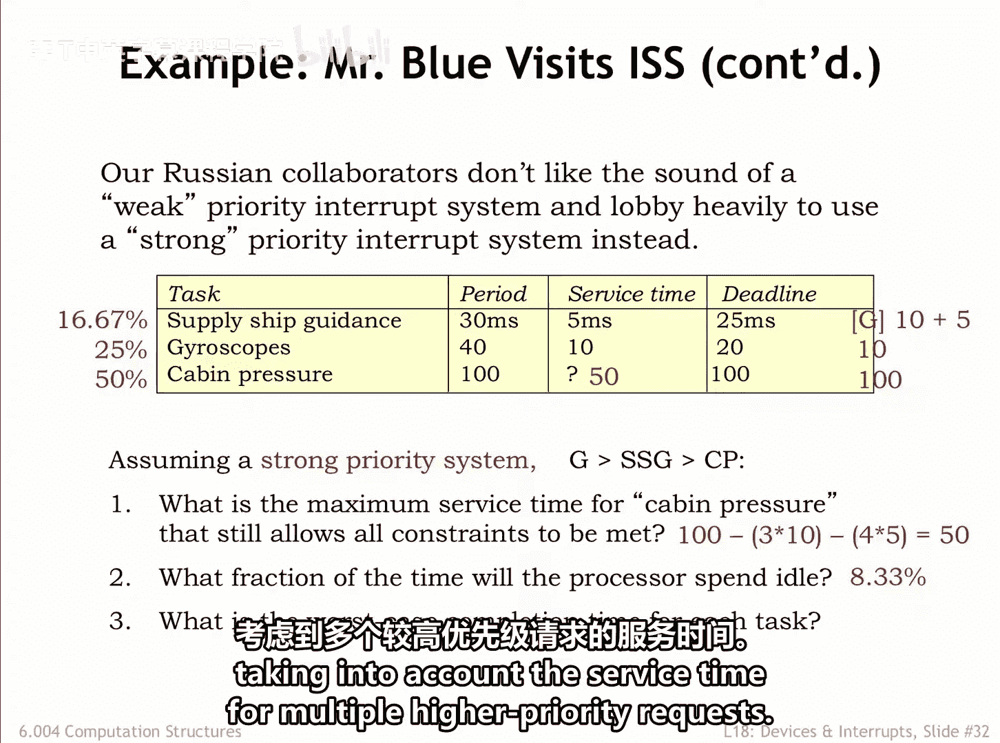
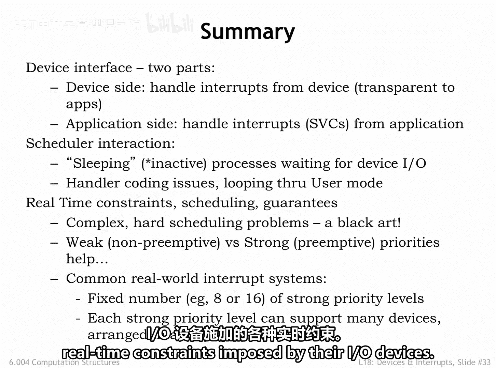

# 060：中断处理与优先级实例分析 🚀

在本节课中，我们将通过两个扩展实例，深入分析弱优先级和强优先级系统在实时任务调度中的应用。我们将以国际空间站的控制系统为例，探讨如何满足不同任务的实时性约束。

## 概述

我们将分析一个包含三个周期性任务的控制系统：补给飞船引导（SSG）、陀螺仪控制（G）和舱内压力控制（CP）。每个任务都有其请求周期、服务时间和截止期限。我们将首先在弱优先级系统下分析，然后在强优先级系统下重新分析，比较两种策略的差异。

---

## 实例一：弱优先级系统分析

上一节我们介绍了中断优先级的基本概念，本节中我们来看看在弱优先级系统下，如何为任务分配优先级并计算关键参数。

以下是任务参数表：
| 任务 | 周期 (ms) | 服务时间 (ms) | 截止期限 (ms) |
| :--- | :---: | :---: | :---: |
| SSG | 30 | 5 | 25 |
| G | 40 | 10 | 20 |
| CP | 100 | 10 | 100 |

### 1. CP任务的最大服务时间

在弱优先级系统中，低优先级任务的服务时间不能过长，以免阻塞高优先级任务。SSG任务的最大允许延迟为20毫秒（`25ms - 5ms`），G任务的最大允许延迟为10毫秒（`20ms - 10ms`）。因此，任何其他处理程序（包括CP）的运行时间都不能超过10毫秒，否则G任务将错过其截止期限。

**结论**：CP任务的最大服务时间为 **10毫秒**。

### 2. 满足约束的弱优先级排序

根据之前讨论的“最早截止期限优先”策略，截止期限越短，优先级越高。

以下是优先级排序（从高到低）：
1.  **G任务**（截止期限20ms）
2.  **SSG任务**（截止期限25ms）
3.  **CP任务**（截止期限100ms）

### 3. 处理器空闲时间比例

我们需要计算CPU用于服务周期性请求的周期比例。

*   SSG任务：`5 / 30 = 16.67%`
*   G任务：`10 / 40 = 25%`
*   CP任务：`10 / 100 = 10%`

总服务负载为 `16.67% + 25% + 10% = 51.67%`。
因此，处理器空闲时间比例为 `100% - 51.67% = 48.33%`。

这意味着宇航员在空闲时间可以玩《我的世界》。

### 4. 各任务的最坏情况完成时间

在弱优先级系统中，一个任务可能被更高优先级的任务抢占，也可能需要等待正在运行的低优先级任务完成。

以下是各任务的最坏情况完成时间计算：
*   **SSG（最低优先级）**：可能需等待CP（10ms）和G（10ms）完成，再加上自身服务时间（5ms）。最坏完成时间为 `10 + 10 + 5 = 25ms`。
*   **G（中等优先级）**：可能需等待CP（10ms）完成，再加上自身服务时间（10ms）。最坏完成时间为 `10 + 10 = 20ms`。
*   **CP（最高优先级）**：不会被抢占。但可能需等待当前正在运行的SSG（最长5ms）或G（最长10ms）完成。最坏情况是，一个SSG（5ms）刚启动，紧接着一个G请求（10ms）到达。CP需等待 `5 + 10 = 15ms`，再加上自身服务时间10ms，总完成时间为 `15 + 10 = 25ms`。

---

## 实例二：强优先级系统分析

在分析了弱优先级系统后，我们现在切换到强优先级系统。在强优先级下，高优先级任务可以抢占低优先级任务，这将改变我们的计算方式。

我们假设优先级顺序不变：G最高，SSG次之，CP最低。

### 1. CP任务的最大服务时间

在强优先级系统中，CP任务的服务时间不再受限于高优先级任务的最大延迟，因为它会被抢占。我们需要考虑在CP请求与其截止期限之间的100毫秒间隔内，SSG和G任务会占用多少CPU时间。

在100毫秒内：
*   SSG可能有4次请求（时间点：0， 30， 60， 90），总服务时间为 `4 * 5ms = 20ms`。
*   G可能有3次请求（时间点：0， 40， 80），总服务时间为 `3 * 10ms = 30ms`。

高优先级任务总共需要 `20ms + 30ms = 50ms` 的服务时间。
因此，CP任务的服务时间最多可达 `100ms - 50ms = 50ms`，仍能满足100毫秒的截止期限。

### 2. 处理器空闲时间比例

假设CP服务时间为50毫秒。

*   SSG任务：`5 / 30 = 16.67%`
*   G任务：`10 / 40 = 25%`
*   CP任务：`50 / 100 = 50%`

总服务负载为 `16.67% + 25% + 50% = 91.67%`。
因此，处理器空闲时间比例为 `100% - 91.67% = 8.33%`。

### 3. 各任务的最坏情况完成时间

在强优先级系统中，计算方式有所不同。

以下是各任务的最坏情况完成时间：
*   **G（最高优先级）**：服务程序在收到请求后立即运行，最坏完成时间就是其服务时间 **10ms**。
*   **SSG（中等优先级）**：在SSG请求与其25ms截止期限之间，最多可能有1次G请求（10ms）抢占其执行。因此，最坏完成时间为 `10ms (G) + 5ms (SSG) = 15ms`。
*   **CP（最低优先级）**：根据问题1的计算，我们选择了50ms的服务时间，考虑到多个高优先级请求的服务时间，它将在其100ms的截止期限那一刻完成。

---

## 总结

本节课中我们一起学习了中断处理中优先级系统的实际应用。我们通过国际空间站控制系统的两个实例，对比分析了弱优先级和强优先级系统：

1.  **弱优先级系统**中，低优先级任务的服务时间受限于高优先级任务的延迟要求，计算相对直接，但低优先级任务可能被“饿死”。
2.  **强优先级系统**中，高优先级任务可以抢占低优先级任务，因此计算最大服务时间时，需考虑在截止期限窗口内所有高优先级任务的总服务时间。这通常允许低优先级任务有更长的服务时间，但调度更复杂。

在实际的计算机系统中，通常采用**强优先级**系统，并支持有限数量的优先级级别。在同一强优先级级别内，则使用**弱优先级**系统来处理多个设备。这种混合方法在实践中效果很好，使系统能够满足其I/O设备提出的各种实时约束。

