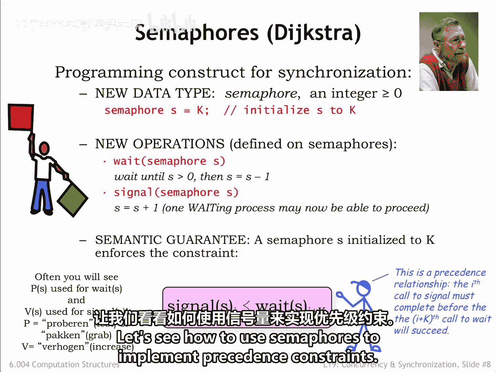
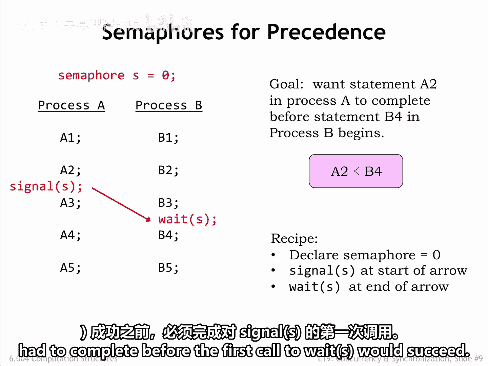
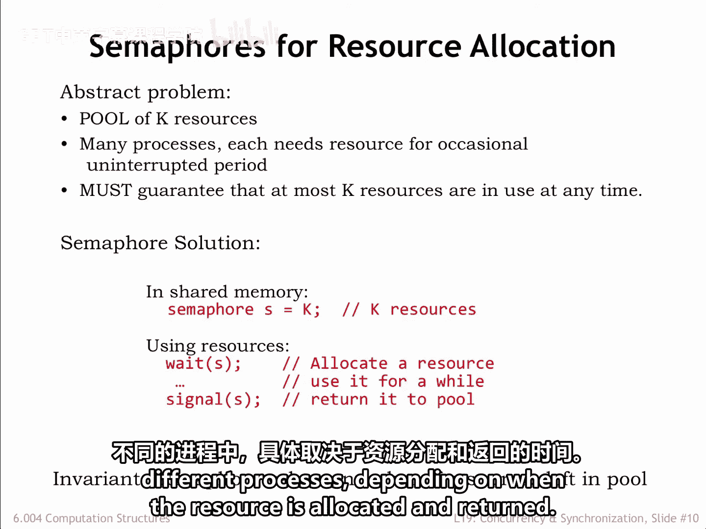
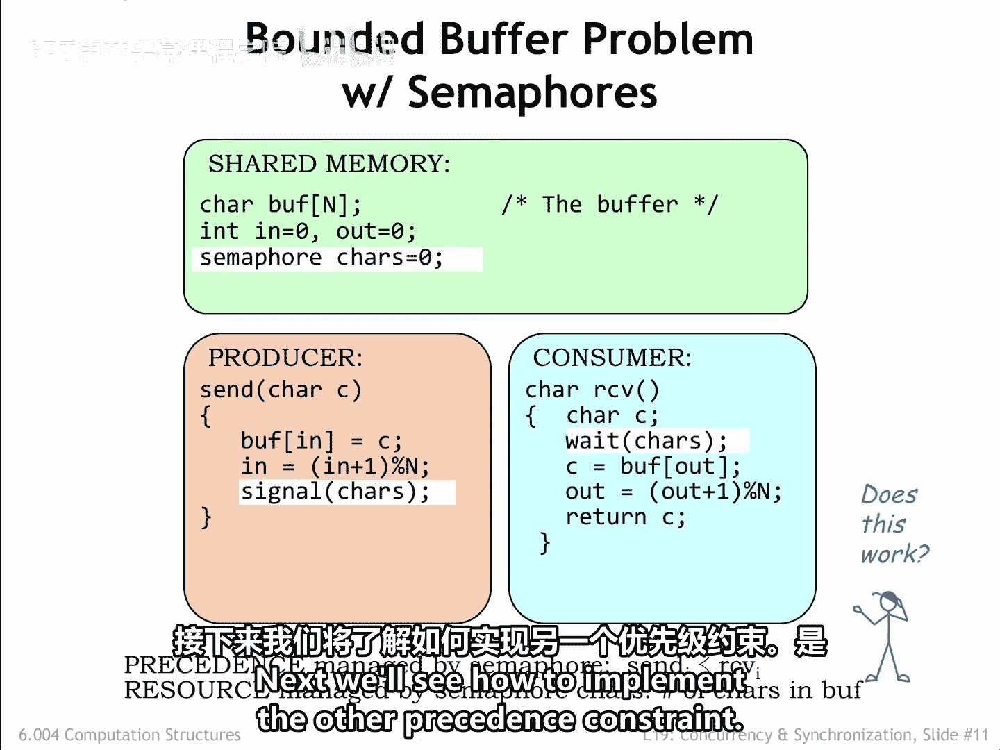
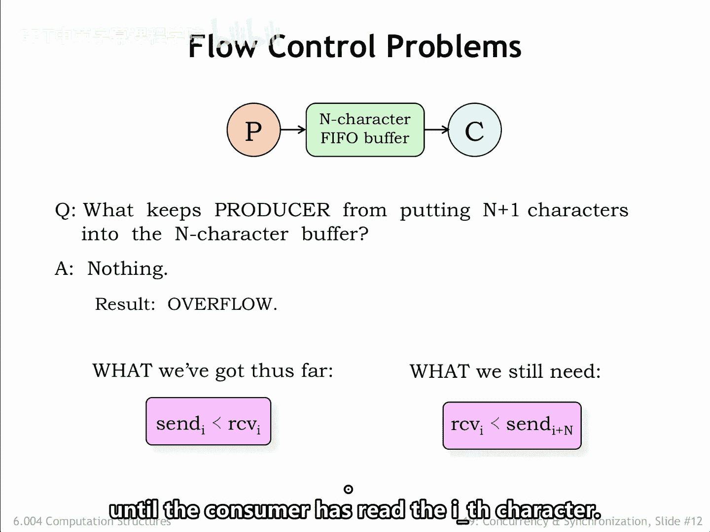

# 063：6.4 信号量 🚦

在本节课中，我们将学习一种强大的同步抽象工具——信号量。我们将了解它的定义、基本操作，并学习如何使用它来解决进程间的同步问题，特别是生产者-消费者问题。

## 概述

信号量是一种由荷兰计算机科学家 Edsger Dijkstra 提出的抽象数据类型，用于解决多进程环境下的同步需求。它本质上是一个共享的整数值（≥0），通过两个原子操作 `wait` 和 `signal` 来管理，从而协调多个进程对共享资源的访问顺序。

## 信号量的定义与操作

信号量是一个整数值大于或等于0的抽象数据类型。程序员可以声明一个信号量，并指定其初始值。这个信号量存储在所有需要同步操作的进程共享的内存位置中。

对信号量的访问通过两个操作进行：`wait` 和 `signal`。

*   **`wait` 操作**：此操作会等待，直到指定的信号量值大于0。然后，它会将信号量值减1并返回调用程序。如果调用 `wait` 时信号量值为0，则概念上会暂停执行，直到信号量值变为非0。一个简单但低效的实现是让 `wait` 例程循环，定期测试信号量的值，直到其值非0才继续执行。
*   **`signal` 操作**：此操作将指定信号量的值加1。如果有任何进程正在等待该信号量，那么其中**恰好有一个**进程现在可以继续执行。我们必须小心实现 `signal` 和 `wait`，以确保“恰好一个”这个约束得到满足。换句话说，要防止两个等待同一信号量的进程在收到一个 `signal` 后，都认为自己可以递减信号量并继续执行。

一个初始值为 **K** 的信号量保证：第 **I** 次 `signal` 调用会先于第 **I+K** 次 `wait` 调用完成。稍后我们将通过具体例子来阐明这一点。

> **注意**：在6.004课程中，我们排除了信号量值为负的情况。在文献中，你可能会看到用 **P(S)** 代替 `wait(S)`，用 **V(S)** 代替 `signal(S)`。这些操作名称来源于荷兰语的“测试”和“增加”。

## 使用信号量实现执行顺序约束

上一节我们介绍了信号量的基本概念，本节中我们来看看如何使用它来实现进程间的执行顺序约束。

假设有两个进程A和B，每个进程运行一个包含五个语句的程序。在每个进程内部，执行是顺序的（A1在A2之前执行，依此类推）。但进程之间没有执行顺序约束，因此进程B的语句B1可能在进程A的任何语句之前或之后执行。

如果我们希望施加一个约束：**语句A2的执行必须在语句B4开始执行之前完成**（如下图所示）。

以下是使用信号量实现这种简单前驱约束的步骤：

1.  **声明并初始化信号量**：首先，声明一个信号量（本例中称为 `S`）并将其初始值设为 **0**。
2.  **放置 `signal` 调用**：在约束箭头**开始**的位置放置一个 `signal(S)` 调用。在本例中，`signal(S)` 被放在进程A的语句A2之后。
3.  **放置 `wait` 调用**：在约束箭头**结束**的位置放置一个 `wait(S)` 调用。在本例中，`wait(S)` 被放在进程B的语句B4之前。

进行这些修改后，进程A照常执行，`signal(S)` 在语句A2执行后发生。进程B的语句B1到B3也照常执行，但当执行到 `wait(S)` 时，进程B的执行会被挂起，直到 `signal(S)` 语句执行完毕。这保证了B4只有在A2完成后才会开始执行。

通过将信号量 `S` 初始化为0，我们强制了第一个 `signal(S)` 调用必须在第一个 `wait(S)` 调用成功之前完成。

## 将信号量视为资源管理器

理解信号量的另一种方式是将其视为共享资源池的管理工具。其中，资源池的大小 **K** 就是信号量的初始值。

*   使用 `signal` 操作向共享池**添加**或**归还**资源。
*   使用 `wait` 操作从共享池**分配**一个资源供你独占使用。

在任何给定时间，信号量的值表示共享池中**尚未分配**的可用资源数量。请注意，`wait` 和 `signal` 操作可以在同一个进程中，也可以在不同的进程中，这取决于资源何时被分配和归还。

## 应用：生产者-消费者问题（第一部分）

现在，让我们将信号量应用到经典的生产者-消费者问题中。假设我们有一个能容纳 **N** 个字符的缓冲区。

首先，我们定义一个信号量 `chars` 并将其初始化为 **0**。`chars` 的值将告诉我们缓冲区中有多少个字符。

*   **生产者（发送方）** 在向缓冲区添加一个字符后，执行 `signal(chars)`，表示缓冲区现在多了一个字符。
*   **消费者（接收方）** 在从缓冲区读取之前，执行 `wait(chars)` 以确保缓冲区中至少有一个字符。

由于 `chars` 被初始化为0，这强制了第 **I** 次 `signal(chars)` 调用必须先于第 **I** 次 `wait(chars)` 调用完成。换句话说，消费者在字符被生产者放入缓冲区之前，无法消费它。

我们使用 `chars` 信号量实现了一个必要的同步约束：**消费者不能从空缓冲区读取**。但这足够了吗？

## 识别缺失的约束

上一节我们使用信号量防止了消费者读取空缓冲区，但生产者这边还存在问题。

是什么阻止生产者向 **N** 字符的缓冲区中放入超过 **N** 个字符？**什么也没有**。生产者可能会开始覆盖之前放入缓冲区、但尚未被消费者读取的字符。这被称为**缓冲区溢出**，从生产者传输到消费者的字符序列会遭到严重破坏。

到目前为止，我们保证的是：消费者只有在生产者将字符放入缓冲区后才能读取它。但我们仍然需要保证：**生产者不能领先消费者太多**。由于缓冲区最多容纳 **N** 个字符，生产者必须在消费者读取了第 **I** 个字符之后，才能发送第 **I+N** 个字符。

## 应用：生产者-消费者问题（完整方案）

为了解决上述问题，我们需要第二个信号量来管理缓冲区中的**空位**数量。

我们添加第二个信号量 `spaces` 来管理缓冲区中的空位数量。初始时，缓冲区是空的，所以它有 **N** 个空位。

*   **生产者** 必须等待有空位可用。当 `spaces` 非0时，`wait(spaces)` 成功，将可用空位数减1，然后生产者用下一个字符填充该空位。
*   **消费者** 在从缓冲区读取一个字符后，执行 `signal(spaces)`，表示又多了一个可用空位。

这里存在一种美妙的对称性：
*   生产者**消耗**空位，并**生产**字符。
*   消费者**消耗**字符，并**生产**空位。

信号量被用来跟踪这两种资源（即字符和空位）的可用性，从而同步生产者和消费者的执行。

这个方案在单个生产者进程和单个消费者进程的情况下工作得很好。接下来，我们将思考如果存在多个生产者和多个消费者会发生什么。😊

## 总结

本节课中，我们一起学习了信号量这一核心同步机制。我们了解了信号量作为共享整数和资源管理器的双重视角，掌握了 `wait` 和 `signal` 操作的含义。通过具体的例子，我们学习了如何使用信号量来强制进程间的执行顺序，并完整地解决了经典的单生产者-单消费者问题，通过 `chars` 和 `spaces` 两个信号量实现了对缓冲区访问的安全同步。这为理解更复杂的并发编程模式奠定了坚实基础。