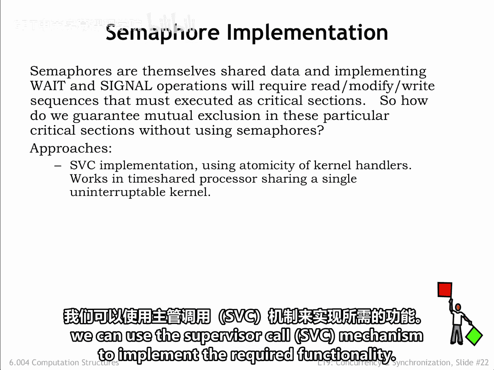
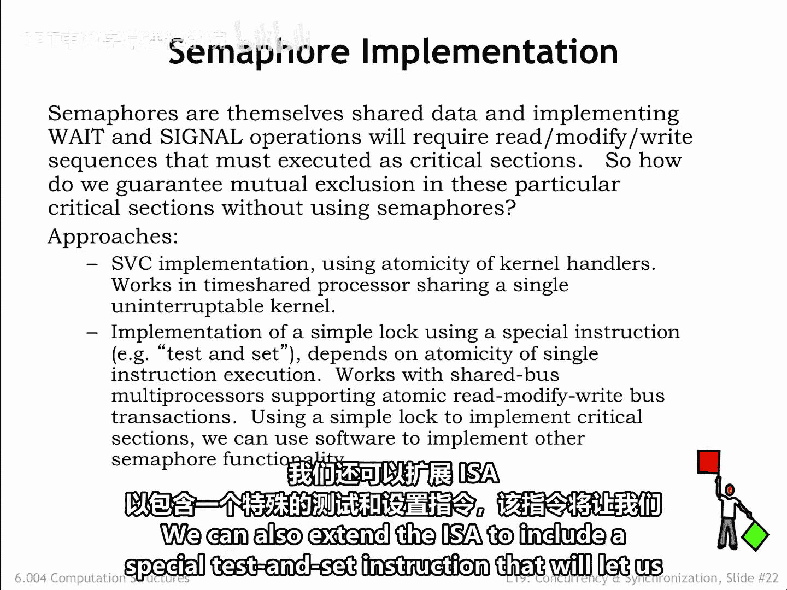
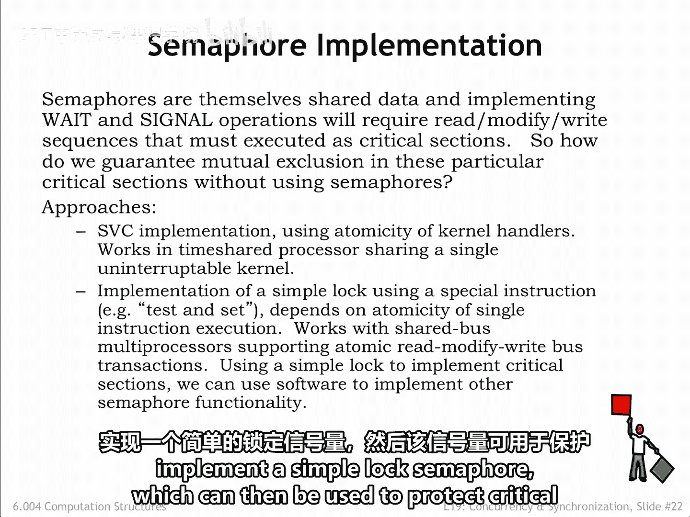
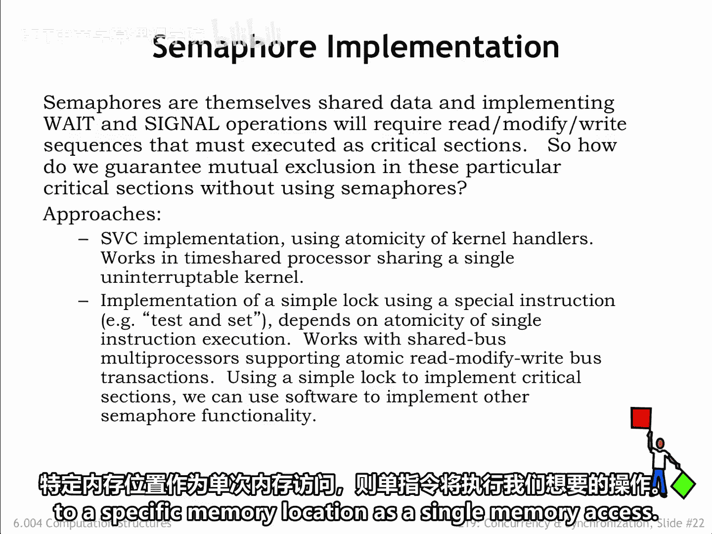
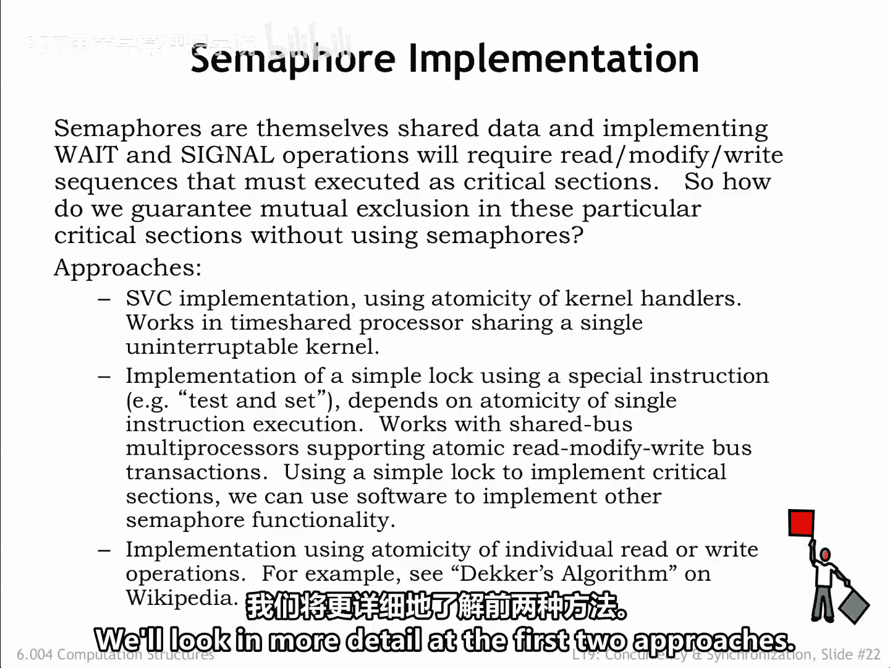
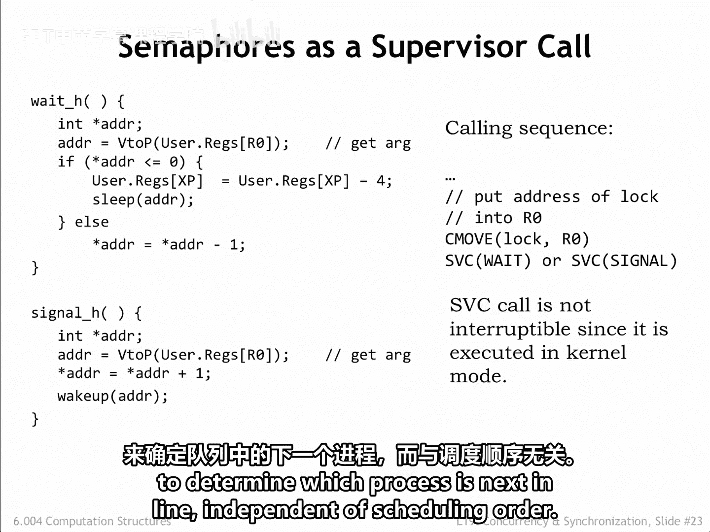
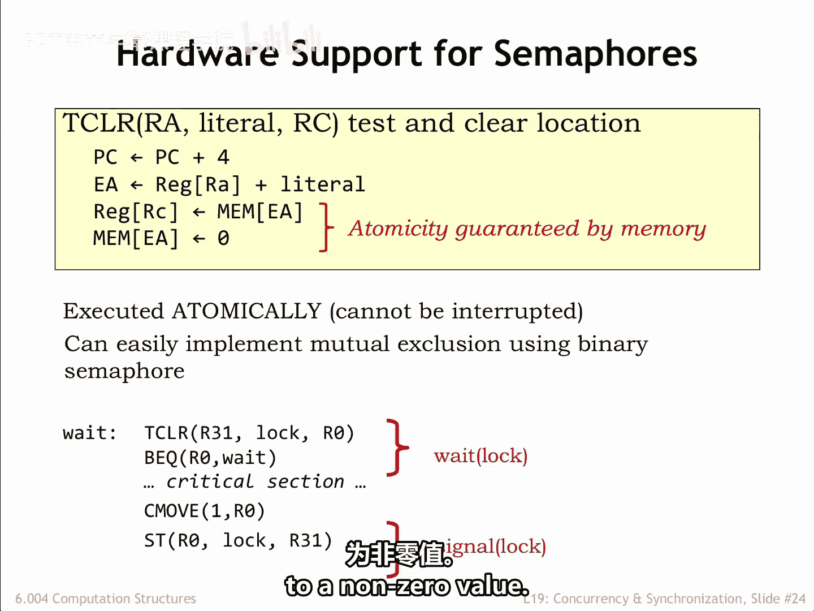

# 065：信号量的实现 🔧

在本节课中，我们将要学习如何从零开始实现信号量。信号量本身是共享数据，其 `wait` 和 `signal` 操作需要以临界区执行的读-修改-写序列。我们将探讨两种主要的实现方法：利用操作系统内核的不可中断特性，以及使用特殊的原子硬件指令。

## 实现挑战与引导问题

信号量是实现互斥约束的常用工具。然而，我们无法使用信号量自身来实现信号量，这被称为“引导问题”。因此，我们需要从头构建所需的功能。

幸运的是，在运行有时分共享处理器和不可中断操作系统内核的系统上，我们可以利用**系统调用**机制来实现所需功能。

我们也可以扩展指令集架构，加入特殊的**测试并设置**指令，这允许我们实现一个简单的锁信号量。然后，这个锁可以用来保护实现更复杂信号量语义的临界区。

单个指令本质上是原子的。在多核处理器中，如果共享主存支持将读取旧值和写入新值到特定内存位置作为一个单一的内存访问操作，那么这种指令就能满足我们的需求。

此外，还存在其他更复杂的纯软件解决方案，它们依赖于单个读写的原子性来实现简单锁，例如维基百科上的**C. Decker算法**。本节课我们将更详细地探讨前两种方法。

## 方法一：基于系统调用的实现

以下是 `wait` 和 `signal` 系统调用的操作系统处理程序。由于系统调用在内核模式下运行且不可中断，因此处理程序代码自然作为临界区执行。

两个处理程序都期望用户程序将信号量内存地址作为参数通过寄存器 R0 传递。

### Wait 处理程序

`wait` 处理程序检查信号量的值。如果值非零，则将其减一，然后处理程序恢复用户程序在 `wait` 系统调用之后指令的执行。

如果信号量为 0，代码会安排当用户程序恢复执行时重新执行 `wait` 系统调用。接着，它调用 `sleep` 将进程标记为非活动状态，直到收到对应的 `wakeup` 调用。

### Signal 处理程序

`signal` 处理程序更简单：它将信号量值加一，并调用 `wakeup` 来标记任何正在等待此特定信号量的进程为活动状态。最终，轮转调度器会选中一个正在等待的进程，该进程将能够减少信号量并继续执行。

需要注意的是，此代码没有提供公平性保证。换句话说，不能保证一个等待的进程最终一定能成功找到非零的信号量。调度器有特定的进程运行顺序，因此序列中的下一个等待进程总是会获得信号量，即使序列中后面有等待时间更长的进程。

如果希望实现公平性，`wait` 可以维护一个等待进程队列，并使用该队列（独立于调度顺序）来决定哪个进程是下一个。

## 方法二：基于原子指令的实现

许多指令集架构支持类似此处所示的**测试并清零**指令。`TCLR` 指令读取内存位置的当前值，然后将其设置为 0，所有操作作为一个单一操作。它类似于加载指令，区别在于它在读取值之后会将内存位置清零。

要实现 `TCLR`，内存需要支持读-清零操作以及正常的读写操作。

幻灯片底部的汇编代码展示了如何使用 `TCLR` 来实现一个简单的锁。

以下是实现步骤：

1.  程序使用 `TCLR` 指令访问锁信号量的值。
2.  如果返回给寄存器 RC 的值是 0，则表示其他进程已持有锁，程序循环以再次尝试 `TCLR`。
3.  如果返回值非零，则表示已获得锁，可以开始执行临界区代码。在这种情况下，`TCLR` 也已将锁设置为 0，从而阻止其他进程进入临界区。
4.  当临界区执行完毕后，使用一条 `store` 指令将信号量设置为非零值，释放锁。

## 总结

本节课中，我们一起学习了信号量的两种底层实现方法。首先，我们看到了如何利用操作系统内核的不可中断特性，通过系统调用处理程序来实现 `wait` 和 `signal` 操作。其次，我们探讨了如何借助硬件提供的原子指令（如测试并清零）来构建一个简单的锁，进而保护更复杂的信号量操作。理解这些实现原理对于深入掌握并发编程和操作系统内核设计至关重要。