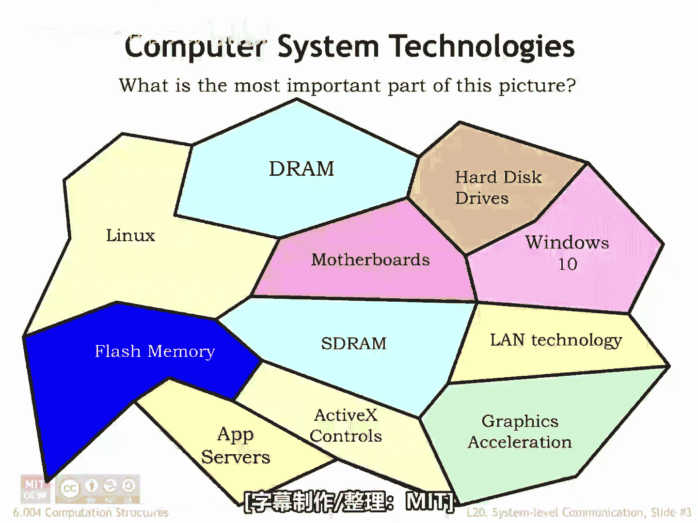
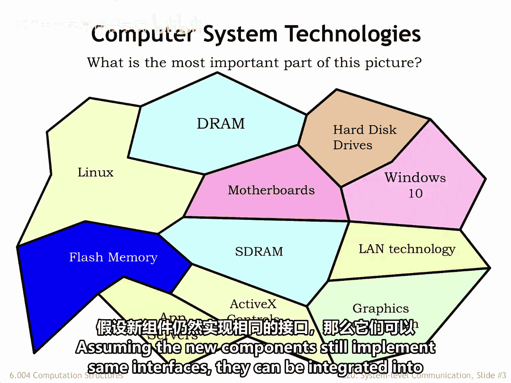
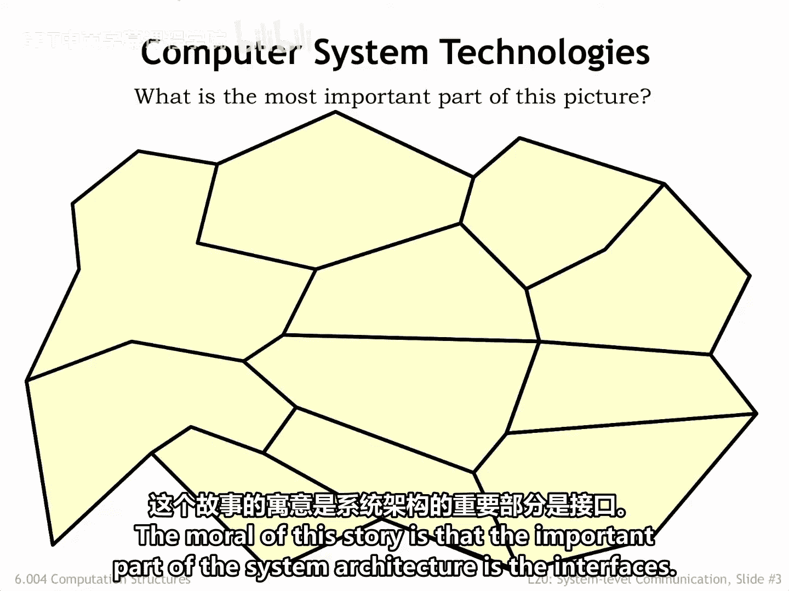
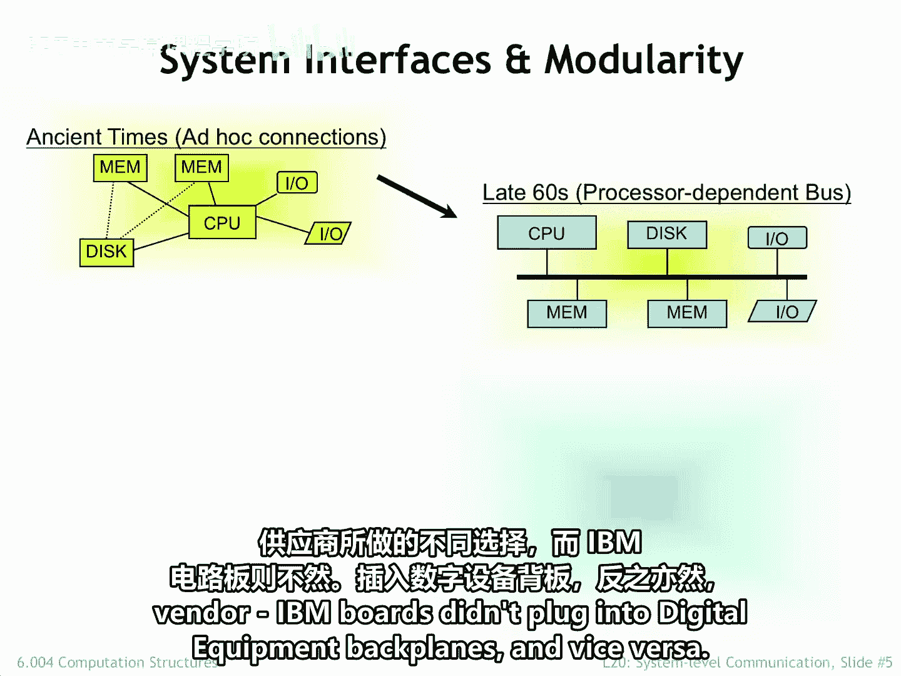
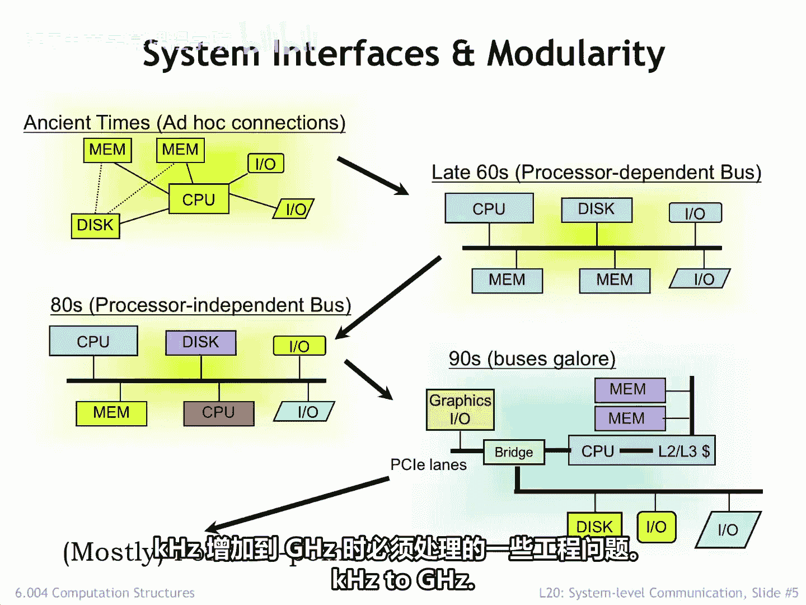

# 068：系统级接口

## 概述
在本节课中，我们将要学习计算机系统如何通过定义良好的接口将各种技术组件集成在一起。我们将探讨接口设计的重要性、历史经验教训，以及现代系统如何通过通用通信通道实现组件间的互联。

计算机系统汇集了许多技术，并利用它们来快速执行程序。其中一些技术相对较新，另一些则已伴随我们数十年。

每个系统组件都附带其功能和接口的详细规范。系统设计师的期望是，他们可以根据组件规范来设计系统，而无需了解每个组件的实现细节。这非常有益，因为许多底层技术会发生变化，通常这些变化使得组件变得更小、更快、更便宜、更节能等等。假设新组件仍然实现相同的接口，那么它们就可以几乎不费力地被集成到系统中。

这个故事的寓意是，系统架构中最重要的部分是接口。

我们的目标是设计能够经历多代技术变革而依然有效的接口规范。实现长期生存的一种方法是，将规范建立在一个有用的抽象之上，这个抽象隐藏了大部分（如果不是全部）底层实现细节。

例如，操作系统提供了许多多年来保持稳定的接口。网络接口可靠地将字节流传递到指定的目标，隐藏了数据包、套接字、错误检测和恢复等细节。或者，窗口和图形系统渲染复杂图像，使应用程序免受底层图形引擎细节的影响。又或者，日志文件系统在后台防止二级存储阵列的损坏。

基本上，我们早已过了每次集成电路专家能够将芯片上的晶体管数量翻倍、通信专家想出如何从1 GHz网络升级到10 GHz网络、或者内存专家能够将主存容量增加4倍时，就从头开始构建系统的阶段。

保护我们免受技术变革影响的接口对于确保技术进步不会成为持续性的破坏来源至关重要。

## 接口设计的经验与教训
上一节我们介绍了接口的重要性，本节中我们来看看一些历史上接口设计的经验教训。

有一些著名的例子表明，一个表面上看似方便的接口选择，却带来了令人尴尬的长期后果。例如，在独立计算时代，不同的指令集架构对于如何在主存中存储多字节数值做出了不同的选择。

IBM架构将最高有效字节存储在最低地址，即所谓的**大端序**。而Intel的X86架构则首先存储最低有效字节，即所谓的**小端序**。但在网络世界中，数值数据经常在系统间传输，这导致了各种复杂问题。这是一个局部最优选择对全局产生不幸影响的典型例子。正如俗话所说：**一时的方便，一生的遗憾**。

另一个例子是第一台IBM PC（基于Intel CPU芯片的原始个人计算机）选择的系统级通信策略。IBM通过简单地使用当时X86 CPU提供的接口信号来构建其用于添加IO外设、内存卡等的扩展总线。因此，数据总线宽度、地址引脚数量、数据传输协议等，都是为该特定CPU的接口而设计的。这是一个合乎逻辑的选择，因为它完成了任务，同时将成本保持在尽可能低的水平。

但随着更新、性能更高的CPU被引入，能够寻址更多内存或提供32位而非16位外部数据通路，这个选择很快被证明是不幸的。系统架构师被迫向客户提供霍布森选择：要么为了向后兼容性而牺牲系统性能，要么丢弃去年购买的网络卡，因为它与今年的系统不兼容。

但也有成功的故事。IBM在20世纪60年代初选择的System/360接口延续到了70年代和80年代的System/370，以及90年代的Enterprise System Architecture/390。客户期望为早期机器编写的软件能在新系统上继续运行，而IBM能够满足这一期望。也许最引人注目的长期接口成功案例是70年代初设计的TCP和IP网络协议，它们构成了大多数基于数据包的网络通信的基础。最近的一次更新将网络地址从32位扩展到128位，但这对于使用网络的应用程序来说基本上是透明的。这是一套极具远见的工程选择，经受住了网络连接指数级增长超过四十年的考验。

## 现代系统组件互联
上一节我们回顾了接口设计的历史，本节中我们来看看现代系统组件互联的接口选择。

今天讲座的主题是找出连接系统组件的适当接口选择。在最早的系统中，这些连接是非常临时的，因为协议和物理实现是为每个必须建立的连接独立选择的。连接CPU机箱和内存机箱的电缆（是的，在那个年代它们分别放在不同的19英寸机架中）与连接CPU和磁盘的电缆是不同的。

改进的电路技术使系统组件从机柜大小缩小到电路板大小，系统工程师设计了一种模块化封装方案，允许用户混合搭配可插入通信背板的电路板类型。背板上的协议和信号反映了每个供应商做出的不同选择。IBM的电路板不能插入Digital Equipment的背板，反之亦然。

这演变成了一些标准化的通信背板，允许用户进行自己的系统集成，为CPU、内存、网络等选择不同的供应商。健康的竞争迅速压低了价格并推动了创新。

然而，这一有希望的发展被快速提高的性能需求所超越，这需要通信带宽，而多板背板根本无法支持这种带宽。对更高性能的需求以及将许多不同通信通道集成到单个芯片中的能力，导致了不同通道的激增。在许多方面，系统架构让人想起了原始系统：临时的、为特定任务专门构建的通信通道。

正如我们将看到的，工程上的考虑导致了通用单向点对点通信通道的广泛采用。根据所需的性能、传输距离等，仍然存在几种类型的通道，但异步点对点通道已经基本取代了早期系统的同步多信号通道。

大多数系统级通信都涉及通过电线进行信号传输。因此，接下来，我们将研究随着通信速度从千赫兹增加到千兆赫兹，我们必须处理的一些工程问题。

## 总结
本节课中我们一起学习了计算机系统架构中接口的核心作用。我们了解到，良好的接口设计能够抽象底层技术细节，确保系统的长期稳定性和兼容性。通过回顾大端序/小端序、IBM PC扩展总线等历史案例，我们认识到接口选择的长远影响。最后，我们探讨了现代系统如何从临时、专用的连接方式，发展到采用通用异步点对点通信通道来连接组件，以适应高性能计算的需求。理解这些接口原理是设计和集成复杂计算机系统的基础。