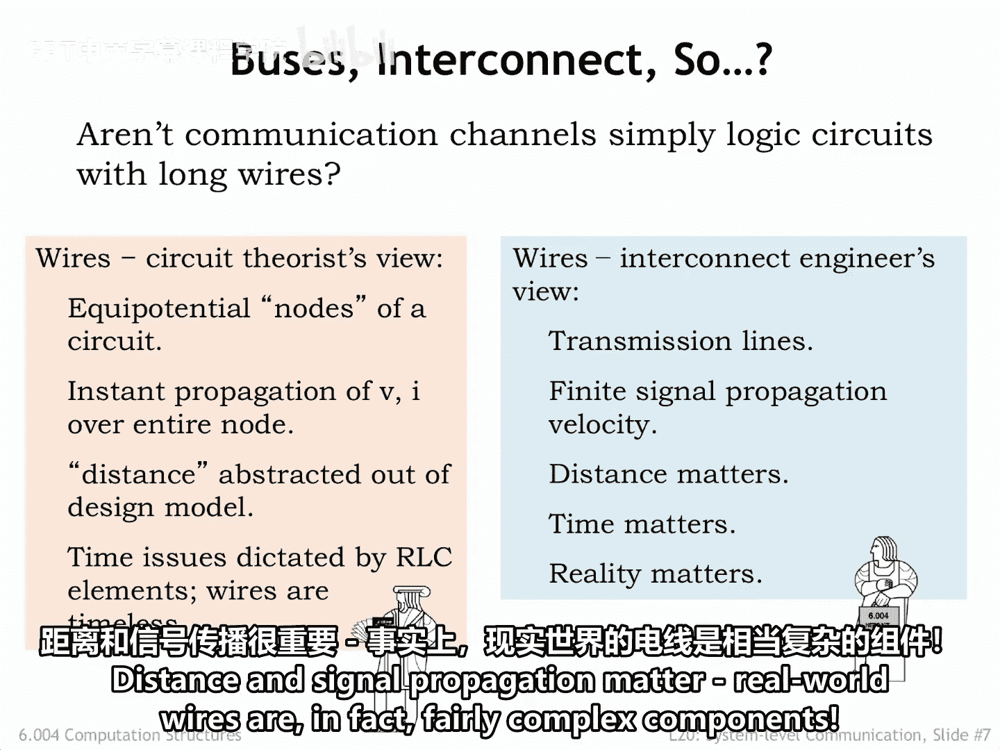
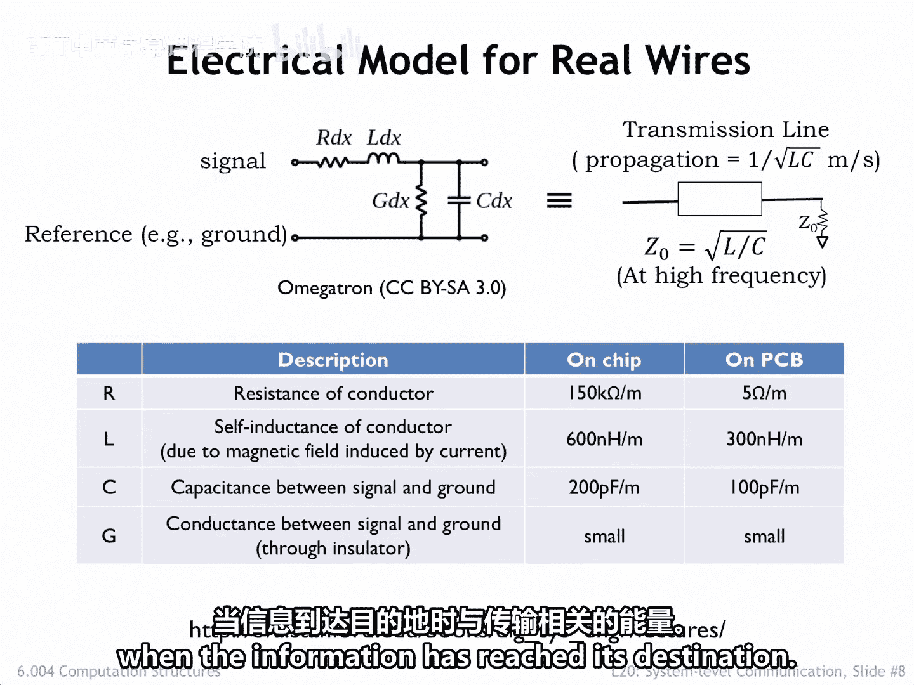
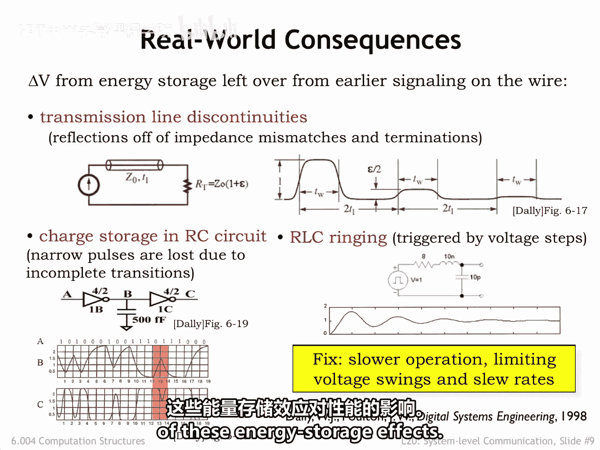
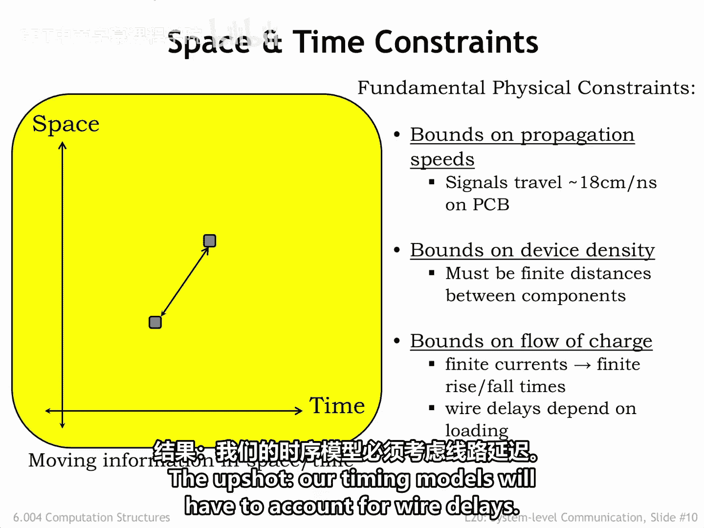
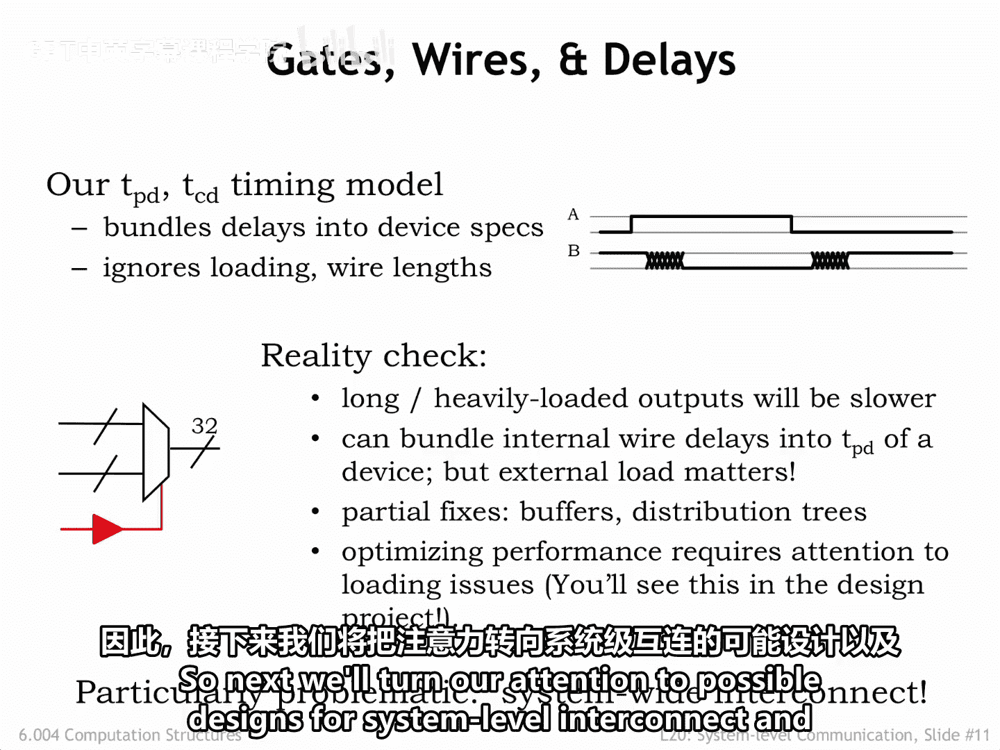

# 069：Wires（导线）🚀

在本节课中，我们将要学习数字系统中一个看似简单但至关重要的组成部分：导线。我们将探讨为什么在高速电路中，导线不能仅仅被视为理想的连接点，以及如何正确地建模和分析它们的行为，以确保系统可靠运行。

---

## 导线：不仅仅是连接点

构建一个通信通道有多难？它们不就是从一个组件连接到另一个组件的长导线构成的逻辑电路吗？

电路理论家会告诉你，原理图中的导线旨在表示电路的等电位节点，用于连接组件端子。在这个简单的模型中，导线上所有点的电压都相同，并且一个组件端子上的任何电压变化都会瞬间传播到连接在同一导线上的其他组件端子。

距离的概念在我们的电路模型中被抽象掉了。端子要么通过导线连接，要么没有。如果需要考虑电阻、电容和电感，可以在电路模型中添加必要的组件。导线本身是无时间概念的。它们用于显示组件如何连接，但它们本身不是组件。

事实上，当导线上的电压变化率与电磁波沿导线传播所需的时间相比很慢时，将导线视为等电位节点是一个非常可行的模型。

---

## 高速信号与传输线理论

随着集成电路技术的进步，电路速度不断提高，这个经验法则开始在逻辑电路中失效，因为组件之间的距离最多只有几十英寸。

实际上，自19世纪末以来，人们就知道电压电平的变化需要有限的时间才能沿导线传播。奥利弗·亥维赛是一位自学成才的英国电气工程师，他在19世纪80年代描述了一组电报方程，用于解释信号如何沿导线传播。利用这些方程，他能够将当时新的大西洋电报电缆的传输速率提高10倍。

我们现在知道，对于高速信号传输，我们必须将导线视为**传输线**，我们将在接下来的几张幻灯片中详细讨论。在这个领域，如果我们想正确预测电路的性能，组件之间的距离以及导线的长度就至关重要。距离和信号传播很重要。

---

## 真实导线的电气模型

现实世界中的导线实际上是相当复杂的组件。

上图是一个真实导线无限小段的电气模型。实际的导线可以通过想象许多个这样的模型首尾相连来正确建模。信号，即导线上的电压，是相对于参考节点测量的，参考节点也在模型中显示。

有四个参数表征导线的行为：
*   **R** 表示导体的电阻。对于印刷电路板上的布线，它通常可以忽略不计，但对于长导线和集成电路，它可能很重要。
*   **L** 表示导体的自感，它表征当流过导线的电流变化时，导线的磁场会吸收多少能量。
*   导体和参考节点之间由某种绝缘体隔开，这可能只是空气，从而形成一个电容为 **C** 的电容器。
*   最后，电导 **G** 表示通过绝缘体泄漏的电流，通常这个值非常小。

表格显示了我们在集成电路内部和印刷电路板上可能测量到的导线参数值。

---

## 传输线的特性

当我们分析沿导线发送信号时会发生什么，我们可以使用一个称为**传输线**的单一组件来描述导线的行为，该组件具有一个特征性的复值阻抗 **Z**。

在高速信号频率下，以及在芯片或电路板上（如现代数字系统中可能找到的）的距离上，传输线是无损耗的，电压变化（阶跃）以 `1 / sqrt(L*C)` 米每秒的速率沿导线传播。

使用此处给出的印刷电路板数值，特征阻抗约为 **50 欧姆**，传播速度约为 **18 厘米/纳秒** 或 **7 英寸/纳秒**。

为了将数字信息从一个组件发送到另一个组件，我们改变连接导线上的电压，该电压阶跃从发送方传播到接收方。我们必须注意该能量前沿到达导线末端时会发生什么。如果我们不做任何吸收该能量的措施，守恒定律告诉我们，它会作为回波从导线末端反射回来，很快我们的导线上就会充满先前电压阶跃的回波。

为了防止这些回波，我们必须用一个与传输线特征阻抗匹配的接地电阻来**端接**导线。如果信号可以双向传播，我们将在两端都需要端接。

这个模型告诉我们的是，将信息从一个组件传输到另一个组件需要时间，并且我们必须小心地在信息到达目的地时吸收与传输相关的能量。

---

## 不良布线设计的后果

有了这些理论背景，我们现在可以描述信号导线设计不良所带来的现实后果。

关键观察是，除非我们小心，否则先前传输的能量可能残留下来，从而**破坏当前的传输**。解决这个问题的通用方法是**时间**，即给予传输值更长的时间来稳定到无干扰的值。但在高性能系统中，减慢速度通常不可接受，因此我们必须尽力最小化这些能量存储效应。

以下是几种常见问题：

*   **反射**：如果端接不完全正确，任何到达导线末端的电压阶跃都会产生一些反射，这些回波需要一段时间才能消失。实际上，能量会从任何阻抗不连续处反射，这意味着我们希望尽量减少此类不连续点的数量。

*   **传播延迟与信号完整性**：我们需要小心地留出足够的时间让信号达到有效的逻辑电平。下图中的阴影区域显示了导线A从1到0再到1的转换。第一个反相器试图从初始输入转换到0产生1输出，但在输入再次改变之前，没有足够的时间在Y或B上完成转换。这导致导线C（第二个反相器的输出）上出现一个窄脉冲。我们看到，当信号到达C时，A上的比特序列已经被破坏。这个问题是由反相器之间导线电容中的能量存储引起的，这将限制我们运行逻辑的速度。

*   **振铃**：下图显示了当大的电压阶跃触发导线振荡（称为**振铃**）时会发生什么，这是由于导线的电感和电容造成的。图表显示，需要一些时间振铃才会衰减到我们拥有可靠数字信号的程度。可以通过将电压阶跃分散在更长的时间上来减小振铃。

这里的核心思想是，通过密切关注我们的布线设计和将信息放到导线上的驱动器，我们可以最小化这些能量存储效应对性能的影响。

---

## 从理论到系统设计

好了，电气工程知识就讲这么多。假设我们的系统中有一些信息。如果我们随着时间的推移保存该信息，我们称之为**存储**。如果我们将该信息发送到另一个组件，我们称之为**通信**。

在现实世界中，我们已经看到通信需要时间，我们必须在系统时序中为此预算时间。我们的工程设计必须适应传播速度、组件之间的距离以及我们可以在不触发上一张幻灯片中看到的效果的情况下改变导线电压的速度的基本限制。

结果是，我们的时序模型必须考虑**导线延迟**。

在本课程的第一部分，我们有一个简单的时序模型，为逻辑门输出反映门输入变化所需的时间分配了一个固定的传播延迟 `TPD`。我们需要改变我们的时序模型，以考虑将逻辑门输出传输到下一个组件的延迟。

时序将是**负载相关**的，因此连接到许多其他逻辑门输出的信号将比仅连接到一个其他门的信号更慢。Jde 模拟器在计算门的有效传播延迟时，会考虑门输出信号的负载。

我们可以通过减少输出信号上的负载数量，或者使用专门设计的称为**缓冲器**的门（图中红色显示的组件）来驱动具有非常大负载的信号，从而改善传播延迟。优化电路性能时的一项常见任务是追踪负载重（因此速度慢）的导线，并重新设计电路以使它们更快。

今天，我们关注的是用于在系统级别连接组件的导线。因此，接下来我们将把注意力转向系统级互连的可能设计以及可能出现的问题。

---

## 总结

本节课中，我们一起学习了导线在数字系统中的关键作用。我们了解到，在高速设计中，导线不能被视为理想的零延迟连接，而必须建模为具有电阻、电感和电容的**传输线**。信号沿导线传播需要时间，其速度由 `1 / sqrt(L*C)` 决定。不良的布线设计会导致**反射**、**传播延迟**和**振铃**等问题，从而破坏信号完整性。为了确保可靠通信，我们需要使用匹配电阻进行**端接**，并考虑**负载相关**的延迟。在系统设计中，优化导线性能（例如使用缓冲器）对于实现高性能至关重要。