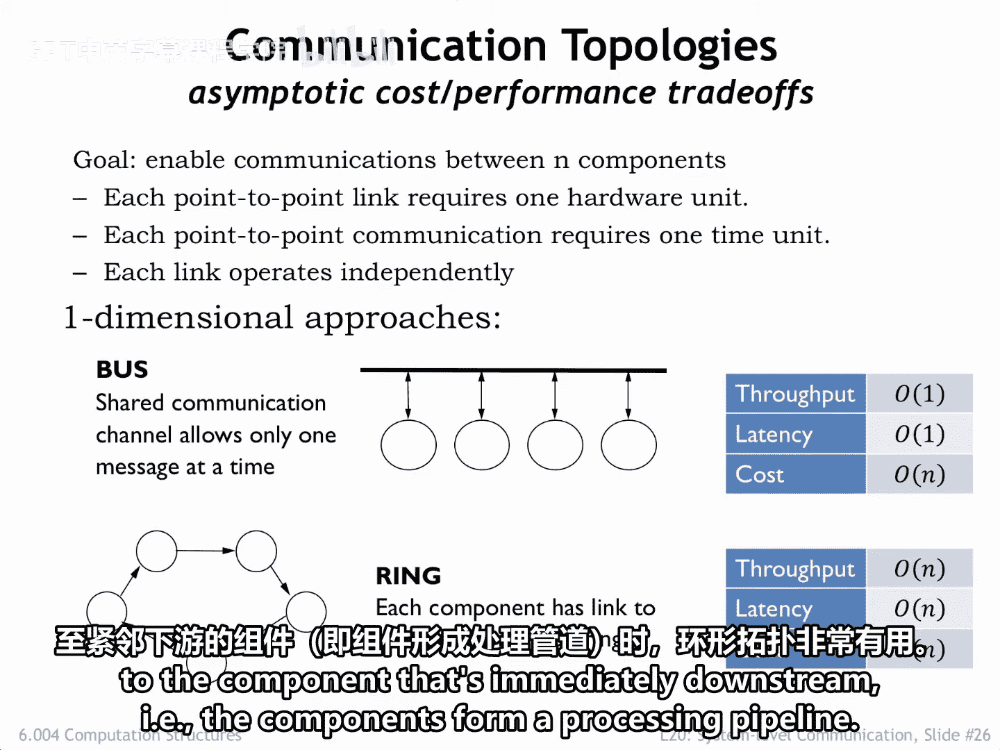
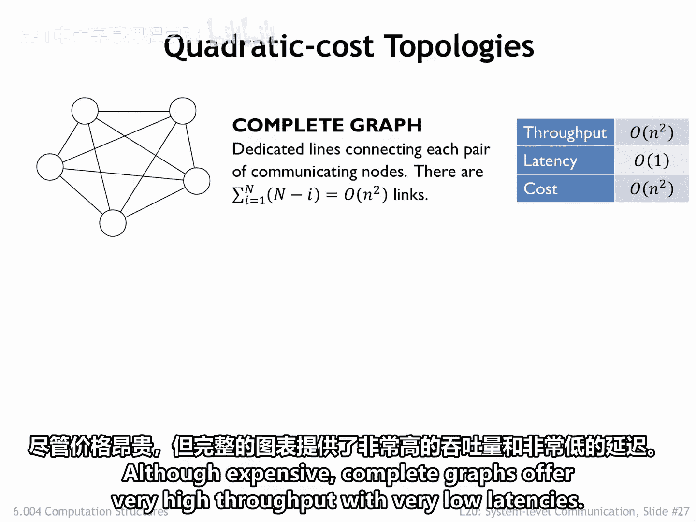
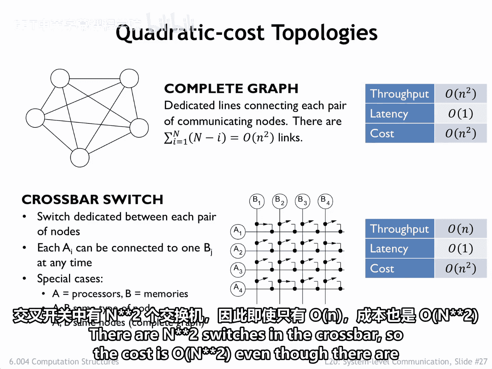
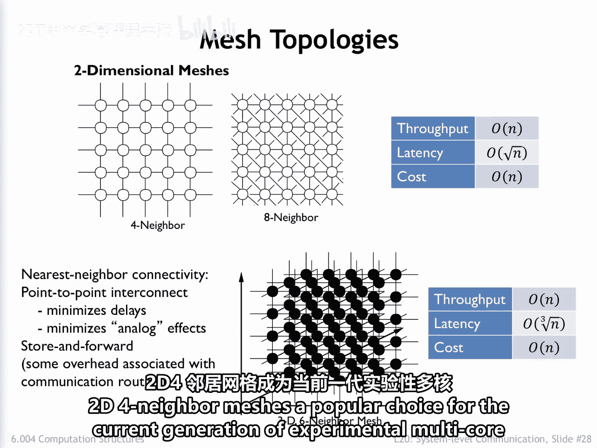
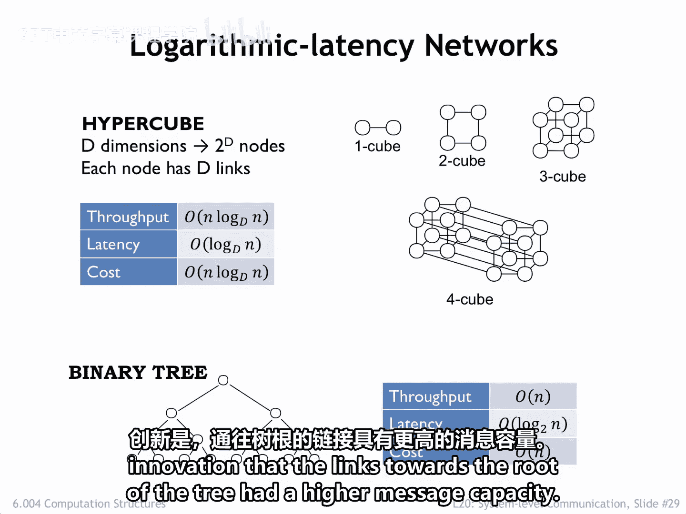
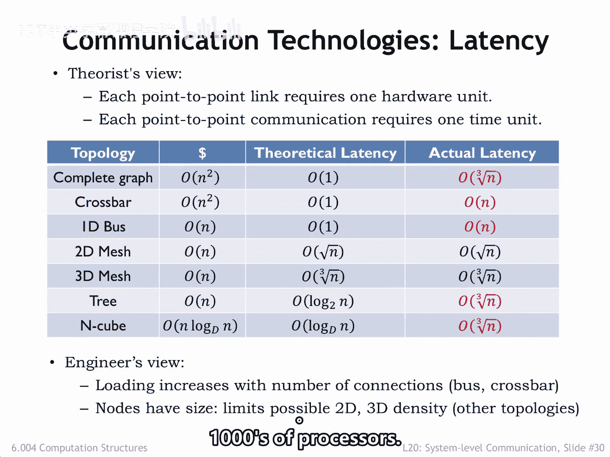
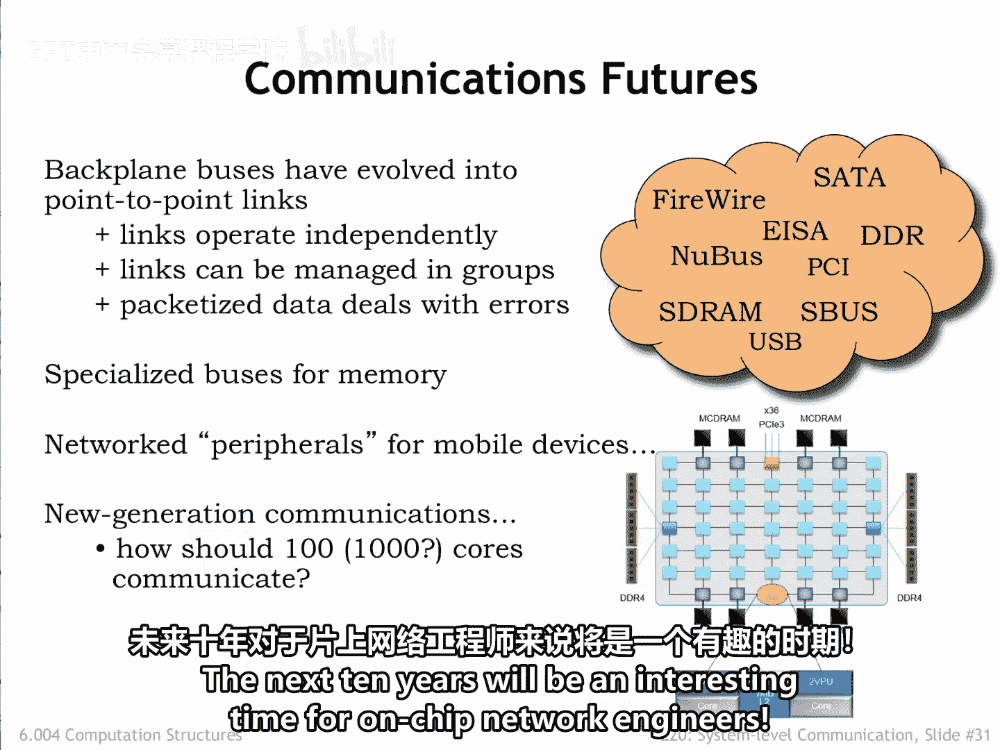

# 073：6.4 通信拓扑结构 🧠

在本节课中，我们将学习如何为需要相互通信的终端组件（例如多核芯片上的CPU）设计最佳的系统级互连网络。我们将分析不同网络拓扑结构在吞吐量、延迟和硬件成本方面的表现。

---

上一节我们讨论了系统级互连的基础，本节中我们来看看几种具体的通信网络拓扑结构。我们将使用点对点链路构建网络，并假设每条链路的硬件成本为1个单位，传输一条消息需要1个单位时间，且不同链路可以并行工作。

## 总线拓扑

总线是我们讨论的基线方案，所有组件共享一条通信通道。

*   **吞吐量**：由于只有单一通道，吞吐量为 **1条消息/单位时间**。
*   **延迟**：任意两个组件间传递消息需要 **1个单位时间**。
*   **硬件成本**：每个组件都需要一个到共享通道的接口，总成本为 **O(N)**。

## 环形拓扑

在环形网络中，每个组件只向其一个邻居发送消息，链路首尾相连构成环。

*   **总链路数**：**N** 条。
*   **吞吐量与成本**：均为 **O(N)**。
*   **最坏情况延迟**：消息可能需要穿越 **N-1** 条链路才能到达紧邻的上游邻居，因此延迟为 **O(N)**。

环形拓扑适用于延迟不重要，或大多数消息都发送给紧邻下游组件（即组件构成处理流水线）的场景。

## 全连接拓扑

最通用的网络拓扑是每个组件都与其他所有组件有直接链路。

*   **总链路数**：**O(N²)** 条。
*   **吞吐量与成本**：均为 **O(N²)**。
*   **延迟**：每个目的地都可直接访问，延迟为 **1个单位时间**。

尽管成本高昂，但全连接图能提供极高的吞吐量和极低的延迟。

## 交叉开关拓扑

交叉开关是全连接图的一个变体，特定的行和列可以连接起来，在特定的A、B组件间形成链路，但限制是每行每列在每个时间单位只能传输一条消息。

假设第一行和第一列连接到同一个组件，以此类推。也就是说，示例中的交叉开关用于连接四个组件。

*   **每单位时间传递的消息数**：**O(N)** 条。
*   **延迟**：**1个单位时间**。
*   **成本**：交叉开关中有 **N²** 个开关，因此成本为 **O(N²)**，尽管实际链路只有 **O(N)** 条。

## 网格拓扑

在网格网络中，组件连接到固定数量的相邻组件，形成二维或三维阵列。

*   **总链路数**：与组件数量成正比，为 **O(N)**。
*   **吞吐量与成本**：均为 **O(N)**。
*   **最坏情况延迟**：与网格边长成正比。对于二维网格，延迟为 **O(√N)**；对于三维网格，延迟为 **O(³√N)**。

有序的布局、恒定的单节点硬件成本以及适中的最坏情况延迟，使得二维四邻接网格成为当前实验性多核处理器的热门选择。

## 超立方体与树形拓扑

超立方体和树形网络提供了对数级延迟 **O(log N)**，对于大规模N值，这可能比网格网络更快。

以下是各种拓扑结构的理论延迟总结：

作为一个现实检验，必须认识到在我们这个三维世界中，组件间最坏情况距离的理论下限是 **O(³√N)**。在二维布局中，最坏情况距离是 **O(√N)**。由于我们知道消息传输时间与传输距离成正比，因此应该修改我们的延迟计算以反映这一物理约束。

注意，总线和交叉开关涉及N个连接到单一链路的连接。因此，这里的延迟下限需要反映每个连接增加的电容负载。

**胜出者**：网格网络避免了随着连接组件数量增长而需要更长导线的问题，对于连接数千个处理器的高容量通信网络来说，似乎是一个有吸引力的替代方案。

---

## 总结

本节课中我们一起学习了系统级互连的各种通信拓扑结构。

总结我们的讨论：点对点链路如今已普遍用于系统级互连，因此我们的系统比以往更快、更可靠、更节能、更小巧。多信号并行总线仍用于与存储器之间的极高带宽连接，并通过大量精心的工程设计来避免早期总线实现中出现的问题。无线连接普遍用于将移动设备连接到附近的组件，并且在如何让移动设备发现附近的外设并自动连接方面，已有许多有趣的研究工作。

即将到来的多核芯片时代将拥有数十到数百个处理核心。目前有大量正在进行的研究，旨在确定哪种通信拓扑结构能提供高通信带宽和低延迟的最佳组合。未来十年，对于片上网络工程师来说，将是一个激动人心的时期。

