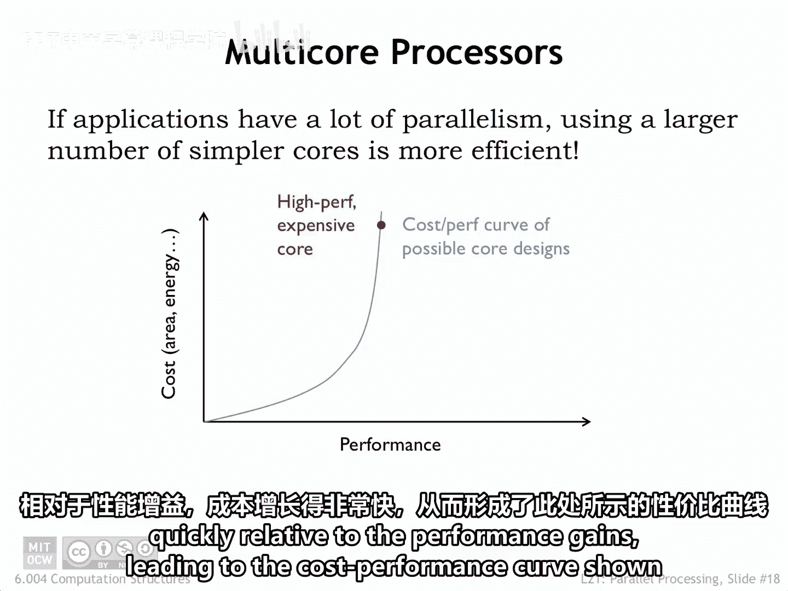
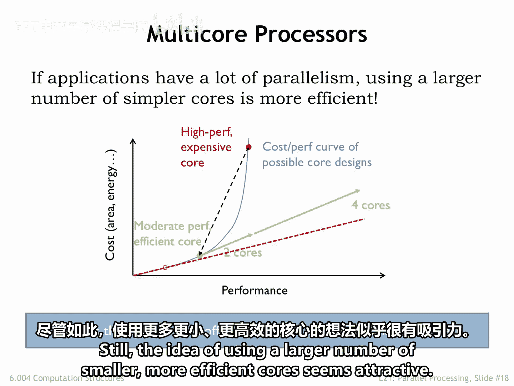
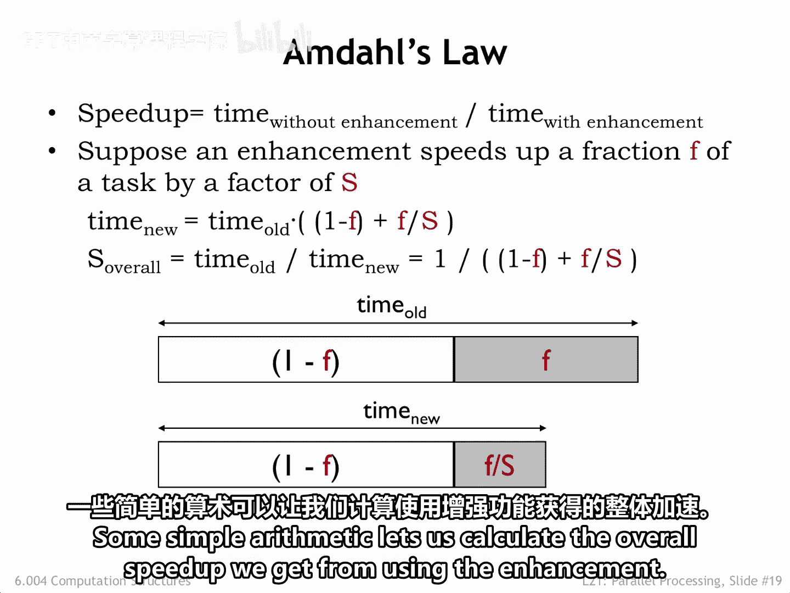
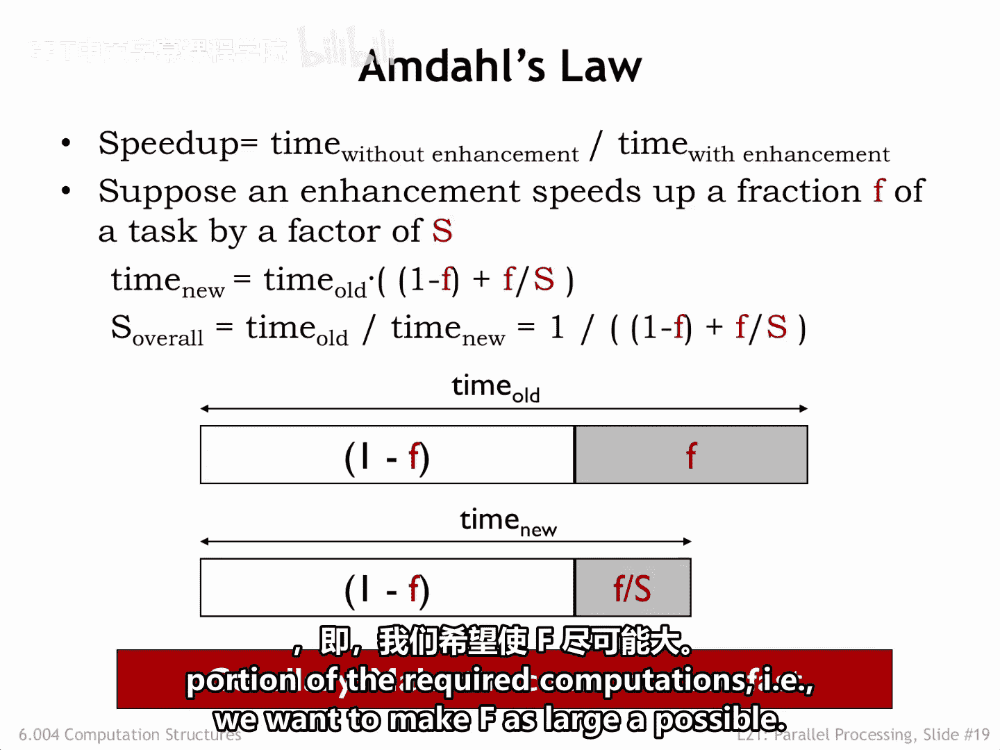
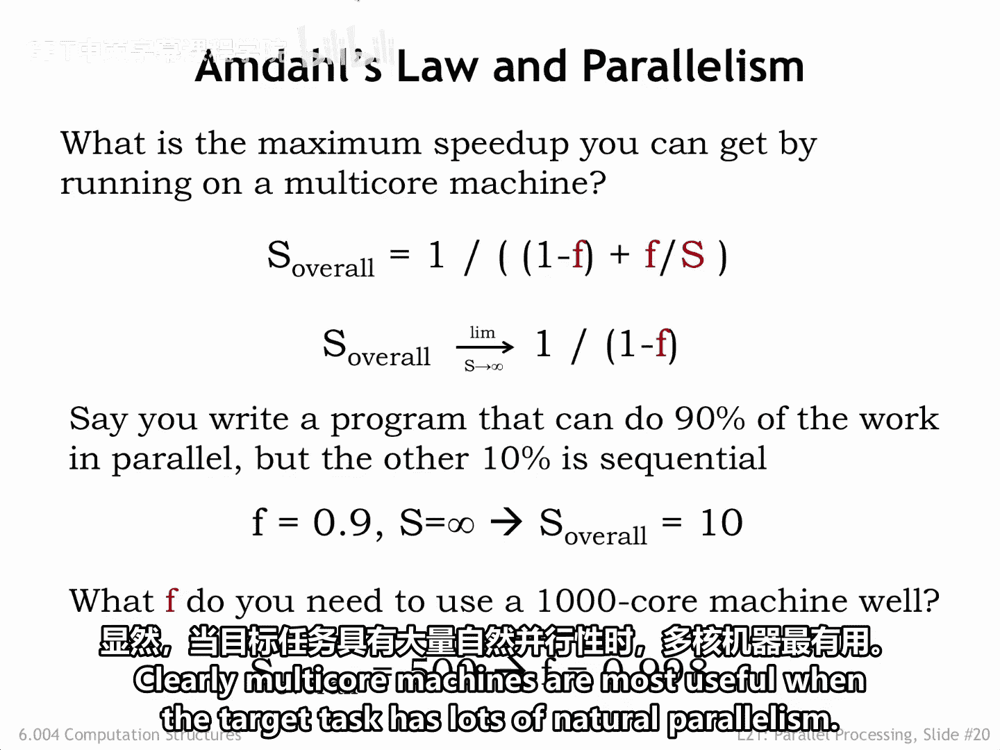
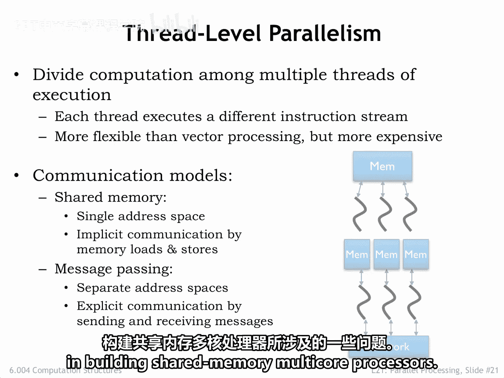

# 076：6.4 线程级并行 🧵

在本节课中，我们将要学习线程级并行（TLP）的概念。我们将探讨如何通过使用多个更小、更高效的核心来提升计算性能，并理解其背后的理论限制和实际应用场景。

## 概述

在讨论乱序超标量流水线CPU时，我们曾指出其成本相对于性能提升增长得非常快，形成了下图所示的成本-性能曲线。

沿着这条曲线向下移动，我们可以找到更高效的架构，例如，以四分之一的成本获得一半的性能。当我们的应用程序包含可以并行执行的独立计算时，我们或许能够使用两个核心来提供与原来昂贵核心相同的性能，但成本却低得多。如果可用的并行性允许我们使用更多核心，我们将看到性能提升与成本增加之间呈线性关系。当然，关键在于所需计算能够被划分为多个任务，这些任务可以独立运行，几乎或完全不需要任务间的通信或协调。

## 核心成本与数量的权衡

核心成本与核心数量之间的最佳权衡点是什么？

如果我们的计算可以任意划分而不产生额外开销，那么我们将继续沿着曲线向下移动，直到找到以最低成本提供所需性能的成本-性能点。

实际上，将计算分配到多个核心确实会涉及一些开销。例如，分发数据和代码，然后收集和汇总结果。因此，找到最佳权衡点更为困难。尽管如此，使用大量更小、更高效核心的想法似乎很有吸引力。许多应用程序既包含可以并行执行的计算，也包含无法从并行中受益的计算。

## 阿姆达尔定律

为了理解我们可能从并行化中获得的加速，计算机科学家吉恩·阿姆达尔在1967年提出的计算模型非常有用，现在被称为阿姆达尔定律。

假设我们正在考虑一项增强措施，它可以将手头任务的某个比例 **F** 加速 **S** 倍。

如图所示，任务的灰色部分现在所需的时间是原来的 **F / S**。

通过一些简单的算术，我们可以计算出使用该增强措施后获得的总体加速。

我们可以得出的一个结论是，对所需计算中占比较大部分进行加速的增强措施将带来最大的收益。换句话说，我们希望使 **F** 尽可能大。

如果我们有许多核心可以用来加速任务的并行部分，我们能期望的最佳加速是多少？

以下是基于 **F** 和 **S** 的加速公式，其中 **F** 是任务的并行部分比例。

如果我们假设任务的并行部分可以通过使用越来越多的核心而无限加速，我们会发现可能的最佳加速是 **1 / (1 - F)**。

例如，你编写了一个程序，其90%的工作可以并行完成，但另外10%必须顺序执行。那么，无论你拥有多少核心，可以实现的最佳总体加速是10倍。

反过来思考这个问题，假设你有一台1000核心的机器，你希望用它来在目标应用上实现500倍的加速。为了达到这个目标，你需要能够将99.8%的计算并行化。

显然，当目标任务具有大量天然的并行性时，多核机器最为有用。

## 线程级并行架构

使用多个独立的核心来执行并行任务被称为线程级并行，其中每个核心执行一个单独的计算线程。线程是独立的程序，因此其执行模型可能比向量机提供的锁步执行更为灵活。

当线程数量较少时，你通常会看到核心共享一个公共的主存储器，允许线程通过共享公共地址空间进行通信和同步。我们将在下一节进一步讨论这一点。这是当前多核处理器（通常有2到12个核心）所采用的方法。

当核心数量达到数十或数百个时，共享内存会成为一个真正的瓶颈，因为它们会迅速耗尽可用的内存带宽。在这些架构中，线程使用通信网络来回传递消息进行通信。我们在之前的讲座中讨论过可能的网络拓扑结构。

一种经济高效的片上方法是使用最近邻网状网络，它支持许多并行的点对点通信，同时仍然允许任意两个核心之间的多跳通信。

消息传递也用于计算集群中，许多普通CPU协作处理大型任务。有标准化的消息传递接口（MPI），以及专门的、具有极高吞吐量和低延迟的消息传递通信网络（例如InfiniBand），使得构建高性能计算集群变得容易。

在接下来的几节中，我们将更仔细地研究构建共享内存多核处理器所涉及的一些问题。

## 总结

本节课中，我们一起学习了线程级并行的基本原理。我们探讨了通过多核设计提升性能与成本效益的权衡，理解了阿姆达尔定律对并行加速的理论限制，并介绍了共享内存与消息传递这两种主要的线程级并行架构。核心要点是，并行化的有效性高度依赖于任务本身可被并行化的比例，而架构的选择则取决于核心数量和应用对通信的需求。