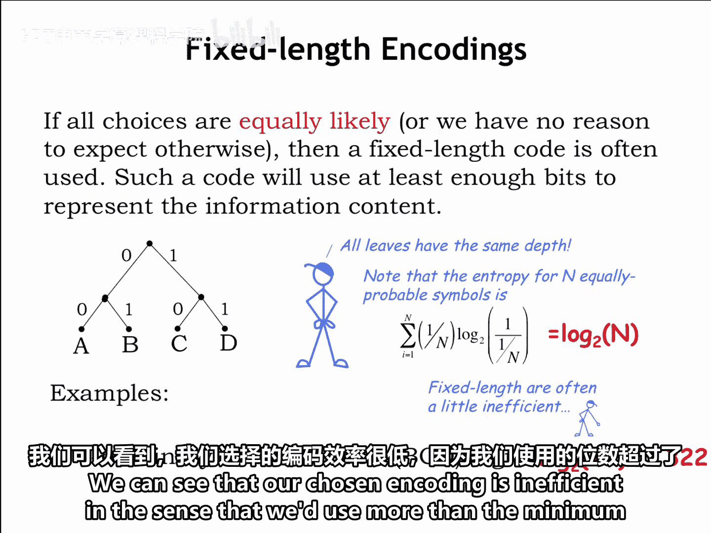
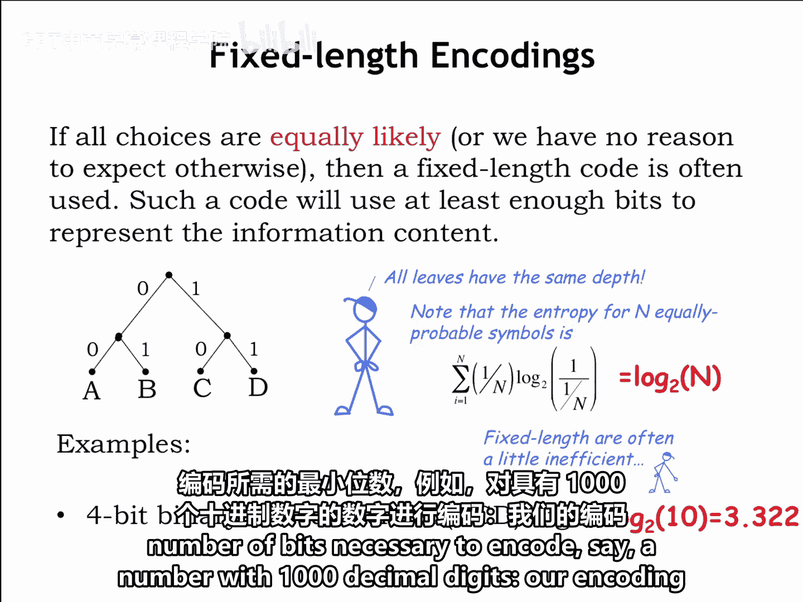
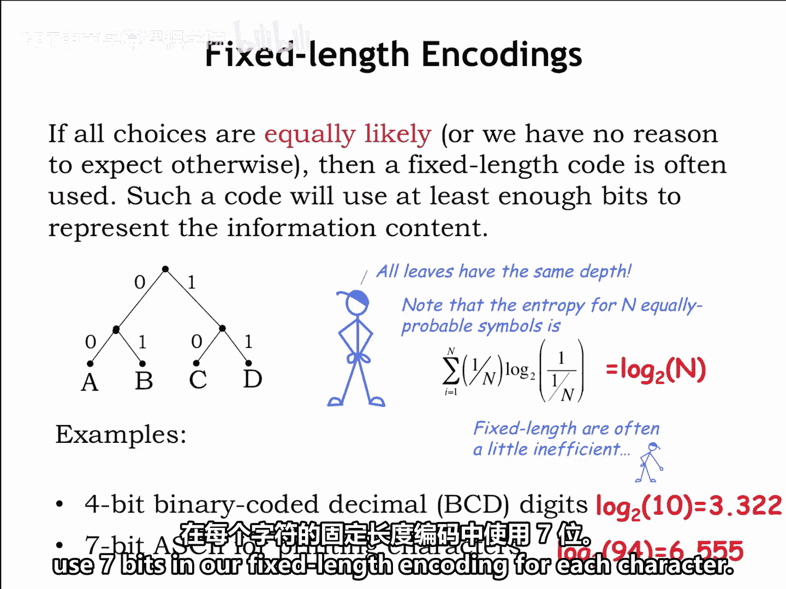
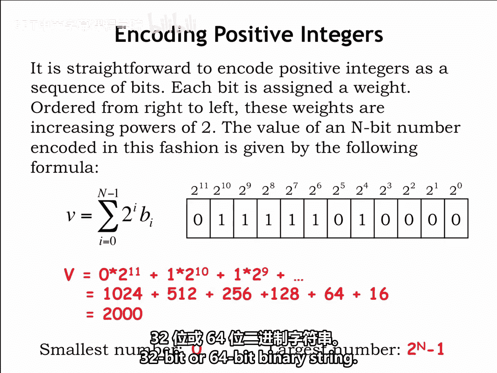
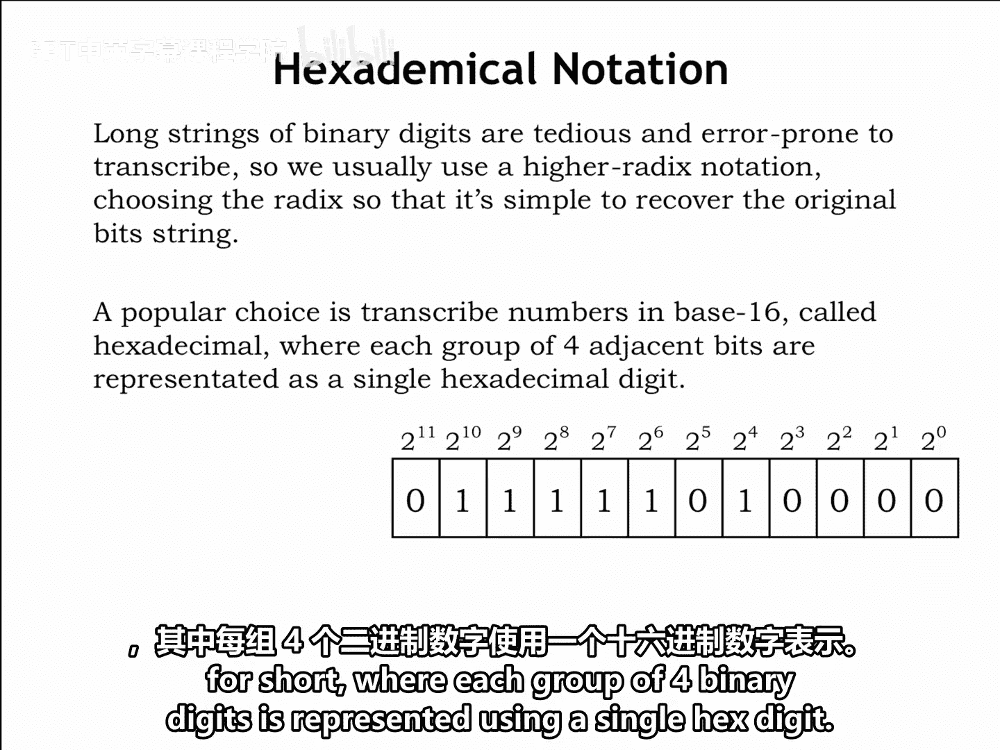
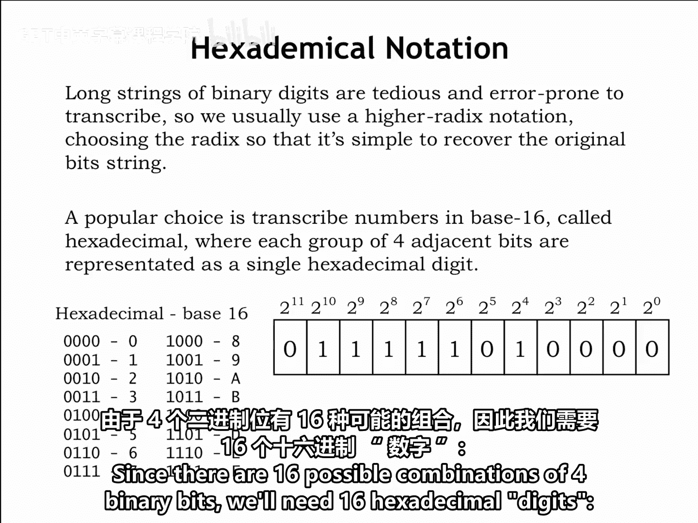
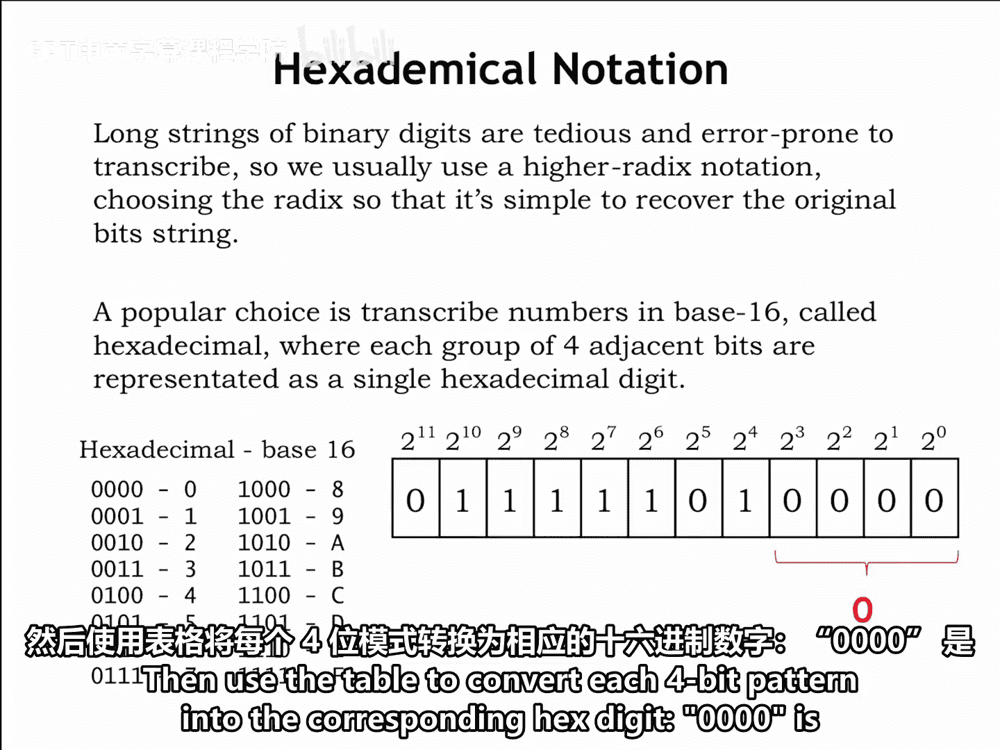
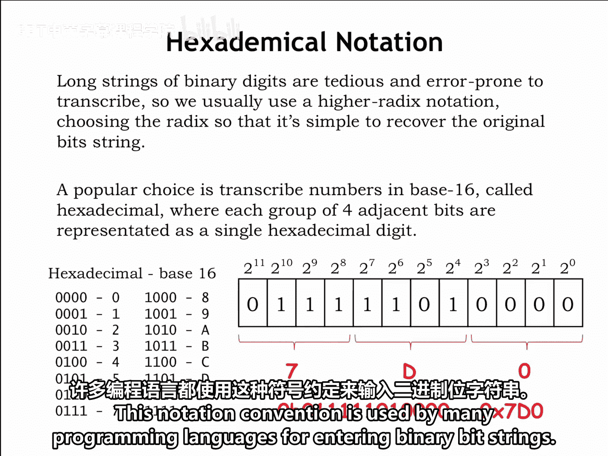

# 【数字系统与计算机架构P1 6.004 2017】麻省理工学院—中英字幕 p05 1.2.5 Fixed-length Encodings -BV1DZ421E7Yz_p5-

If the symbols we are trying to encode occur with equal probability。

 or if we have no a priori reason to believe otherwise。

 then we'll use a fixed length encoding where all leaves in the encoding's binary tree are the same distance from the root。

Fix length encodings have the advantage of supporting random access。

 where we can figure out the n symbol of the message by simply skipping over the required number of bits。

 For example， in a message encoded using the fixed length code shown here if we wanted to determine the third symbol in the encoded message we would skip the four bits used to encode the first two symbols and start decoding with the fifth bit of the message。

Mr。 Blue is telling us about the entropy for random variables that have n equally probable outcomes。

In this case， each element of the sum in the entropy formula is simply1 over n times log base 2 of n。

 and since there are n elements in the sequence， the resulting entropy is just log base 2 of n。

Let's look at some simple examples in binary coded decimal。

 each digit of a decimal number is encoded separately。Since there are 10 different decimal digits。

 we'll need to use a four bit code to represent the 10 possible choices。

The associated entropy is log base 2 of 10， which is 3。322 bits。

We can see that our chosen encoding is inefficient in the sense that we'd use more than the minimum number of bits necessary to encode。

 say a number with 1000 decimal digits， our encoding would use 4，000 bits。

 although the entropy suggests we might be able to find a shorter encod， say 3400 bits。

 for messages of length 100th。

Another common encoding is ASI， the code used to represent English text and computing and communication。

AsI has 94 printing characters， so the associated entropy is log based2 of 94， or 6。555 bits。

So we would use seven bits in our fixed length and codingding for each character。

One of the most important encodings is the one we use to represent numbers Let's start by thinking about a representation for unsigned integers。

 numbers starting at zero and counting up from there。

Drawing on our experience with representing decimal numbers， in other words。

 representing numbers in base 10 using the 10 decimal digits。

 our binary representation of numbers will use a base 2 representation using the two binary digits。

The formula for converting an n bit binary representation of a numeric value into the corresponding integer shown below。

Just multiply each binary digit by its corresponding weight in the base 2 representation。For example。

 here's a 12 bit binary number with the weight of each binary digit shown above。

 we can compute its value as 0 times 2 to the 11th， plus 1 times 2 to the 10th， plus 1。

 times2 to the 9th and so on。Keeping only the non zero terms and expanding the powers of two gives us the sum 10。

24 plus 5，12 plus 256， plus 128 plus 64 plus 16。Which expressed in base 10 sums to the number 2000。

With this n bit representation， the smallest number that can be represented is0 when all the binary digits are 0。

 and the largest number is 2 to the n minus1 when all the binary digits are 1。

Many digital systems are designed to support operations on binary encoded numbers of the same fixed size。

 for example， choosing a 32 bit or a 64 bit representation。

 which means that they would need multiple operations when dealing with numbers too large to be represented as a single 32 bit or a 64 bit binary string。

Long strings of binary digits are tedious and error prone to transcribe。

 so let's find a more convenient notation。 Ily， one where will be easy to recover the original bit string without too many calculations。

A good choice is to use a representation based on adix that's some higher power of two。

 so each digit and a representation corresponds to some short， contiguous string of binary bits。

A popular choice these days is a Radix 16 representation called hexadeadecimal， or Hex for short。

 where each group of four binary digits is represented using a single hex digit。

Since there are 16 possible accommodations of four binary bits， we'll need 16 hexadecimal digits。

We'll borrow the 10 digits 0 through9 from the decimal representation and then simply use the first six letters of the alphabet A through F for the remaining digits。

The translation between four bit binary and hexadeciimmal is shown in the table to the left below。

To convert a binary number to hex， group the binary digits into sets of four。

 starting with a least significant bit， that's the bit with weight 2 to the zero。

Then use the table to convert each four bit pattern into the corresponding hex digit。

0000 is the hex digit 0， 1101 is the hex digit D， and 0111 is the hex digit 7。

The resulting hex representation is 7D0。To prevent any confusion。

 we'll use a special prefix 0x to indicate when a number is being shown in hex。

 so we'd write0x70 as the hex representation for the binary number 0111-11010000。

This notation convention is used by many programming languages for entering binary strings。

