# 【数字系统与计算机架构P1 6.004 2017】麻省理工学院—中英字幕 p09 1.2.9 Huffman Code -BV1DZ421E7Yz_p9-

Opttimal sounds pretty good。 Does that mean we can't do any better？ Well。

 not by encoding symbols one at a time。

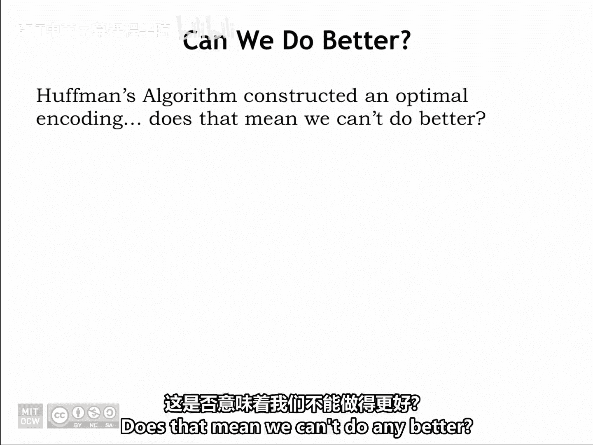

But if we want to encode long sequences of symbols。

 we can reduce the expected length of the encoding by working with， say。

 pairs of symbols instead of only single symbols。

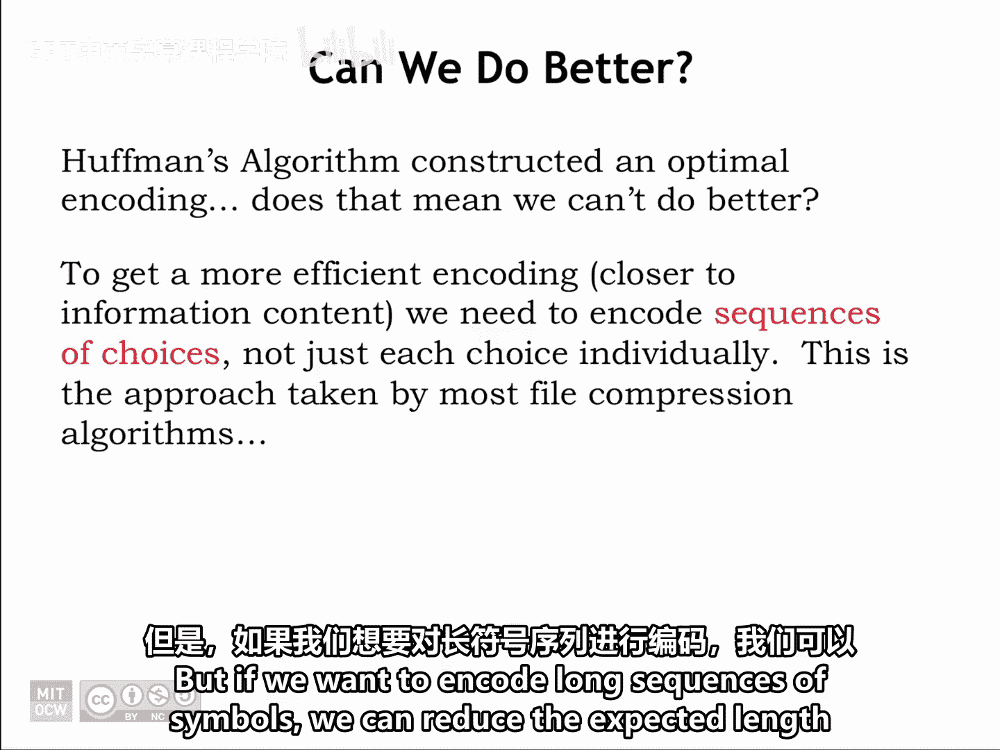

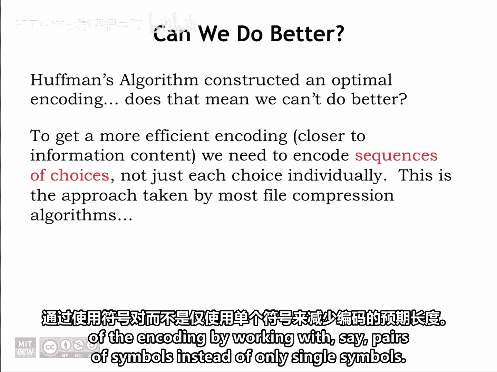

The table below shows the probability of pairs of symbols from our example。

 If we use Huffman's algorithms to build the optimal variable length code using these probabilities。

 it turns out that the expected length when encoding pairs is 1。646 B per symbol。

 This is a small improvement on the 1。667 B per symbol， when encoding each symbol individually。

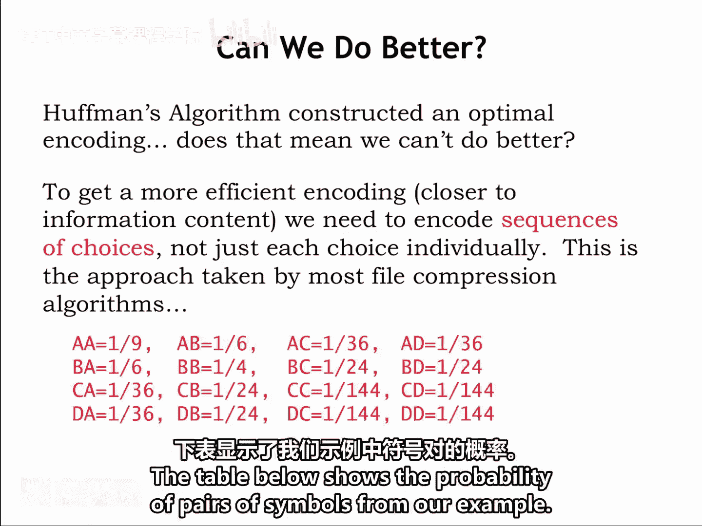

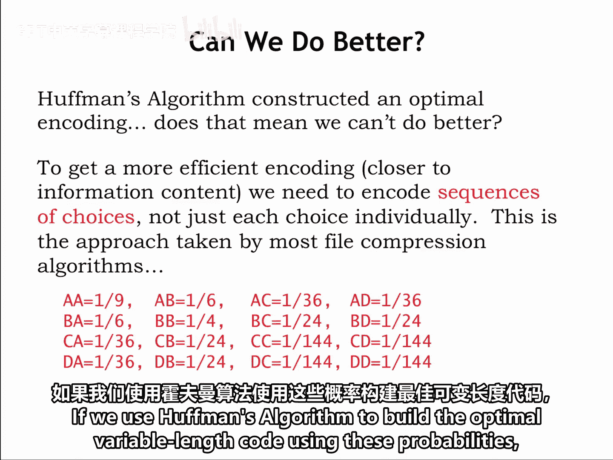

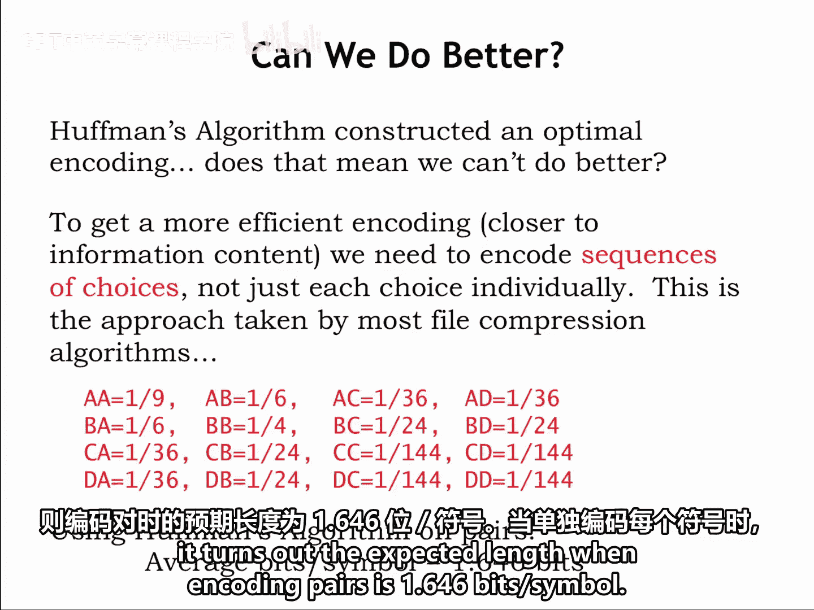

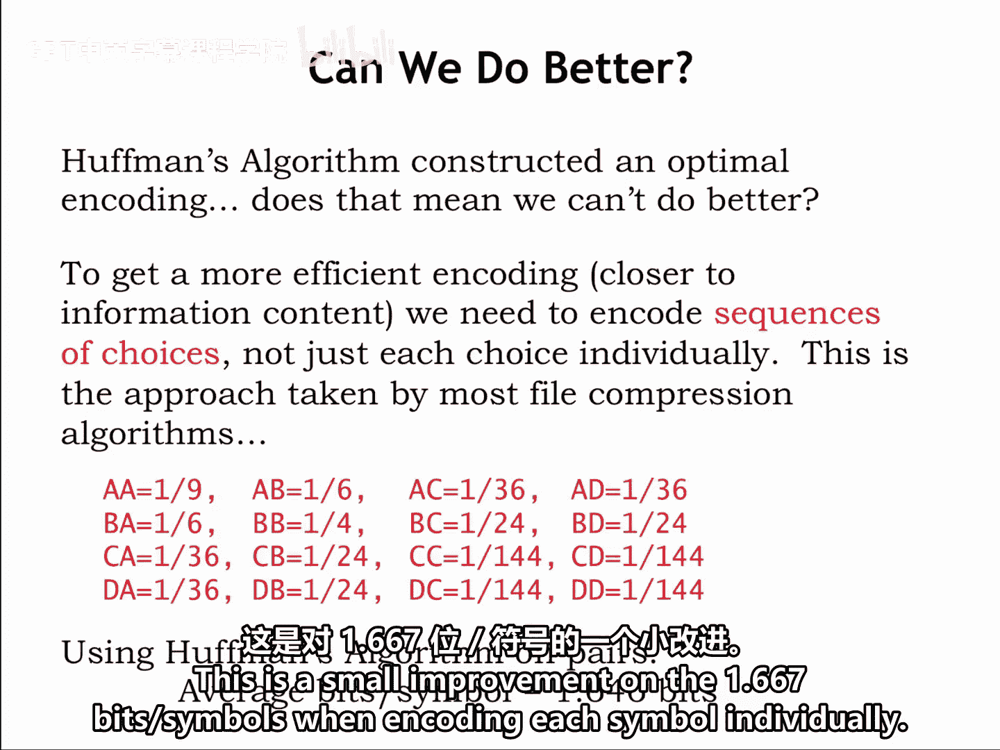

And we do even better if we encoded sequences of link 3 and so on。

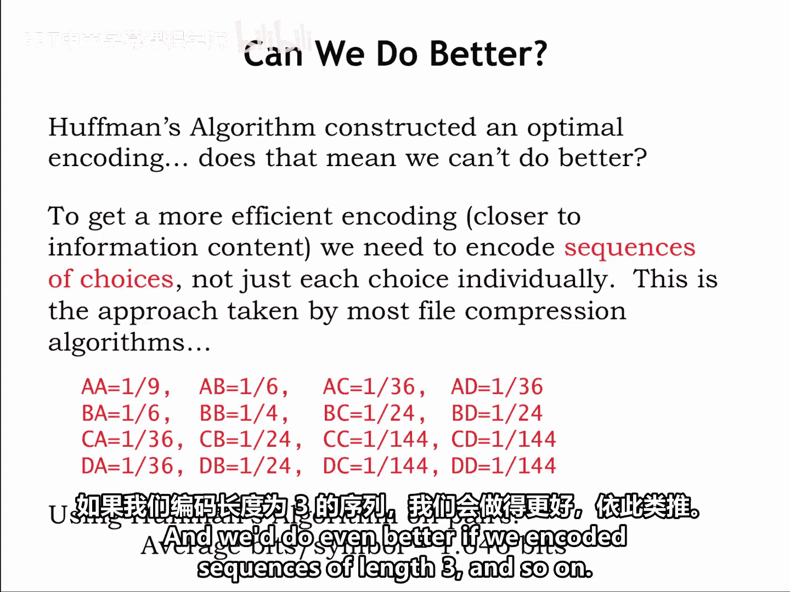

Modern file compression algorithms use an adaptive algorithm to determine on the fly which sequences occur frequently and hence should have short encodings。

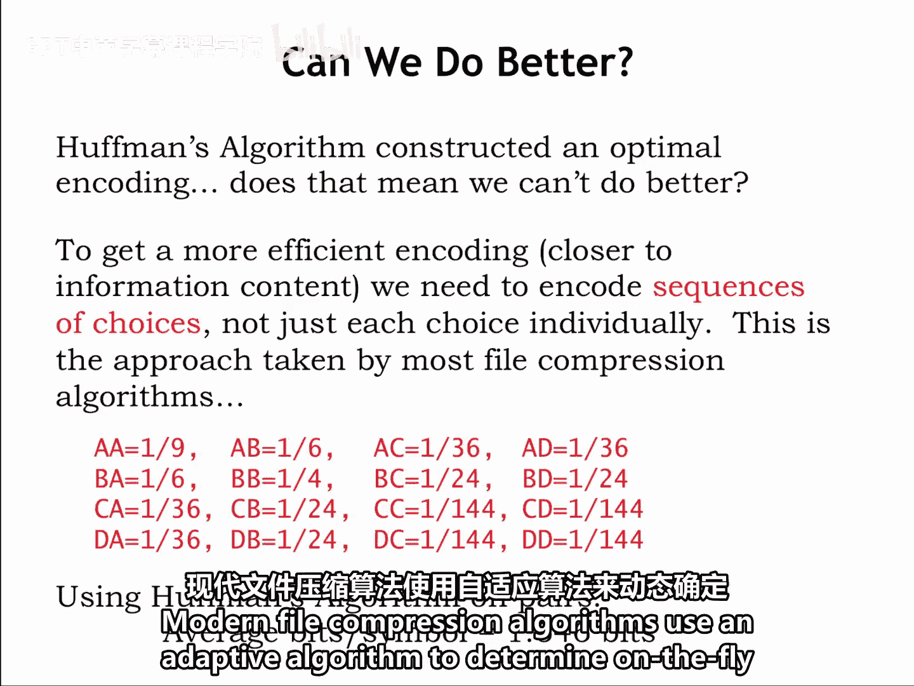

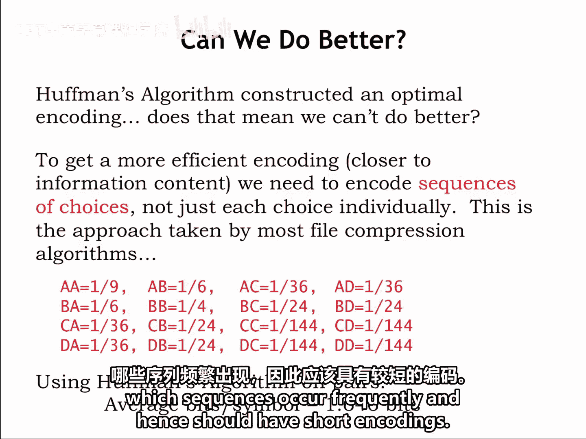

They work quite well when the data has many repeating sequences。 For example， natural language data。

 where some letter accommodations or even whole words occur again and again。

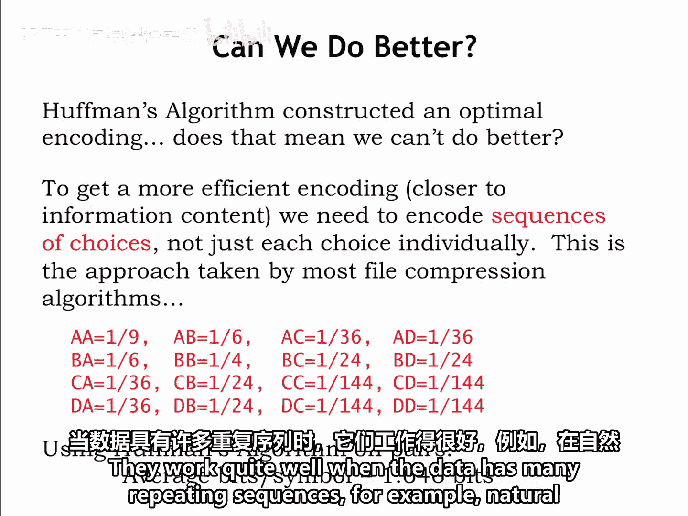

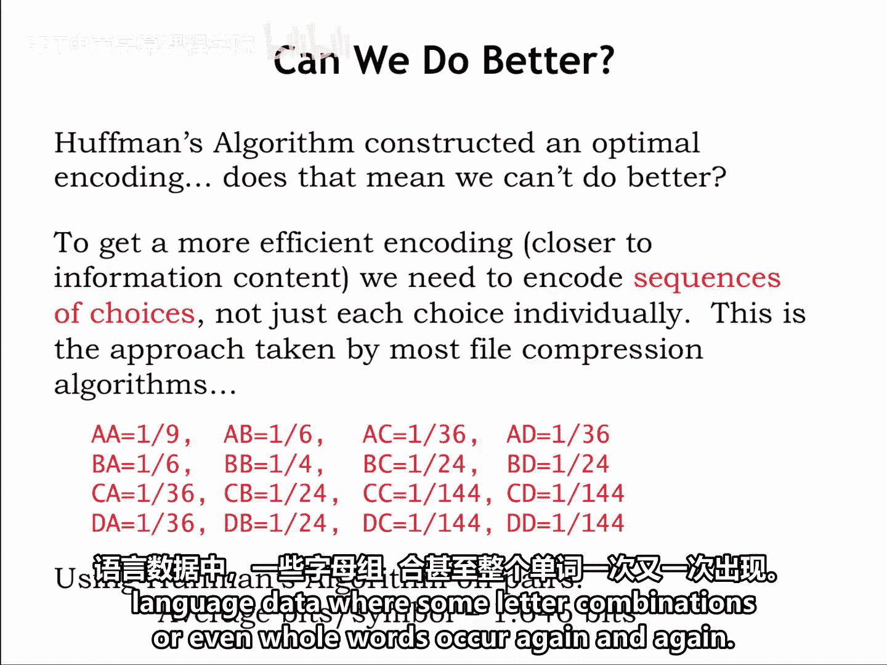

Compression can achieve dramatic reductions from the original file size。

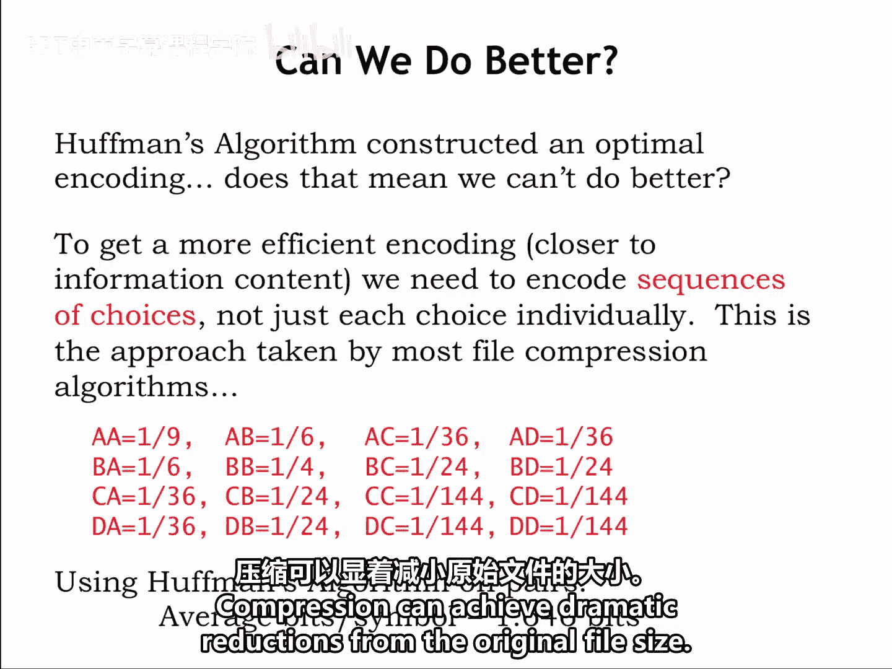

If you'd like to learn more， look up LZW and Wikipedia to read about the Leple Ziv Welch data compression algorithm。

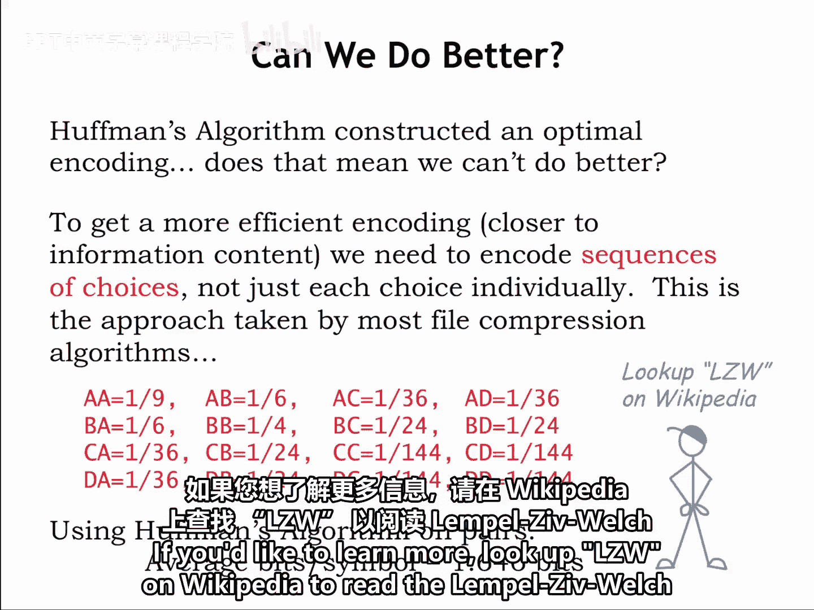