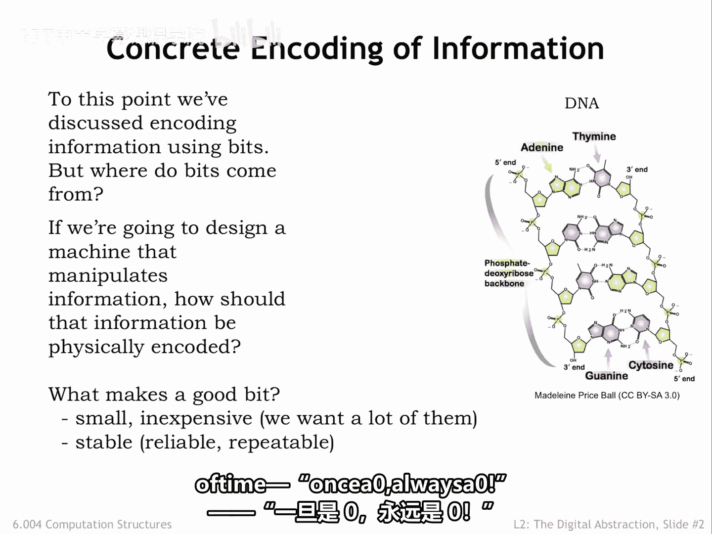
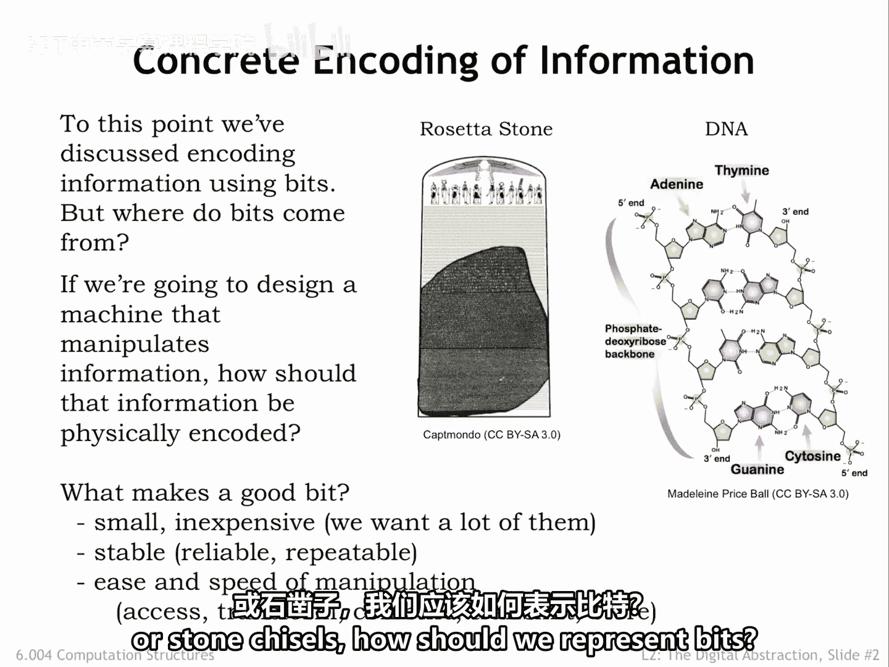
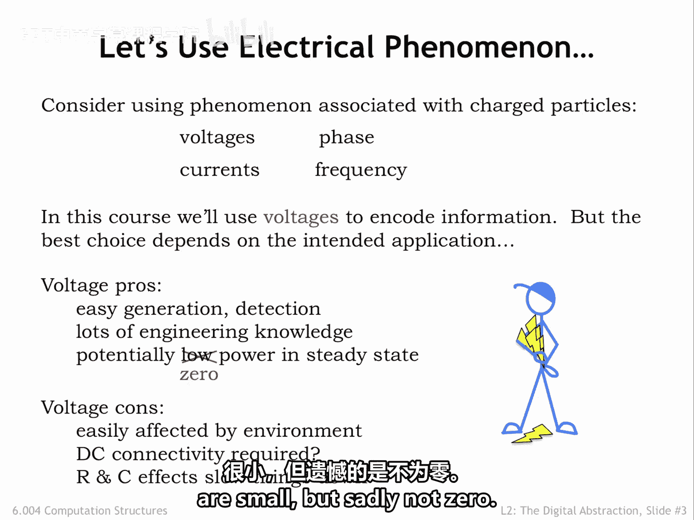

# 【数字系统与计算机架构P1 6.004 2017】麻省理工学院—中英字幕 p17 2.2.1 Concrete Encoding of Information -BV1DZ421E7Yz_p17-

In the previous chapter， we discussed how to encode information as sequences of bits。

 In this chapter， we turn our attention to finding a useful physical representation for bits。

 Our first step in building devices that can process information。So what makes a good bit。

 In other words， what properties do we want our physical representation of bits to have。Well。

 we'll want a lot of them。 We expect to carry billions of bits around with us， for example。

 music files， and we expect to have access to trillions of additional bits on the web for news and entertainment。

 social interactions， commerce。 The list goes on and on。So we want bits to be small and inexpensive。

Mother Nature has a suggestion， the chemical encoding embodied in DNA。

 or sequences of the nucleotides， adenine， thymine。

 guanine and cytoocine form codons that encode genetic information that serve as the blueprint for living organisms。

The molecular scale meets our size requirements。And there's active research underway on how to use the chemistry of life to perform interesting computations on a massive scale。

We'd certainly like our bits to be stable over long periods of time， once a0， or a0。

The Rosetta stone， shown here as part of its original tablet containing a decree from the Egyptian king。

 Ptolemy the V， was created in 196 B。 C and encoded the information needed for archaeologists to start reliably deciphering Egyptian hieroglyphics almost 2000 years later。

But the very property that makes stone engravings a stable representation of information makes it difficult to manipulate the information。

Which brings us to the final item in our shopping list。

 We'd like our representation of bits to make it easy to quickly access， transform， combine。

 transmit and store the information they encode。Assuming we don't want to carry around buckets of gooey DNA or stone chisels。

 how should we represent bits？

With some engineering， we can represent information using the electrical phenomenon associated with charged particles。

The presence of charged particles creates differences in electrical potential energy we can measure as voltages。

 and the flow of charged particles can be measured as currents。

We can also encode information using the phase and frequency of electromagnetic fields associated with charged particles。

These latter two choices form the basis for wireless communication。

Which electrical phenomenon is the best choice depends on the intended application。

In this course we'll use voltages to represent bits， for example。

 we might choose zero volts to represent a zero bit and one volt to represent a one bit。

To represent sequences of bits， we can use multiple voltage measurements。

 either from many different wires or as a sequence of voltages over time on a single wire。

A representation using voltages has many advantages。

Electrical outlets provide an inexpensive and mostly reliable source of electricity。

 and for mobile applications， we can use batteries to supply what we need。For more than a century。

 we've been accumulating considerable engineering knowledge about voltages and currents。

We now know how to build very small circuits to store， detect， and manipulate voltages。

 and we can make those circuits run on a very small amount of electrical power。In fact。

 we can design circuits that require close to zero power dissipation in a steady state if none of the encoded information is changing。

However， a voltage based representation does have some challenges。

 voltages are easily affected by changing electromagnetic fields in the surrounding environment。

If I want to transmit voltage encoded information to you， we need to be connected by a wire。

And changing the voltage on a wire takes some time since the timing of the necessary flow of charged particles is determined by the resistance and capacitance of the wire。

In modern integrated circuits， these RC time constants are small， but sadly not0。

We have good engineering solutions for these challenges， so let's get started。

