# 【数字系统与计算机架构P1 6.004 2017】麻省理工学院—中英字幕 p36 4.2.3 Inverting Logic -BV1DZ421E7Yz_p36-

Now would be a good time to take a moment to look at the documentation for the Library of Logic gateates we'll use for our designs。

Look for the Standard Cll Library handout and the updatesates in handouts tab。

 which is next to the CourseW tab。The information on this slide is taken from there。

The library has both inverting gates such as inverters， Nands， and nors， and non inverting gates。

 such as buffers， ants and os。Why bother to include both types of gates。

 Didn't we just learn we can build any circuit using only Nand to nor？Good questions。

 We get some insight into the answers if we look at these three implementations for a four input and function。

The upper circuit is a direct implementation using the for input and gate available in the library。

The TPD of the gate is 160 picoconds， and its size is 20 square microns。

Don't worry too much about the actual numbers， what matters on this slide is how the numbers compare between designs。

The middle circuit implements the same function this time using a four input Nand gate hooked to an inverter to produce the and functionality we want。

The TPD of this circuit is 90 picoseconds， considerably faster than the single gate above。

The trade off is that the size is somewhat larger。How can this be。

 especially since we know the and gate implementation is the Nand inverter pair shown in the middle circuit？

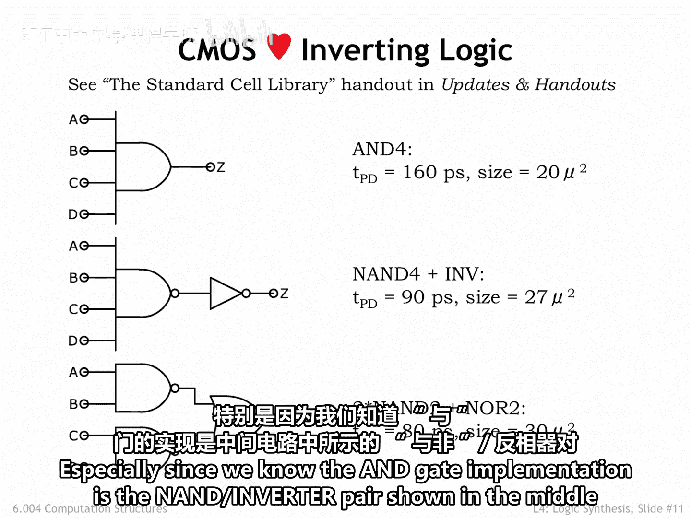

The answer is that the creators of the library decided to make the non inverting gate small but slow。

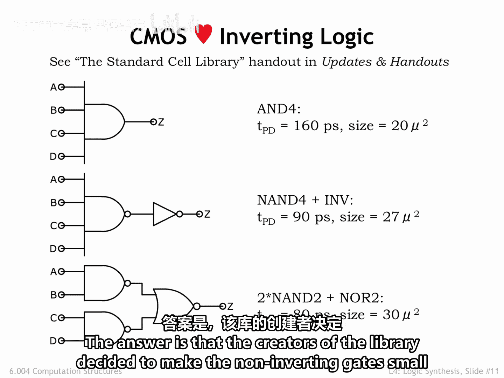

By using Was Fets with much smaller widths than used in the inverting logic gates。

 which were designed to be fast。

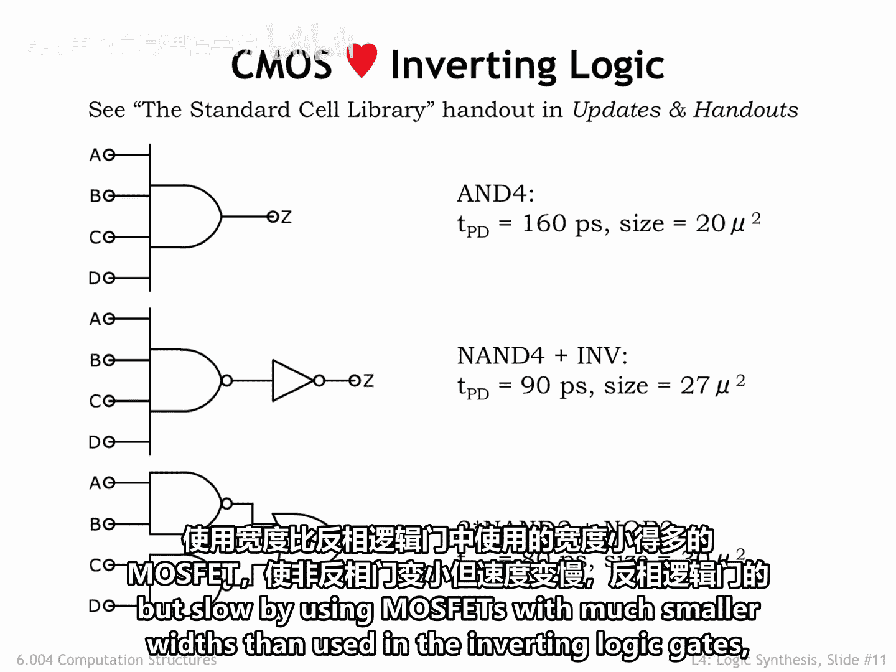

Why would we ever want to use a slow gate？Remember that the propagation delay of a circuit is set by the longest path in terms of delay from inputs to outputs。

In a complex circuit， there are many input output paths。

 but it's only the components on the longest path that need to be fast in order to achieve the best possible overall TPD。

The components on the other shorter paths can potentially be a bit slower。

And the components on short input output pass can be very slow indeed。

So for the portions of the circuit that aren't speed sensitive。

 it's a good trade off to use slower but smaller gates。 The overall performance isn't effect。

 but the total size is improved。So for faster performance we'll design with inverting gates。

 and for smaller size will design with non inverting gates。

 the creators at the Gate Library design the available gates with this trade off in mind。

The four input inverting gates are also designed with this trade off in mind。

For the ultimate in performance， we want to use a tree circuit of two input gates。

 as shown in the lower circuit， This implementation shaves 10 picooseds off the T while costing us a bit more in size。

Take a closer look at the lower circuit。This tree circuit uses two Nn gates whose outputs are combined with a no gate。

Does this really compute the a of A， B， C， and D？Yep。

 as you can verify by building the truth table for this combinational system using the truth tables for NN and Nora。

This circuit is a good example of the application of a particular Boolean identity known as De Morgan's Law。

There are two forms of D Morgangan's law， both of which are shown here。

The top form is the one we're interested in for analyzing the lower circuit。

It tells us that the nor of A with B is equivalent to the and of not a with not B。

So the two input Nor gate can be thought of as a two input and gate with inverting inputs。

How does this help？We can now see that the lower circuit is actually a tree of ant gates。

Where the inverting outputs of the first layer match up with the inverting inputs of the second layer。

It's a little confusing the first time you see it， but with practice you'll be comfortable using D Morgan's Law when building trees or chains of inverting logic。

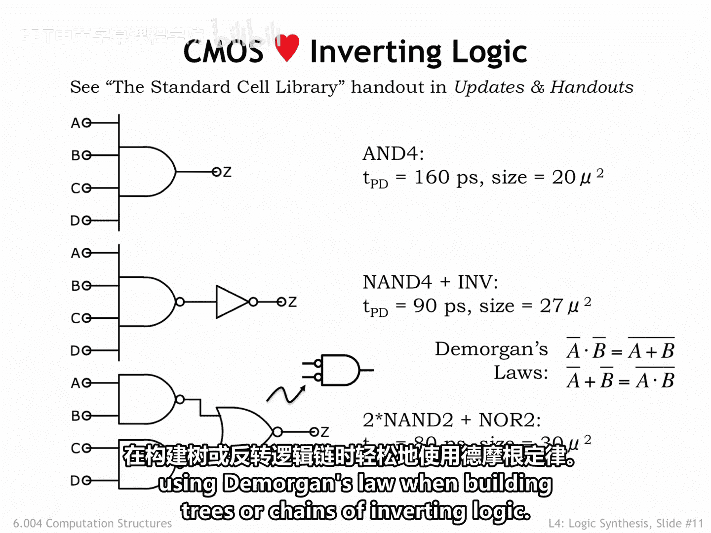

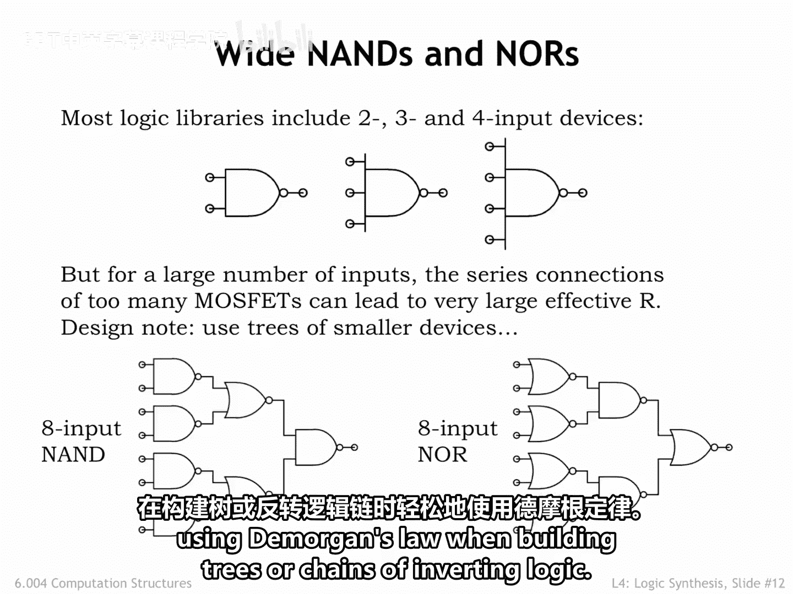

Using De Morgangan's law， we can answer the question of how to build Nans and Nors with large numbers of inputs。

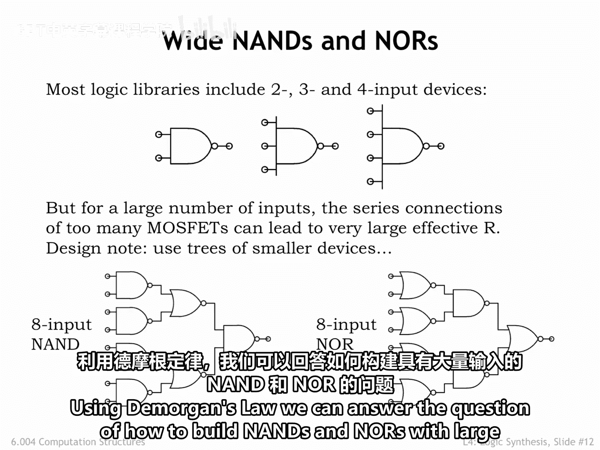

Our G library includes inverting gates with up to four inputs， why stop there？Well。

 the pull down chain of a four input Ngate has four nFs in series。

 and the resistance of the conducting channels is starting to add up。

We could make the nFts wider to compensateate， but then the gate gets much larger and the wider NFs impose a higher capacitive load on the input signals。

The number of possible trade offs between size and speed grows rapidly with the number of inputs。

 so it's usually just best for the library designer to stop at four input gates and let the circuit designer take it from there。

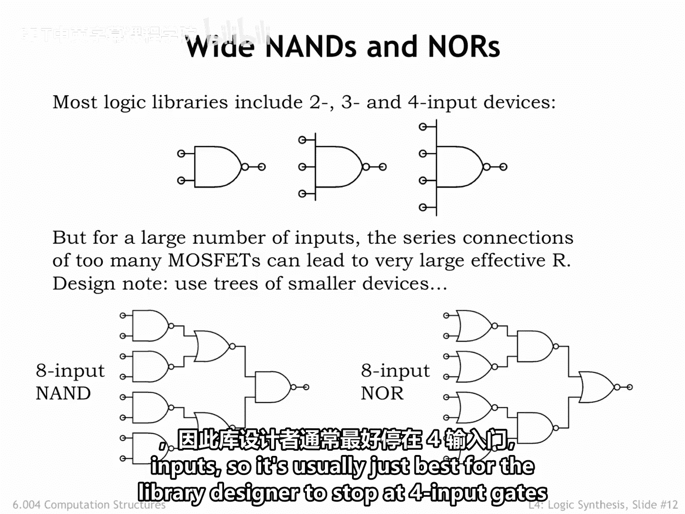

Happily， De Morgangan's law shows us how to build trees of alternating nans and nors to build inverting logic with a large number of inputs。

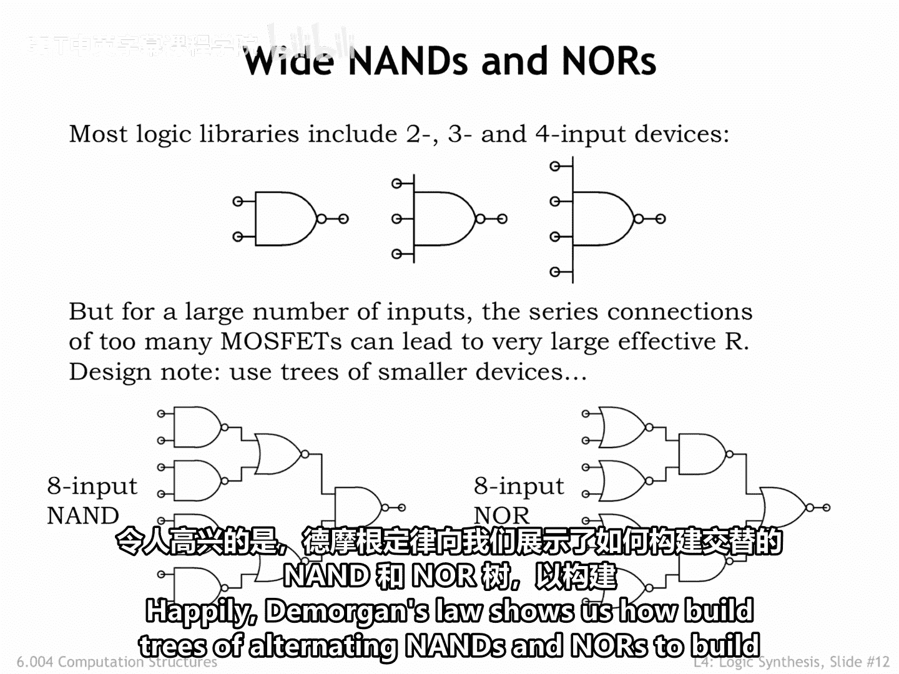

Here we see schematics for an8 input Nand and an8 input Norgate。

Think of the middle layer of nor gates in the left circuit as and gates with inverting inputs。

 and then it' easy to see that the circuit is a tree of ans with an inverting output。Similarly。

 think of the middle layer of Nand gates in the right circuit as or gates with inverting inputs and see that we really have a tree of or gates with an inverting output。

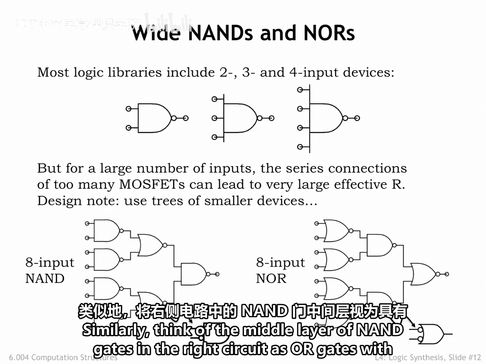

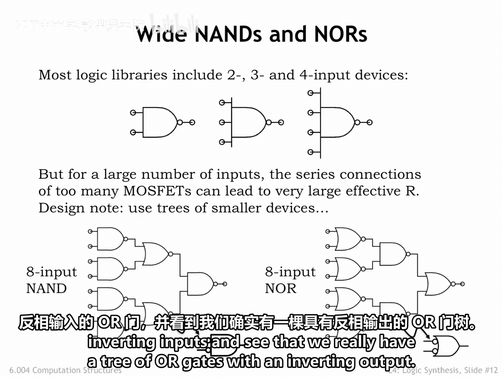

Now let's see how to build summer product circuits using inverting logic。

The two circuits shown here implement the same summer product logic function。

 The one on the top uses two layers of Nand gates。 The one on the bottom， two layers of norer gates。

Let's visualize De Morgan's law in action on the top circuit。

The Nand gate with Y on its output can be transformed by De Morgan's law into an oreg gate with inverting inputs。

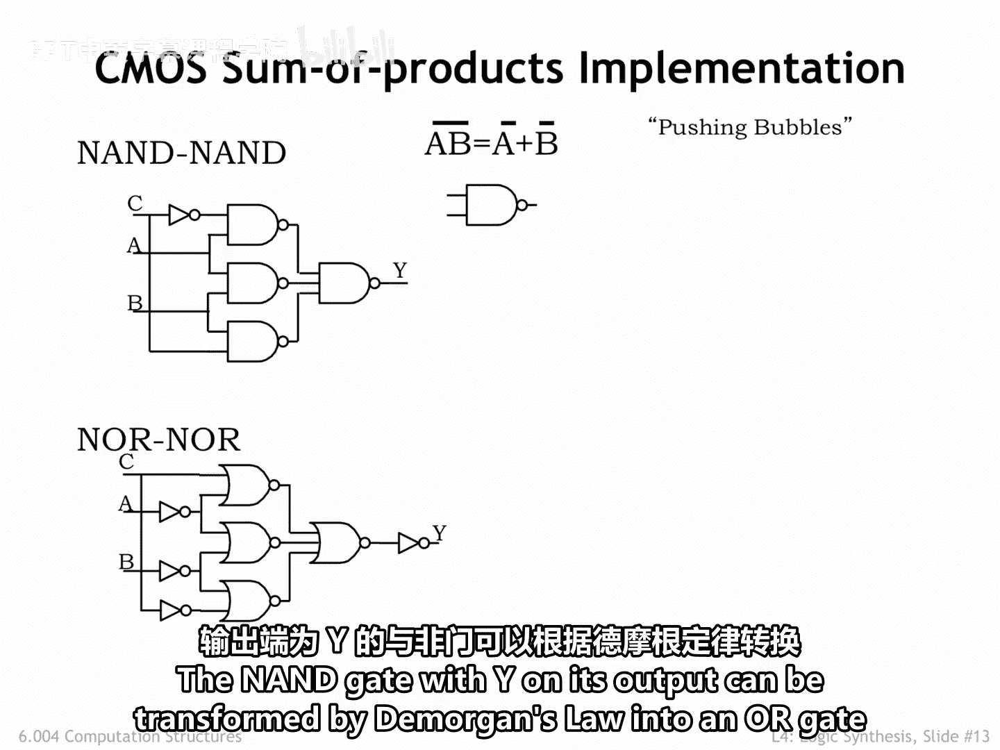

So we can redraw the circuit on the top left as the circuit shown on the top right。Now。

 notice that the inverting outputs of the first layer are canceled by the inverting inputs of the second layer。

 a step we can show visually by removing matching inversions。

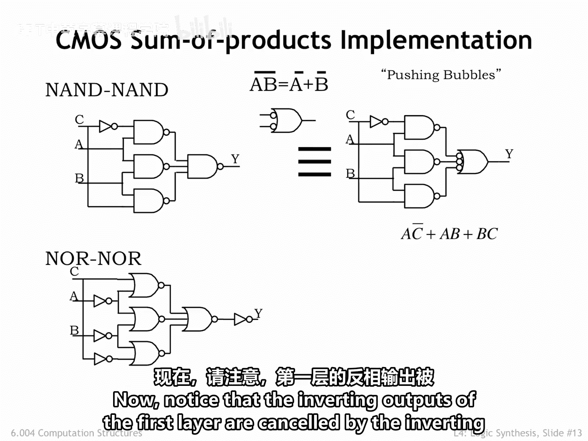

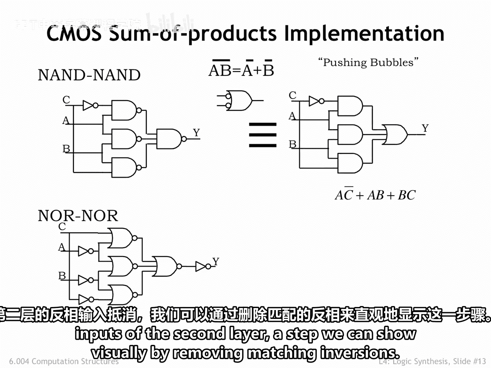

Andvoila， we see the Nand and circuit in summer products form， a layer of inverters。

 a layer of an gate， and an origgate to combine the product terms。

We can use a similar visualization to transform the output gate of the bottom circuit。

 giving us a circuit shown on the bottom right。

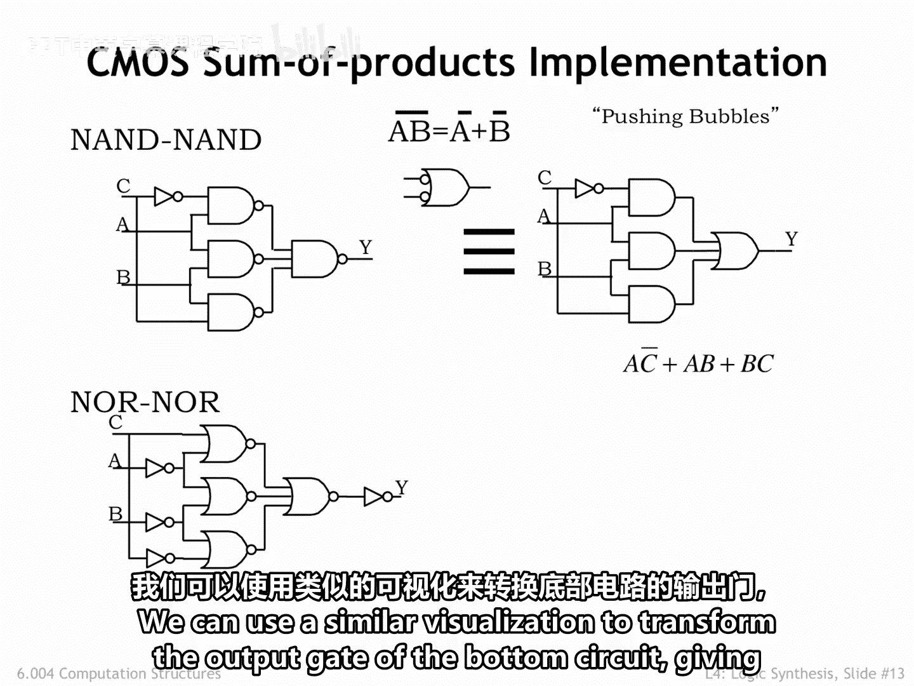

Match up the bubbles and we see that we have the same logic function as above。

Looking at the N nor circuit on the bottom left， we see that it has four inverters。

 whereas the Enandan circuit only has one。Why would we ever use the NO implementation？

It has to do with the loading on the inputs in the top circuit。

 the input A connects to a total of four Mosfet switches in the bottom circuit。

 it connects to only the two Mossfet switches in the inverter。

So the bottom circuit imposes half the cap of load on the A signal。

 this might be significant if the signal A connected to many such circuits。

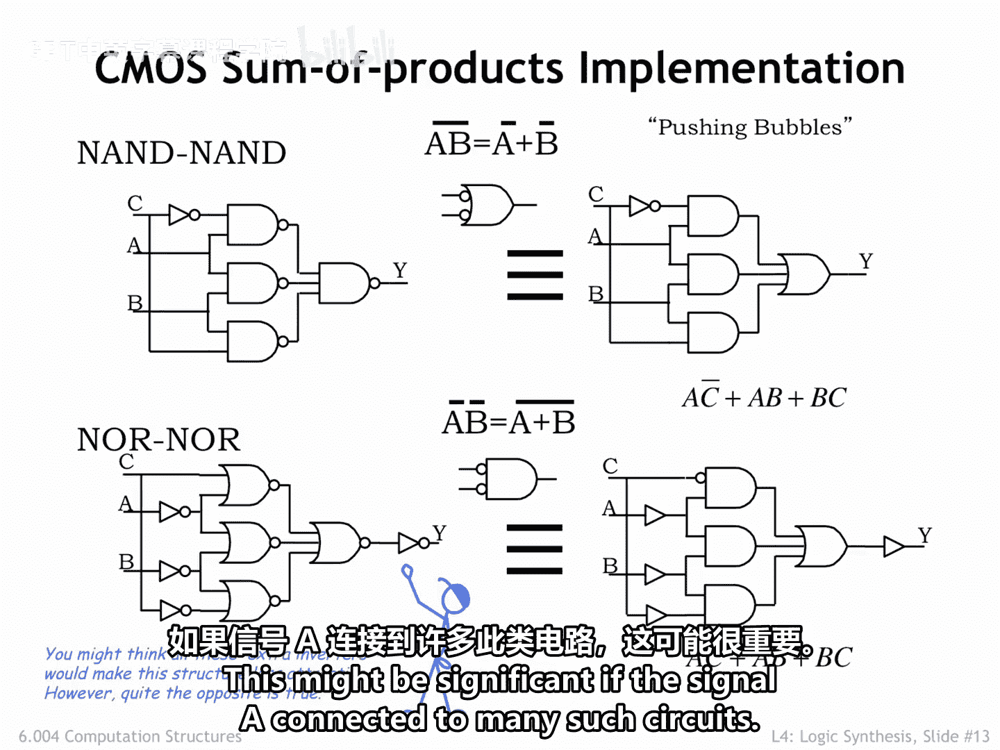

The bottom line， when you find yourself needing a fast implementation for the and or circuitry for a summer products expression。

 try using the Nand to Nand implementation， itll be noticeably faster than using and or。

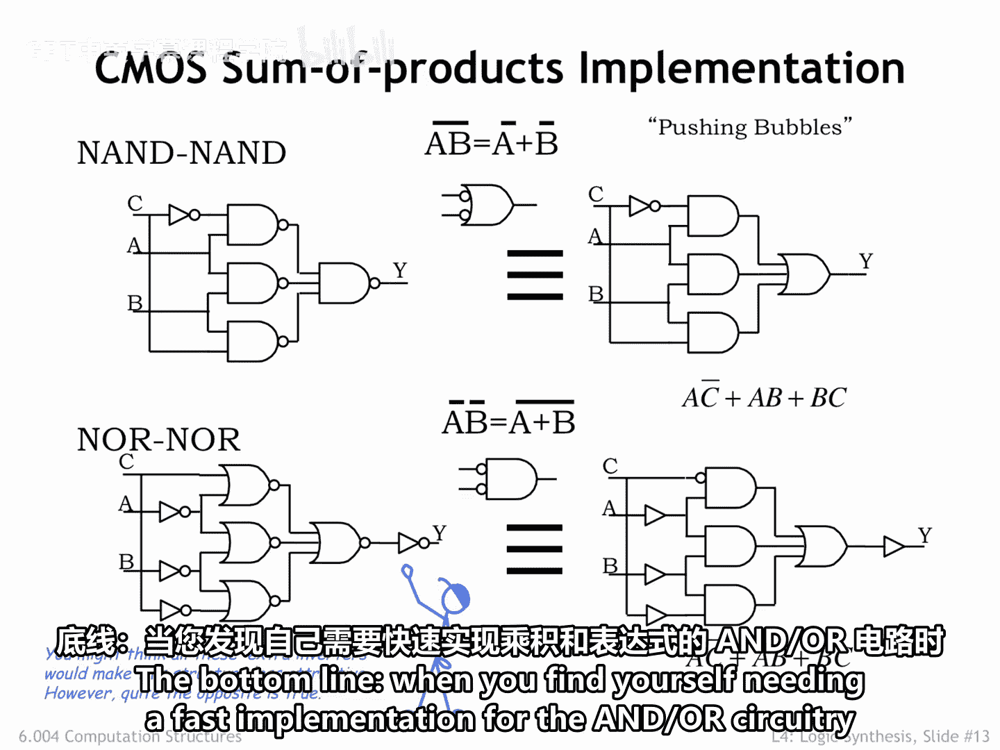

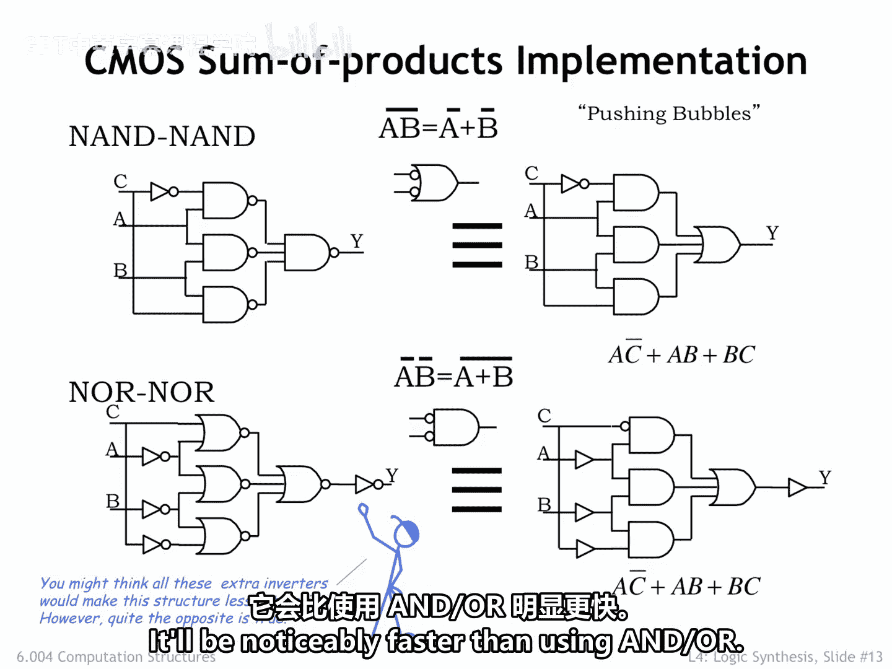