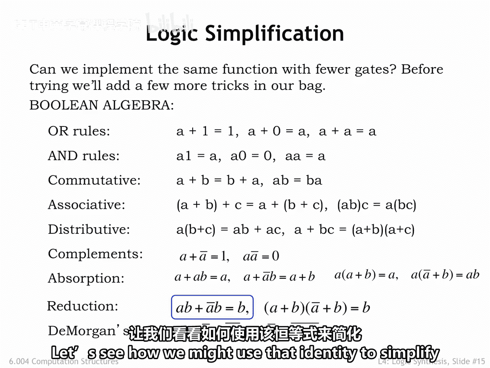
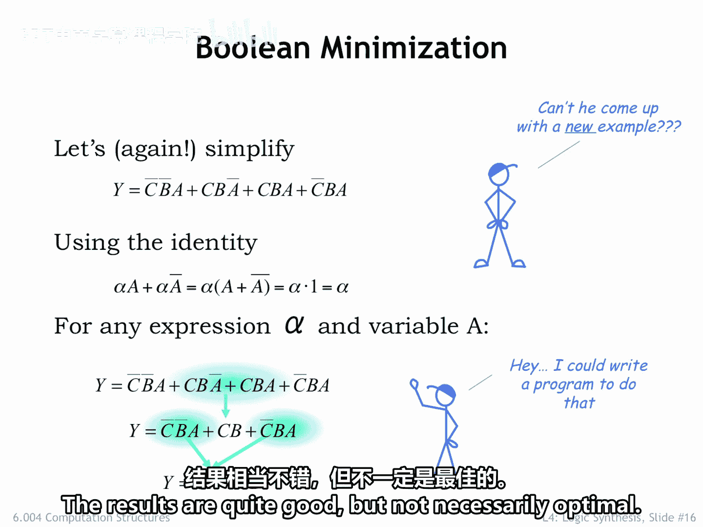
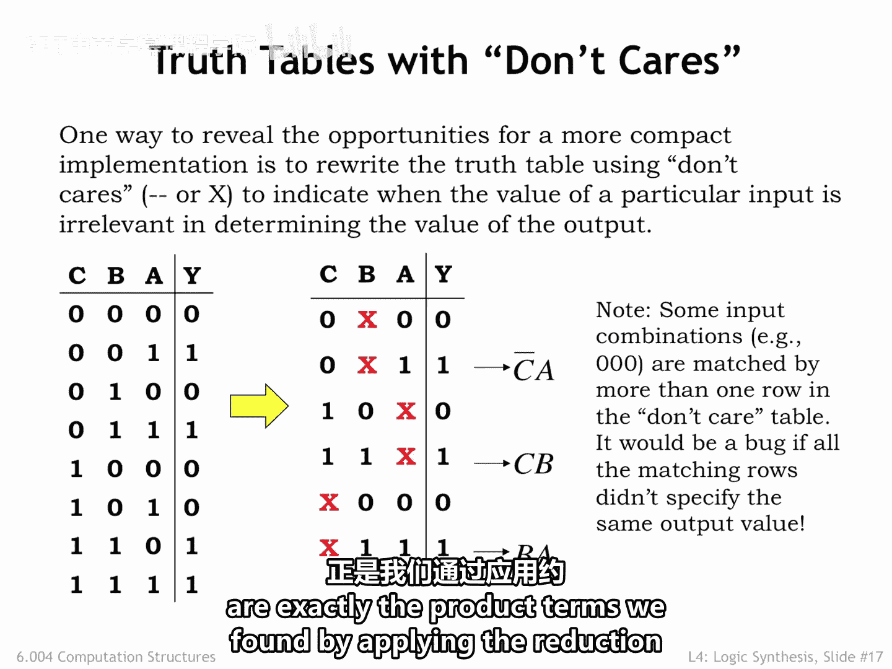
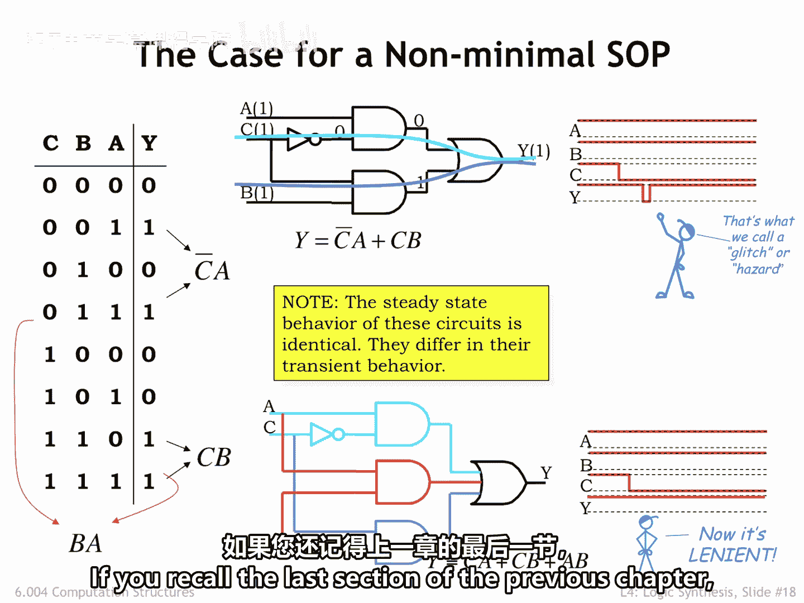

# 【数字系统与计算机架构P1 6.004 2017】麻省理工学院—中英字幕 p37 4.2.4 Logic Simplification -BV1DZ421E7Yz_p37-

The previous sections showed us how to build a circuit that computes a given summer product expression。

An interesting question to ask is if we can implement the same functionality using fewer or smaller gates。

In other words， is there an equivalent boolean expression that involves fewer operations？

Bolean algebrage has many identities that can be used to transform an expression into an equivalent and hopefully smaller expression。

The reduction identity in particular offers a transformation that simplifies an expression involving two variables and four operations into a single variable and no operations。

 Let's see how we might use that identity to simplify a summer product expression。

Here's the equation from the start of this chapter involving four product terms。

 we'll use a variant of the reduction identity involving obbiline expression alpha。

 and a single variable A。Looking at the product terms。

 the middle two offer an opportunity to apply the reduction identity if we let alpha be the expression C and B。

So we sified the middle two product terms to just alpha， in other words， C and B。

Eliminating the variable A from this part of the expression。Considering the now three product terms。

 we see that the first and last terms can also be reduced， this time letting alpha be the expression。

 not C and A。Wow， this equivalent equation is much smaller。

Counting inversions in pairwise operations， the original equation has 14 operations。

 while the simplified equation has four operations。

The simplified circuit would be much cheaper to build and have a smaller TPD in the bargain。

Doing this sort of Boolean simplification by hand is tedious in error prone。

 just the sort of task a computer program could help with。Such programs are in common use。

 but the computation needed to discover the smallest possible form for an expression grows faster than exponentially as the number of inputs increases。

So for larger equations， the program used various heuristics to choose which simplifications to apply。

The results are quite good， but not necessarily optimal。

But it sure beats doing the simplification by hand。

Another way to think about simplification is by searching the tooth table for don't care situations。

 For example， look at the first and third rows of the original truth table on the left。In both cases。

 A is 0， C is 0， and the output y is 0， The only difference is the value of B。

 which we can then tell is irrelevant when both A and C are 0。

This gives us the first row of the truth table on the right。

 where we use x to indicate that the value of B doesn't matter when A and C are both0。

By comparing rows with the same value for y， we can find other don't care situations。

The truth table with don't care us has only three rows where the output is1。And in fact。

 the last row is redundant in the sense that the input combinations it matches 011 and 111 are covered by the second and fourth rows。

The product terms derived from rows2 and4 are exactly the product terms we found by applying the reduction identity。

Do we always want to use the simplest possible equation as the template for our circuits？

Seemmed like that would minimize the circuit cost and maximize performance， a good thing。

The simplified circuit is shown here。Let's look at how it performs when A is 1， B is 1。

 and C makes a transition from 1 to0。Before the transition C is 1。

 and we can see from the annotated node values that it's the bottom end gate that's causing the output y to be1。

When C transitions to zero， the bottom end gate turns off and the top end gate turns on。

 and eventually the Y output becomes 1 again。But the turning on of the top end gate is delayed by the TPD of the inverter。

So theres a brief period of time when neither ant gate is on， and the output momentarily becomes0。

 this short blip and wise value is called a glitch and it may result in short lived changes on many node values as it propagates through other parts of the circuit。

All those changes consume power， so it would be good to avoid these sorts of glitches if we can。

If we include the third product term BA in our implementation。

 the circuit still computes the same long term answer as before。But now， when A and B are both high。

 the output y will be1 independently of the value of the C input。

So the 1 to zero transition on the C input doesn't close a glitch on the Y output。

If you recall the last section of the previous chapter。

 the phrase we use to describe such circuits is lenient。

