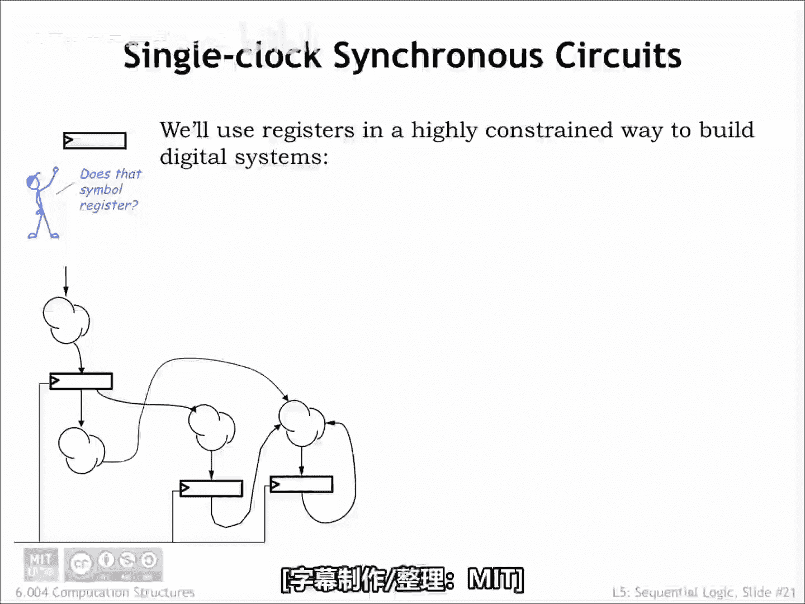
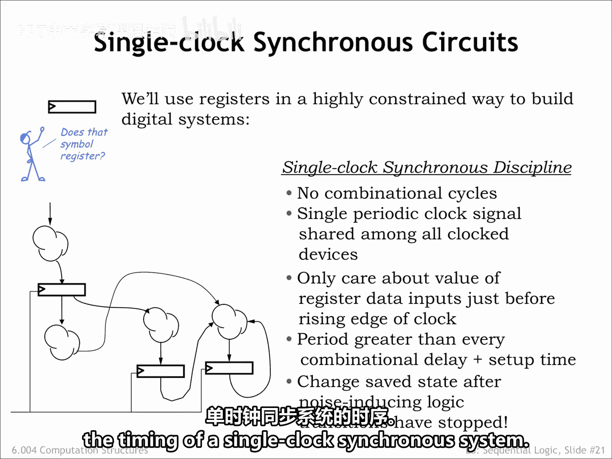
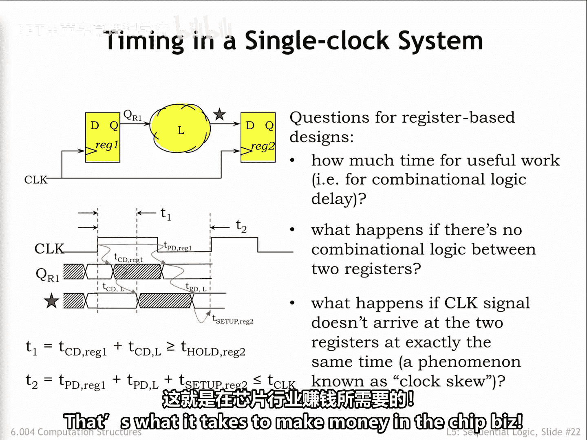

# 【数字系统与计算机架构P1 6.004 2017】麻省理工学院—中英字幕 p49 5.2.5 Sequential Circuit Timing -BV1DZ421E7Yz_p49-

In 604， we have a specific plan on how we'll use registers in our designs。

 which we call the single clock synchronous discipline。

Looking at the sketch of a circuit on the left， we see that it consists of registers。

 the rectangular icons with the edge triggered symbol。

And combinational logic circuits shown here as little clouds with inputs and outputs。

Remembering that there is no combinational path between a register's input and output。

 the overall circuit has no combinational cycles。In other words。

 paths from system inputs and register outputs to the inputs of registers never visit the same combinational block twice。

A single periodic clock signal is share it among all the clock devices。

Using multiple clock signals is possible， but analyzing the timing for signals that cross between clock domains is quite tricky。

 so life is much simpler when all the registers use the same clock。

The details of which data signals change when are largely unimportant。

 All that matters is that signals hooked to the register inputs are stable and valid for long enough to meet the register setup time。

And of course， stay stable long enough to meet the Reg's hold time。

We can guarantee that the dynamic discipline is obeyed by choosing the clock period to be greater than the TPD of every path。

 from register outputs to register inputs。Plus， of course， the register setup time。

A happy consequence of choosing the clock period in this way is that at the moment of the rising clock edge。

 there are no other noise inducing logic transitions happening anywhere in the circuit。

Which means there should be no noise problems when we update the stored state of each register。

Our next task is to learn how to analyze the timing of a single clock synchronous system。

Here's a model of a particular path in our synchronous system。

A large digital system will have many such paths， and we have to do the analysis below for each one in order to find the path that will determine the smallest workable clock period。

 As you might expect， there are computer aided design programs that will do these calculations for us。

There is an upstream register whose output is connected to a combinational logices circuit。

 which generates the input signal labeled star to the downstream register。

 Let's build a carefully drawn timing diagram showing when each signal in the system changes and when it is stable。

The rising edge of the clock triggers the upstream register whose output labeled QR1 changes specified by the contamination and propagation delays of the register。

QR1 maintains its old value for at least the contamination delay of Regg1 and then reaches its final stable value by the propagation delay of Regg1。

 At this point， QR1 will remain stable until the next rising clock edge。

Now let's figure out the waveforms for the output of the combinational logic circuit。

 marked with a red star in the diagram。The contamination delay of the logic determines the earliest time star will go invalid。

 measured from when QR1 went invalid。The propagation delay of the logic determines the latest time star will be stable。

 measured from when Q R1 became stable。Now that we know the timing for ST。

 we can determine whether ST will meet the setup and hold times for the downstream Reg Regg2。

Time T1 measures how long star will stay valid after the rising clock edge。

T 1 is the sum of Regg 1's contamination delay and the logic's contamination delay。

 The whole time for reg 2 measures how long star has to stay valid after the rising clock edge in order to ensure correct operation。

 So T 1 has to be greater than or equal to the hold time for Regg 2。

Time T 2 is the sum of the propagation delays for Regg 1 and the logic。

 plus the setup time for reg 2。 This tells us the earliest time at which the next rising clock edge can happen and still ensure that the setup time for Regg 2 is met。

So T2 has to be less than or equal to the time between the rising clock edges。

 called the clock period or T clock。If the next rising clock edge happens before T2。

 we be violating the dynamic discipline for Regg2。So we have two inequalities that must be satisfied for every register register path in our digital system。

If either inequality is violated， we won't be ab the dynamic discipline for Regg2。

 and our circuit will not be guaranteed to work correctly。

Looking at the inequality involving tea clock， we see that the propagation delay of the upstream register and the setup time for the downstream register take away from the time available for useful work performed by the combinational logic。

Not surprisingly， designers try to use registers that minimize these two times。

What happens if there's no combinational logic between the upstream and downstream registers？

This happens when designing F registers， digital delay lines， etc。Well。

 then the first inequality tells us that the contamination delay of the upstream register had better be greater than or equal to the whole time of the downstream register。

In practice， contamination delays are smaller than hold times， so in general。

 this wouldn't be the case。So designers are often required to insert dummy logic， for example。

 to inverters and seriesries， in order to create the necessary contamination delay。Finally。

 we have to worry about the phenomenon calledCcu， where the clock signal arrives at one register before it arrives at the other。

We won't go into the analysis here， but the net effect is to increase the apparent set up and hold times at the downstream register。

 assuming we can't predict the sign of the skill。The clock period T clock characterizes the performance of our system。

You may have noticed that Intel is willing to sell you processor chips that run at different clock frequencies。

For example， a 1。7 gigahertz processor versus a2 gigahertz processor。

Did you ever wonder how those chips are different？As it turns out， they're not。

What's going on is that variations in the manufacturing process means that some chips have better TPds than others On fast chips。

 a smaller TPD for the logic means that they can have a smaller T clock and hence a higher clock frequency。

 So Intel manufactures many copies of the same chip Me their Tpds and selects the fast ones to sell us higher performance parts。

That's what it takes to make money in the chip is。

