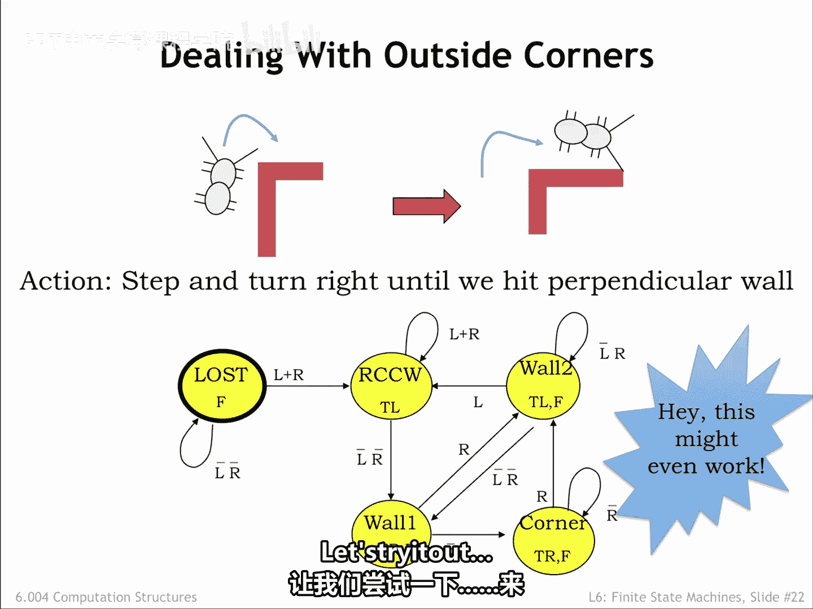
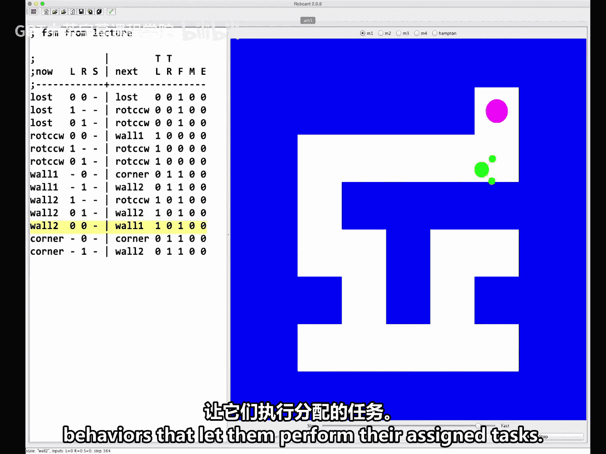

# 【数字系统与计算机架构P1 6.004 2017】麻省理工学院—中英字幕 p56 6.2.4 Roboant Example -BV1DZ421E7Yz_p56-

Surprise， we've just been given a robotic ant that has an FSM for its brain。

The input to the FSM come from the ants 2 and 10 I labeled L and R。An antenna input is one。

 if the antenna is touching something， otherwise it's zero。

The outputs of the FSM control the ants motion。We can make it step forward by setting the F output to1 and turn left or right by asserting the TL or TR outputs respectively。

If the ant tries to both turn and step forward， the turn happens first。

Note that the ant can turn when its antenna are touching something， but it can't move forward。

We've been challenged to design an amp brain that will let it find its way out of a simple maze like the one shown here。

We remember reading that if the maze doesn't have any unconnected walls， in other words， no islands。

 we can escape using the right hand rule where we put our right hand on the wall and walk so that our hand stays on the wall。

Let's try to implement this strategy。We'll assume that initially our an is lost in space。

The only sensible strategy is to walk forward until we find a maze wall。

So our initial state labeled Los， asserts the F output causing the ant to move forward until at least one of the antenna touches something；

 In other words， at least one of the L or R inputs is a1。

So now the ant finds itself in one of these three situations。To implement the right hand rule。

 the ant should turn left counterclockwise， until its antenna eye have just cleared the wall。

To do this we'll add a rotate counterclockwise state。

 which asserts both the turn left output until both L and R are 0。

Now the ant is standing with a wall to its right， and we can start the process of following the wall with its right antenna。

So we have the ant step forward and right， assuming that it will immediately touch the wall again。

The wall1 state asserts both the turn right and forward outputs。

 then checks the right antenna to see what it should do next。

If the right antenna does touch as expected， the ant turns left to free the antenna and then steps forward。

The wall two states asserts both the turn left and forward outputs， then checks the antenna。

If the right antenna is still touching， it needs to continue turning。If the left antenna touches。

 it's run into a corner and needs to reorient itself。 So the new wall is on its right。

 The situation we dealt with with the rotate counterclockwise state。 Finally。

 if both antenna are free， the ant should be in the state of the previous slide。

 standing parallel to the wall。 So we return to the wall 1 state。

Our expectation is that the FSM will alternate between the wall1 and wall2 states as the amp moves along the wall。

If it reaches an inside corner， it rotates to put the new wall on its right and keeps going。

What happens when it reaches an outside corner？When the ant is in the wall1 state。

 it moves forward and turns right， then checks its right antenna expecting to find the wall as traveling along。

But if it's an outside corner， there's no wall to touch。

The correct strategy in this case is to keep turning right and stepping forward until the red antenna touches the wall that's around the corner。

The corner state implements this strategy， transitioning to the wall2 state when the ant reaches the wall again。

Hey， this might even work。Let's try it out。

Meet the Robbo ant simulator。On the left we see a text representation of the transition table for the FSM brain。

Each action line specifies an input pattern， which， if it matches。

 will set the next state and output signals is specified。

This particular version of robo ant allows the ant to drop or pick up breadcrumbs and to sensech bread crumbs it comes across。

These inputs and outputs aren't needed for this demo。

The input pattern specifies a value for the current state and antenna inputs。

The simulator highlights the row in the table that matches the current inputs。As you can see。

 initially the ant is in the lost state with neither antenna touching。

On the right is a map showing our green ant standing and a maze with blue walls。

We can select several different mazes to try。To see the ant in action。

 let's click the step button several times。After a few steps， the ant hits the wall。

 then rotates counterclockwise to free its antennana。

Now it starts following the wall until it reaches a corner。

 at which point it keeps turning right and stepping until it's once again in contact with the wall。

Now， we'll let it run and watch as the FSM patiently pursues the program strategy。

 responding to inputs and generating the appropriate output responses。

With more sensors and actuators， you can see that fairly sophisticated behaviors and responses would be possible。

In essence， this is exactly what modern robots do。They too。

 have FSM brains full of pre program behaviors that let them perform their assigned tasks。

2。