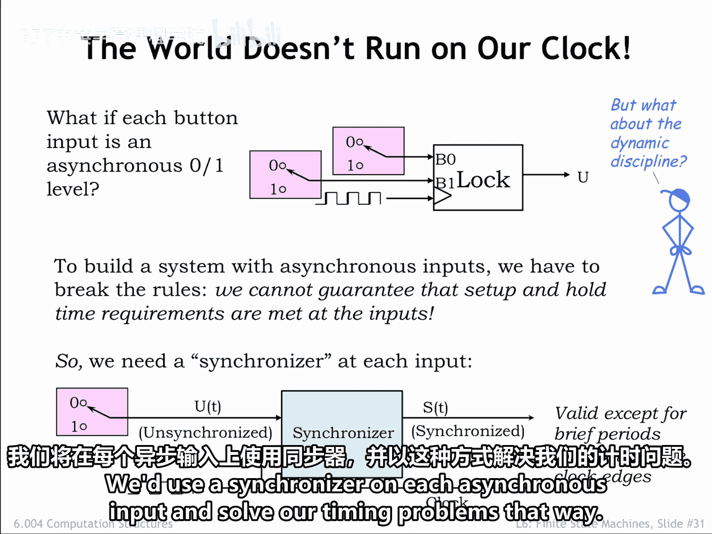
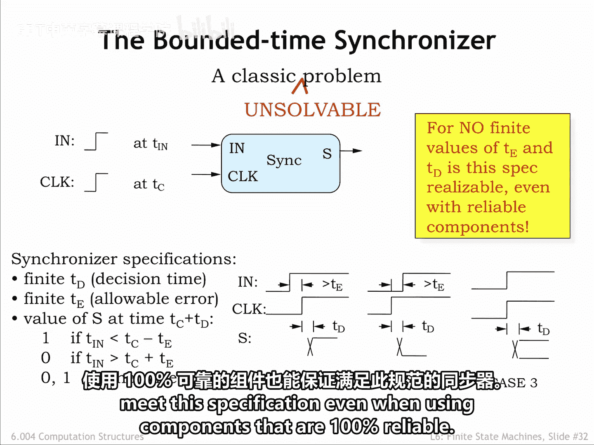
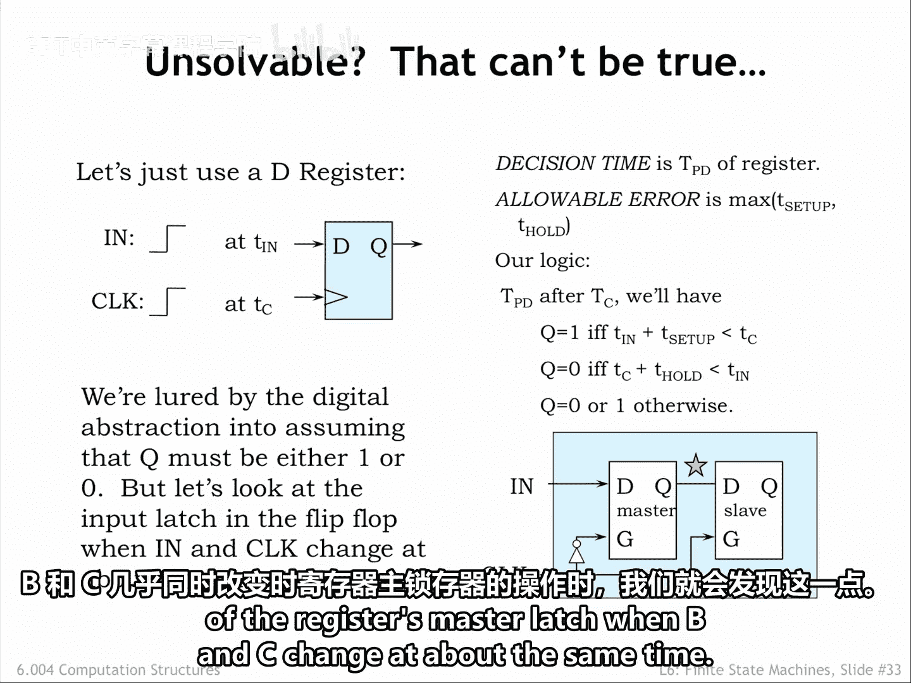
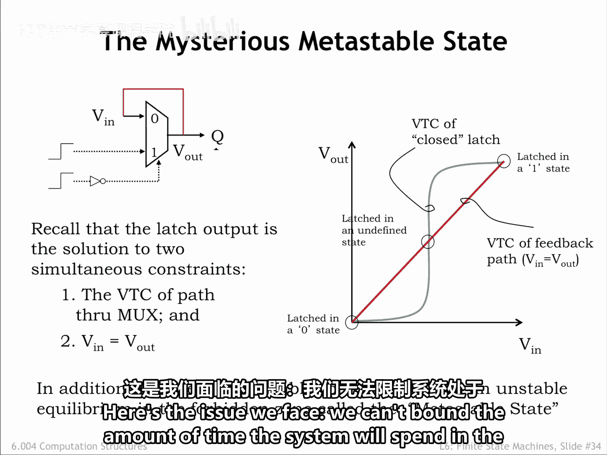
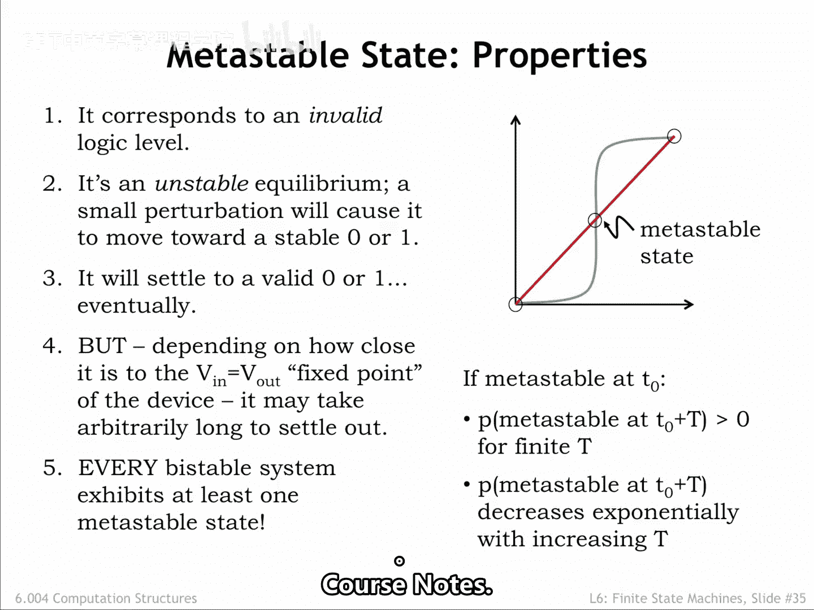
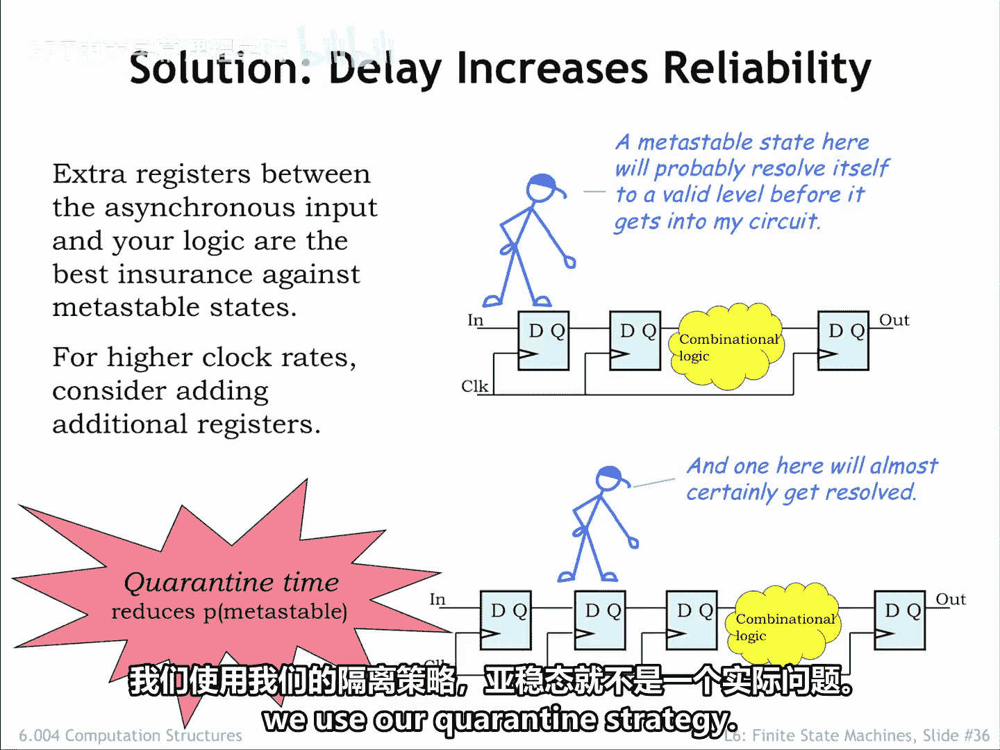

# 【数字系统与计算机架构P1 6.004 2017】麻省理工学院—中英字幕 p58 6.2.6 Synchronization and Metastability -BV1DZ421E7Yz_p58-

Okay， it's finally time to investigate issues caused by asynchrontous inputs to a sequential logic circuit。

By asynchronous， we mean that the timing of transitions on the input is completely independent of the timing of the sequential logic clock。

The situation arises when the inputs arrive from the outside world。

 where the timing of events is not under our control。

As we saw at the end of Cha 5 to ensure reliable operation of the state registers。

 inputs to a sequential logic system have to obey set up in hold time constraints relative to the rising edge of the system clock。

Clearly， if the input can change at any time， it can change at a time that would violate the setup in hold times。

Maybe we can come up with a synchronizer circuit that takes an unsynchronized input signal and produces a synchronized signal that only changes shortly after the rising edge of the clock。

We use to synchronizer on each asynchronous input and solve our timing problems that way。

Here's a detailed specification for our synchronizer。The synchronizer has two inputs in and clock。

 which have transitions at time TN and TC respectively。

If In's transition happens sufficiently before C's transition。

 we want the synchronizer to output a1 within some bounded time TD after clock's transition。

And if clock's transition happens sufficiently before in's transition。

 we want the synchronizer to output a zero within time TD after clock's transition。Finally。

 if the two transitions are closer together than some specified interval TE。

 the synchronizer can output either a0 or a1 within time TD of clocks transition。

Either answer is fine， so long it's a stable digital  zero or digital 1 by the specified deadline。

This turns out to be an unsolvable problem for no finite values of TE and TD。

 can we build a synchronizer that's guaranteed to meet this specification。

 even when using components that are 100% reliable。

But can't we just use a D register to solve the problem。

 we'll connect in to the Reg's data input and connect clock to the Reg's clock input。

We'll set the decision time，D to the propagation delay of the register。

 and the allowable error interval to the larger of the register set and hold times。

Our theory is that if the rising edge of in occurs at least t set up before the rising edge of clock。

 the register is guaranteed to output a1。And if in transitions more than T hold after the rising edge of clock。

 the register is guaranteed to output a0。So far so good。

If in transitions during the setup and hold times with respect to the rising edge of clock。

We know weve violated the static discipline and we can't tell whether the register will store a zero or a1。

But in this case， our specification lets us produce either answer， so we're good to go， right？Sadly。

 we're not good to go。 We're lured by the digital abstraction into assuming that even if we violate the dynamic discipline。

 that Q must be either  one or 0 after the propagation delay， But that isn't a valid assumption。

 As we'll see when we look more carefully at the operation of the register's master latch。

 when B and C change at about the same time。

Recall that the master latch is really just a lineient muckx that can be configured as a bytable storage element using a positive feedback loop。

When the latch is in memory mode， it's essentially a two gate cyclic circuit whose behavior has two constraints。

The voltage transfer characteristic of the two gate circuit shown in green on the graph。

 and that Vn equal V out， a constraint that's shown in red on the graph。

These two curves intersect at three points。Our concern is the middle point of intersection。

If in and clock change at the same time， the voltage on Q may be in transition at the time the mus closes and enables the positive feedback loop。

So the initial voltage in the feedback loop may happen to be at or very near the voltage of the middle intersection point。

When Q is at the metastable voltage， the storage loop is in an unstable equilibrium called the metastable state。

 In theory， a system could balance at this point forever。

 but a small change in the voltages in the loop will move the system away from the metastable equilibrium point and set it irrevocably in motion towards the stable equilibrium points。

Here's the issue we face。 we can't bound the amount of time the system will spend in the metatable state。

Here's what we know about the metaple state。It's in the forbidden zone of the digital signaling specifications。

 and so corresponds to an invalid logic level。Violating the dynamic discipline means that our register is no longer guaranteed to produce a digital output in bounded time。

A persistent invalid logic level can wreak both logical and electrical havoc in our sequential logic circuit。

Since combinational logic H with invalid inputs have unpredictable outputs。

 an invalid signal may corrupt the state and output values in our sequential system。

At the electrical level， if an input to a seamoss gate is at the metastable voltage。

 both PFt and NF switches controlled by that input would be conducting。

 so we would have a path between VDD and ground causing a spike in the system's power dissipation。

It's an unstable equilibrium and will eventually be resolved by a transition to one of the two stable equilibrium points。

You can see from the graph that the metasple voltage is in the high gain region of the VTC。

 so a small change in VN results in a large change in V out。And once away from the metatable point。

 the loop voltage will move towards0 or VDD。The time it takes for the system to evolve to a stable equilibrium is related to how close Q's voltage was to the metatable point when the positive feedback loop was enabled。

The closer Q's initial voltages to the metatable voltage。

 the longer it will take for the system to resolve the metaability。

But since there's no lower bound in how close Q is to the meta voltage。

 there's no upper bound on the time it will take for resolution。In other words， if you specify about。

 for example， P of D on the time available for resolution。

 there's a range of initial Q voltages that won't be resolved in that time。

If the system goes metatable at some point in time。

 then there's a non zero probability that the system will still be metatable after some interval T for any finite choice of T。

The good news is that the probability of being metatable at the end of the interval decreases exponentially with increasing T。

Note that every bisStable system has at least one meta stable state。

 so metaability is the price we pay for building storage elements from positive feedback loops。

If you'd like to read a more thorough discussion of synchronizers and related problems and learn about the mathematics behind the exponential probabilities。

Please see Cha 10 of the course notes。

Our approach to dealing with asynchronous inputs is to put the potentially metatable value coming out of our D register synchronizer into quarantine by adding a second register hook to the output of the first register。

If a transition on the input violates the dynamic discipline and causes the first register to go meta a stable。

Is not immediately an issue since the metatable value is stopped from entering the system by the second register。

In fact， during the first half of the clock cycle， the master latch in the second register is closed。

 so the metatable value is being completely ignored。

It's only at the next clock edge and entire clock period later that the second D register will need a valid and stable input。

There' is still some probability that the first register will be meta atable after an entire clock period。

 but we can make that probability as low as we wish by choosing a sufficiently long clock period。

In other words， the output of the second register， which provides the signal used by the internal combinational logic。

 will be stable and valid with a probability of our choosing。Validdity is not 100% guaranteed。

 but the failure times are measured in years or decades， so it's not an issue in practice。

Without the second register， the system might see a metaability failure every handful of hours。

The exact failure rate depends on the transition frequencies and gains in the circuit。

What happens if our clockap period is short， but we want a long quarantine time。

We can use multiple quarantine Regs in series。Is the total delay between when the first register goes meta atable and when the synchronized input is used by the internal logic that determines the failure probability。

The bottom line。We can use synchronizing registers to quarantine potentially metatable signals for some period of time。

Since the probability of still being metatable decreases exponentially with the quarantine time。

 we can reduce the failure probability to any desired level。Not 100% guaranteed。

 but close enough that metaability is not a practical issue if we use our quarantine strategy。

