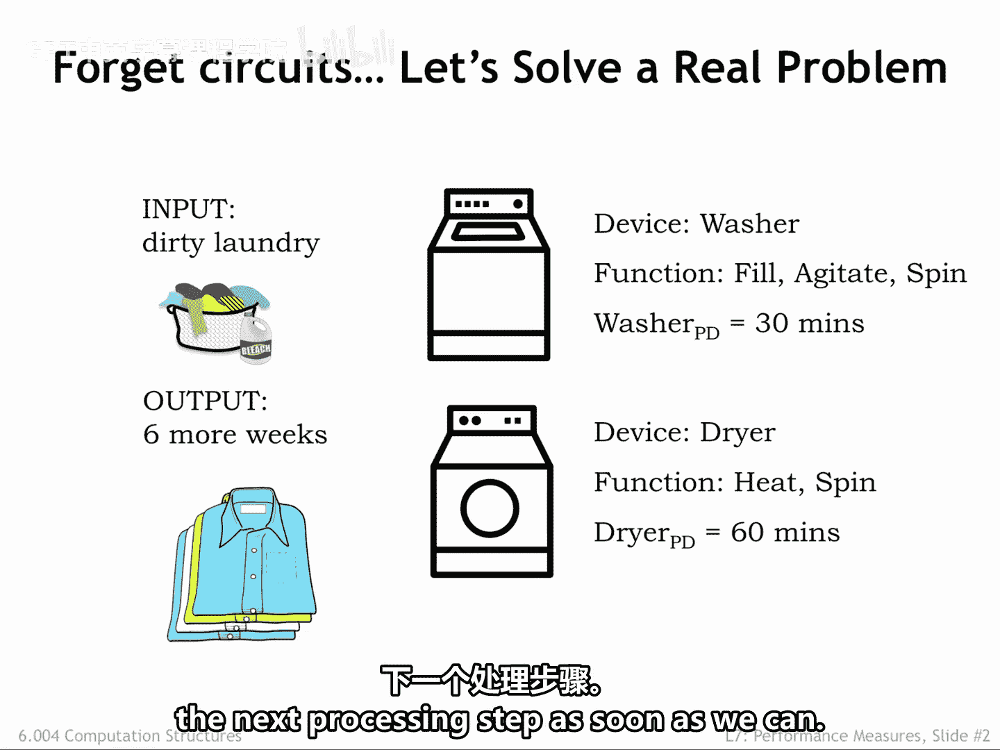
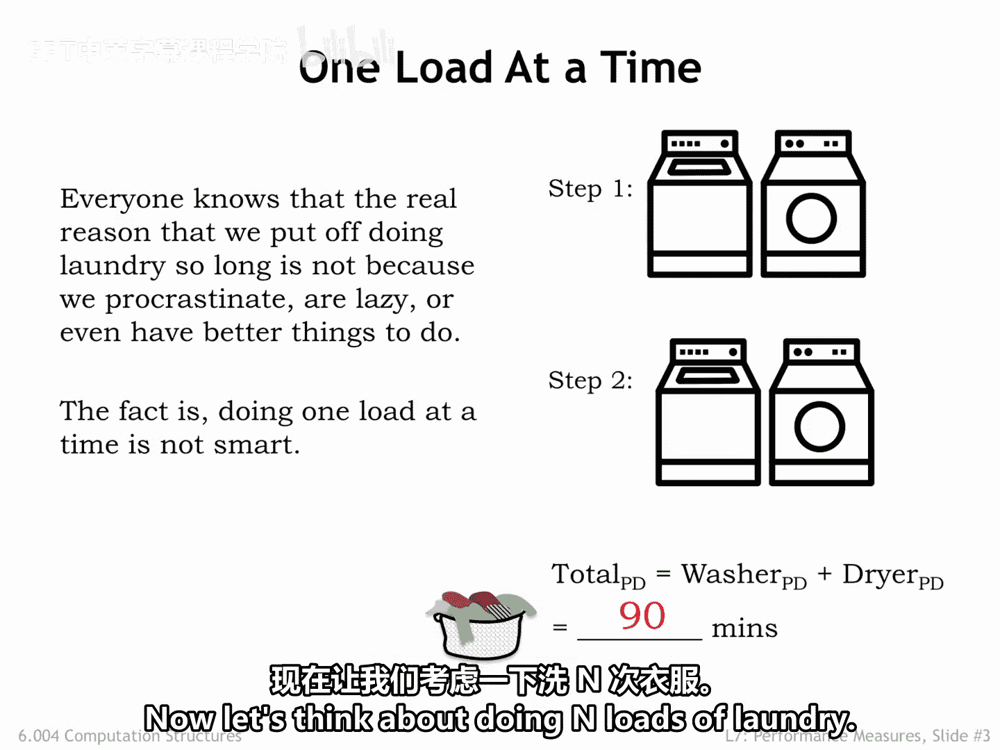
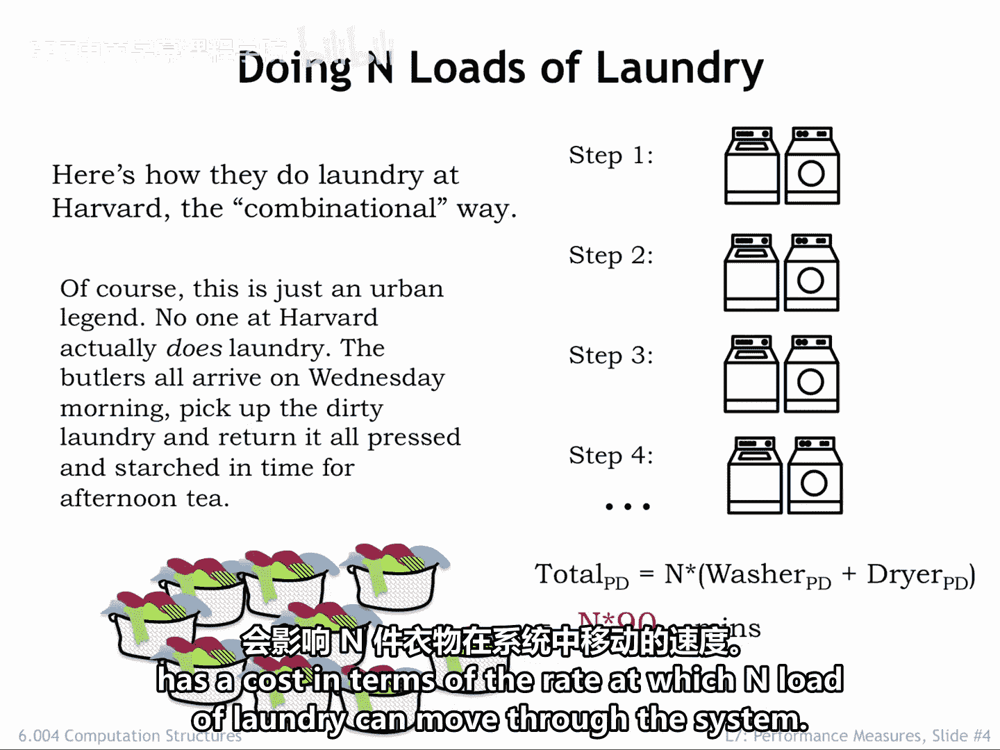
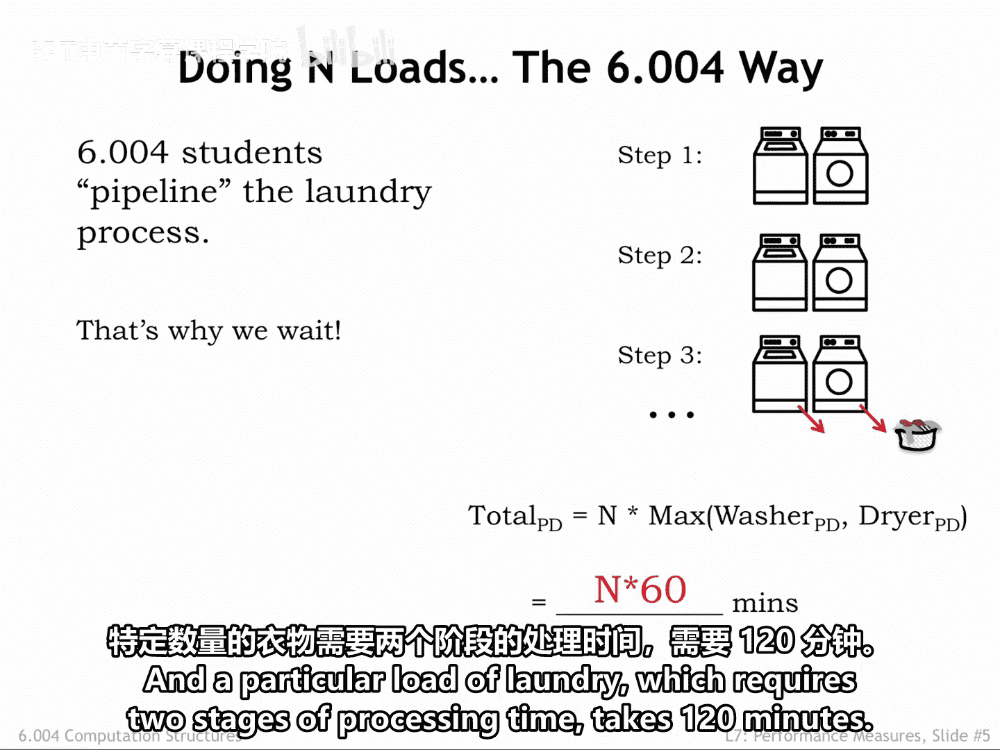
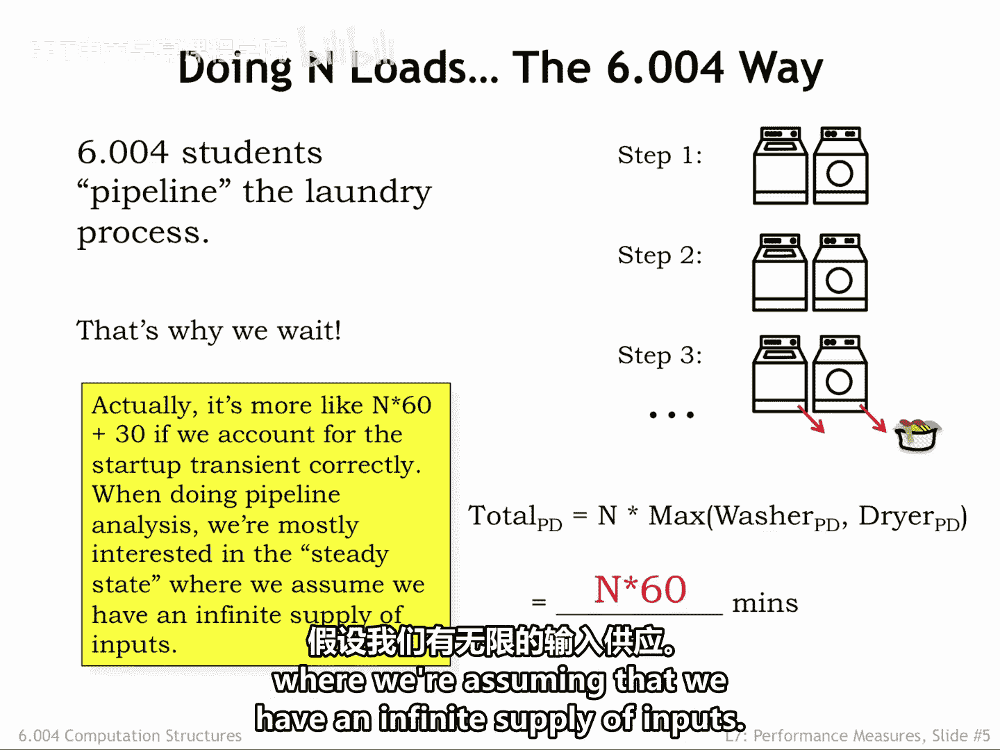
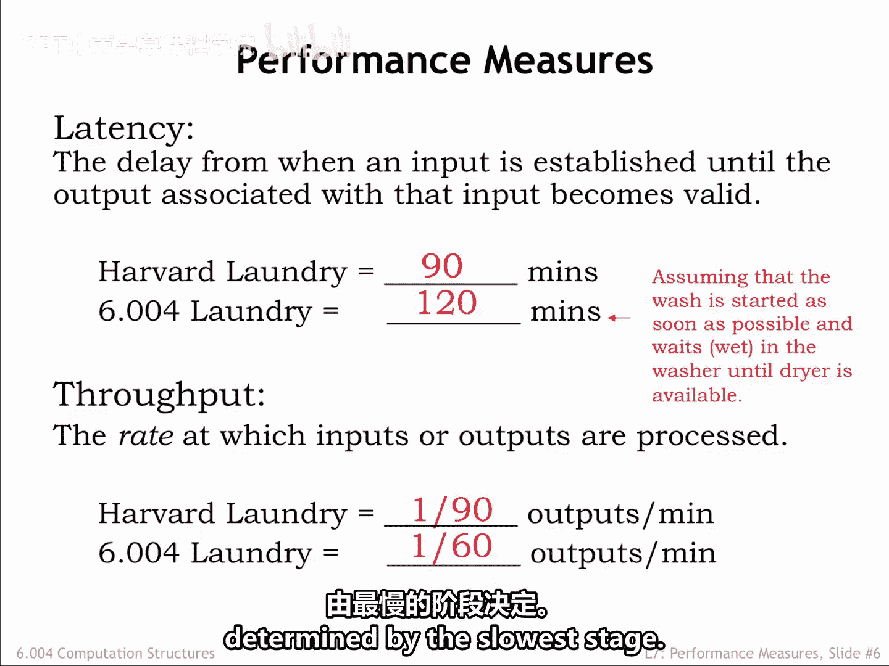

# 【数字系统与计算机架构P1 6.004 2017】麻省理工学院—中英字幕 p61 7.2.1 Latency and Throughput -BV1DZ421E7Yz_p61-

In this chapter， our goal is to introduce some metrics for measuring the performance of a circuit and then investigate ways to improve that performance。

We'll start by putting aside side circuit for a moment and looking at an everyday example that will help us understand the proposed performance metrics。

Laundry is a processing task we all have to face at some point。

The input to our laundry system is some number of loads of dirty laundry。

 and the output is the same loads， but washed， dried and folded。There are two system components。

 a washer that washes a load of laundry in 30 minutes and a dryer that dries a load in 60 minutes。

 You may be used to laundry system components with different propagation delays。

 but let's go with these delays for our example。Our laundry follows a simple path through the system。

 Each load is first washed in the washer and afterwards moved to the dryer for drying。There can。

 of course， be delays between the steps of loading the washer or moving wet wash loads to the dryer or in taking dried loads out of the dryer。

Let's assume we move the laundry through the system as fast as possible。

 moving loads to the next processing step as soon as we can。

Most of us wait to do laundry until we've accumulated several loads。

 That turns out to be a good strategy。 Let's see why。To process a single load of laundry。

 we first run it through the washer， which takes 30 minutes。Then we run it through the dryer。

 which takes 60 minutes， so the total amount of time from system input to system output is 90 minutes。

If this were a combinational logic circuit， we'd say the circuit's propagation delay is 90 minutes from valid inputs to valid outputs。

Okay， that's the performance analysis for a single load of laundry。

 now let's think about doing n loads of laundry。

Here at MIT， we like to make gentle fun of our colleagues at the prestigious institution just up the river from us。

So here's how we imagine they do n loads of laundry at Harvard。

They follow the combinational recipe of supplying new system inputs after the system generates the correct output from the previous set of inputs。

So in step 1， the first load is washed and in step 2， the first load is dried。

 taking a total of 90 minutes。Once those steps are complete， Harvard students move on to step 3。

 starting the processing of the second load of laundry and so on。

The total time for the system to process n laundry loads is just n times the time it takes to process a single load。

So the total time is n times 90 minutes。Of course， we're being silly here。

 Harvard students don't actually do laundry。 Mumy sends the family butler over in Wednesday mornings to collect their dirty loads and return them starched and pressed in time for afternoon tea。

But I hope you're seeing the analogy we're making between the harbor approach to laundry and combinational circuits。

 We can all see that the washer is hitting idle while the dryer is running。

 and that inefficiency has a cost in terms of the rate at which end loads of laundry can move through the system。

As engineering students here in 604， we see that it makes sense to overlap washing and drying。

 So in step 1， we wash the first load， and in step 2， we dry the first load as before。

 But in addition， we start washing the second load of laundry。

 We have to allocate 60 minutes for step 2 in order to give the dryer time to finish。

There's a slight inefficiency in that the washer finishes its work early。

 but with only one dryer it's the dryer that determines how quickly laundry moves through the system。

Systems that overlap the processing of a sequence of inputs are called pipeline systems。

 and each of the processing steps is called a stage of the pipeline。

The rate at which inputs move through the pipeline is determined by the slowest pipeline stage。

Our laundry system is a two stage pipeline with a 60 minute processing time for each stage。

We repeat the overlapped wash dry step until all end loads of laundry have been processed。

 We're starting a new washer load every 60 minutes and getting a new load of dried laundry from the dryer every 60 minutes。

 In other words， the effective processing rate of our overlapped laundry system is one load every 60 minutes。

So once the process is underway， n loads of laundry takes n times 60 minutes。

And a particular load of laundry， which requires two stages of processing time， takes 120 minutes。

The timing for the first load of laundry is a little different since the timing of step1 can be shorter with no dryer to wait for。

But in the performance analysis of pipeline systems。

 we're interested in the steady state where we're assuming that we have an infinite supply of inputs。

 We see that there are two interesting performance metrics。

The first is the latency of the system， the time it takes the system to process a particular input。

In the Harvard laundry system， it takes 90 minutes to wash and dry a load。In the 6A04 laundry。

 it takes 120 minutes to wash and dry a load， assuming that it's not the first load。

The second performance measure is throughput， the rate at which the system produces outputs。

In many systems we get one set of outputs for each set of inputs， and in such systems。

 the throughput also tells us the rate at which inputs are consumed。In the Harvard laundryund system。

 the throughput is one load of laundry every 90 minutes。In the 6W04 laundry。

 the throughput is one load of laundry every 60 minutes。Though Harvard laundry has lower latency。

 the 6A04 laundry has better throughput。Which is the better system？Well， that depends on your goals。

If you need to wash 100 loads of laundry， you'd prefer to use the system with higher throughput。If。

 on the other hand， you want clean underwear for your date in 90 minutes。

 You're much more concerned about the latency。The laundry example also illustrates a common trade off between latency and throughput。

If we increase throughput by using pipeline processing。

 the latency usually increases since all pipeline stages must operate in lockstep。

 and the rate of processing is thus determined by the slowest stage。

