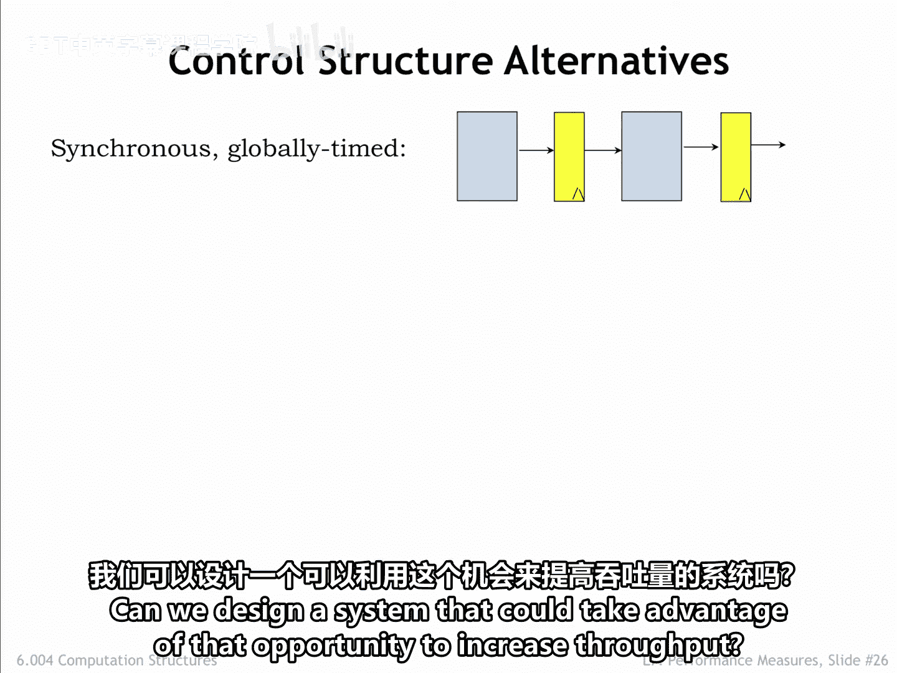
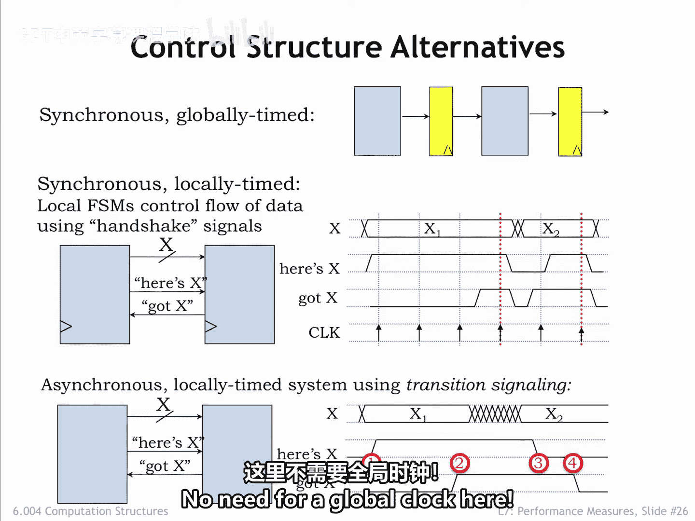
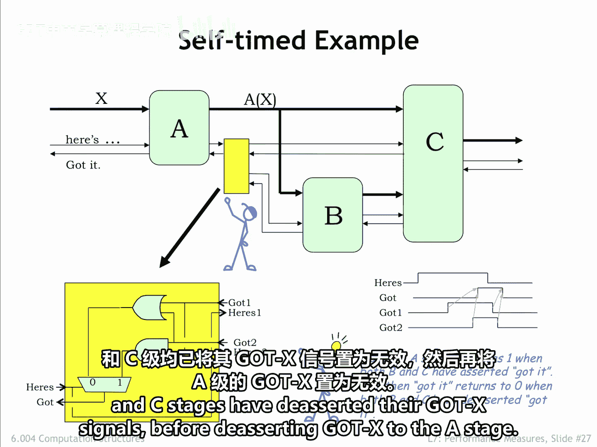
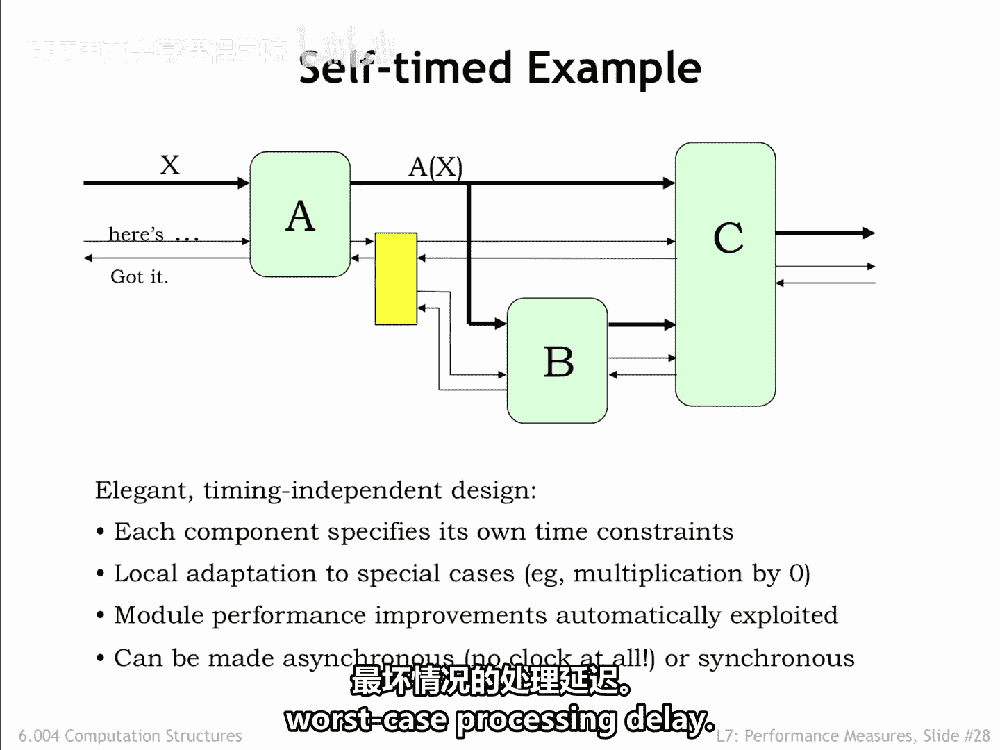

# 【数字系统与计算机架构P1 6.004 2017】麻省理工学院—中英字幕 p65 7.2.5 Self-timed Circuits -BV1DZ421E7Yz_p65-

We've been designing our processing pipelines to have all the stages operate in lockstep。

 choosing the clock period to accommodate the worst case processing time over all the stages。

 this is what we'd call a synchronous globally time system。

But what if there are data dependencies in the processing time， in other words。

 if for some data inputs， a particular processing stage might be able to produce its output in a shorter time？

Can we design a system that could take advantage of that opportunity to increase throughput？

One alternative is to continue to use a single system clock。

 but for each stage to signal when it's ready for a new input and when it has a new output ready for the next stage。

It's fun to design a simple two signal handshake protocol to reliably transfer data from one stage to the next。

The upstream stage produces a signal called here's X to indicate that it has new data for the downstream stage。

 and the downstream stage produces a signal called GodX to indicate when it is willing to consume data。

It's a synchronous system， so the signal values are only examined on the rising edge of the clock。

The Handshake protocol works as follows。The upstream stage asserts here's x if it will have a new output value available at the next rising edge of the clock。

The downstream stage asserts GodX if it will grab the next output at the rising edge of the clock。

Both stages look at the signals on the rising edge of the clock to decide what to do next。

If both stages see that heres x and God x are asserted at the same clock edge。

 the handshake is complete， and the data transfer happens at that clock edge。

Either stage can delay a transfer， yet they're still working on producing the next output or consuming the previous input。

It's possible， although considerably more difficult to build a clock free asynchronous self time system that uses a similar handshake protocol。

The handshake involves four phases。In phase1， when the upstream stage has a new output and GodX is deasserted。

 it asserts its hero signal and then waits to see the downstream stages' reply on the GodX signal。

In phase 2， the downstream stage seeing that here is x is asserted。

A search God asks when it has consumed the available input。In phase 3。

 the downstream stage waits to see here' x go low， indicating that the upstream stage has successfully received the GodX signal。

In phase 4， once here is X is deassered， the downstream stage deasserts GodX and the transfer handshake is ready to begin again。

Note that the upstream stage waits until it sees god X deasserted before starting the next handshake。

 The timing of the system is based on the transitions of the handshake signals。

 which can happen at any time。 the conditions required by the protocol are satisfied。

No need for a global clock here。

It's fun to think about how this self time protocol might work when there are multiple downstream modules。

 each with their own internal timing。In this example。

 A's output is consumed by both the B and C stages。

We need a special circuit shown as a yellow box in the diagram to combine the Godette signals from the B and C stages and produce a summary signal for the A stage。

Let's take a quick look at the timing diagram shown here。After A is asserted here is x。

 the circuit in the yellow box waits until both the B and the C stage have asserted their GodX signals before asserting God x to the A stage。

At this point， the A stage D assertserts heres X， then the yellow box waits until both the B and C stages have deasered their GodX signals before deasserting Godt x to the A stage。

Let's watch the system in action。 When a signal is asserted， We'll show it in red。

 Otherwise it's shown in black。 A new value for the A stage arrives on A's data input。

 and the module supplying the value then asserts its heres Act signal to let a know that it has a new input。

At some point later， a signals Godt x back upstream to indicate that it has consumed the value。

 then the upstream stage deserts， here's x followed by A deasserting its GodX signal。

 this completes the transfer of the data to the a stage。

When A is ready to send a new output to the B and C stages。

 it checks that its Godt X signal is deasered， which it is。

 so it asserts the new output value and signals here's x to the yellow box。

 which forged the signal to the downstream stages。B is ready to consume the new input。

 and so asserts its GodX output。Note that C is still waiting for its second input and has yet to assert its GodX output。

After B finishes its computation， it supplies a new value to C and asserts its hereous x signal output to let C know that its second input is ready。

Now C is happy and signals both upstream stages that it has consumed as two inputs。

Now that both Gt's inputs are asserted， the yellow box asserts。

A's GodX's input to let it know that the data has been transferred。Meanwhile。

 B completes is part of the handshake， and C completes its transaction with B。

And AD asserts here's X to indicate that it has seen the GodX input。

When the B and C stages see there， heres x signals go low。

They finish their handshakes by de assertsing their GodX outputs， and when they're both low。

 the yellow box lets A know the handshake is complete by D assertsering A's GodX input。

the system has returned to the initial state where a is now ready to accept some future input value。

This is an elegant design based entirely on transition signaling。

 Each module is in complete control of when it consumes inputs and produces outputs。

 and so the system can process data at the fastest possible speed rather than waiting for the worst case processing delay。

