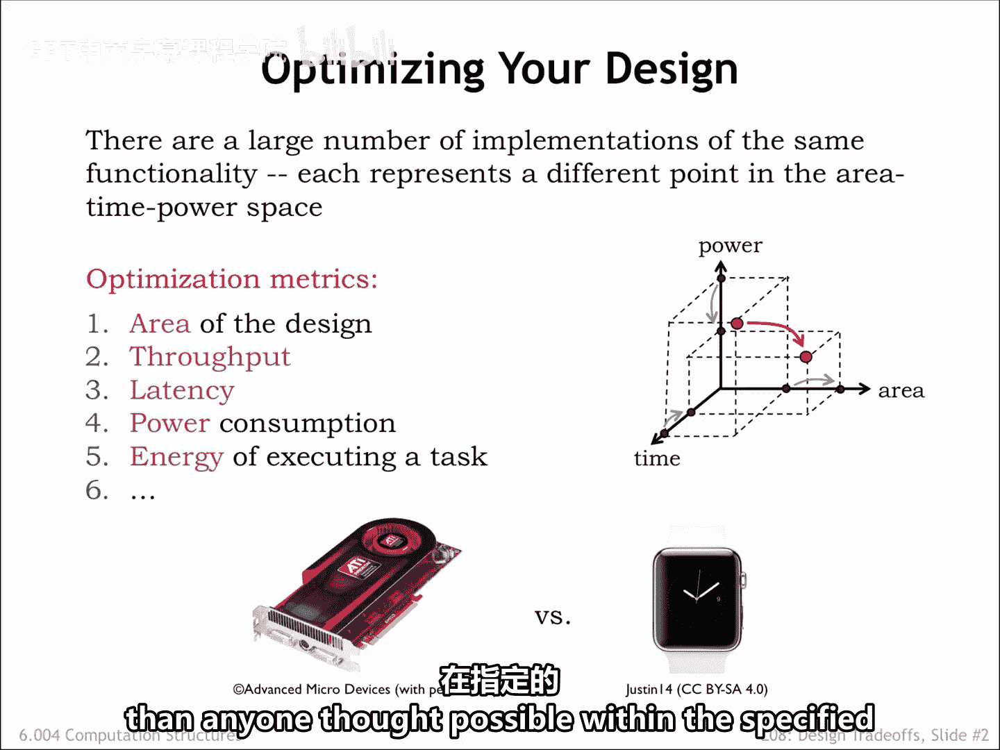
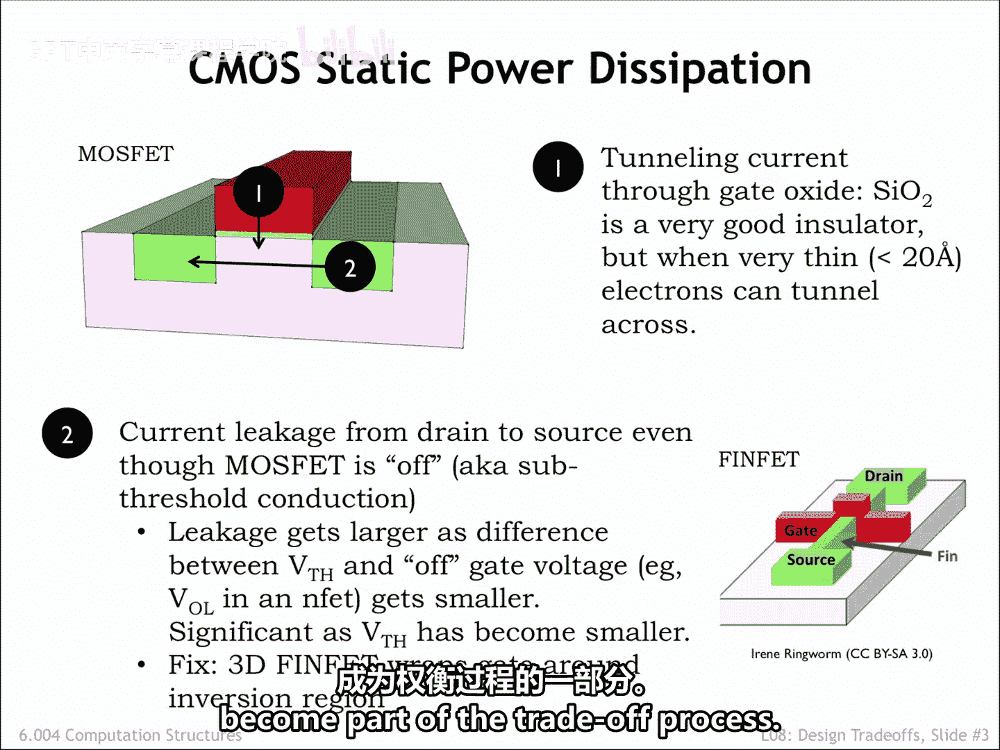
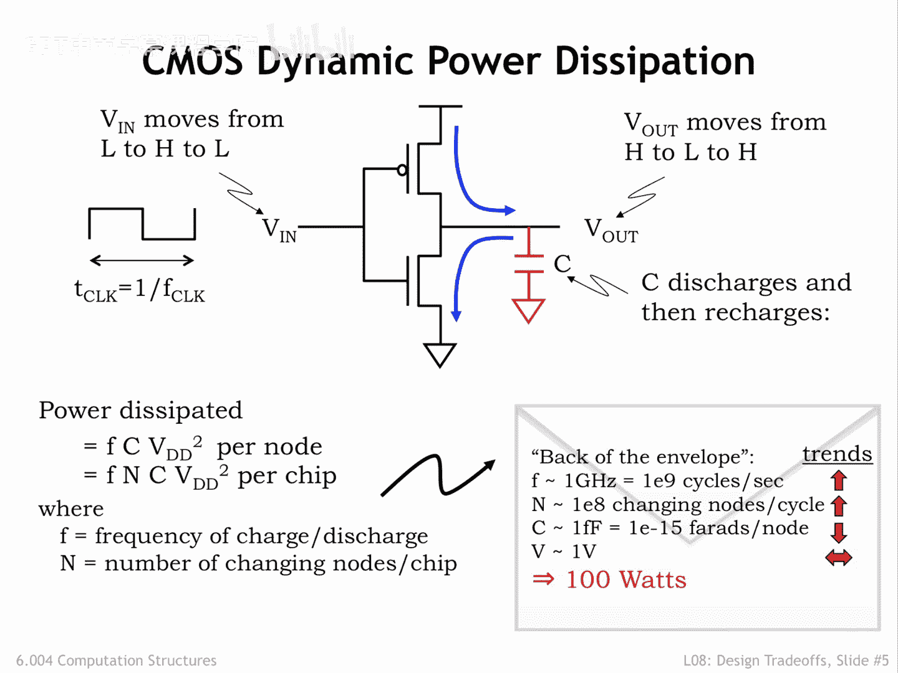
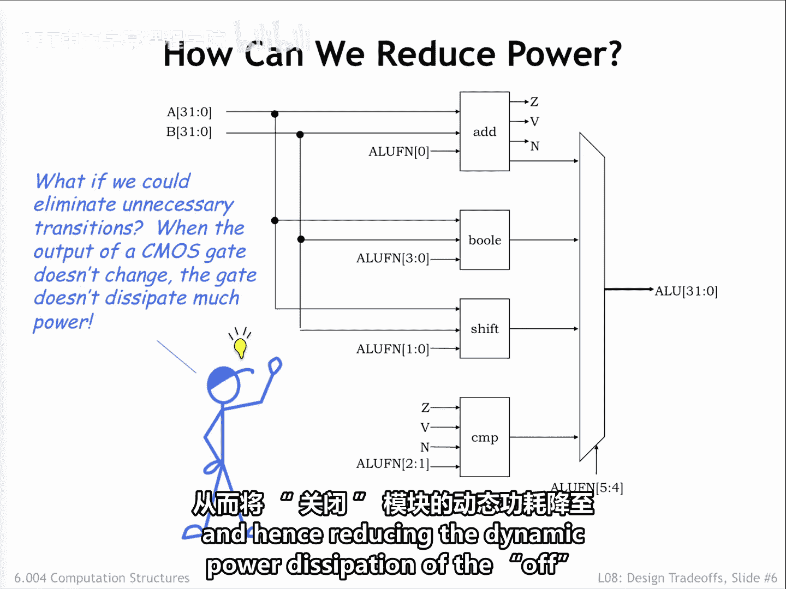
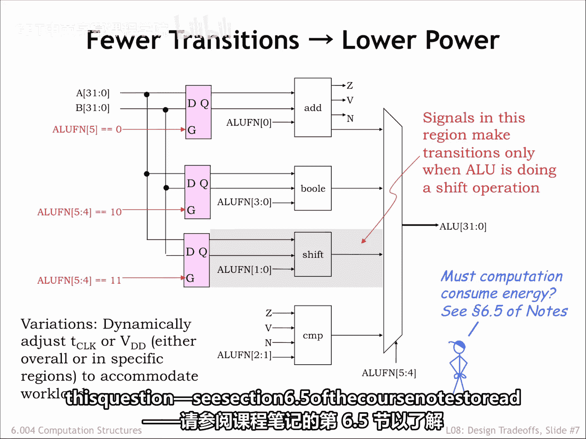

# 【数字系统与计算机架构P1 6.004 2017】麻省理工学院—中英字幕 p69 8.2.1 Power Dissipation -BV1DZ421E7Yz_p69-

In this final chapter， we're going to look into optimizing digital systems to make them smaller。

 faster， higher performance， more energy efficient， and so on。

It would be wonderful if we could achieve all these goals at the same time。

 and for some circuits we can。But in general， optimizing in one dimension usually means doing less well in another。

In other words， there are designed trade offs to be made。

Making trade offs correctly requires that we have a clear understanding of our design goals for the system。

Consider two different design teams， one is charged with building a high end graphics card for gaming。

 the other with building the Apple Watch。The team building the graphics card is mostly concerned with performance。

 and within limits is willing to trade off cost and power consumption to achieve their performance goals。

Graphics cards have a set size， so there's a high priority in making the system small enough to meet the required size。

 but there's little to be gained by making it smaller than that。

The team building the watch has very different goals。Size and power consumption are critical。

 since it has to fit on a wrist and run all day without leaving scorch marks on the wearer's wrist。

Suppose both teams are thinking about pipe planning part of their logic for increased performance。

Pipelining registers are an obvious additional cost。

The overlap execution and higher tea clock made possible by pipelining would increase the power consumption and the need to dissipate that power somehow。

You can imagine the two teams might come to very different conclusions about the correct course of action。

This chapter takes a look at some of the possible tradeoffs。But as designers。

 you'll have to pick and choose which trade offs are right for your design。

This is the sort of design challenge on which good engineers thrive。

Nothing is more satisfying than delivering more than anyone thought possible within the specified constraints。

Our first optimization topic is power dissipation， where the usual goal is to either meet a certain power budget or to minimize power consumption while meeting all the other design targets。

In CMOS circuits， there are several sources of power dissipation， some under our control， some not。

Static power dissipation is power that is consumed even when the circuit is idle， in other words。

 no nodes are changing value。Using our simple switch model for the operation of MoOSsFEs。

 we'd expect CMOOS circuitirs to have zero static power dissipation。And in the early days of Seemoss。

 we came pretty close to meeting that ideal。But as the physical dimensions of the mossfet have shrunk and the operating voltages have been lowered。

 there are two sources of static power dissipation in mossfes that have begun to loom large。

We'll discuss the effects as they appear in in channel Mossvets。

 but keep in mind that they appear in P channel mosvets too。

The first effect depends on the thickness of the Mosst's gate oxide。

 shown as the thin yellow layer in the Mossvet diagram on the left。

In each new generation of integrated circuit technology。

 the thickness of this layer has shrunk as part of the general reduction in all the physical dimensions。

The thinner insulating layer means stronger electrical fields that cause a deeper aversion layer that leads to nphs that carry more current。

 producing faster ga speeds。Unfortunately， their layers are now thin enough that electrons can tunnel through the insulator。

 creating a small flow of current from the gate to the substrate with billions of nfs in a single circuit。

 Even tiny currents can add up to non negligible power drain。

The second effect is caused by current flowing between the drain and source of an inFt that is in theory。

 not conducting because VGS is less than the threshold voltage。Appropriately。

 this effect is called sub threshold conduction and is exponentially related to VGS minus VTH。

 a negative value when the endVt is off。So as VTH has been reduced in each new generation of technology。

 VGS minus VTH is less negative and the subthres conduction has increased。

One fix has been to change the geometry of the NFt， so the conducting channel is a tall。

 narrow fin with the gate terminal wrapped around three sides。

 sometimes referred to as a trigate configuration。This has reduced the sub thresholdre conduction by an order of magnitude or more。

 solving this particular problem for now。Neither of these effects is under the control of the system designer。

 except of course， if they're free to choose an older manufacturing process。

We mention them here so that you're aware that newer technologies often bring additional costs that then become part of the trade off process。

A designer does have some control over the dynamic power dissipation of the circuit。

 The amount of power spent causing the nodes to change value during a sequence of computations。

 Each time a node changes from 0 to 1 or one to 0。 currents flow through the mosfet pull up and pull down networks。

 charging in discharging the output node's capacitance， and thus changing its voltage。

 Consider the operation of an inverter as the voltage of the input changes。

 the pull up and pull down networks turn on and off。

 connecting the inverter's output node to VDD or ground。

 Dischars or discharges the capacitance of the output node， changing its voltage。

 we can compute the energy required by integrating the instantaneous power associated with the current flow into and out of the capacitor。

 times the voltage across the capacitor over the time taken by the output transition。

The instantaneous power dissipated across the resistance of the Mosvet channel is simply IS times VdS。

 Here's the power calculation using the energy integral for the one to0 transition of the output node。

 where we're measuring I S using the equation for the current flowing out of the output nodes capacitor。

 I equals C DDT。 assuming that the input signal is a clock signal of period T clock。

 and that each transition is taking half a clock cycle。

 We can work through the math to determine that the power dissipated through the pull out network is one half F C VDD squared。

 where the frequency F tells us the number of such transitions per second。 C is the nodal capacitors。

 and VDD， the power supply voltage is the starting voltage of the nodal capacitor。

 There's a similar integral for the current dissipated by the pull up network when charging the capacitor and it yields the same result。

 So one complete cycle of charging then。😊，Discharging dissipates F c v squared watts。

Note that all this power has come from the power supply。

 The first half is dissipated when the output node is charged and the other half stored as energy in the capacitor。

Then the capacitor's energy is dissipated as it discharges。

These results are summarized in the lower left。 We've added the calculation for the power dissipation of an entire circuit。

 assuming n of the circuit's nodes change each clock cycle。

How much power could be consumed by a modern integrated circuit？

 Here is a quick back of the envelope estimate for a current generation CPU chip。It's operating at。

 say，1 gigahertz and will have 100 million internal nodes that could change each clock cycle。

Each nodal capacitance is around1 femtofaed， and the power supply is about 1 V。 With these numbers。

 the estimated power consumption is 100 Ws。 We all know how hot 100 wt light bulbcas。

 You can see it would be hard to keep the CPU from overheating。

This is way too much power to be dissipated in many applications， and modern CPUs intended。

 say for laptops only dissipate a fraction of this energy。

 so the CPU designers must have some tricks up their sleeve， some of which we'll see in a minute。

But first， notice how important it's been to be able to reduce the power supply voltage in modern integrated circuits。

 If we're able to reduce the power supply voltage from 3。3 V to one fold。

 that alone accounts for more than a factor of 10 in power dissipation。

 So the newer circuit can be say five times larger and two times faster with the same power budget。😊。

Newer technology trends are shown here。 The net effect is that newer chips would naturally dissipate more power if we could afford to have them do so。

 We have to be very clever in how we use more and faster mossfats in order not to run up against the power dissipation constraints we face。

To see what we can do to reduce power consumption， consider the following diagram of an arithmetic and logic unit。

 AOU， like the one you'll design in the final lab in this part of the course。

There are four independent component modules performing the separate arithmetic Boolean shifting and comparison operations typically found in an AU。

Some of the AOU control signals are used to select the desired result in a particular clock cycle。

 basically ignoring the answers produced by the other modules。Of course。

 just because the other answers aren't selected doesn't mean we didn't dissipate energy in computing them。

This suggests an opportunity for saving power。Suppose we could somehow turn off modules whose outputs we didn't need。

 one way to prevent them from dissipating power is to prevent the module's inputs from changing。

 thus ensuring that no internal nodes would change。

 and hence reducing the dynamic power dissipation of the off module to0。

One idea is to put latches on the inputs to each module。

 only opening a module's input latch if an answer was required from that module in the current cycle。

If a module's latch stayed closed， its internal nodes would remain unchanged eliminating the module's dynamic power dissipation。

This could save a substantial amount of power。For example。

 the shifter circuitry has many internal nodes and so has a large dynamic power dis。

 but there are comparatively few shift operations in most programs。 So with our proposed fix。

 most of the time those energy costs wouldn't be incurred。

A more draconian approach to power conservation is to literally turn off unused portions of the circuit by switching off their power supply。

This is more complicated to achieve， so this technique is usually reserved for special power saving modes of operation。

 where we can afford the time it takes to reliably power the circuitry backup。

Another idea is to slow the clock， reducing the frequency of nodal transitions。

 when there's nothing for the circuit to do。This is particularly effective for devices that interact with the real world。

 where the time scales for significant external events are measured in milliseconds。

The device can run slowly until an external event needs attention。

 then speed up the clock while it deals with the event。

All of these techniques and more are used in modern mobile devices to conserve battery power without limiting the ability to deliver bursts of performance。

There is much more innovation waiting to be done in this area。

 something you may be asked to tackle as designers。

One last question is whether computation has to consume energy。

There have been some interesting theoretical speculations about this question， see section 6。

5 of the course notes to read more。

