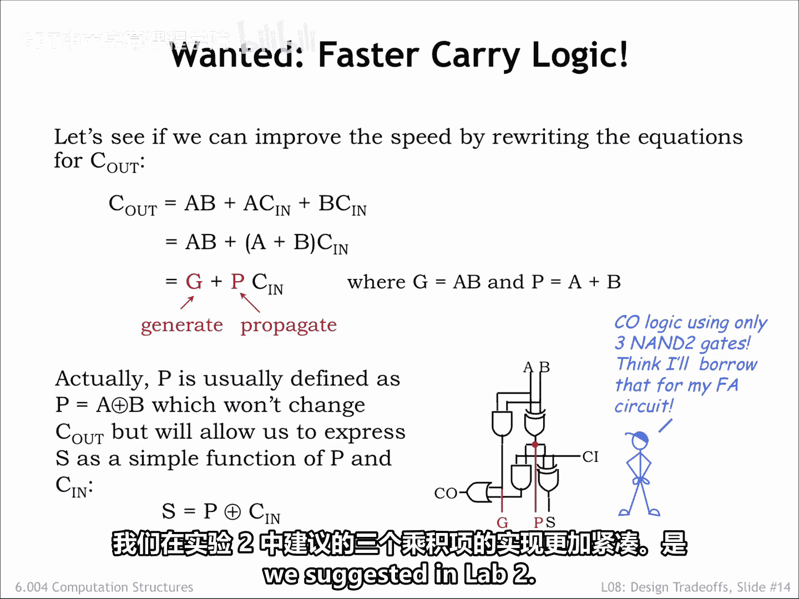
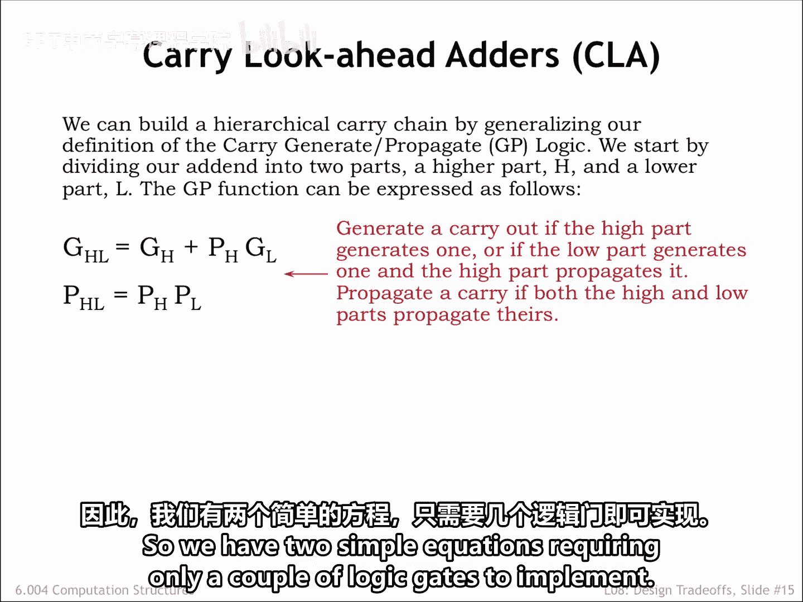
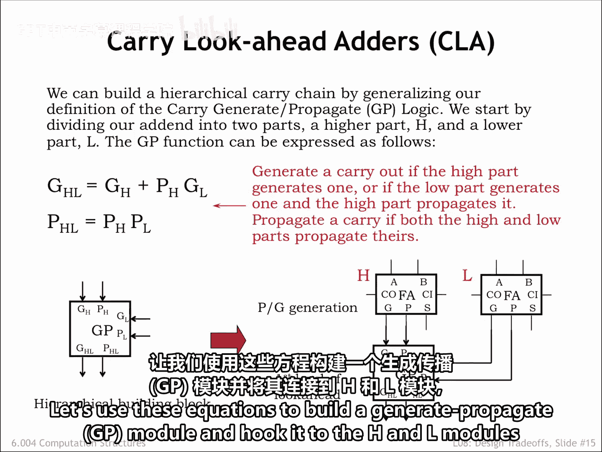
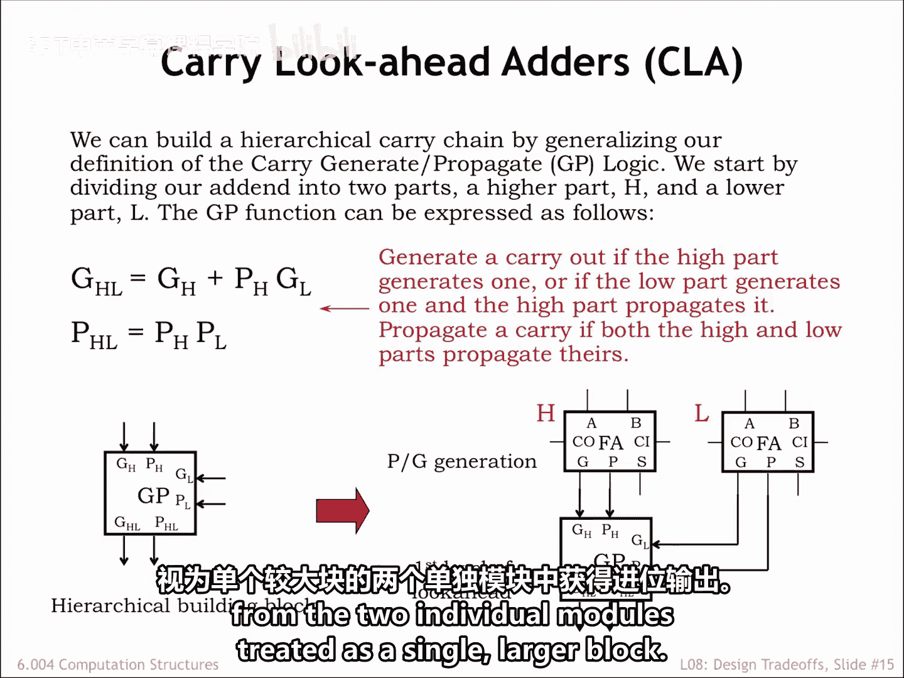
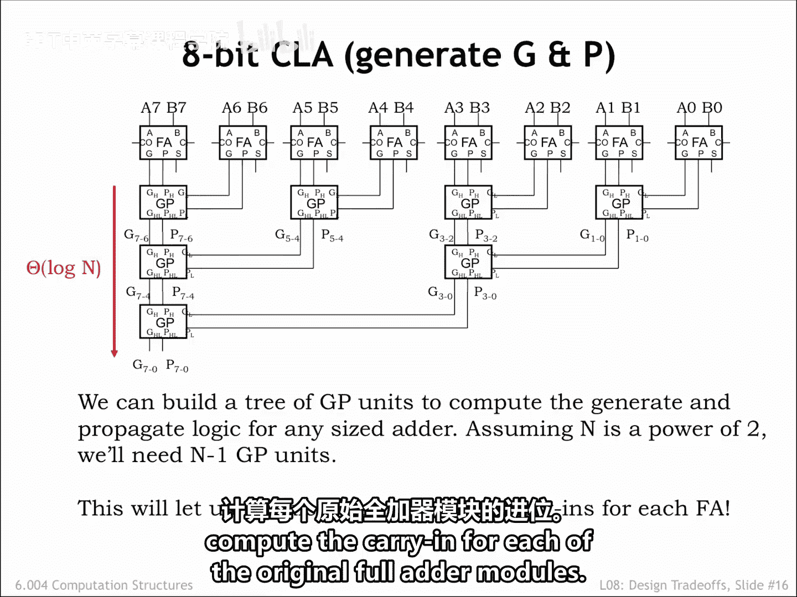
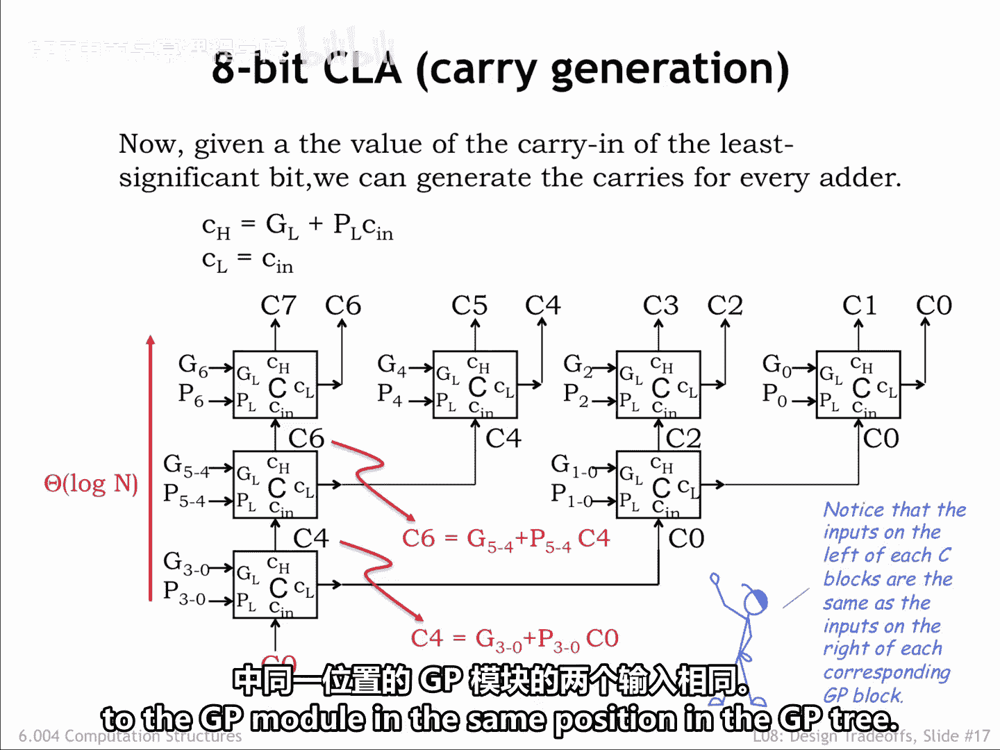
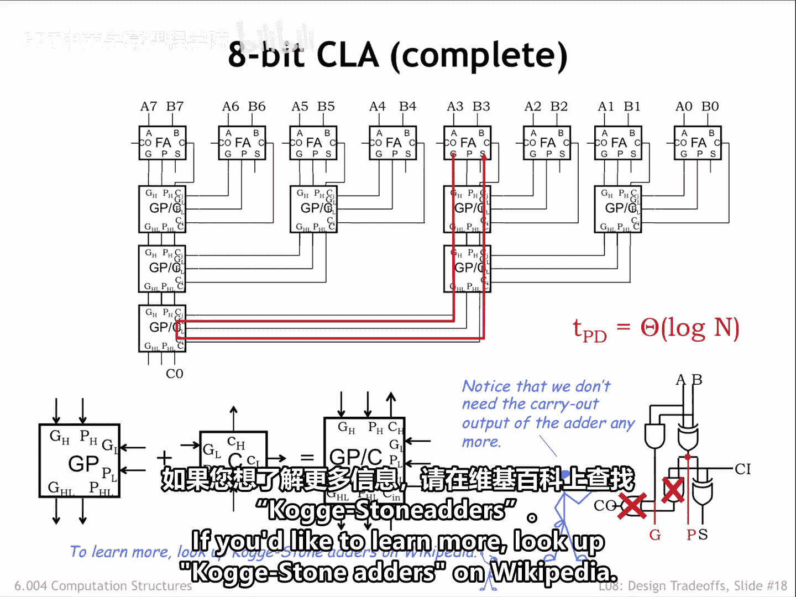

# 【数字系统与计算机架构P1 6.004 2017】麻省理工学院—中英字幕 p71 8.2.3 Carry-lookahead Adders -BV1DZ421E7Yz_p71-

Here's another approach to improving the latency of our adder。

 this time focusing just on the carry logic。Early on in the course。

 we learned that by going from a chain of logic gates to a tree of logic gates。

 we could go from a linear latency to a logarithmic latency。Let's try to do that here。

We'll start by rewriting the equations for the carryout from the full Adder module。

The final form of the rewritten equation has two terms。

The G or generate term is true when the inputs will cause the module to generate a carry out right away without having to wait for the carry in to arrive。

The P or propagate term is true if the module will generate a carry out only if there's a carry in。

So there are only two ways to get a carry out from the module。

 it's either generated by the current module or the carry in is propagated from the previous module。

Actually， it's usual to change the logic for the P term from A or B to A X or B。

 This doesn't change the chooseth table for the carryout。

 but will allow us to express the sum output as P X or carry in。

Heres the schematic for the reorganized full ladder module。

The little summer product circuit for the carryout can be implemented using three2 input Nand gates。

 which is a bit more compact than the implementation for the three product terms we suggested in lab 2。

 Time to update your full ladder circuit。

Now consider two adjacent adder modules in a larger adder circuit。

 we'll use the label H to refer to the high order module and the label L to refer to the low order module。

We can use to generate and propagate information from each of the modules to develop equations for the carryout from the pair of modules treated as a single block。

We'll generate a carryout from the block when a carryout is generated by the H module。

 or when a carryout is generated by the L module and propagated by the H module。

And will propagate the carry in through the block only if the L module propagates its carry in to the intermediate carryout。

And H propagates that to the final carryout。So we have two simple equations requiring only a couple of logic gates to implement。

Let's use these equations to build a generate propagate or GP module and hook it up to the H and L modules as shown。

The GM&P outputs of the GP module tell us under what conditions we'll get to carry out from the two individual modules treated as a single。

 larger block。

We can use additional layers of GP modules to build a tree of logic that computes the generate and propagate logic for adders with any number of inputs。

For an adder with n inputs， the tree will contain a total of n minus1 GP modules and have a latency that's order log n。

And the next step we'll see how to use the generate and propagate information to quickly compute the carry end for each of the original full ladder modules。

Once we're given the carry in C0 for the low order bit。

 we can hierarchically compute the carry in for each full adder module。

Given the carry in to a block of adds， we simply pass it along as the carry in to the low half of the block。

The carry in for the high half of the block is computed using to generate and propagate information from the low half of the block。

We can use these equations to build a C module and arrange the C modules in a tree as shown to use the C0 carry in to hierarchically compute the carry in to each layer of success smaller blocks until we finally reach the full outer modules。

For example， these equations show how C4 is computed from C0， and C6 is computed from C4。Again。

 the total propagation delay from the arrival of the C0 input to the carry ins for each full ladder is order log n。

Notice that the GL and PL inputs to a particular C module are the same as two of the inputs to the GP module in the same position in the GP3。

We can combine the GP module and C module to form a single carry Look ahead module that passes。

 generate and propagate information up the tree and carry in information down the tree。

The schematic at the top shows how to wire up the tree of carry Look ahead modules。

And now we get to the payoff for all this hard work。

The combined propagation delay to hierarchically compute the generate and propagate information on the way up。

 and the carry in information on the way down is order log N。

 which is then the latency for the entire adder since computing the thumb outputs only takes one additional Xor delay。

This is a considerable improvement over the order n latency of the Rple carder。A final design note。

 we no longer need the carry out circuitry in the full adder module so it can be removed。

Variations on this generate propagate strategy form the basis for the fastest known ater circuits。

If you'd like to learn more， look up Coggy stone adders on Wikipedia。

