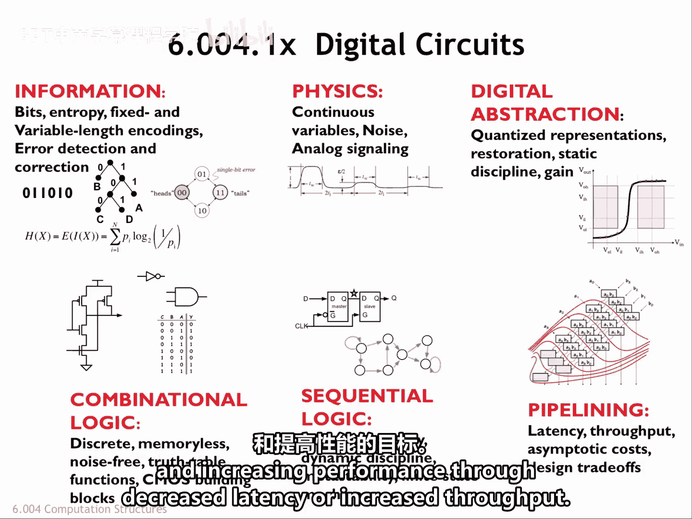
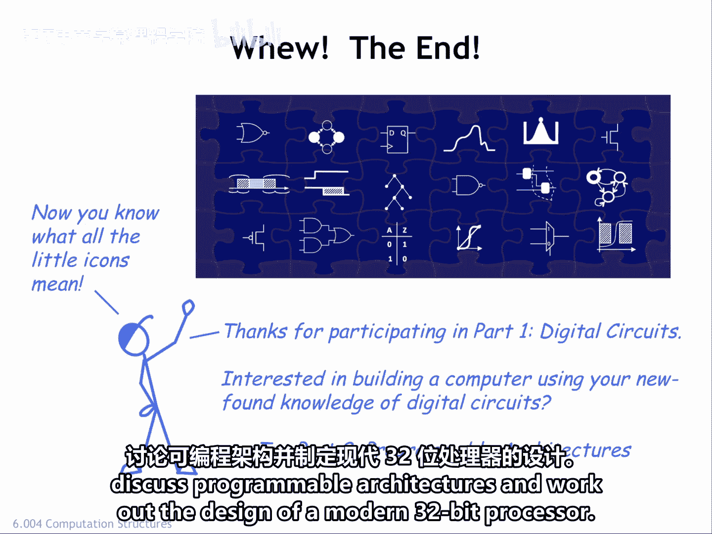

# 【数字系统与计算机架构P1 6.004 2017】麻省理工学院—中英字幕 p74 8.2.6 Part 1 Wrap-up -BV1DZ421E7Yz_p74-

The discussion of design trade offs completes Part one of the course。

 We've covered a lot of ground in the last eight lectures。

We started by looking at the mathematics underlying information theory and used it to help evaluate various alternative ways of effectively using sequences of bits to encode information content。

Then we turned to our attention to adding carefully chosen redundancies to our encoding to ensure that we could detect and even correct errors that corrupted our bit level encodings。

Next， we learned how analog signaling accumulates errors as we added processing elements to our system。

 We solved the problem by using voltages digitally。

 choosing two ranges of voltages to encode the bit value 0 and1。

 We had different signaling specifications for our outputs and inputs。

 adding noise margins to make our signaling more robust。

Then we develop the static discipline for combinational devices。

And were LED to the conclusion that our devices had to be nonlinear and exhibit gains greater than one。

In our study of combinational logic， we first learned about the mossfet， a voltage controlled switch。

 We developed a technique for using mossphts to build seamoss combinational logic gates。

 which met all the criteria of the static discipline。😊。

Then we discussed systematic ways of synthesizing larger combinational circuits that could implement any functionality we could express in the form of a truth table。

To be able to perform sequences of operations， we first developed a reliable bys storage element based on a positive feedback loop。

To ensure the storage elements work correctly， we imposed the dynamic discipline。

 which required inputs to the storage elements to be stable just before and after the time the storage element was transitioned to memory mode。

We introduce finite state machines as a useful abstraction for designing sequential logic。

And then we figured out how to deal with asynchronous inputs in a way that minimized the chance of incorrect operation due to metatability。

In the last two lectures， we developed latency and throughput as performance measures for digital systems and discussed ways of achieving maximum throughput under various constraints。

We discussed how it's possible to make trade offs to achieve goals of minimizing power participationip and increasing performance through decreased latency。

Or increase throughput。

H， that's a lot of information in a short amount of time。Mr。

 Blue and the rest of the 6 A04X staff hope you found the course useful in increasing your skills in designing digital systems and analyzing their operation。

You've completed several actual designs， and you're well on your way to designing a complete computer using our standard cell library。

 That's quite an accomplishment。If you'd like to continue the journey。

 please join us for part two of the course where we'll discuss programmable architectures and work out the design of a modern 32 bit processor。

See you then。