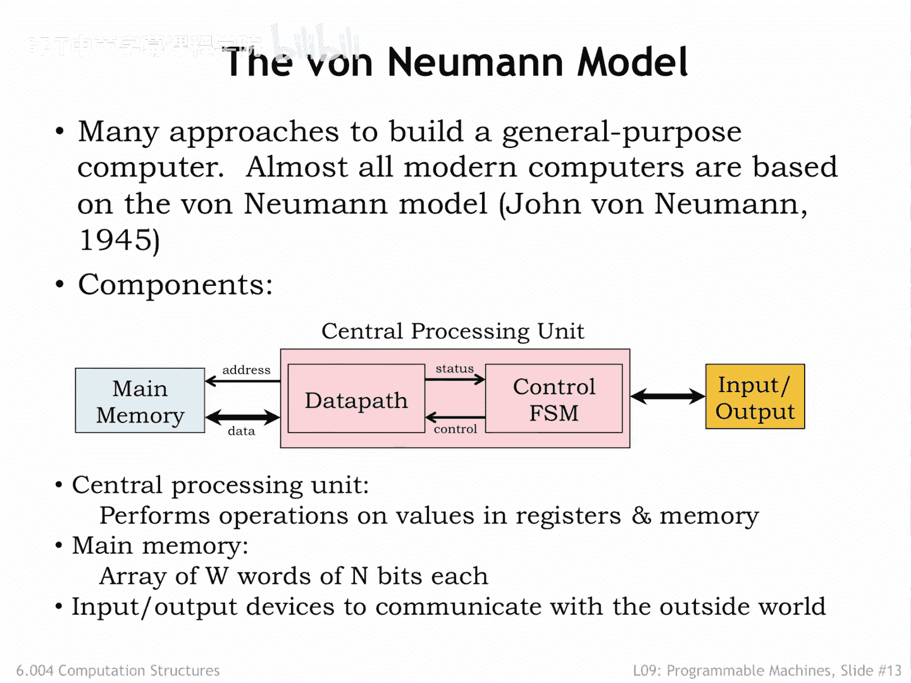
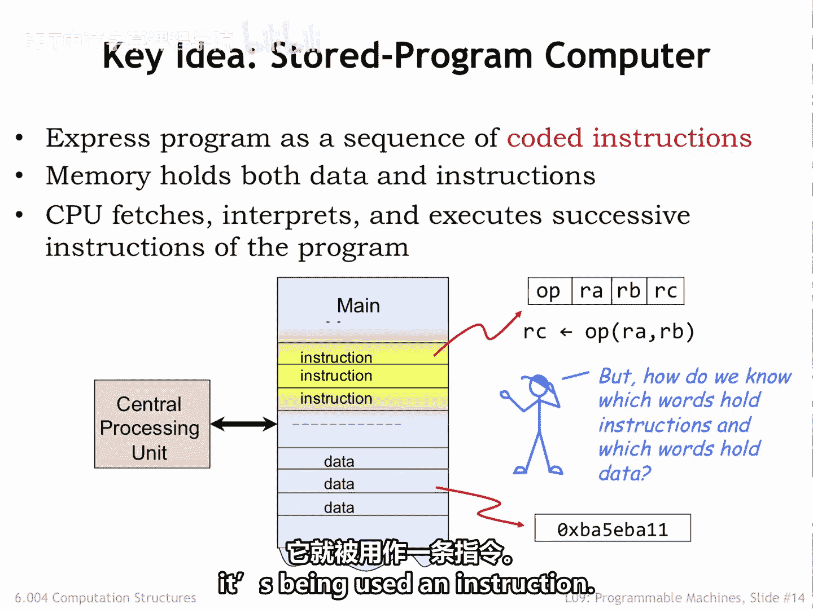
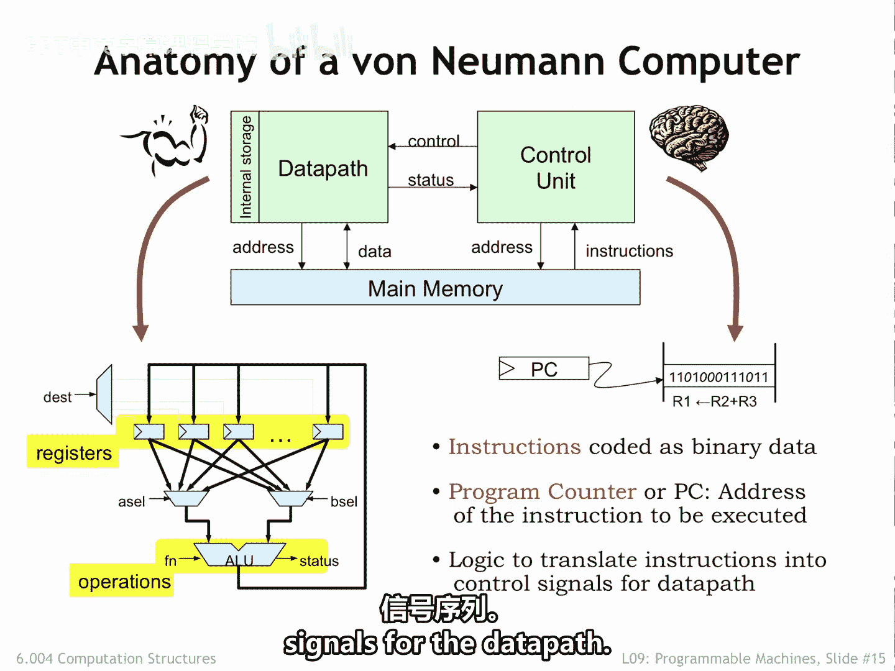
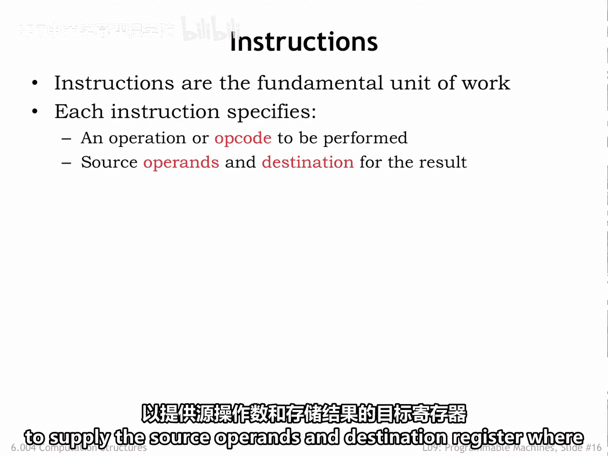
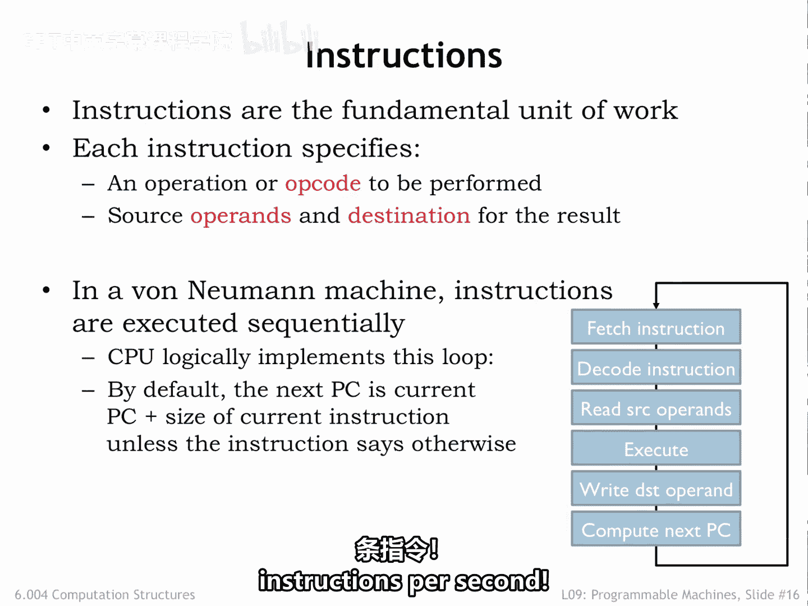
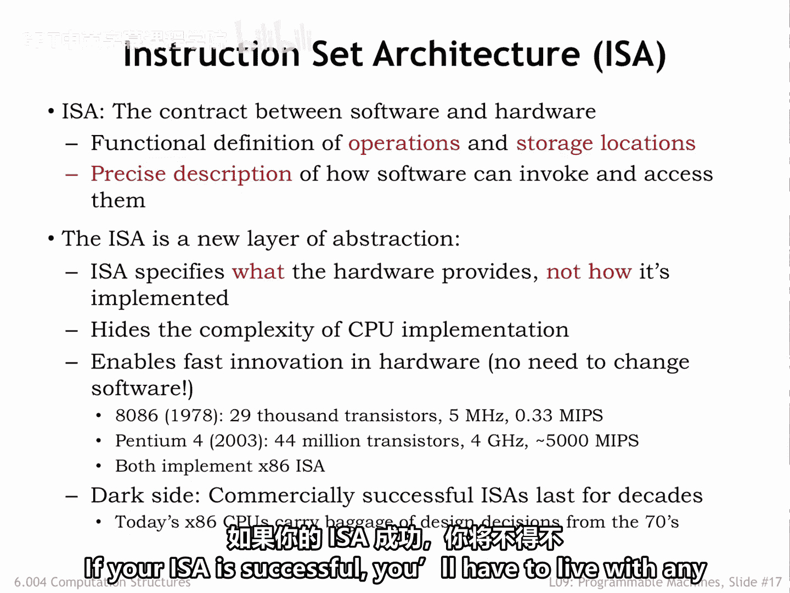
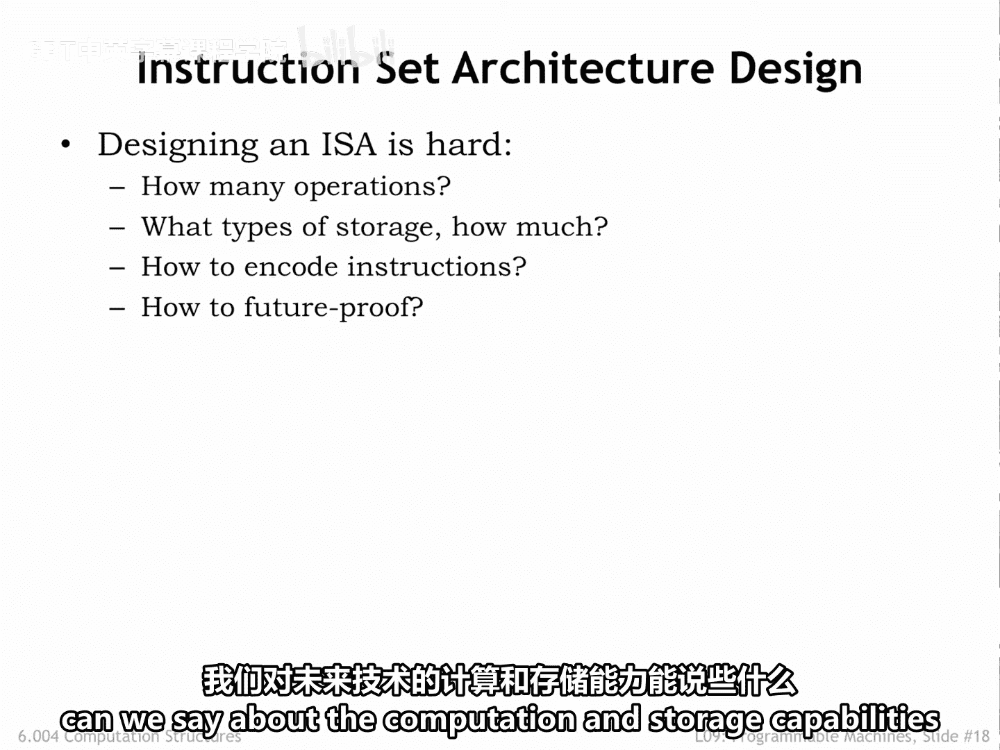
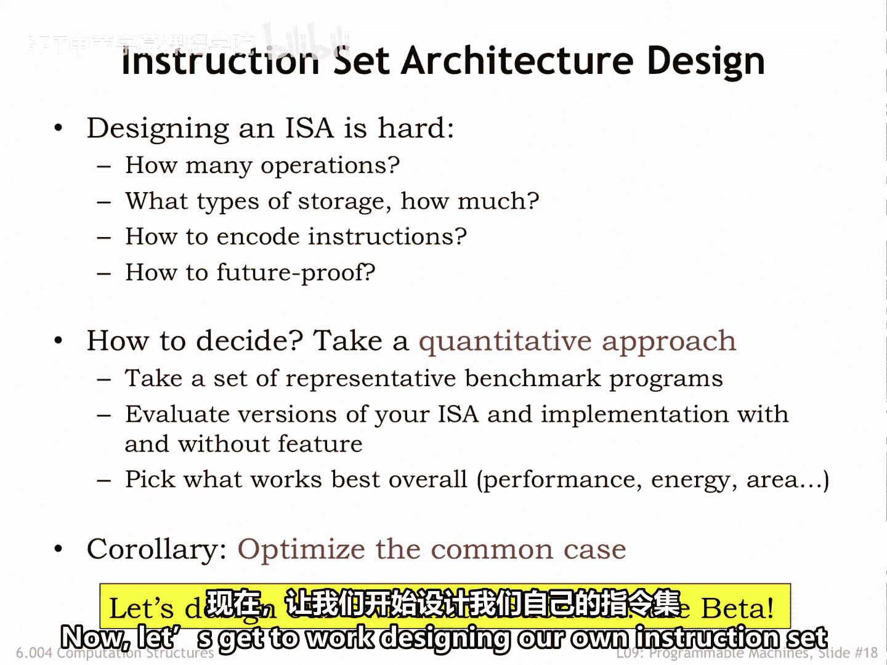

# 【数字系统与计算机架构P1 6.004 2017】麻省理工学院—中英字幕 p77 9.2.3 The von Neumann Model -BV1DZ421E7Yz_p77-

There are many approaches to building a general purpose computer that can be easily reprogrammed for new problems。

 Almost all modern computers are based on the stored programmed computer architecture developed by John Von Neumann in 1945。

 which is now commonly referred to as the Vanon Neumann model。

The Phneyman model has three components。 There's a central processing unit。

 also known as the CPUU that contains a data path and control FSM as described previously。

The CPU is connected to a readrite memory that holds some number W of words each with n bits。

 Nowadays， even small memories have a billion words， and the width of each location is at least 32 B。

 usually more。This memory is often referred to as main memory to distinguish it from other memories in the system。

You can think of it as an array when the CPU wishes to operate on values in memory。

 it sends the memory in array index， which we call the address， and after a short delay。

 currently tens of nanoseds。The memory will return the endbit value stored at that address。

Rightites to main memory follow the same protocol， except， of course。

 the data flows in the opposite direction。We'll talk about memory technologies a couple of lectures from now。

And finally， there are input output devices that enable the computer system to communicate with the outside world。

 or to access data storage that， unlike main memory， will remember values even when turned off。

The key idea is to use main memory to hold the instructions for the CPU as well as data。

Both instructions and data are， of course， just binary values stored in main memory。

Interpreted as an instruction， a value in memory can be thought of as a set of fields containing one or more bits encoding information about the actions to be performed by the CPU。

The Op code field indicates the operation to be performed。 For example， add， X or， compare。

Subsequent fields specify which registers supply the source opera and the destination register where the result is stored。

The CPU interprets the information in the instruction fields and performs the requested operation。

It would then move on to the next instruction of memory， executing the stored program step by step。

The goal of this chapter is to discuss the details of what operations we want the CPU to perform。

 how many registers we should have and so on。Of course， some values in memory are not instructions。

 They might be binary data representing numeric values， strings of characters， and so on。

The CPU will read these values into its temporary registers when it needs to operate on them and write newly computed values back into memory。

Mr。 Blue is asking a good question。 How do we know which words and memory are instructions and which are data。

 After all， they're both binary values。The answer is that we can't tell by looking at the values。

 It's how they're used by the CPU that distinguishes instructions from data。

 If a value is loaded into the data path， it's being used as data。

If a value is loaded by the control logic is' being used as an instruction。

So this is the digital system we' build to perform computations。

 We'll start with a data path that contains some number of registers to hold data values。

 We'll be able to select which registers will supply opera rans for the arithmetic and logic unit that will perform an operation。

The AOU produces a result and other status signals。

 The AOU result can be written back to one of the registers for later use。

Will provide the data path with the means to move data to and from main memory。

There will be a control unit that provides the necessary control signals to the data path In the example data path shown here。

 the control unit would provide a cell and B cell to select two register values as operas and desk to select the register where the A L U result will be written。

If the data path had， say， 32 internal registers， A cell， B cell and desk would be 5 B values。

 each specifying a particular register number in the range 0 to 31。

The control unit also provides the FN function code that controls the operation performed by the AOU。

The AU we designed in part one of the course requires a six bit function code to select between a variety of arithmetic。

 Boolean and shift operations。The control unit would load values from main memory to be interpreted as instructions。

The control unit contains a register called the program counter that keeps track of the address and main memory of the next instruction to be executed。

The control unit also contains a hopefully small amount of logic to translate the instruction fields into the necessary control signals。

Note that the control unit receives status signals from the data path that will enable programs to execute different sequences of instructions if。

 for example， a particular data value is 0。The data path serves as the branze of our digital system and is responsible for storing and manipulating data values。

The control unit serves as the brain of our system。

 interpreting the program stored in main memory and generating the necessary sequence of control signals for the data path。

Instructions are the fundamental unit of work。 Theyre fetched by the control unit and executed one after another in the order they are fetched。

Each instruction specifies the operation to be performed。

 along with the register to supply the source opera and destination register。

 where the result will be stored。

In a von Neimmi machine， instruction execution involves the steps shown here。

 The instruction is loaded from the memory location whose address is specified by the program counter。

When the requested data is returned by the memory， the instruction fields are converted to the appropriate control signals for the data path。

 selecting the source operas from the specified registers。

 directing the AOU to perform the specified operation and stirring the result in the specified destination register。

The final step in executing an instruction is updating the value of the program counter to be the address of the next instruction。

This execution loop is performed again and again。 Moern machines can execute more than a billion instructions per second。

The discussion so far has been a bit abstract。 Now。

 it's time to roll up our sleeves and figure out what instructions we want our system to support。

The specification of instruction fields in their meeting。

 along with the details of the data path design， are collectively called the instruction set Archecture ISA of the system。

The ISA is a detailed specification of the operations and storage mechanisms and serves as a contract between the designers of the digital hardware and the programmers who will write the programs。

Since the programs are stored in May memory and can hence be changed。

 we'll call them software to distinguish them from the digital logic which once implemented doesn't change。

Is the combination of hardware and software that determine the behavior of our system。

The ISA is a new layer of abstraction。 We can write programs for the system without knowing the implementation details of the hardware。

As hardware technology improves， we can build faster systems without having to change the software。

You can see here that over a 15 year time span， the hardware for executing the Intel X86 instruction set went from executing 300。

000 instructions per second to executing 5 billion instructions per second。Same software as before。

 we've just taken advantage of smaller and faster mossFts to build more complex circuits and faster execution engines。

But a word of caution is in order。Is tempting to make choices in the ISA that reflect the constraints of current technologies。

 For example， the number of internal registers that with the operarants are the maximum size of main memory。

But it will be hard to change the ISA when technology improves。

 since theres a powerful economic incentive to ensure that old software can run on new machines。

Which means that a particular ISA can live for decades and span many generations of technology。

If your ISA is successful， you'll have to live with any bad choices you made for a very long time。

Designing an I S A is hard。 What are the operations that should be supported。

 How many internal registers， How much main memory should we design the instruction and coding to minimize program size or to keep the logic and the control unit as simple as possible。

 Looking into our crystal ball。 What can we say about the computation and storage capabilities of future technologies。

We'll answer these questions by taking a quantitative approach。 First。

 we'll choose a set of benchmark programs chosen as representative of the many types of programs we expect to run in our system。

So some of the benchmark programs will perform scientific and engineering computations。

 some will manipulate large data sets or perform database operations。

 some will require specialized computations for graphics or communications and so on。Happily。

 after many decades of computer use， several standardized benchmark suites are available for us to use。

Well then implement the benchmark programs using our instruction set and simulate their execution on our proposed data path。

We'll evaluate the results to measure how well the persistent performs。But what do we mean by well？

That's where it gets interesting， well could refer to execution speed， energy consumption。

 circuit size， system cost， etc。If you're designing a smartwatch。

 you'll make different choices than if you're designing a high performance Gs card or a data center server。

Whatever metric you choose to evaluate your proposed system。

 there is an important design principle we can follow。

 identify the common operations and focus on them as you optimize your design。For example。

 in general purpose computing， almost all programs spend a lot of their time on simple arithmetic operations and accessing values in main memory。

 So those operations should be made as fast and energy efficient as possible。Now。

 let's get to work designing our own instruction set and execution engine。

 a system we'll call the beta。

