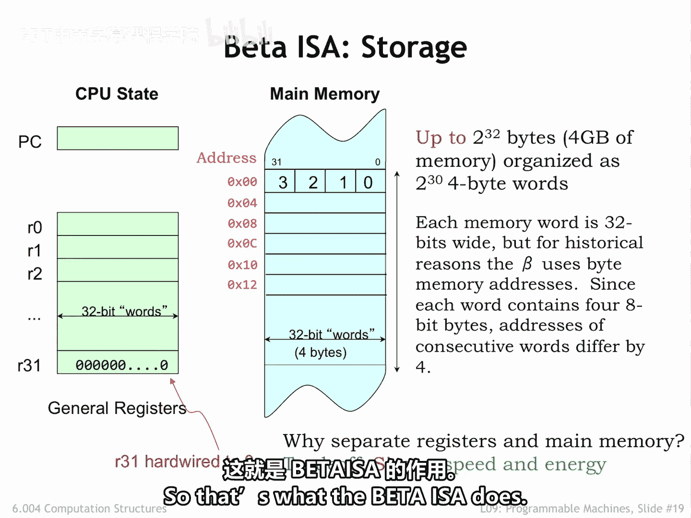
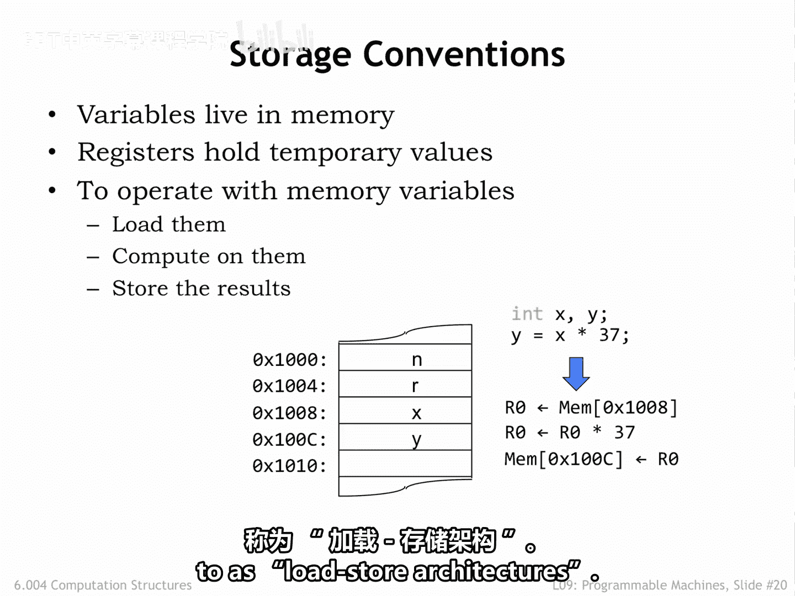

# 【数字系统与计算机架构P1 6.004 2017】麻省理工学院—中英字幕 p78 9.2.4 Storage -BV1DZ421E7Yz_p78-

The beta is an example of a reduced instruction set Comp architecture。

 reduced refers to the fact that in the beta ISA， most instructions only access the internal registers for their opera and destination。

Memory values are loaded in store using separate memory access instructions。

 which implement only a simple address calculation。These reductions lead to smaller。

 higher performance， hardware implementations and simpler compilers on the software side。

The arm and MIps I S As are other examples of risk architectures。 Intel's X 86 ISA is more complex。

There is a limited amount of storage inside of the CPU using the language of sequential logic referred to this as the CPU state。

Theres a 32 B program counter， PC for short。That holds the address of the current instruction in main memory。

And there are 32 registers numbered 0 through 31。Each register holds a 32 B value We use 5 B fields in the instruction to specify the number of the register to be used as an opera aunt or destination。

As shorthand， we refer to a register using the prefix R， followed by his number。 For example。

 R0 refers to the register selected by the5 bit field 0，0，0，0，0。Regs 31， or R 31 is special。

 Its value always reads a 0 and write to R 31 have no effect on its value。

The number of bits in each register and hence the number of bits supported by ALU operations。

 is a fundamental parameter of the ISA。The beta is a 32 bit architecture。

Many modern computers are 64 bit architectures， meaning they have 64 bit registers and a 64 bit data path。

Main memory is an array of 32 bit words， each word contains4，8 bit bytes。

The bytes are number0 through 3。With byte 0 corresponding to the lower order 7 B of the 32 B value and so on。

The beta ISA only supports word accesses， either loading or storing full 32 bit words。

Most real computers also support accesses to bytes and half wordss。

Even though the beta only addresseses four words， following a convention used by many ISA。

 it uses byte addresses。Since there are four bytes in each word。

 consecutive words in memory have addresses that differ by four。So。

The first word in memory has address 0， the second word address 4， and so on。

You can see the addresses is to the left of each memory location in the diagram shown here。

Note that we'll usually use hexadecimal notation when specifying addresses and other binary values。

The0 x prefix indicates when a number is in hex。When drawing a memory diagram。

 we'll follow the convention that addresses increase as you read from top to bottom。

The beta supports 32 bit by addressing， so an address fits exactly into one 32 bit register or memory location。

The maximum memory size is2 to the 32nd bytes or2 to the 30th words， that's 4 gigabytes。

Or 1 billion words of main memory。Some be implementations might actually have a smaller main memory。

 in other words， one with fewer than 1 billion locations。Why have separate registers in May memory。

Well， modern programs and data sets are very large。

 so we'll want to have a large memory to hold everything。

But large memories are slow and usually only support access to one location at a time。

 so they don't make good storage for use in each instruction。

 which needs to access several opera and store a result。If we used only one large storage array。

 then an instruction would need to have3，32 B addresses to specify the two source opera in destination。

Each instruction and codingd would be huge。And that required memory accesses would have to be one after the other。

 really slowing down instruction execution。On the other hand。

 if we use registers to hold the operarans and service the destination。

 we can design the register hardware for parallel access and make it very fast。To keep the speed up。

 we won't be able to have very many registers， a classic size versus speed performance trade off we see in digital systems all the time。

In the end， the trade off leading to the best performance is to have a small number of very fast registers used by most instructions in a large but slow main memory。

So that's what the beta ISA does。

In general， all program data will reside in main memory。

Each variable used by the program lives in a specific main memory location and so has a specific memory address。

For example， in the diagram below the value of the variable x is stored in memory location hex 1008。

 and the value of y is stored in memory location hex 1000 and C and so on。To perform a computation。

 for example， to compute x times 37 and stir the result in y。

 we would have to first load the value of x into a register， say R 0。

 Then we would have the data path multiply the value in R0 by 37， stirring the result back in R0。

Here we've assumed that the constant 37 is somehow available to the data path and doesn't itself need to be loaded from memory。

Finally， we would write the updated value in r0 back into memory at the location for Y。

a lot of steps。 Of course， we could avoid all the loading and storing if we chose to keep the values for X and y and registers。

Since there are only 32 registers， we can't do this for all of our variables。

 but maybe we could arrange to load X and Y into registers。

 do all the required computations involving X and Y by referring to those registers。

 and then when we're done， store changes to X and Y back into memory for later use。

Optimizing performance by keeping often used values in registers is a favorite trick of programmers and compiler writers。

So the basic program template is some loads to bring in values into the registers。

 followed by computation， followed by any necessary stores。

ISSAs that use this template are usually referred to as load store architectures。

