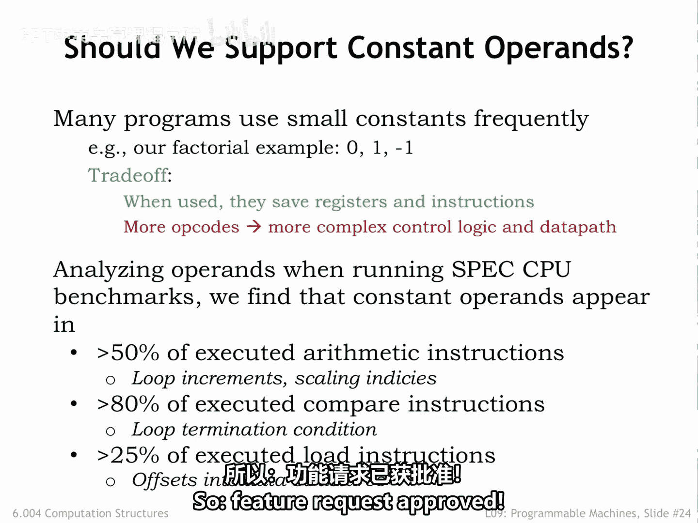
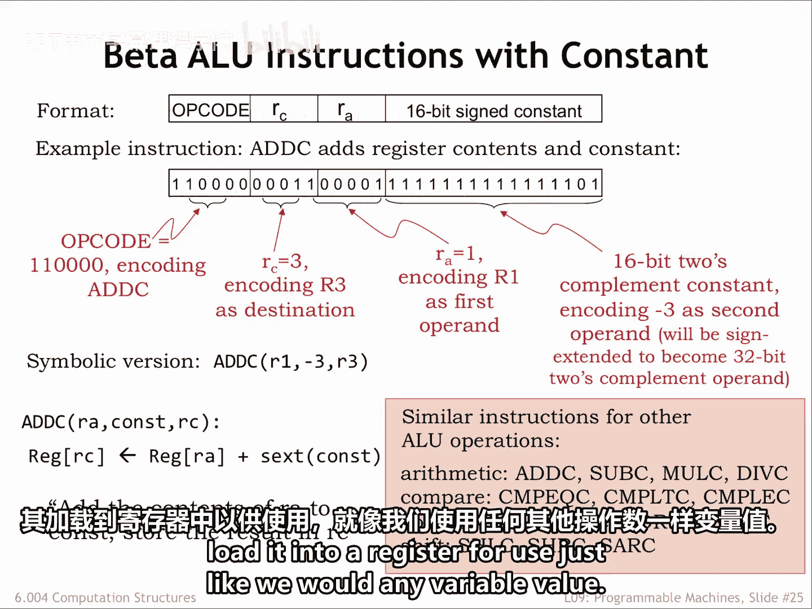
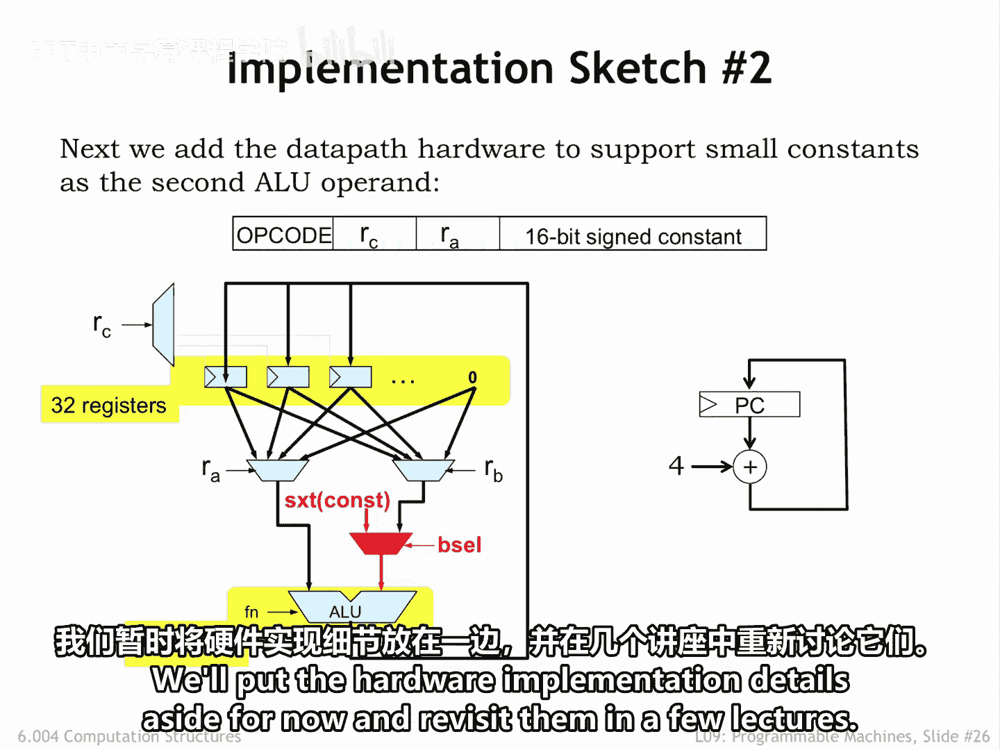

# 【数字系统与计算机架构P1 6.004 2017】麻省理工学院—中英字幕 p80 9.2.6 Constant Operands -BV1DZ421E7Yz_p80-

IS S A designers receive many requests for what are affectionately known as features。

  additional instructions that， in theory， will make the IS A better in some way。

 Deing with such request is the moment to apply our quantitative approach in order to be able to judge the trade offs between cost and benefits。

Our first feature request is to allow small constants as the second opera R and AOU instructions。

So if we replace the 5 bit RB field， we would have room in the instruction to include a 16 bit constant as bits 15 to0 of the instruction。

The argument in favor of this request is that small constants appear frequently in many programs。

 and it would make programs shorter if we didn't have to use load operations to read constant values from main memory。

The argument against the request is that we would need additional control and data path logic to implement the feature。

 increasing the hardware cost and probably decreasing their performance。

So our strategy is to modify our benchmark programs to use the ISA augmented with this feature and measure the impact on a simulated execution。

Looking at the results， we find that there is compelling evidence that small constants are indeed very common。

As the second opera to many operations Note that we're not so much interested in simply looking at the code。

 Instead， we want to look at what instructions actually get executed while running the benchmark programs。

 This will take into account that instructions executed during each iteration of a loop might get executed thousands of times。

 even though they only appear in the program once。Looking at the results。

 we see that over half the arithmetic instructions have a small constant as their second operaand。

Comparisons involve small constants 80% of the time。

 This probably reflects the fact that during execution。

 comparisons are used in determining whether we've reached the end of a loop。

And small constants are often found in address calculations done by load and store operations。

Operations involving constant apps are clearly a common case， one well worth optimizing。

Adding support for small constant opera to the ISA resulted in programs that were measurably smaller and faster。

So， feature request approved。

Here we see the second of the two beta instruction formats。

 It's a modification of the first formatmat where we replaced the 5 B RB field with a 16 B field holding a constant and twos complement format。

This will allow us to represent constant operaans in the range。U。Hex 8000， which is decimal minus-32。

7682。Hex 7 FFF， which is decimal 32，767。Here's an example of the add constant instruction。

 which adds the contents of R1 and the constant minus3， writing the result into R3。

We can see that the second operaand in the symbolic representation is now a constant。

 or more generally an expression that can be evaluated to get a constant value。

One technical detail needs discussion。The instruction contains a 16 bit constant。

 but the data path requires a 32 B opera。 How does the data path hardware go from converting from。

 say， the 16 B representation of -3 to the 32 B representation of -3。

Comparing the 16 bit and 32 bit representations for various constants。

 we see that if the 16 bit2s complement constant is negative。In other words， as high a bit as1。

 The high 16 Bs of the equivalent，32 B constant are all once。

And if the 16 bit constant is non negative， in other words， its high order bit is 0。

 the high 16 bits of the 32 bit constant are all zeros。Thus。

 the operation the hardware needs to perform is sine extension。

 where the sine bit of the 16 bit constant is replicated 16 times to form the high half of the 32 bit constant。

The low half of the 32 bit constant is simply the 16 bit constant from the instruction。

No additional logic H will be needed to implement sign extension。 We can do it all with wiring。

Here are the 14 AOU instructions in there with constant form。Showing the same instruction mnemonics。

 but with a C suffix to indicate that the second opera ran is a constant。

Since these are additional instructions， these have different opt codes than the original ALU instructions。

Finally， note that if we need a constant operaand whose representation does not fit into 16 Bs。

 then we have to store the constant as a 32 B value in the main memory location and load it into a register for use。

 just like we would any variable value。

To give some sense for the additional data P hardware that will be needed。

 let's update our implementation sketch to add support for Constance as the second ALU operator。

We don't have to add much hardware， just a multiplexer which selects either the RB register value or the sign extended constant from the 16 bit field in the instruction。

The B cell control signal that controls the multixer is one for the AOU with constant instructions and zero for the regular AOU instructions。

We'll put the hardware implementation details aside for now and revisit them in a few lectures。

