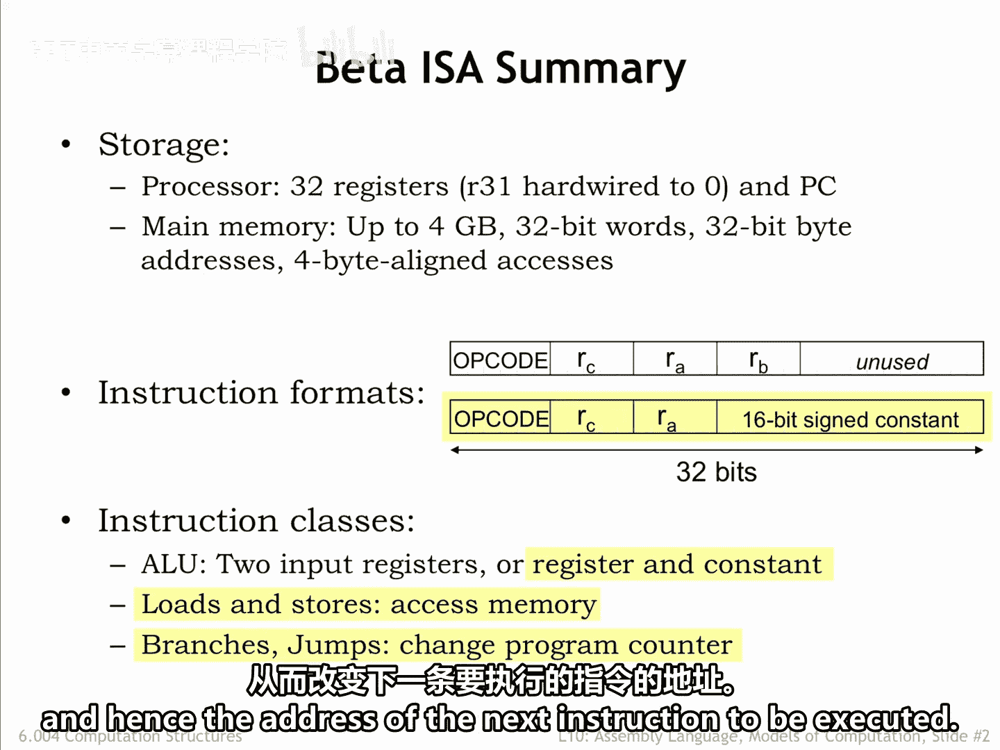
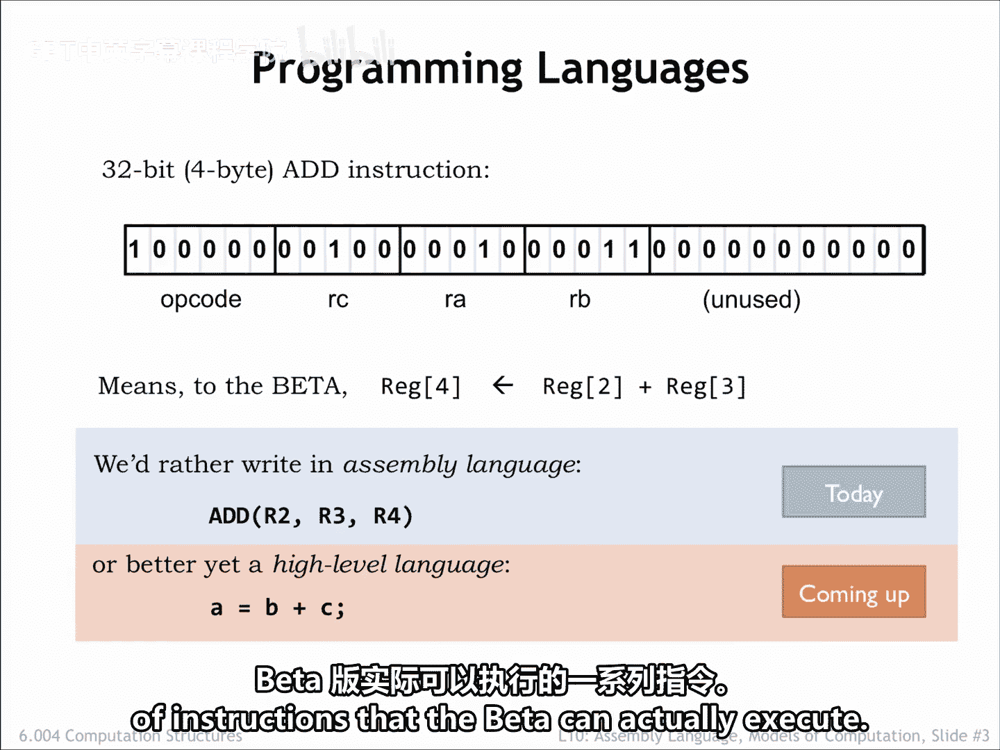
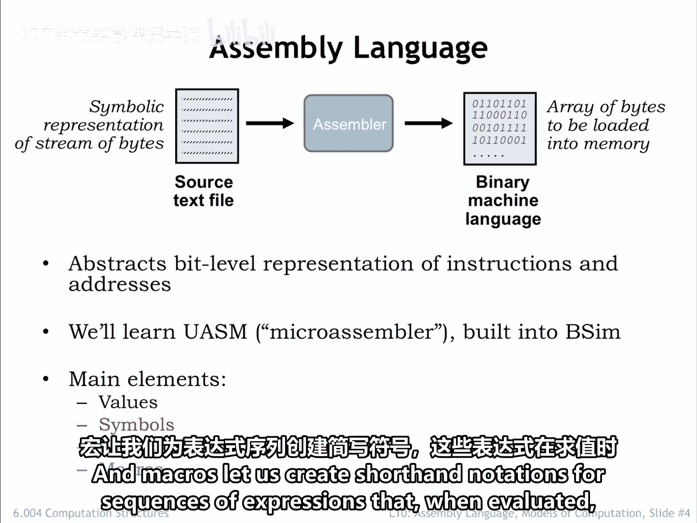
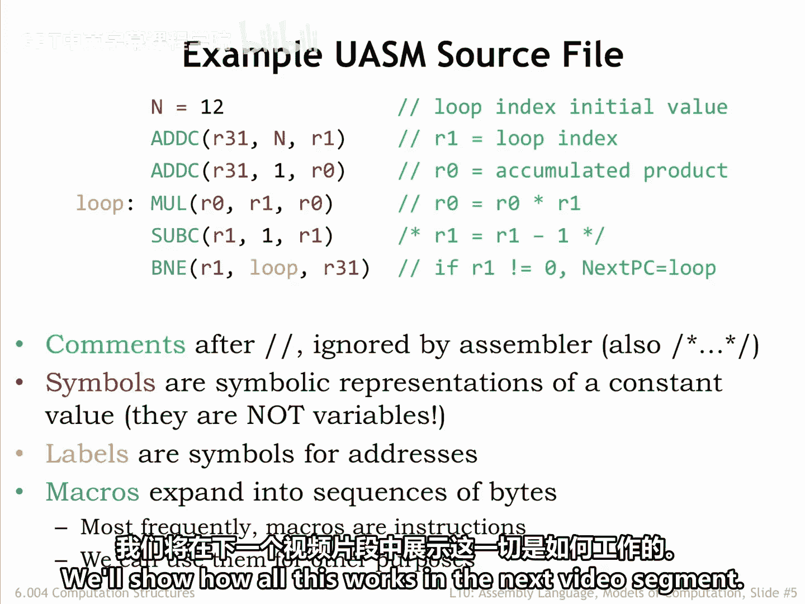

# 【数字系统与计算机架构P1 6.004 2017】麻省理工学院—中英字幕 p85 10.2.1 Intro to Assembly Language -BV1DZ421E7Yz_p85-

In the previous lecture we developed the instruction set architecture for the beta。

 the computer system will be building throughout this part of the course。

The beta incorporates two types of storage or memory。In the CPU data path。

 there are 32 general purpose registers which can be read to supply source opera for the ALU or written with the ALU result。

In the CPU's control logic， there is a special purpose register called the program counter。

 which contains the address of the memory location holding the next instruction to be executed。

The data path and control logic are connected to a large main memory with a maximum capacity of 2 to the 32nd bys organized as 2 to the 30th。

32 B words。This memory holds both data and instructions。

 Beta instructions are 32 B values comprised of various fields。

 The 6 bit op code field specifies the operation to be performed。 The5 B R A。

 R B and R C fields contain register numbers specifying one of the 32 general purpose registers。

There are two instruction formats， one specifying an Op code and three registers。

 the other specifying an Op code two registers and a 16 bit signed constant。

There are three classes of instructions。 The ALU instructions perform an arithmetic or logic operation on two operas。

 producing a result that is stored in the destination register。

The operaans are either two values from the general purpose registers or one register value and a constant。

The yellow highlighting indicates instructions that use the second instruction format。

The load store instructions access main memory， either loading a value from main memory into a register or storing a register value to main memory。

 And finally， there are branches and jumps whose execution may change the program counter and hence the address of the next instruction to be executed。

To program the beta will need to load May memory with binary end instructions。

 figuring out each encoding is clearly the job for a computer。

 So will'll create a simple programming language that will let us specify the op code and operaran for each instruction。

 So instead of writing the binary at the top of the slide or write assembly language statements to specify instructions in symbolic form。

Of course， we still have to think about which registers to use for which values and write sequence of instructions for more complex operations。

By using a high level language， we can move up one more level of abstraction and describe the computation we want in terms of variables in mathematical operations。

 rather than registers in AOU functions。In this lecture。

 we'll describe the assembly language we'll use for programming the beta。 And in the next lecture。

 we'll figure out how to translate high level languages such as C into assembly language。

 The layerir cake of abstractions gets taller yet。We could write an interpreter for say。

 Python and C and then write our application programs in Python。Nowadays。

 programmers often choose the programming language that's most suitable for expressing their computations。

 then after perhaps many layers of translation come up with a sequence of instructions that the beta can actually execute。

O， back to assembly language， which we'll use to shield ourselves from the bit level representations of instructions and from having to know the exact location of variables and instructions in memory。

A program called the Asmbler reads a text file containing the assembly language program and produces an array of 32 B words that can be used to initialize main memory。

 We learn the UAM assembly language， which is built into Bim。

 our simulator for the beta instruction set architecture。UASM is really just a fancy calculator。

It reads arithmetic expressions and evaluates them to produce 8 B values。

 which it then adds sequentially to the array of bytes。

 which will eventually be loaded into the beta's memory。

UASM supports several useful language features that make it easier to write assembly language programs。

 Ss and labels let us give names to particular values and addresses。

 and macros let us create shorthand notations for sequences of expressions that when evaluated。

 will generate the binary representations for instructions and data。

Here's an example UAM source file。 Typically， we write one UASM statement on each line and can use spaces。

 tabs and new lines to make the source as readable as possible。

 We've added some color coding to help in our explanation。

 Comments shown in green allow us to add text annotations to the program。😊。

Good comments will help remind you how your program works。

 You really don't want to have to figure out from scratch what a section of code does each time you need to modify it or to bucket。

There are two ways to add comments to the code。 slash， slash starts a comment。

 which then occupies the rest of the source line。Any characters after s flash are ignored by the asmbler。

 which will start processing statements again at the start of the next line in the source file。

You can also enclose comment text using the delimiters slash star and star s。

 and the asmbler will ignore everything in between。Using this second type of comment。

 you can comment out many lines of code by placing/lash star at the start and many lines later and the comment section with a star/。

Symbols shown in red are symbolic names for constant values。

 Symbols make the code easier to understand。 For example。

 we can use n as the name for an initial value for some computation。 In this case， the value 12。

 subsequentequent statements can refer to this value using the symbol N。

 Instead of entering the value 12 directly。When reading the program we'll know that n means this particular initial value。

 So if later we want to change the initial value， we only have to change the definition of the symbol N。

 rather than find all the 12 in the program and change them。In fact。

 some of the other appearances of 12 might not refer to this initial value。

 and so to be sure we only changed the ones that did。

 we'd have to read and understand the whole program to make sure we only edited the right 12。

You can imagine how error prone that might be。 So using symbols is a practice you want to follow。

Note that all the register names are shown in red。We'll define the symbols R 0 through R 31 to have the value 0 through 31。

 Then we'll use those symbols to help us understand which instruction operarans are intended to be registereds。

 For example， by writing R1 and which operarans are numeric values。 For example。

 by writing the number one。We could just use numbers everywhere。

 but the code would be much harder to read and understand。

 labels shown in yellow are symbols whose value are the address of a particular location in the program。

 Here， the label loop will be our name for the location of the mall instruction and memory。

In the B&E at the end of the code， we use the label loop to specify the mole instruction as the branch target。

So if R1 is nonze， we want our branch back to the mall instruction and start another iteration。

We'll use indentation for most UASM statements to make it easy to spot the labels defined by the program。

Indentation isn't required， is just another habit assembly language programmers use to keep their programs readable。

We use macro invocations shown in blue when we want to write beta instructions。

When the assembler encounters a macro， it expands the macro replacing it with a string of text provided in the macro's definition。

During expansion， the provided arguments are textually inserted into the expanded text at locations specified in the macro definition。

Think of a macro as shorthand for a longer text string we could have typed in。

We'll show how all this works in the next video segment。

