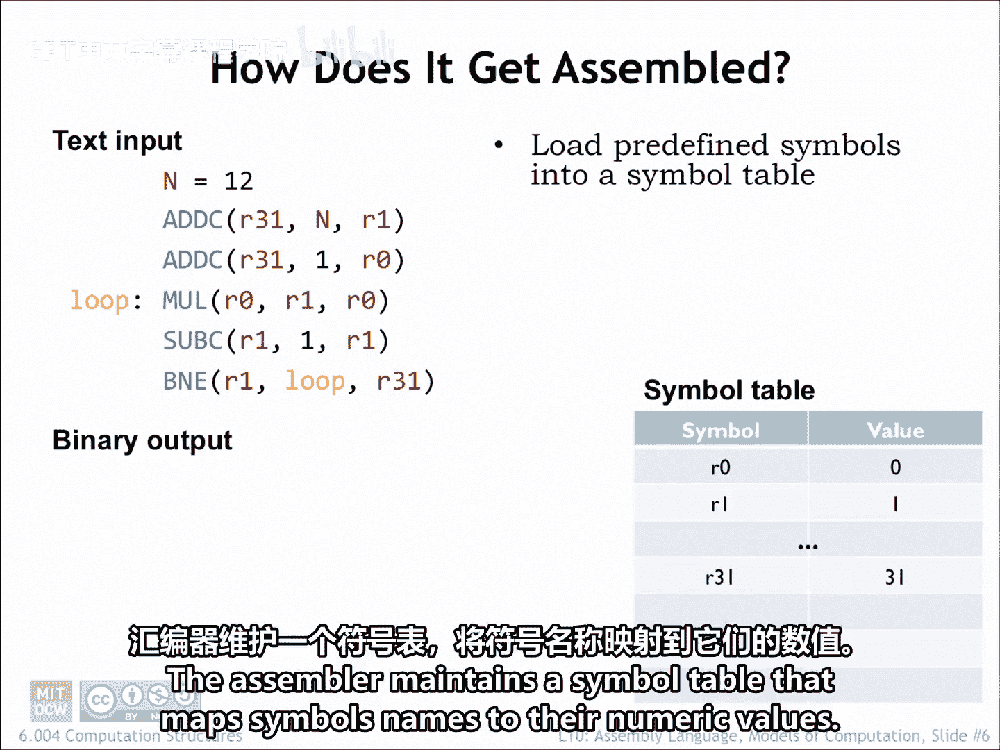
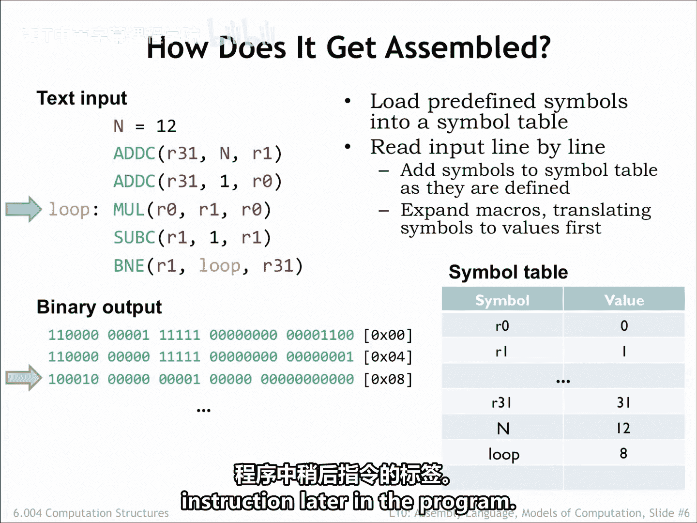
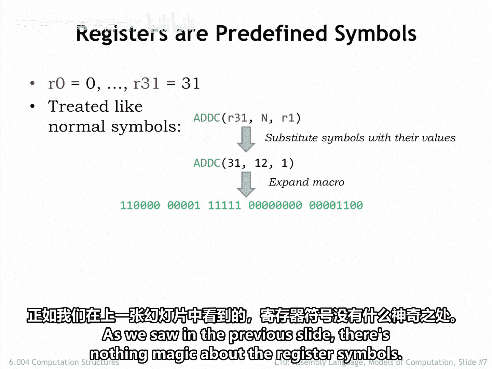
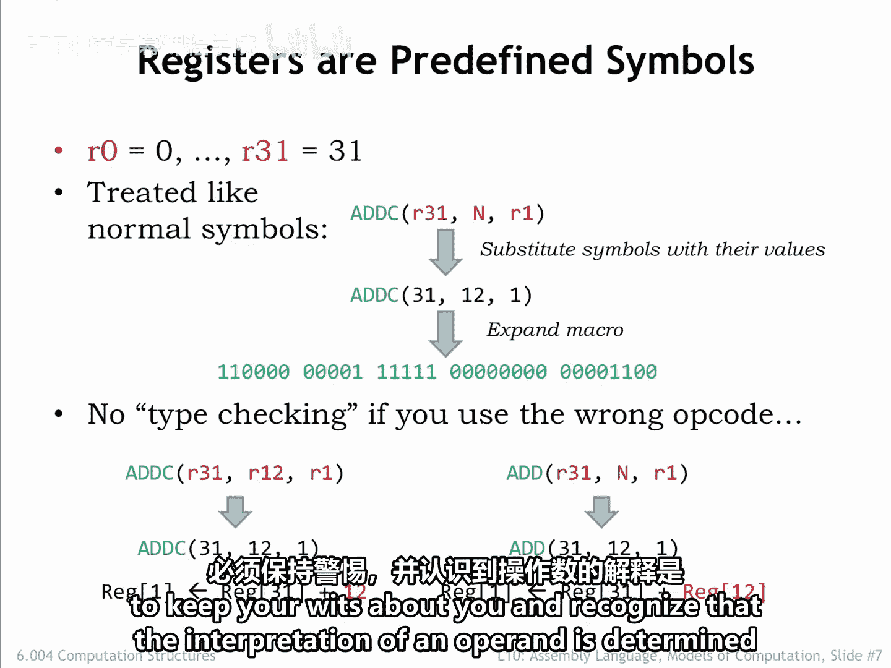
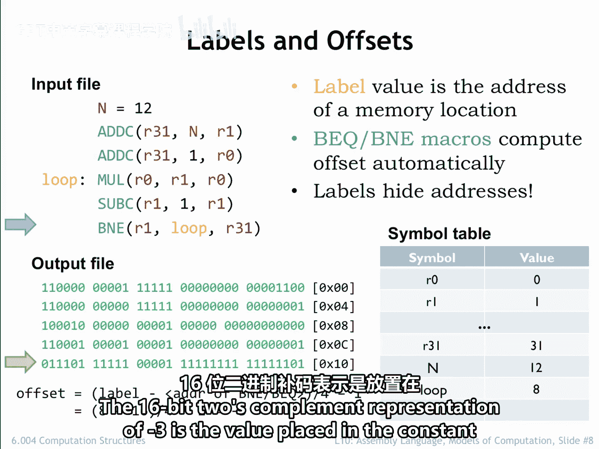

# 【数字系统与计算机架构P1 6.004 2017】麻省理工学院—中英字幕 p86 10.2.2 Symbols and Labels -BV1DZ421E7Yz_p86-

Let's follow along as the asmbler processes are source file。

 The assembler maintains a symbol table that maps symbol names to their numeric values。 Initially。

 the symbol table is loaded with mappings for all the register symbols。

The assembler reads the source file line by line， defining symbols and labels。

 expanding macros or evaluating expressions to generate bytes for the output array。

 Whenever the assembler encounters a use of a symbol or label。

 Its replaced by the corresponding numeric value found in the symbol table。The first line。

 n equals 12 defines the value of the symbol n to be 12。

 so the appropriate entry is made in the symbol table。Advancing to the next line。

 the assembler encounters an imvocation of the add C macro with the arguments R 31， n and R1。

As we'll see in a couple of slides， this triggers a series of nested macro expansions that eventually lead to generating a 32 B value to be placed in memory location0。

The 32 bit value is formatted here to show the instruction fields and the destination address is shown in brackets。

The next instruction is processed in the same way， generating a second 32 bit word。

On the fourth line， the label loop is defined to have the value of the location and memory that's about to be filled。

 In this case， location 8。So the appropriate entry is made in the simple table and the Ma macro is expanded into the 32 bit word to be placed in Lo 8。

The assembler processes the file line by line until it reaches the end of the file。Actually。

 the asmbler makes two passes through the file。 On the first pass。

 it loads the symbol table with the values from all the symbol and label definitions。

 Then on the second pass， it generates the binary output。

The twopa approach allows a statement to refer to a symbol or label that is defined later in the file。

 For example， a forward branch instruction could refer to the label for an instruction later in the program。

As we saw in the previous slide， there's nothing magic about the register symbols。

 They're just symbolic names for the values 0 through 31。

So when processing add C R31 and R1， UAM replaces the symbols with their values and actually expands Add C 31121。

UAM is very simple。 It simply replaces symbols with their values， expands macros。

 and evaluates expressions。 So if you use a register symbol where a numeric value is expected。

 the value of the symbol is used as the numeric constant。 Probably not what the programmer intended。

Similarly， if you use a symbol or expression where a register number is expected。

 the low order 5 bits of the value is used as the register number In this example。

 as the RB register number again， probably not what the programmer intended。

The moral of the story is that when writing UASM assemblylyn programs。

 you have to keep your wits about you and recognize that the interpretation of an operaandt is determined by the Opcode macro。

 not by the way you wrote the operaandt。

Recall from lecture 9 that branch instructions use the 16 bit constant field of the instruction to encode the address of the branch target as a word offset from the location of the branch instruction。

Well， actually， the offset is calculated from the instruction immediately following the branch。

 so an offset of minus1 would refer to the branch itself。

The calculation of the offset is a bit tedious to do by hand and would， of course。

 change if we added or removed instructions between the branch instruction and the branch target。

Happily， macros for the branch instructions incorporate the necessary formula to compute the offset from the address of the branch and the address of the branch target。

So we just specify the address of the branch target。

 usually with a label and let UASM do the heavy lifting。

Here we see that B an E branch is backwards by three instructions。

Remember to count from the instruction following the branch。 So the offset is-3。

The 16 B2 complement representation of -3 is the value placed in the constant field of the bieni instruction。

