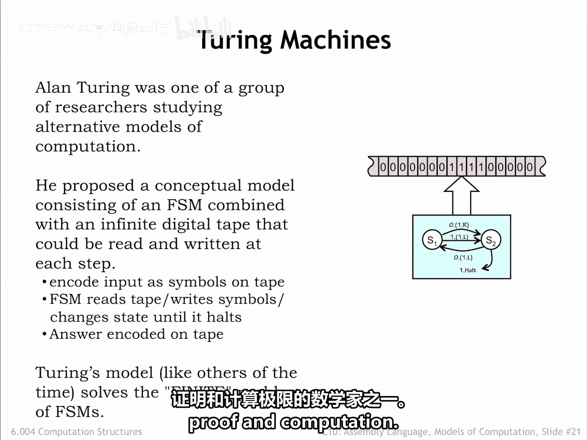
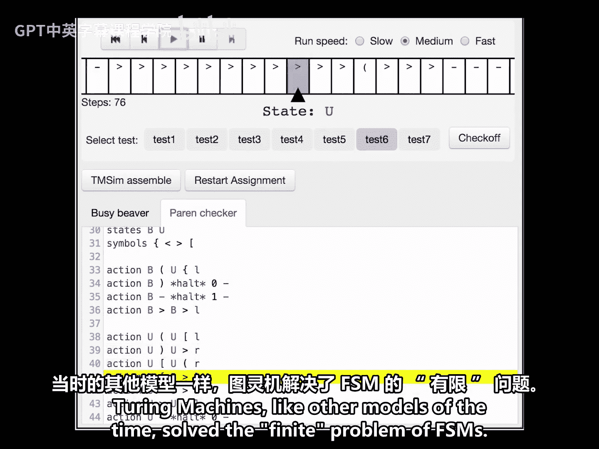
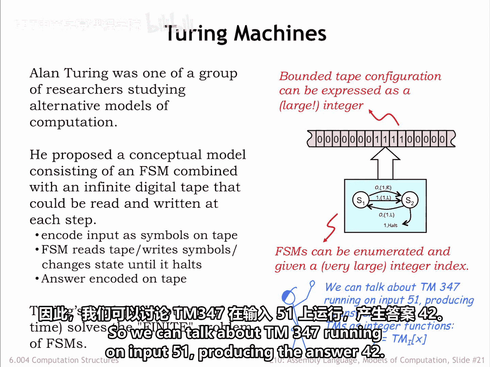
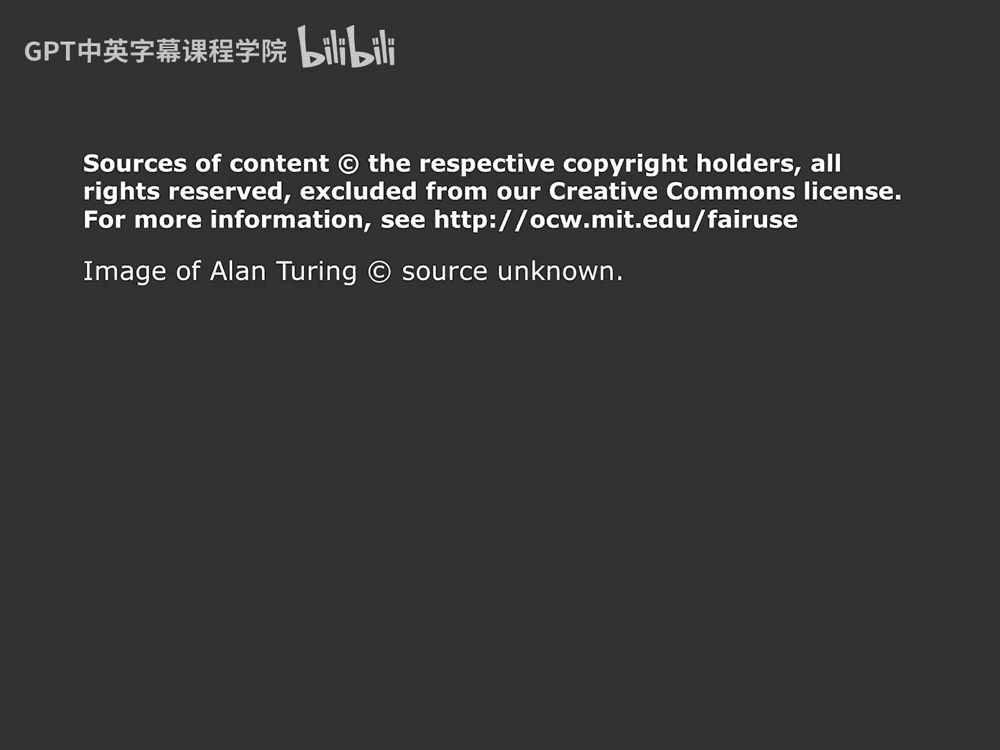

# 【数字系统与计算机架构P1 6.004 2017】麻省理工学院—中英字幕 p89 10.2.5 Models of Computation -BV1DZ421E7Yz_p89-

An interesting question for computer architects is what capabilities must be included in the ISA。

When we studied Boolean gates in part one of the course。

 we were able to prove that Nand gates were universal， in other words。

 that we could implement any Boolean function using only circuits constructed from Nand gates。

We can ask the corresponding question of our ISA。 is it universal， In other words。

 can it be used to perform any computation？What problems can we solve with a Vun computer。

Can the data solve any problem FSMs can solve？Are there problems FSMs can't solve， If so。

 can the datata solve those problems。Do the answers to these questions depend on the particular ISA。

To provide some answers， we need a mathematical model of computation。Reasoning about the model。

 we should be able to prove what can be computed and what can't。

And hopefully we can ensure that the beta ISA has the functionality needed to perform any computation。

The roots of computer science stem from the evaluation of many alternative mathematical models of computation to determine the classes of computation each could represent。

An elusive goal was to find a universal model capable of representing all realizable computations。

In other words， if a computation could be described using some other well formed model。

 we should also be able to describe the same computation using the universal model。

One candidate model might be finite state Mas， FSMs， which can be built using sequential logic。

Using Boolean logic and state transition diagrams， we can reason about how an FSM will operate on any given input。

 predicting the output with 100% certainty。Are FSMs the universal digital computing device？

In other words， can we come up with FSM implementations that implement all computations that can be solved by any digital device？

Despite their usefulness and flexibility， there are common problems that cannot be solved on any FSM。

For example， can we build an FSM to determine if a string of parentheses properly encoded into a binary sequence is well formed。

A parenthesis string is well formed if the parentheses balance。 In other words。

 for every open parenthesis， there is a matching closed parenthesis later in the string。

In the example shown here， the input string on the top is well formed。

 but the input string on the bottom is not。After processing the input string。

 the FSM would output a 1 if the string is well formed0 otherwise。

Can this problem be solved using an FSM。No， it can't。

 The difficulty is that the FSM uses its internal state to encode what it knows about the history of the inputs。

In the Parncheer， the FSM would need to count the number of unbalanced open pars seen so far。

 so it can determine if future input contains the required number of close pars。

But in a finite state machine， there are only a fixed number of states。

 so a particular FSM has a maximum count it can reach。

If we feed the FSM in input with more open print than it has states to count。

 it won't be able to check if the input string is well formed。

The finiteness of FSms limits their ability to solve problems that require unbounded counting。

 What other models of computation might we consider。Mathematicians to the rescue， in this case。

 in the form of a British mathematician named Alllan Tring。In the early 1930s。

 Alan Tring was one of many mathematicians studying the limits of proof and computation。

He proposed a conceptual model consisting of a finite state machine combined with an infinite digital tape that could be read and written under the control of the FSM。

The inputs to some computation would be encoded as symbols on the tape。

 Then the FSM would read the tape， changing its state as it performed the computation。

Then write the answer onto the tape and finally halting。Nowadays。

 this model is called a Tring machine。Tururing machines， like other models of the time。

 solve the finite problems of the FSMs。

So how does all of this relate to computation？Assuming that non blank input on the tape occupies a finite number of adjacent cells。

 It can be expressed as a large integer。Just construct a binary number using the bitten coating of the symbols from the tape。

 alternating between symbols to the left of the tape head and symbols to the right of the tape head。

Eventually， all the symbols will be incorporated into the very large integer representation。

So both the input and output of the Turing machine can be thought of as large integers。

 and the Turing machine itself is implementing an integer function that maps input integers to output integers。

The FSM brain of the Turing machine can be characterized by its truth table。

 and we can systematically enumerate all the possible FSM truth tables。

 assigning an index to each truth table as it appears in the enumeration。

Note that indices get very large very quickly， since they essentially incorporate all the information in the truth table。

Fortunately， we have a very large supply of integers。

We'll use the index for a Turing Ma's FSM to identify the Turing machine as well。

 so we can talk about Turing Mach 347， running on input 51 producing the answer 42。

