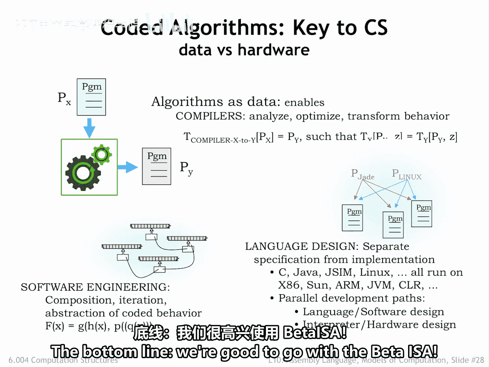
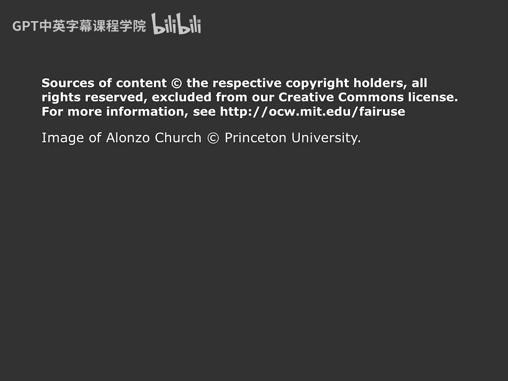

# 【数字系统与计算机架构P1 6.004 2017】麻省理工学院—中英字幕 p90 10.2.6 Computability, Universality -BV1DZ421E7Yz_p90-

There are many other models of computation， each of which describes a class of integer functions where a computation is performed on an integer input to produce an integer answer。

Cleleny post and Tring were all students of Alonzo Church at Princeton University in the mid 1930s。

They explored many other formulations for modeling computation， recursive functions。

 rule based systems for string rewriting， and the Lambda cculus。

They were all particularly intrigued with proving the existence of problems unsolvable by realizable machines。

Which， of course， meant characterizing the problems that could be resolved by realizable machines。

It turned out that each model was capable of computing exactly the same set of integer functions。

This was proved by coming up with constructions that translated the steps in a computation between the various models。

It was possible to show that if a computation could be described by one model。

 an equivalent description exists in the other model。

This LED to a notion of computability that was independent of the computation scheme chosen。

This notion is formulaized by church's thesis。Which says that every discrete function computable by any realizable machine is computable by some Tring machine。

So if we say that the function F of x is computable。

 that's equivalent to saying that there's a Tring machine。Which， given。X。

 as an input on its tape will write F of x as an output on the tape and halt。As yet。

 there's no proof of church's thesis， but it's universally accepted that it's true。 In general。

 computible is taken to mean computable by some touring machine。

If you're curious about the existence of uncomputable functions。

 please see the optional video at the end of this lecture。Okay。

 we've decided that Tring machines can model any realizable computation。In other words。

 for every computation we want to perform， there is a different Turing machine that will do the job。

But how does this help us design a general purpose computer？

Or are there some computations that will require a special purpose machine， no matter what。

What we'd like to find is a universal function。 U。 It would take two arguments， K and J。

 and then compute the result of running Tring machine K on input J。Is U computable， In other words。

 is there a universal Turing machine T sub？If so， then instead of many ad hoc Turing machines。

 we could just use T sub U to compute the results for any computable function。Surprise。

 you is computable and T of you exist。In fact， there are infinitely many universal Turing machines。

 some quite simple。 The smallest known universal Turing machine has four states and uses six tape symbols。

A universal machine is capable of performing any computation that can be performed by any Turing machine。

What's going on here？K encodes a program， a description of some arbitrary Tring machine that performs a particular computation。

J encodes the input data on which to perform that computation。T sub U interprets the program。

 emulating the steps T sub K will take to process the input and write out the answer。

The notion of interpreting a coded representation of a computation is a key idea and forms the basis for our stored program computer。

The universal touring machine is the paradigm for modern general purpose computers。Given an ISA。

 we want to know if it's equivalent to a universal Tring machine。 If so。

 it can emulate every other Tring machine and hence compute any computable function。

How do we show our computers turning universal？Simply demonstrate that it can emulate some known universal Turing machine。

The finite memory on actual computers will mean we can only emulate universal Tring machine operations on inputs up to a certain size。

But within this limitation， we can show our computer can perform any computation that fits into memory。

As it turns out， this is not a high bar so long as the I S A has conditional branches and some simple arithmetic。

 it will be Tring universal。 This notion of encoding a program in a way that allows it to be data out to some other program is a key idea in computer science。

We often translate a program piece of X written to run on some abstract high level machine。

 For example， a program in C or Java In to say， an assembly language program piece of Y that can be interpreted by our CPU。

 This translation is called compilation。Much of software engineering is based on the idea of taking a program and using it as a component in some larger program。

Given a strategy for compiling programs that opens the door for designing new programming languages that let us express our desired computation using data structures and operations particularly suited to the task at hand。

So what have we learned from the mathematicians's work on models of computation？Well。

 it's nice to know that the computing engine we're planning to build will be able to perform any computation that can be performed on any realizable machine。

And the development of the universal Turing machine model paved the way for modern。

 stored programmed computers。The bottom line。Were good to go with the beta I SA。

