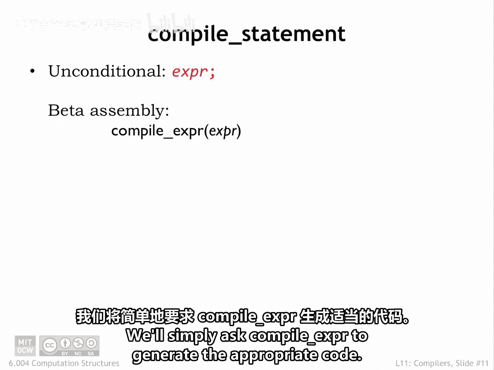
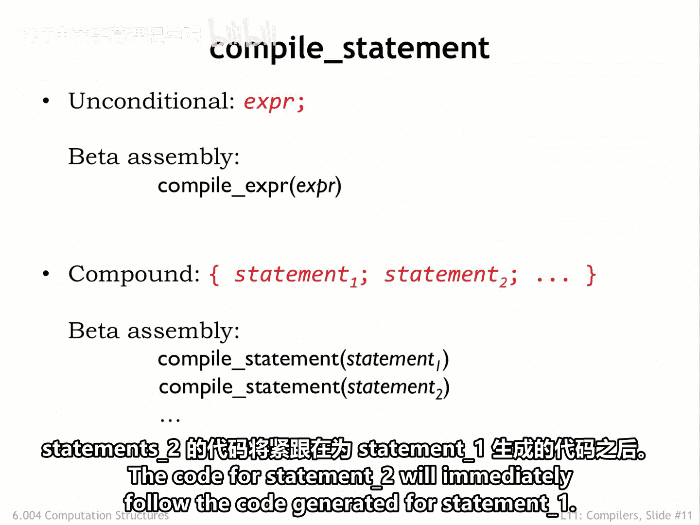
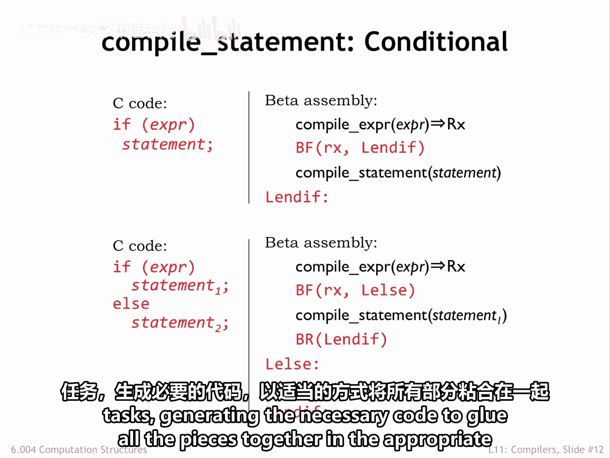
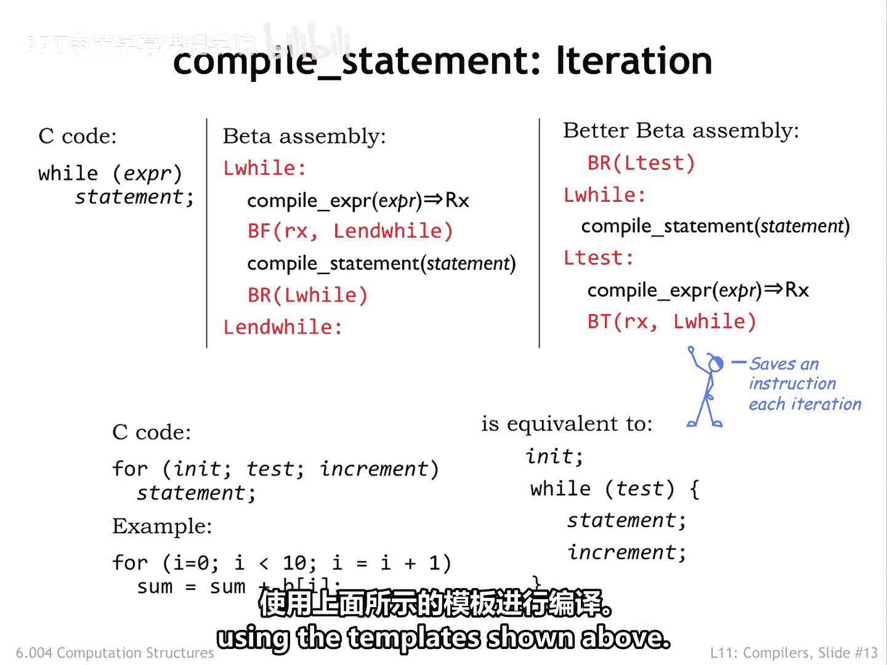
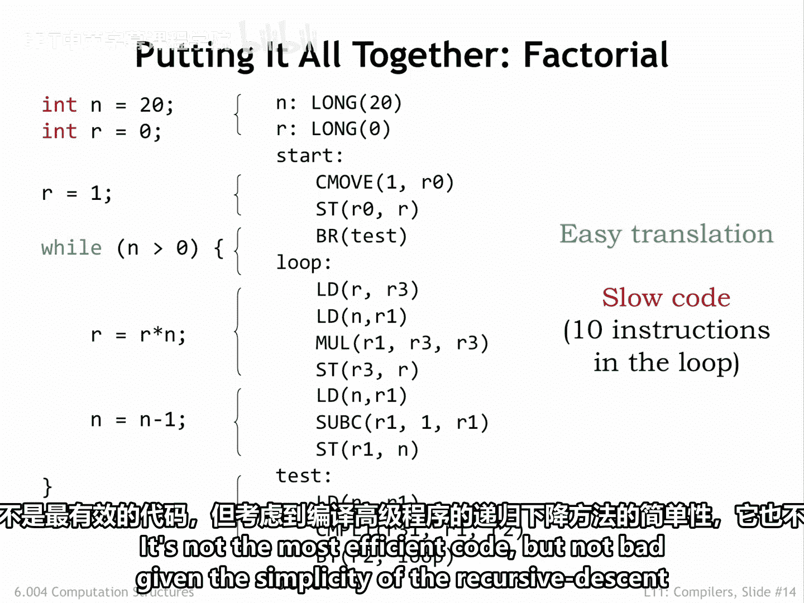
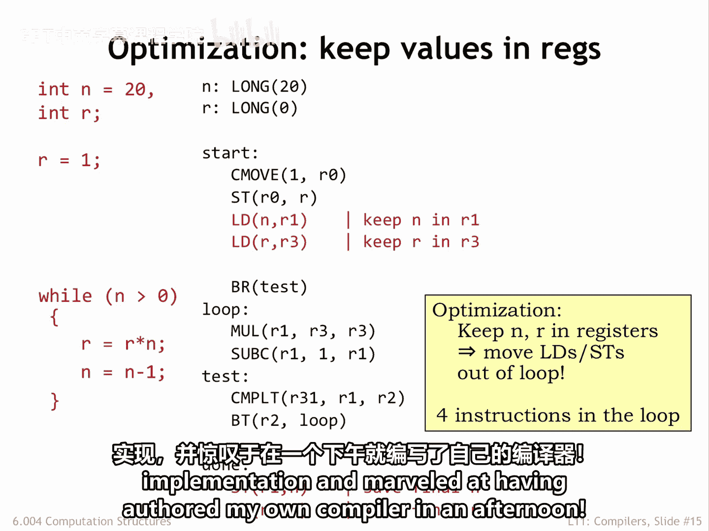

# 数字系统与计算机架构：P2：编译语句 🧩

在本节课中，我们将学习如何将高级编程语言中的各种语句（如赋值、复合语句、条件语句和循环语句）编译成底层的机器指令。我们将通过一系列简单的代码生成模板来理解这个过程。

---

## 无条件语句与复合语句

上一节我们介绍了表达式编译，本节中我们来看看语句的编译。首先从最简单的两种语句类型开始。

无条件语句通常是赋值表达式或过程调用。编译这类语句时，只需调用编译表达式的功能来生成相应的代码。

复合语句的编译同样简单。以下是其处理方式：

*   递归调用 `compile_statement` 函数。
*   依次为复合语句中的每一条子语句生成代码。
*   为语句2生成的代码会紧跟在为语句1生成的代码之后。
*   执行过程将按顺序遍历每条语句的代码。

## 条件语句（If-Then-Else）

现在，让我们转向更复杂的条件语句。对于最简单的 `if-then` 形式，我们需要生成代码来评估测试表达式。如果寄存器中的值为假（false），则跳过执行 `then` 子句中语句的代码。

简单的汇编语言模板通过递归调用 `compile_expression` 和 `compile_statement` 来为 `if` 语句的各个部分生成代码。

完整的 `if` 语句包含一个 `else` 子句，当测试表达式的值为假时应执行该子句。该模板使用了一些分支指令和标签来确保执行流程符合预期。

你可以看到，编译过程本质上就是应用许多小型模板，将代码生成任务逐步分解为更小的任务，并以适当的方式生成必要的代码将所有部分粘合在一起。

## 循环语句（While 与 For）

接下来，我们看看循环语句。`while` 语句的模板与 `if` 语句的模板非常相似，只是在末尾有一个分支指令，导致生成的代码被重复执行，直到测试表达式的值变为假。

经过一些思考，我们可以对这个模板稍作改进。我们重新组织了代码，使得每次迭代只执行一条分支指令 `BT`，而不是原始模板中每次迭代的两条分支指令 `BF` 和 `BR`。这虽然不是重大改进，但对循环内部代码的小优化可以在长时间运行的程序中累积成显著的性能提升。

关于另一种常见的迭代语句 `for` 循环，这里做一个简要说明。`for` 循环是表达迭代的一种简写方式，其中循环索引（例如示例中的 `I`）会遍历一系列值，并且 `for` 循环体针对循环索引的每个值执行一次。`for` 循环可以转换为这里所示的 `while` 语句，然后使用上面展示的模板进行编译。

## 实例分析：阶乘函数

在这个例子中，我们应用模板为之前见过的阶乘函数的迭代实现生成代码。浏览生成的代码，你将能够将代码片段与前几张幻灯片中的模板对应起来。这不是最高效的代码，但考虑到递归下降方法在编译高级程序时的简洁性，这已经相当不错了。

## 优化：使用寄存器

修改递归下降过程以容纳存储在专用寄存器而非主存中的变量值是一件简单的事情。优化编译器非常擅长识别将值保留在寄存器中的机会，从而避免访问主存值所需的加载和存储操作。

使用这个简单的优化，循环中的指令数量从 10 条减少到了 4 条。现在，生成的代码看起来相当不错了。但与其继续调整递归下降方法，我们在此暂停。在下一部分，我们将看到现代编译器如何采用更通用的方法来生成代码。

尽管如此，当我第一次了解递归下降时，我跑回家写了一个简单的实现，并惊叹于自己在一个下午就编写了自己的编译器。😊

---

## 总结

本节课中，我们一起学习了如何使用递归下降编译方法为高级语言中的基本语句结构生成机器代码。我们探讨了无条件语句、复合语句、条件语句（`if-then-else`）以及循环语句（`while` 和 `for`）的编译模板，并通过阶乘函数的例子观察了实际代码生成过程。最后，我们简要了解了通过将变量值存储在寄存器中进行优化的概念。虽然递归下降方法简单直观，但它为理解现代编译器更复杂的代码生成技术奠定了基础。