# 【数字系统与计算机架构P2 6.004 2017】麻省理工学院—中英字幕 p05 11.2.5 Optimization and Code Generation -BV19m41127Kj_p5-

The syntax tree is a useful intermediate representation that is independent of both the source language and the target instruction set architecture。

It contains information about the sequencing and grouping of operations that isn't apparent in individual machine language instructions。

 and it allows front ends for different source languages to share a common back end targeting a specific ISA。

As we'll see， the back end processing can be split into two subphas。

The first performs machine independent optimizations on the intermediate representation。

The optimized intermediate representation is then translated by the cogen phase into sequences of instructions for the target ISA。

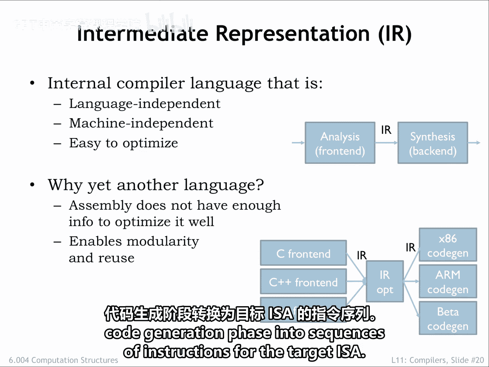

A common intermediate representation is to reorganize the syntax tree into what's called a control flow graph。

Each node in the graph is a sequence of assignment and expression evaluations that ends with a branch。

The nodes are called basic blocks and represent sequences of operations that are executed as a unit。

 Once the first operation in a basic block is performed。

 the remaining operations will also be performed without any other intervening operations。

This knowledge lets us consider many optimizations， for example。

 temporarily storing variable values and registers。

That would be complicated if there was the possibility that other operations outside the block might also need to access the variable values while we were in the middle of this block。

The edges of the graph indicate the branches that take us to another basic block。

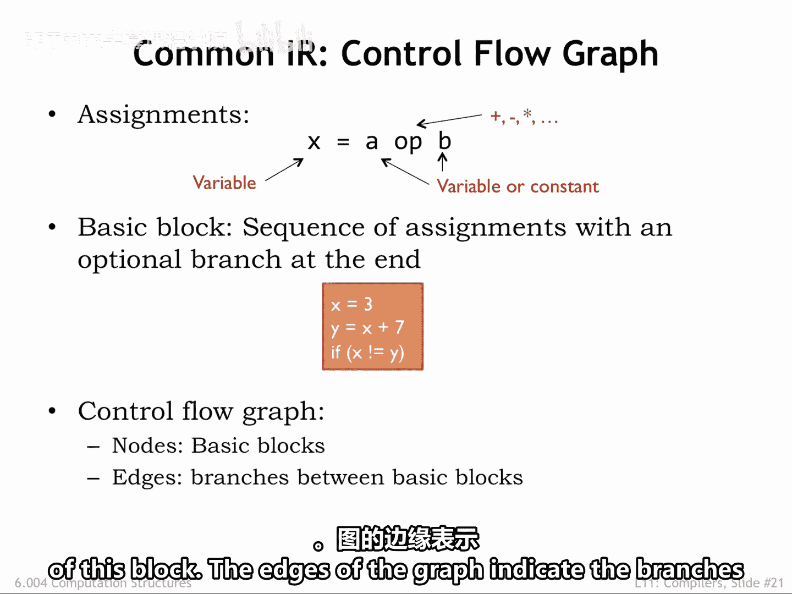

For example， here's the control flow graph for GCD。If a basic block ends with a conditional branch。

 there are two edges labeled T and F leaving the block that indicate the next block to execute。

 depending on the outcome of the test。Other blocks have only a single departing arrow。

 indicating the block always transfers control to the block indicated by the arrow。

Note that if we can arrive at a block from only a single predecessor block。

 then any knowledge we have about operations and variables from the predecessor block can be carried over to the destination block。

For example， if the if X greater than y block has generated code to load the values of x and y into registers。

 both destination blocks can use that information and use the appropriate registers without having to generate their own loads。

But if a block has multiple predecessors， such optimizations are more constrained。

 We can only use knowledge that is common to all the predecessor blocks。

The control flow graph looks a lot like the state transition diagram for a high level FSM。

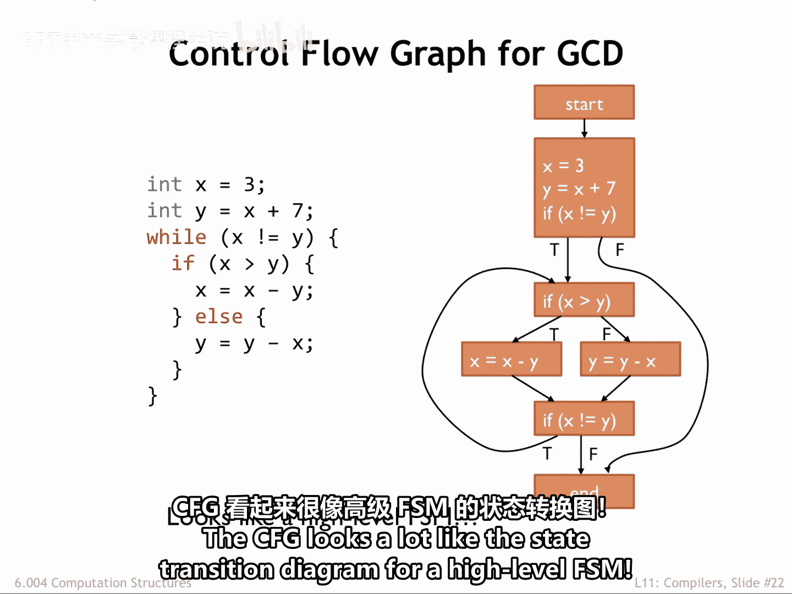

Will optimize the intermediate representation by performing multiple passes over the control flow graph。

Each pass performs a specific， simple optimization。

Will repeatedly apply the simple optimizations in multiple passes until we can't find any further optimizations to perform。

 Collectively， the simple optimizations can combine to achieve very complex optimizations。

Here are some example optimizations。 We can eliminate assignments to variables that are never used and basic blockss that are never reached。

 This is called dead code elimination。In constant propagation。

 we identify variables that have a constant value and substitute that constant in place of references to the variable。

We can compute the value of expressions that have constant operarans。

 This is called constant folding。

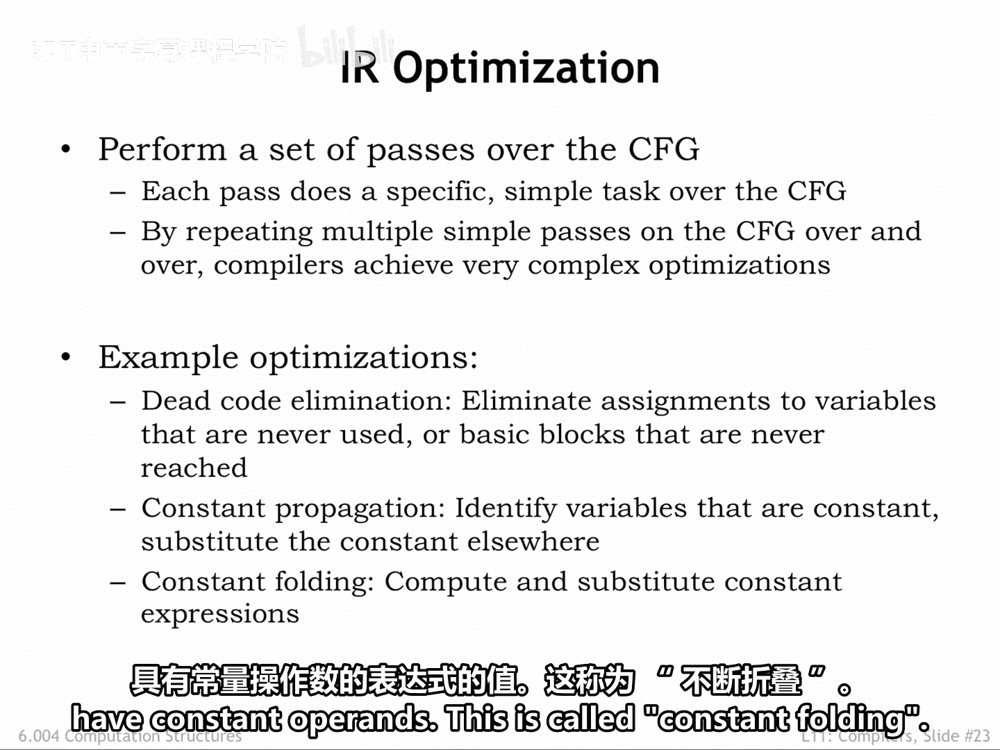

To illustrate how these optimizations work， consider the slightly silly source program and its control flow graph。

 Note that we've broken down complicated expressions into simple binary operations using temporary variable names。

 for example， underscore T1 to name the intermediate results。Let's get started。

The dead code elimination pass can remove the assignment to Z in the first basic block since Z is reassigned in subsequent blocks。

 and the intervening code makes no reference to Z。Next， we look for variables with constant values。

Here we find that x is assigned the value of 3 and is never reassigned。

 so we can replace all references to x with a constant 3。Now perform constant folding。

 evaluating any constant expressions。Here is the updated control flow graph ready for another round of optimizations。

 first， dead code elimination。Then， constant propagation。And finally， constant folding。

So after two rounds of these simple operations， we thininned out a number of assignments on to round three。

Dead code elimination。 And here we can determine the outcome of a conditional branch Eliliminating entire basic blocks from the intermediate representation。

 either because they're now empty or because they can no longer be reached。

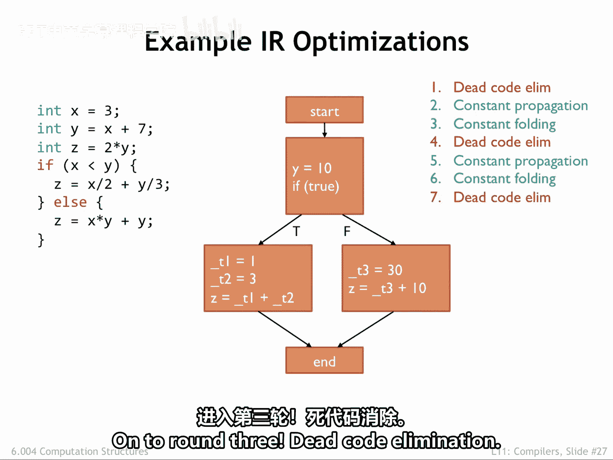

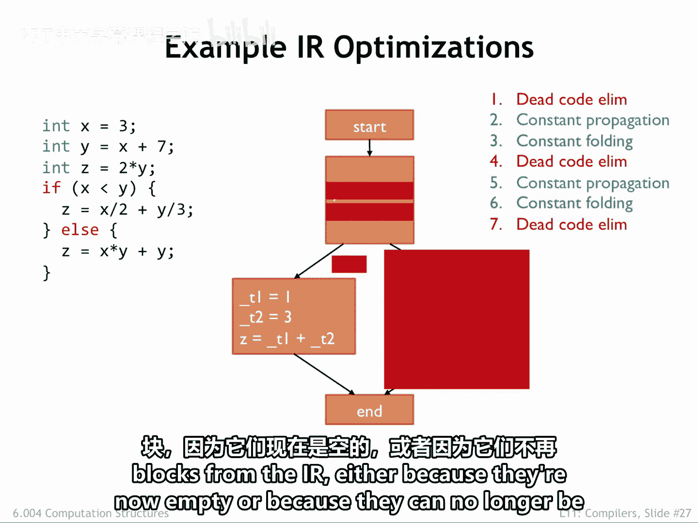

Wow， the intermediate representation is now considerably smaller。

Next is another application of constant propagation。And then， constant folding。

Followed by more day code elimination。The passes continue until we discover there are no further optimization to perform。

 So we're done。Repeated applications of these simple transformations have transformed the original program into equivalent program that computes the same final value for Z。

We can do more optimizations by adding passes， eliminating redundant computation of common subexpressions。

 moving loop independent calculations out of loops， unrolling short loops to perform the effect of。

 say， two iterations in a single loop execution， saving some of the cost of increment and test instructions。

Optimizing compilers have a sophisticated set of optimizations they employ to make smaller and more efficient code。

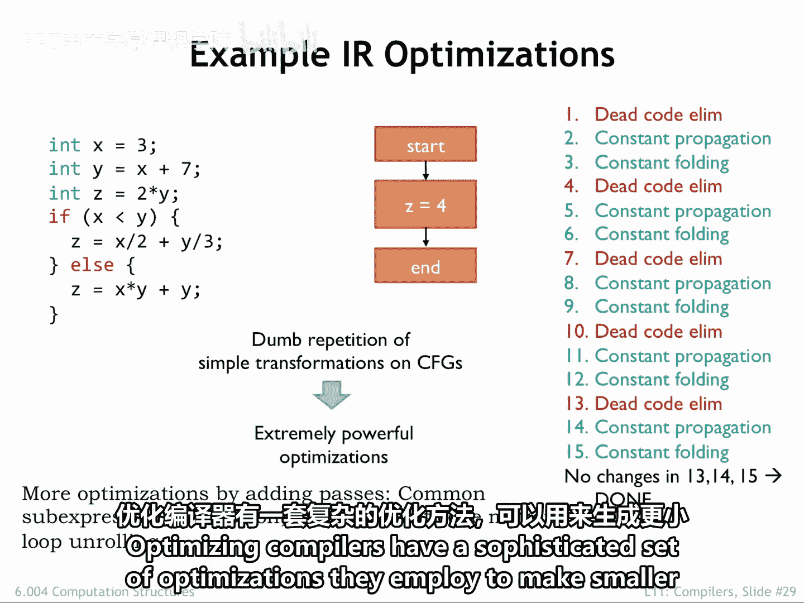

Okay， we're done with optimizations。 Now it's time to generate instructions for the targetet ISA。

First， the co generator assigns each variable， a dedicated register。

 If we have more variables than registers， some variables are stored in memory and will use load in store to access them as needed。

But frequently used variables will almost certainly live as much as possible in registers。

Use our templates from before to translate each assignment and operation into one or more instructions。

Emit the code for each block， adding appropriate labels and branches。

Reorder the basic block code to eliminate unconditional branches wherever possible。And finally。

 perform any target specific PO optimizations。

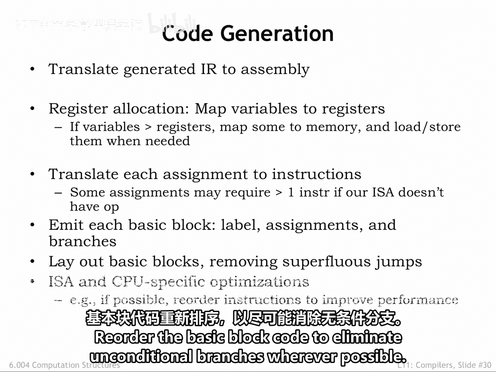

Here's the original control flow graph for the GCD code。

 along with a slightly optimized control flow graph。 GCD isn't as trivial as the previous example。

 so we've only been able to do a bit of constant propagation and constant folding。

Note that we can't propagate knowledge about variable values from the top basic block to the following if block。

 since the if block has multiple predecessors。

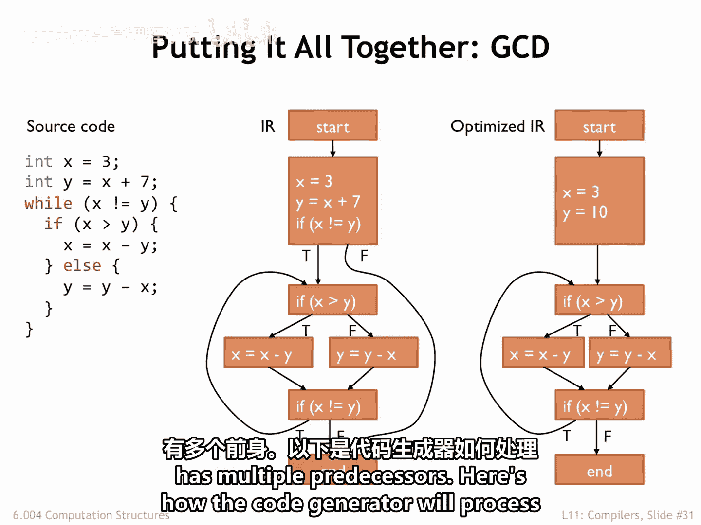

Here's how the code generator will process the optimize control flow graph。First。

 it deddiates registers to hold the values for X and Y。

 Then it emits the code for each of the basic blocks。Next。

 reorganize the order of the basic blocks to eliminate unconditional branches wherever possible。

The resulting code is pretty good。 There are no obvious changes that a human programmer might make to make the code faster or smaller。

 Good job， compiler。

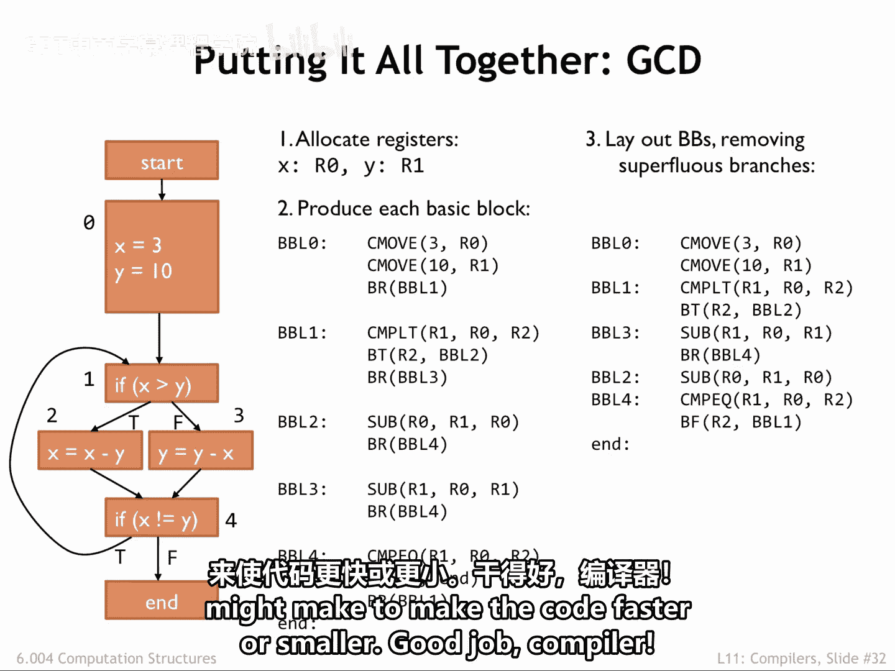

Here are all the compilation steps shown in order along with their input and output data structures。

 Collectly， they transform the original source code into high quality assembly code。

The patient application of optimization passes often produces code that's more efficient than writing assembly language by hand。

Nowadays， programmers are able to focus on getting the source code to achieve the desired functionality and leave the details of translation to instructions in the hands of the compiler。

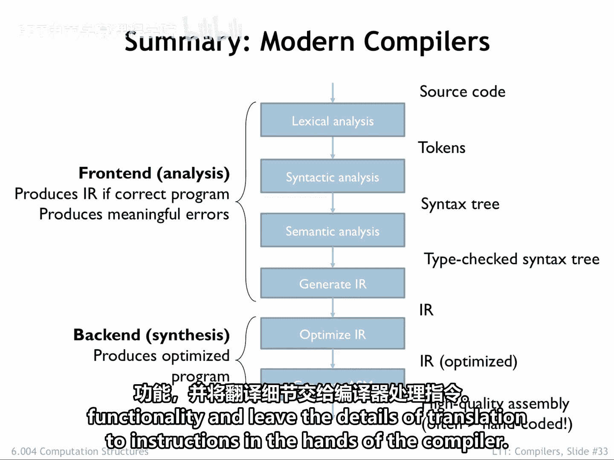