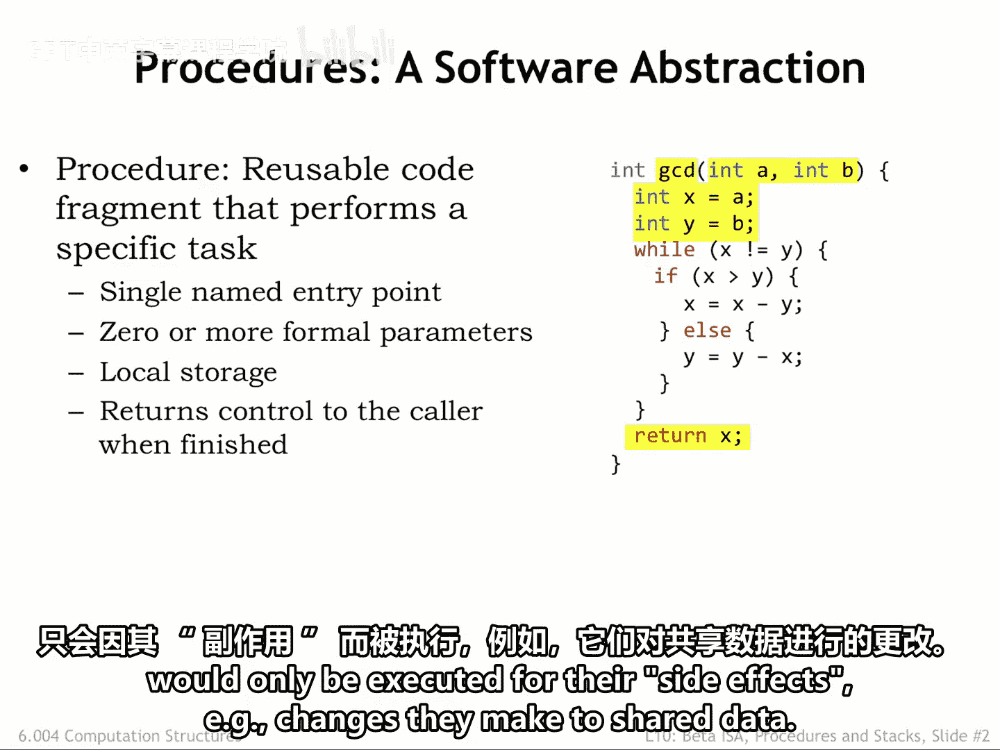
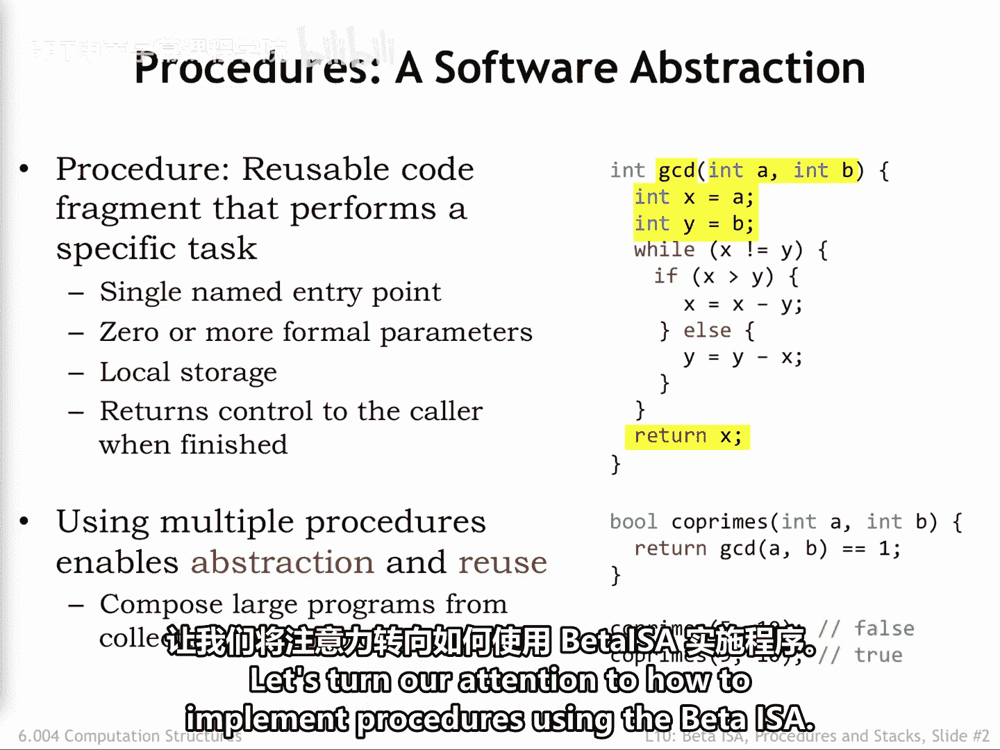
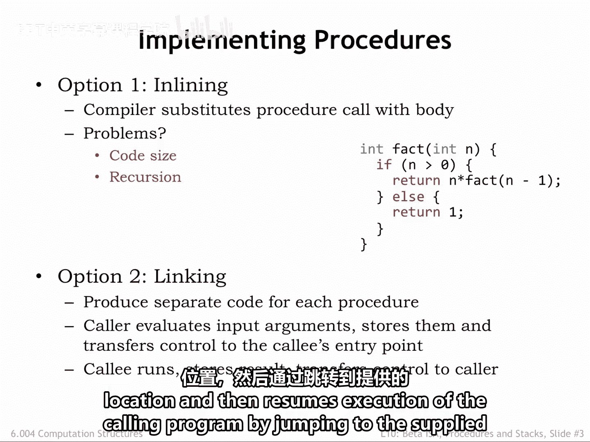
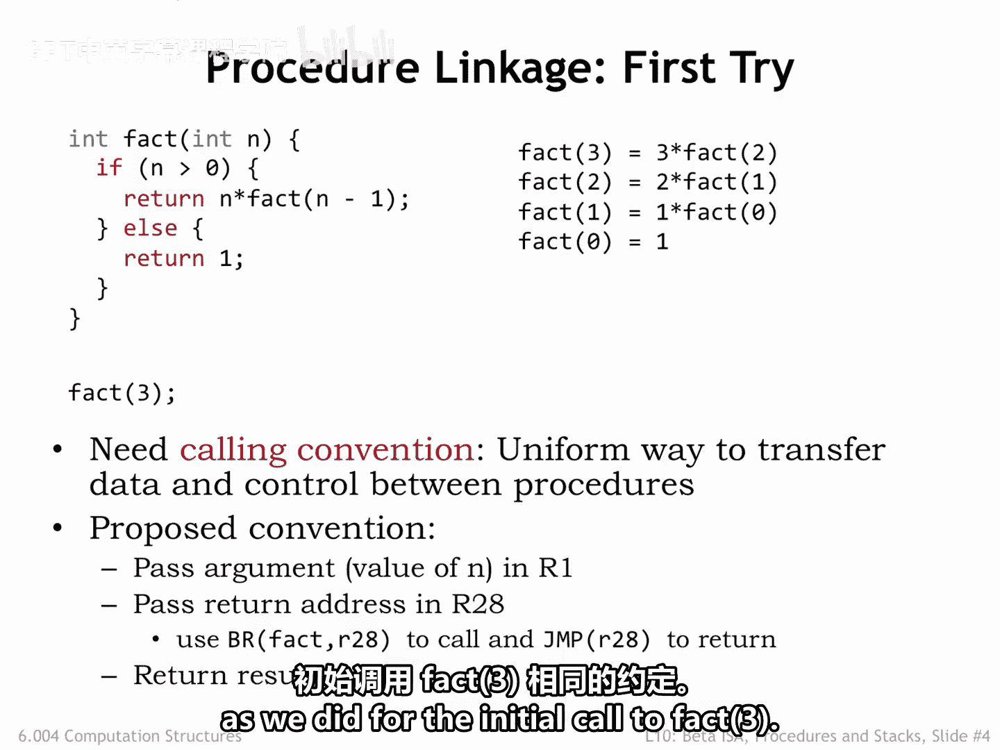
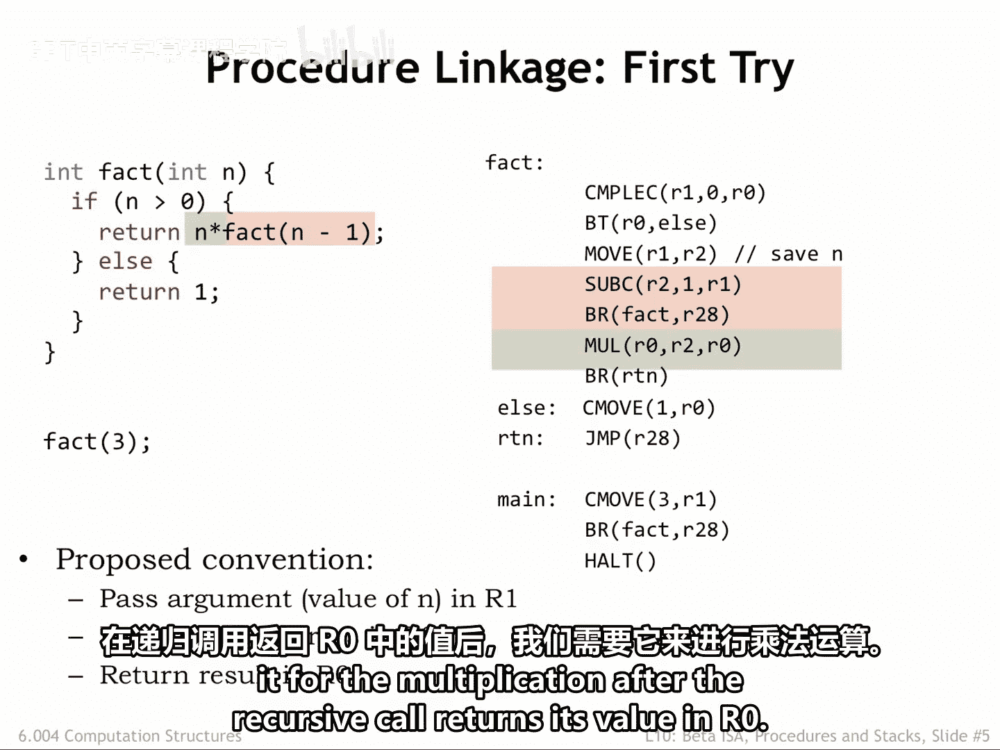
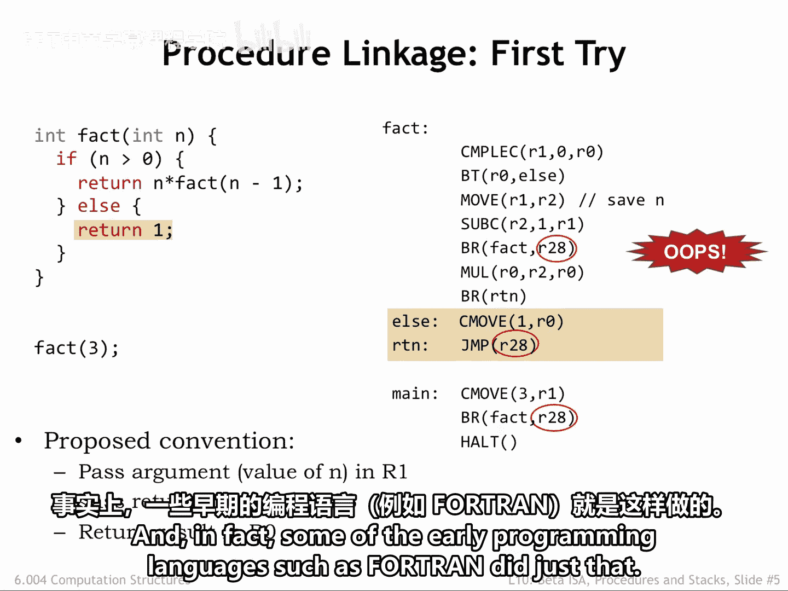

# 数字系统与计算机架构：P2：过程（Procedures） 🧩

在本节课中，我们将要学习高级语言提供的最有用的抽象之一：过程（或子程序）。我们将探讨过程的概念、其重要性，并深入了解如何使用Beta指令集架构（ISA）来实现过程调用。

## 概述

过程是一系列执行特定任务的指令。它提供了一个单一的命名入口点，允许程序的其他部分调用它。过程抽象将复杂的计算封装为一个“黑盒”，使用者只需知道其输入输出行为，而无需了解其内部实现细节。这种抽象是构建模块化、可重用代码的基础，也是面向对象编程的核心思想。

## 过程的概念



上一节我们介绍了过程的基本定义，本节中我们来看看过程的具体组成部分。

一个过程包含以下关键元素：
*   **入口点**：一个单一的名称，用于在程序中引用该过程。
*   **形式参数**：过程内部代码用来指代调用时传入值的名称。
*   **过程体**：执行特定任务的一系列语句。
*   **局部变量**：在过程执行期间存在且只能被过程体内语句访问的变量。
*   **返回值**：过程计算的结果。有些过程可能不返回值，仅通过其副作用（如修改共享数据）产生影响。

以下是过程定义的伪代码示例：
```pascal
function GCD(a: integer, b: integer): integer
begin
    // 过程体：计算最大公约数
    while b != 0 do
        temp := b
        b := a mod b
        a := temp
    end while
    return a // 返回值
end
```

过程抽象的力量在于封装。例如，一个名为`coprime`的过程可以调用`GCD`过程来判断两个数是否互质。`coprime`的程序员只需要知道`GCD`的输入（两个整数）和输出（一个整数），而无需关心`GCD`内部是如何计算的。

几乎所有高级语言都提供预构建的过程集合，称为**库**。这些库极大地增强了语言的表达能力和易用性。

## 过程的实现策略



理解了过程的概念后，我们接下来探讨如何在实际的机器指令层面实现它。我们将重点分析两种策略。

### 内联展开

一种可能的实现方式是**内联展开**。在这种方法中，我们将过程调用替换为过程体语句的一个副本，并用实际参数值替换对形式参数的引用。

这种方法将过程视为类似宏的简单记法缩写。然而，它存在明显问题：
1.  **代码膨胀**：如果一个冗长的过程被多次调用，最终展开的代码会非常庞大。
2.  **无法处理递归**：对于递归过程（即过程调用自身），在编译时内联过程将永不终止，导致方案失败。

因此，内联通常只被优化编译器用于非常短小的过程。

### 链接调用

第二种，也是更通用的选项是**链接调用**。在这种方法中，过程的代码只有一份副本，所有对该过程的调用都“链接”到这份代码上执行。



以下是链接调用的实现步骤：
1.  过程体被翻译成一次Beta指令。
2.  第一条指令被标识为过程的**入口点**。
3.  过程调用被编译成一组指令，用于计算参数表达式并将其值存入约定位置。
4.  使用**分支指令**将控制权转移到过程的入口点。分支指令会将下一条指令的地址（**返回地址**）保存在指定的寄存器中。
5.  过程代码运行，将结果存入约定位置。
6.  过程通过**跳转指令**跳转到提供的返回地址，从而恢复调用者程序的执行。

为了使这个方案可行，我们需要一个**调用约定**来规定参数值、返回地址和返回值存储在哪里。

## Beta ISA 的调用约定

上一节我们介绍了链接调用的概念，本节中我们来看看如何为Beta ISA设计一个具体的调用约定。



一个简单的想法是使用寄存器：
*   **R1**：用于传递第一个（或唯一一个）参数值。
*   **R28**：用于保存返回地址。这个寄存器通常被称为**链接指针**。
*   **R0**：用于保存过程的返回值。

让我们以计算阶乘的递归过程 `fact(3)` 为例，看看这个约定如何工作。我们的目标是建立一个统一的调用约定，使得所有过程调用和过程体都使用相同的规则。

以下是`fact`函数的部分伪代码和对应Beta指令的示意：
```
function fact(n: integer): integer
begin
    if n <= 0 then
        return 1
    else
        return n * fact(n-1) // 递归调用
end
```
对应的Beta指令需要处理参数传递、递归调用和返回值。



## 递归调用的问题与栈帧

在按照上述约定编译`fact`的代码并模拟执行递归调用`fact(3)`时，我们会发现一个严重问题：寄存器会被覆盖。

具体来说：
1.  初始调用将返回地址（`HALT`指令的地址）存入R28。
2.  进入`fact`后，递归调用`fact(2)`需要再次使用R28来保存它自己的返回地址（`MUL`指令的地址），这**覆盖**了原来的返回地址。
3.  同样，用于保存当前参数`n`值的寄存器（例如R2）也会在递归调用中被覆盖。

问题的核心在于，**每个活跃的递归调用都需要记住它自己的参数值和返回地址**。在执行`fact(3)`并最终调用`fact(0)`时，存在四个嵌套的活跃调用，因此需要 4 * 2 = 8 个存储位置。显然，固定的两个寄存器无法满足这种随着递归深度变化而动态增长的存储需求。

早期的一些语言（如Fortran）的解决方案是禁止递归。但我们需要一个更通用的方法。

## 总结



本节课中我们一起学习了过程这一核心编程抽象。我们首先了解了过程的定义、组成部分及其作为“黑盒”封装的重要性。然后，我们探讨了实现过程的两种策略：内联展开和链接调用，并指出了内联在代码膨胀和处理递归方面的局限性。接着，我们为Beta ISA设计了一个使用寄存器的简单调用约定。最后，我们通过阶乘递归的例子，发现了该约定在应对递归调用时寄存器值被覆盖的根本问题，这引出了对动态存储机制的需求，为下一节课学习“栈帧”这一关键概念做好了铺垫。