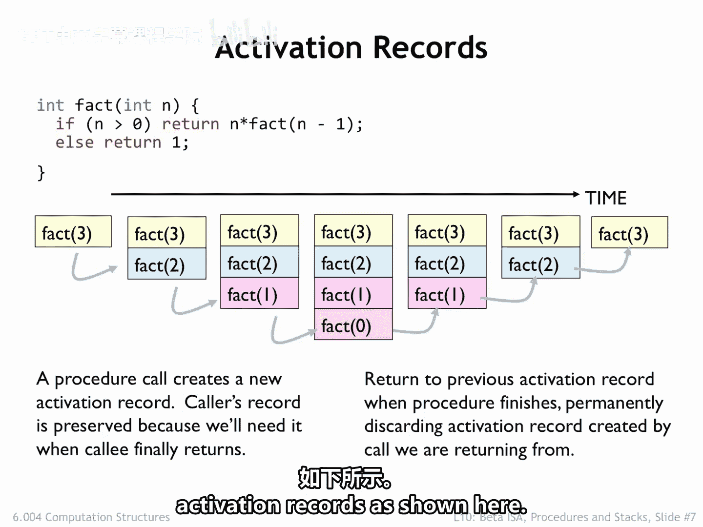
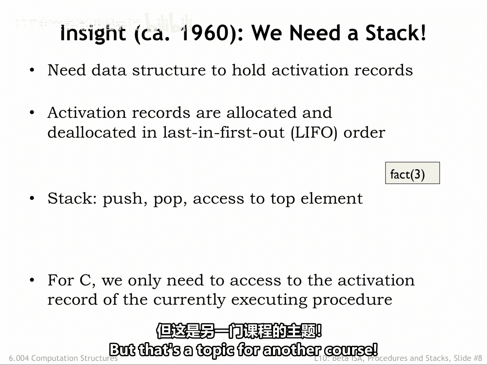
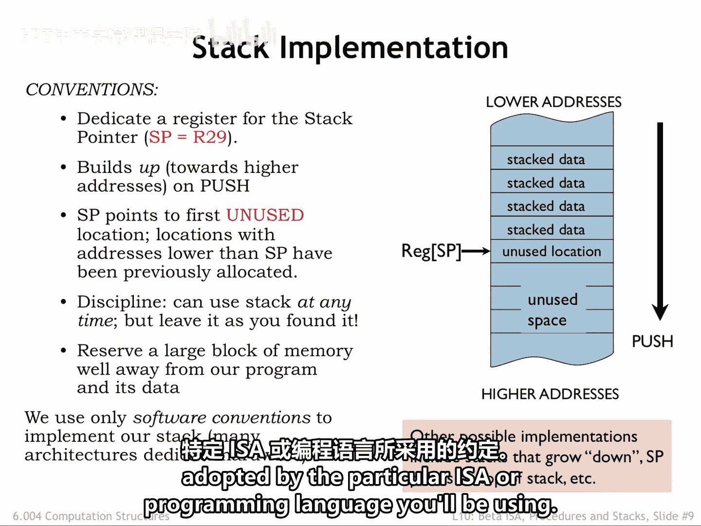
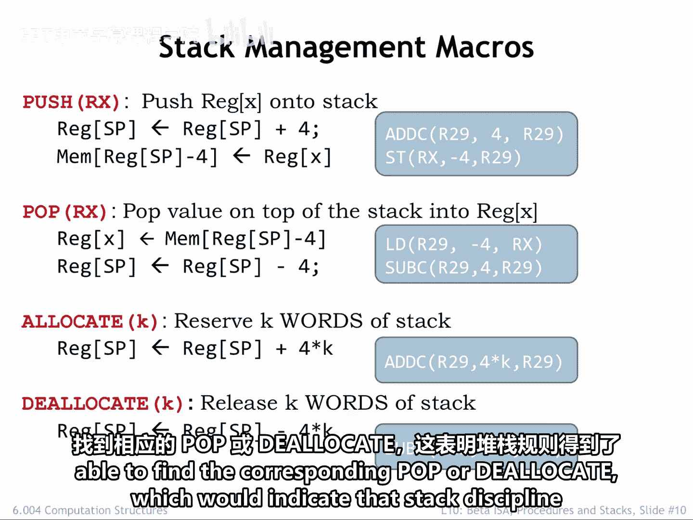
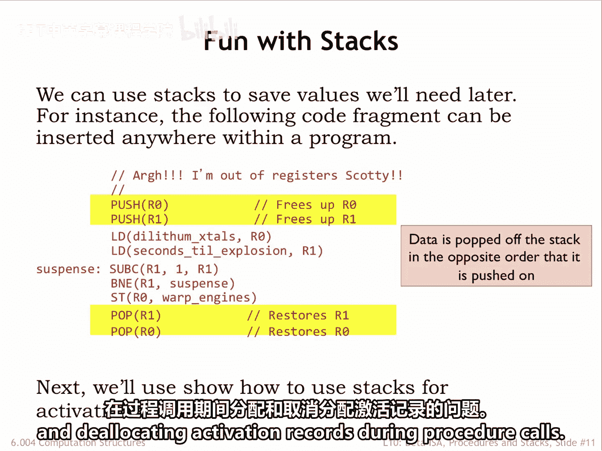

# 数字系统与计算机架构：P2：6.004：激活记录与栈 📚

在本节课中，我们将要学习过程调用中一个关键概念：**激活记录**。我们将探讨为什么需要它，以及如何使用**栈**这种数据结构来高效地管理激活记录的生命周期。理解这些概念对于掌握程序如何在计算机内存中组织和管理数据至关重要。

## 激活记录的必要性

我们需要解决的问题是，在哪里存储过程所需的值，包括其**参数**、**返回地址**和**返回值**。过程可能还需要存储其**局部变量**的空间，以及在过程覆盖调用者的寄存器之前，保存这些寄存器值的空间。

我们希望避免对参数数量、局部变量数量等设置任何限制。因此，我们需要为每个活跃的过程调用分配一块存储区域，我们称之为**激活记录**。

正如我们在阶乘例子中看到的，我们不能为特定过程静态地分配单个存储块，因为递归调用意味着在执行过程中的某些时刻，会有多个对该过程的活跃调用。

我们需要一种方法，在过程被调用时**动态分配**激活记录的存储空间，并在过程返回后**回收**这些空间。

## 激活记录的生命周期

让我们看看随着执行的进行，激活记录是如何创建和销毁的。

第一个激活记录用于调用 `fact(3)`。它在过程开始时创建，并保存了参数 `N` 的值以及 `fact(3)` 计算完成后应恢复执行的**返回地址**。

在执行 `fact(3)` 期间，我们需要进行递归调用来计算 `fact(2)`。因此，该过程调用也会获得一个激活记录，其中包含适当的参数值和返回地址。

请注意，原始的激活记录被保留下来，因为它包含了在 `fact(2)` 调用返回后完成 `fact(3)` 计算所需的信息。所以现在，我们有两个活跃的过程调用，因此有两个激活记录。

`fact(2)` 需要计算 `fact(1)`，而 `fact(1)` 又需要计算 `fact(0)`。此时，有四个活跃的过程调用，因此有四个激活记录。

递归在 `fact(0)` 处终止，它将值 `1` 返回给其调用者。此时，`fact(0)` 的执行完成，因此其激活记录不再需要，可以被丢弃。

`fact(1)` 现在完成其计算，将 `1` 返回给其调用者。我们不再需要它的激活记录。接着 `fact(2)` 完成，将 `2` 返回给其调用者，其激活记录可以被丢弃，依此类推。

需要注意的是，嵌套过程调用的激活记录总是在其调用者的激活记录之前被丢弃。这是合理的，因为调用者的执行在嵌套过程调用返回之前无法完成。

## 栈数据结构

我们需要一种存储方案，能够高效地支持激活记录的分配和回收，如上所示。

早期的编译器编写者认识到，激活记录是按照**后进先出**的顺序进行分配和回收的。因此他们发明了**栈**这种数据结构，它实现了 `push` 操作（将记录添加到栈顶）和 `pop` 操作（移除栈顶元素）。

新的激活记录在过程调用期间被**压入**栈中，并在过程调用返回时从栈中**弹出**。请注意，栈操作只影响栈顶，即栈上最近添加的记录。

C 语言的过程通常只需要访问栈顶的激活记录。其他编程语言，例如 Java，支持访问其他激活记录，栈也支持这两种操作模式。

最后一个技术说明：一些编程语言支持闭包（例如 JavaScript）或协程（例如 Python 的 `yield` 语句），在这些情况下，激活记录即使在过程返回后也需要被保留。此时，栈简单的后进先出行为就不再足够，需要另一种方案来分配和回收激活记录。但这属于另一门课程的主题。

## Beta 架构上的栈实现

以下是我们将在 Beta 架构上实现栈的方法。我们将指定 Beta 的一个寄存器 `R29` 作为**栈指针**，用于管理栈操作。

当我们向栈中压入一个字时，我们将**递增**栈指针。因此，随着字被压入栈中，栈会向更高的地址方向增长。

我们将采用一个约定：栈指针 `SP` 指向**第一个未使用的栈位置**，即其值是下一个 `push` 操作将要填充的位置的地址。因此，地址低于 `SP` 值的那些位置对应着之前已分配的字。

字可以在执行过程中的任何时刻被压入或弹出栈，但我们将强加一个规则：将字压入栈的代码序列必须在执行结束时弹出这些字。因此，当一个代码序列执行完毕时，`SP` 的值应与该序列开始前相同。这被称为**栈纪律**，它确保了对栈的中间使用不会影响后续的栈引用。

我们将分配一大块内存区域来存放栈，并确保栈可以增长而不会覆盖其他程序存储。大多数系统要求你在运行程序时指定最大栈大小，如果程序试图向栈中压入过多项，则会发出执行错误信号。

对于我们的 Beta 栈实现，我们将使用现有指令来实现栈操作。因此，对我们来说，栈严格来说是一套软件约定。其他指令集架构可能提供专门用于栈操作的指令。

还有许多其他合理的栈约定，因此你需要查阅你将要使用的特定 ISA 或编程语言所采用的约定。

## UASM 中的栈支持宏

我们向 UASM 添加了一些便利宏来支持栈操作。

`PUSH` 宏展开为两条指令。`ADDC` 指令递增栈指针，在栈顶分配一个新字，然后通过一条 `ST` 指令，用指定寄存器的值初始化这个新的栈顶字。

`POP` 宏将栈顶的值加载到指定寄存器中，然后使用一条 `SUBC` 指令递减栈指针，从栈中回收该字。

请注意，`PUSH` 和 `POP` 宏中指令的顺序非常重要。正如我们将在下一讲中看到的，中断可能导致 Beta 硬件在任何两条指令之间停止执行当前程序，因此我们必须小心操作顺序。

对于 `PUSH`，我们首先在栈上分配字，然后初始化它。如果我们反过来做，并且在初始化和分配代码之间发生中断，那么中断期间运行的、使用栈的代码可能会无意中覆盖已初始化的值。但假设所有代码都遵循栈纪律，先分配后初始化的方案总是安全的。

同样的推理也适用于 `POP` 指令的顺序。我们首先访问栈顶一次以检索其值，然后我们回收该位置。

我们可以使用 `ALLOCATE` 宏为后续使用预留多个栈位置，有点像 `PUSH`，但不进行初始化。`DEALLOCATE` 执行相反的操作，从栈中移除 N 个字。

通常，如果我们在汇编语言程序中看到一个 `PUSH` 或 `ALLOCATE`，我们应该能找到对应的 `POP` 或 `DEALLOCATE`，这表明栈纪律得到了遵守。

## 栈的典型用法

我们将使用栈来保存我们稍后需要的值。例如，如果我们需要使用一些寄存器进行计算，但不知道这些寄存器的当前值是否在程序后面还需要，我们可以将它们当前的值压入栈中，然后就可以自由地在代码中使用这些寄存器。在我们完成后，我们可以使用 `POP` 来恢复保存的值。

请注意，我们弹出数据的顺序与数据被压入的顺序相反。换句话说，我们需要遵循栈操作所强加的**后进先出**纪律。

现在，我们有了栈这种数据结构，可以用来解决在过程调用期间分配和回收激活记录的问题。

## 总结

本节课中我们一起学习了**激活记录**的概念，它是存储过程调用相关信息（如参数、返回地址、局部变量）的动态内存块。为了解决其动态分配和回收的需求，我们引入了**栈**这种后进先出的数据结构。我们探讨了在 Beta 架构上如何利用栈指针和特定宏指令（`PUSH`/`POP`）来实现栈操作，并强调了遵守**栈纪律**的重要性。最后，我们看到了栈在保存和恢复寄存器值等场景中的典型应用。掌握这些知识是理解程序执行时内存管理机制的基础。