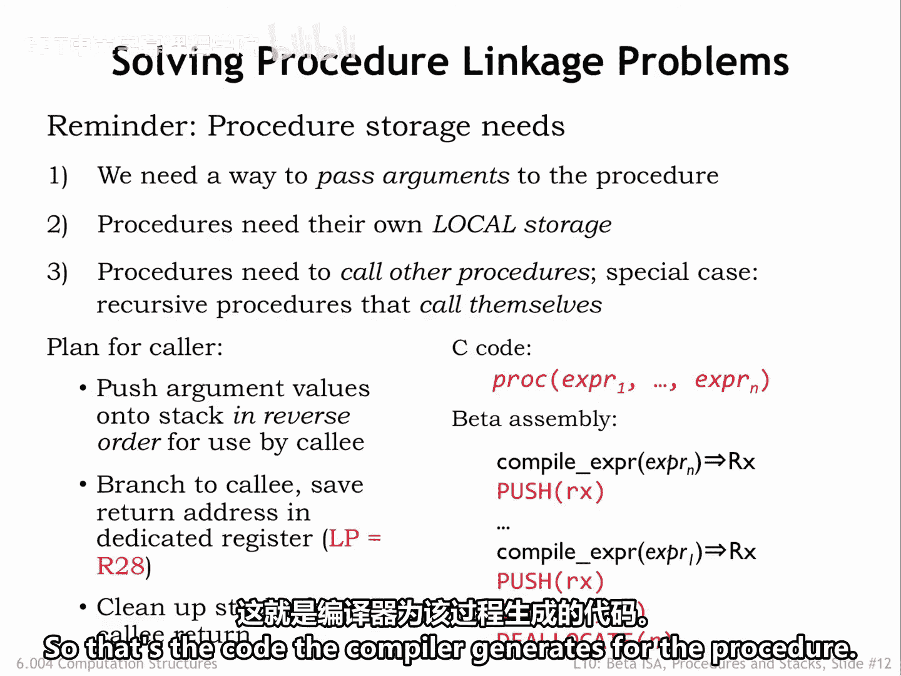
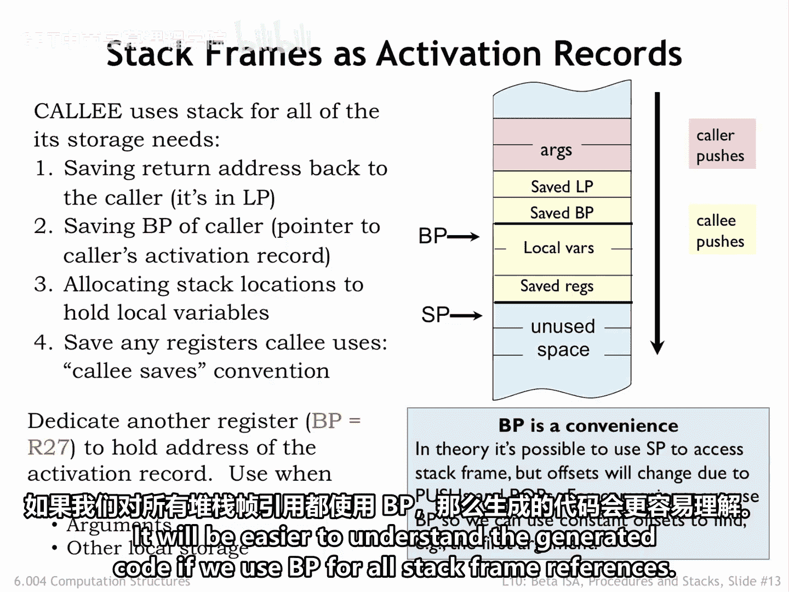
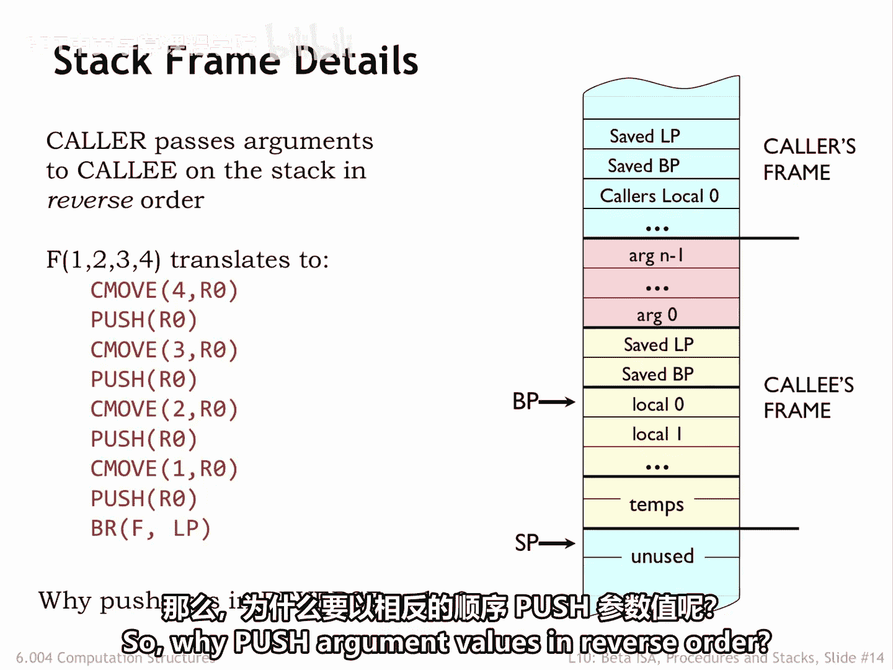
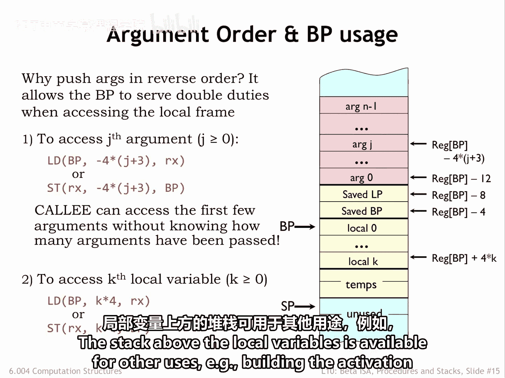

# 数字系统与计算机架构：P2：栈帧组织 🧱

在本节课中，我们将学习过程调用中栈帧的组织方式。栈帧，也称为活动记录，用于存储过程调用所需的信息，包括参数、局部变量和返回地址。我们将详细讲解调用者和被调用者如何协作来构建和销毁栈帧，并解释为何采用特定的参数压栈顺序。

---

## 栈帧的用途

我们使用栈来保存过程的活动记录，该记录包含了过程调用时参数的值。

我们会在栈上分配字（words）来保存过程的局部变量的值，这是假设我们没有将它们保存在寄存器中的情况。

我们还将使用栈来保存返回地址，以便过程可以进行嵌套的过程调用，而不会覆盖其自身的返回地址。

---

## 调用者与被调用者的责任

分配和释放活动记录的责任将由调用过程（调用者）和被调用过程（被调用者）共同承担。

调用者负责计算参数表达式的值，并将这些值保存在栈上正在构建的活动记录中。

我们将采用一个约定：参数以**逆序**压入栈中。换句话说，第一个参数将是最后一个被压入栈的。我们将在几页幻灯片后解释为何做出这个选择。

为过程编译的代码涉及一系列表达式求值，每个求值之后都跟着一个压栈操作，以将计算出的值保存在栈上。因此，当被调用过程开始执行时，栈顶包含第一个参数的值，下一个字包含第二个参数的值，依此类推。

在所有参数值（如果有的话）被压入栈后，会有一条分支指令将控制权转移到过程的入口点，同时将分支指令后的下一条指令地址保存在链接指针寄存器（R28，我们将其专用于此目的）中。

当被调用者返回，执行在调用者中恢复时，会使用一个解分配器（deallocator）从栈中移除所有参数值，以维持栈的纪律。

以上就是编译器为调用过程生成的代码。其余的工作发生在被调用过程中。

---

## 被调用过程的初始化代码

被调用过程开始处的代码负责完成活动记录的分配。由于完成后，活动记录将占据栈上连续的一批字，我们有时会称活动记录为**栈帧**，以提醒我们它的存储位置。

第一个动作是保存链接指针寄存器（LP）中的返回地址。这释放了LP，使其可以被被调用者主体内的任何嵌套过程调用使用。

为了便于访问存储在活动记录中的值，我们将指定另一个称为**基址指针**（BP或R27）的寄存器，它将指向我们正在构建的栈帧。因此，在进入过程时，代码会保存指向调用者栈帧的指针，然后使用栈指针的当前值使BP指向当前的栈帧。我们稍后将看到如何使用BP。

接下来，代码将在栈帧中分配字来保存被调用者的局部变量的值（如果有的话）。

最后，被调用者需要保存它在执行其余代码时将使用的任何寄存器的值。这些保存的值可用于在返回调用者之前恢复寄存器的值。这被称为**被调用者保存约定**，即被调用者保证所有寄存器值在过程调用前后保持不变。

有了这个约定，调用者中的代码可以假设，在嵌套过程调用之前放置在寄存器中的任何值，在嵌套调用返回后仍然存在。

请注意，专门指定一个寄存器作为基址指针并非绝对必要。所有对栈上值的访问都可以相对于栈指针进行，但从SP的偏移量会随着值被压入和弹出栈而改变（例如，在过程调用期间）。如果我们使用BP进行所有栈帧引用，将更容易理解生成的代码。

---

## 参数顺序的考量

现在让我们回到关于栈帧中参数值顺序的问题。我们采用了以逆序压入值的约定。换句话说，第一个参数的值是最后一个被压入的。

那么，为什么要以逆序压入参数值呢？

当参数以逆序压入时，标记为`arg0`的第一个参数将位于相对于基址指针的固定偏移处，而不管压入栈的参数值有多少个。

编译器可以使用一个简单的公式来确定任何特定参数的正确BP偏移值。因此，第一个参数在偏移量`-12`处，第二个在`-16`处，依此类推。为什么这很重要？

一些语言（如C）支持具有可变数量参数的过程调用。通常，过程可以从（例如）第一个参数确定期望有多少个额外参数。典型的例子是C的`printf`函数，其第一个参数是一个格式字符串，指定应如何打印一系列值。

因此，对`printf`的调用包括格式字符串参数，加上数量不定的额外参数。根据我们的调用约定，格式字符串将始终位于相对于BP的相同位置，因此`printf`代码可以找到它，而无需知道当前调用中有多少个额外参数。

局部变量也位于相对于BP的固定偏移处。第一个局部变量在偏移量`0`处，第二个在偏移量`4`处，依此类推。因此，我们看到，拥有一个基址指针使得使用在编译时可确定的固定偏移量来访问参数和局部变量的值变得容易。

局部变量上方的栈空间可用于其他用途，例如，为嵌套过程调用构建活动记录。

---

## 总结

本节课中，我们一起学习了栈帧的组织结构。我们了解到栈帧用于存储过程调用的上下文信息，其构建由调用者和被调用者共同完成。调用者负责按逆序压入参数并处理返回地址，而被调用者则负责保存返回地址、设置基址指针、分配局部变量空间并遵循被调用者保存约定。采用逆序压参和基址指针的设计，特别是为了支持像C语言中`printf`这样的可变参数函数，使得参数访问更简单、更灵活。理解栈帧的组织是理解过程调用机制和编译器生成代码的关键。