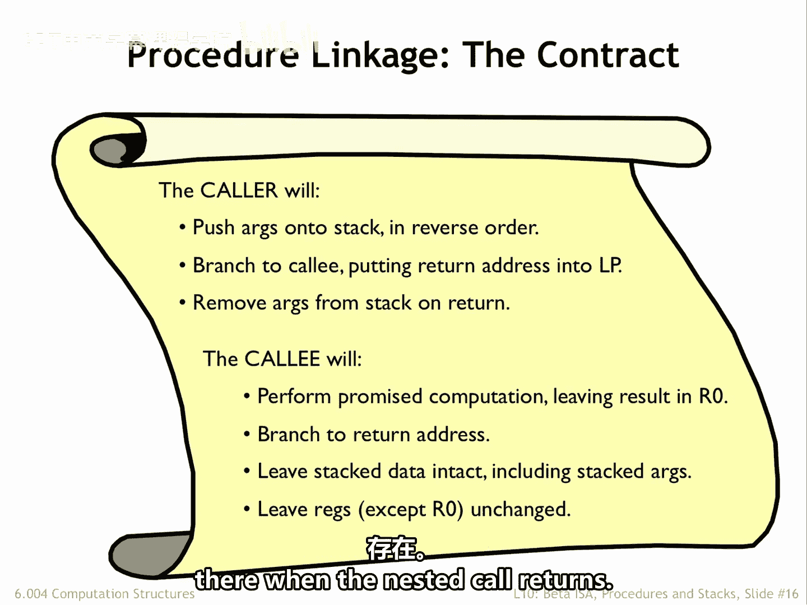
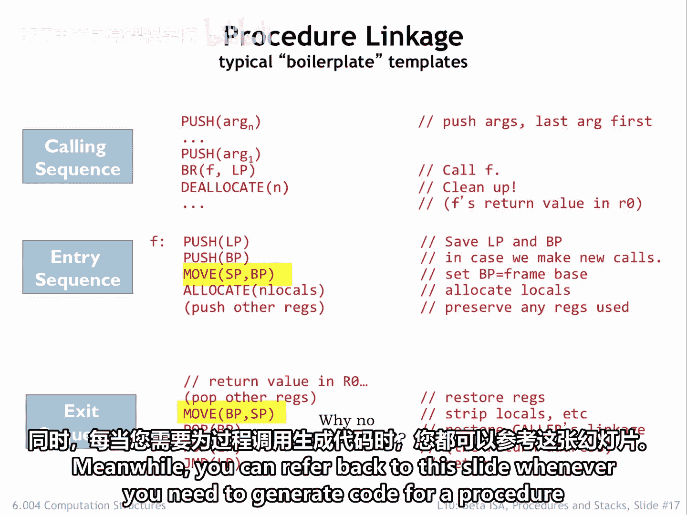
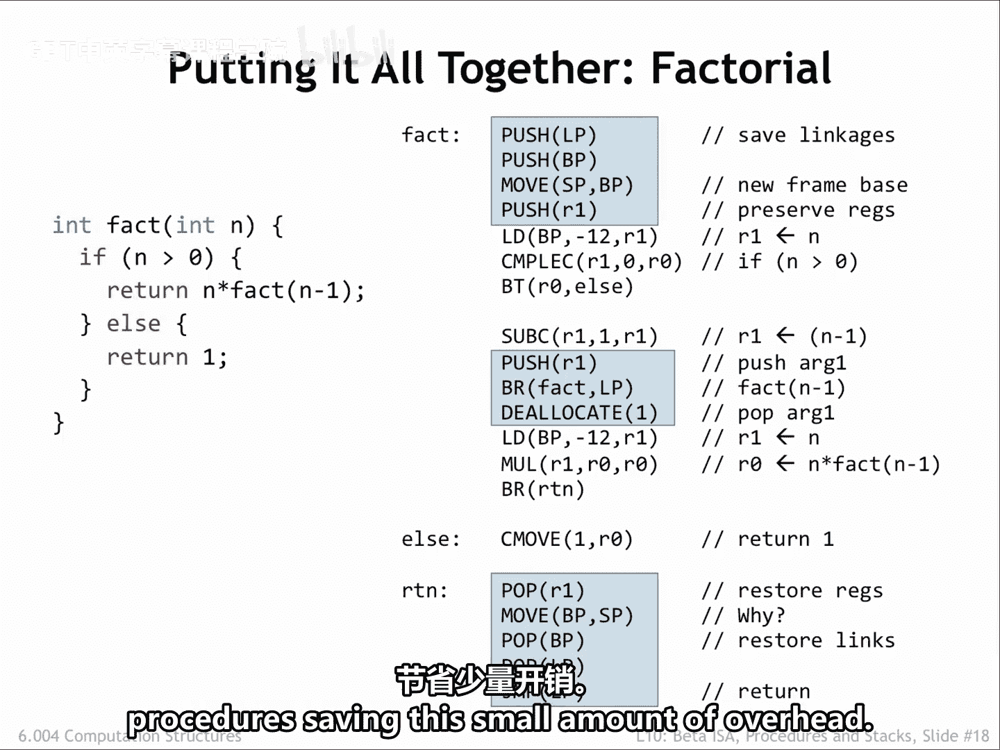
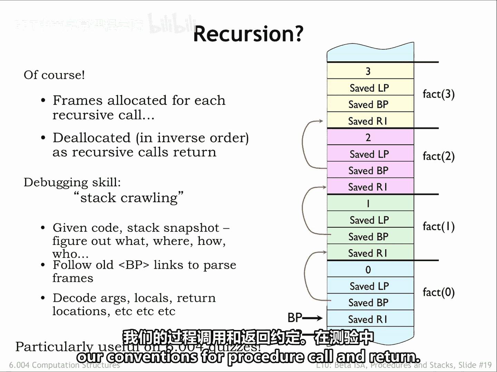

# 【数字系统与计算机架构P2 6.004 2017】麻省理工学院—中英字幕 p10 12.2.4 Compiling a Procedure -BV19m41127Kj_p10-

Okay， here's our final contract for how procedure calls will work。The calling procedure。

 caller will push the arguments onto the stack in reverse order。

 branch to the entry point of the callee， putting the return address into the linkage pointer。

When the collie returns， remove the argument values from the stack。

The called procedure or callee will perform the promised computation leaving the result in R0。

Jump to the return address when the computation has finished。

Remove any items that is placed on the stack， leaving the stack as it was when the procedure was entered。

Note that the arguments were pushed onto the stack by the collarer。

 so it will be up to the collarer to remove them。Preserve the values in all registers except R0。

 which holds the return value。So the caller can assume any values placed in registers before a nested call will be there when the nested call returns。

We saw the code template for procedure calls on an earlier slide。

Here's the template for the entry point to our Proced F。

The code saves the caller's LP and BPP values， initializes BPP for the current stack frame。

 and allocates words on the stack to hold any local variable values。

The final step is to push the value of any registers besides our zero that will be used by the remainder of the procedure code。

The template for the exit sequence mirrors the actions of the entry sequence。

 restoring all the values saved by the entry sequence。

 performing the pop operations and the reverse of the order of the push operations in the entry sequence。

Note that in moving the BP value into S， we've reset the stack to its state at the point of the move SPBP in the entry sequence。

 This implicitly undoes the effect of the allocate statement in the entry sequence。

 so we don't need a matching D allocatecate in the exit sequence。

The last instruction in the exit sequence transfers control back to the calling procedure。

With practice， you'll become familiar with these code templates。 Meanwhile。

 you can refer back to this slide whenever you need to generate code for a proced。

Here's the code our compiler would generate for the C implementation of factorial shown on the left。

The entry sequence saves the calls LP and BPP then initializes BPP for the current stack frame。

The value of R1 is safe， so we can use R1 in code that follows。

The Esic sequence restores all the saved values， including that for R1。

The code for the body of the procedure has arranged for R0 to contain the return value by the time execution reaches the exit sequence。

The nested procedure call passes the argument value on the stack and removes it after the nested call returns。

The remainder of the code is generated using the templates we saw in the previous lecture。

Aside from computing and pushing the values of the arguments。

 there are approximately 10 instructions needed to implement the linking approach to a procedure call。

That's not much for a procedure of any size， but might be significant for a trivial procedure。

As mentioned earlier， some optimizing compilers can make the trade off of inlining small non recursive procedures。

 saving this small amount of overhead。

So have we solved the activation， record storage issue for recursive procedures， Yes。

 a new stack frame is allocated for each procedure call in each frame。

 we see the storage for the argument and return address。And as the nested calls return。

 the stack frames will be delocd in inverse order。Interestingly。

 we can learn a lot about the current state of execution by looking at the active stack frames。

The current value of B P， along with the older values saved in the activation records。

 allow us to identify the active procedure calls and determine their arguments。

 The values of any local variables for active calls and so on。

If we print out all this information at any given time。

 we would have a stack trace showing the progress of the computation。 In fact， when a problem occurs。

 many language run times will print out that stack trace to help the programmer determine what happened。

And of course， if you can interpret the information in the stack frame。

 you can show you understand our conventions for for call and return。

Don't be surprised to find such a question on a quiz。

