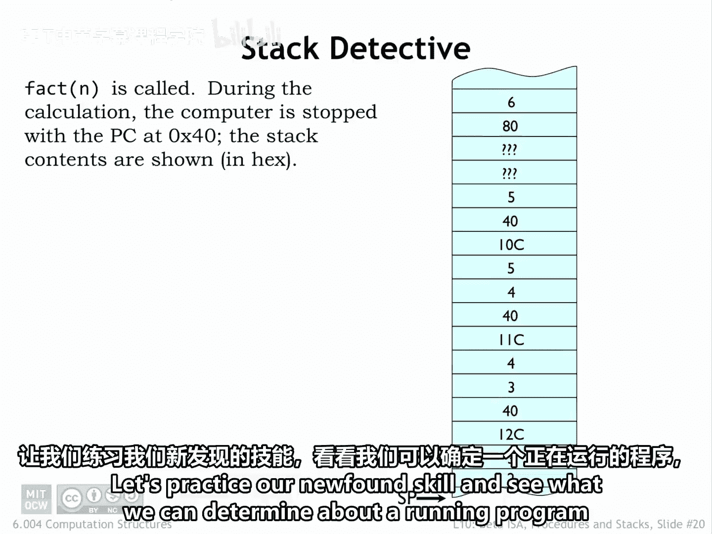
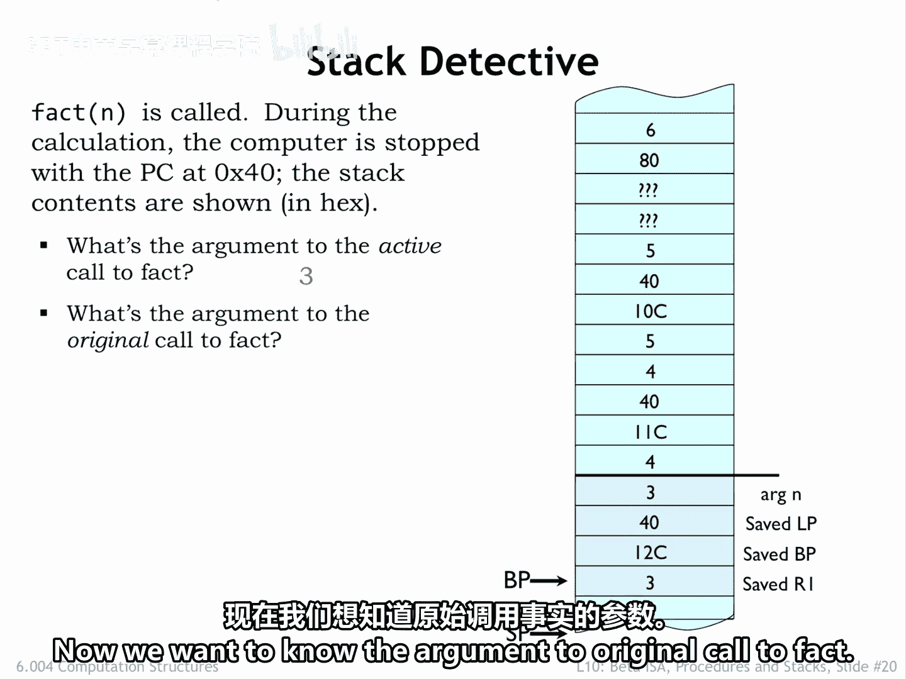
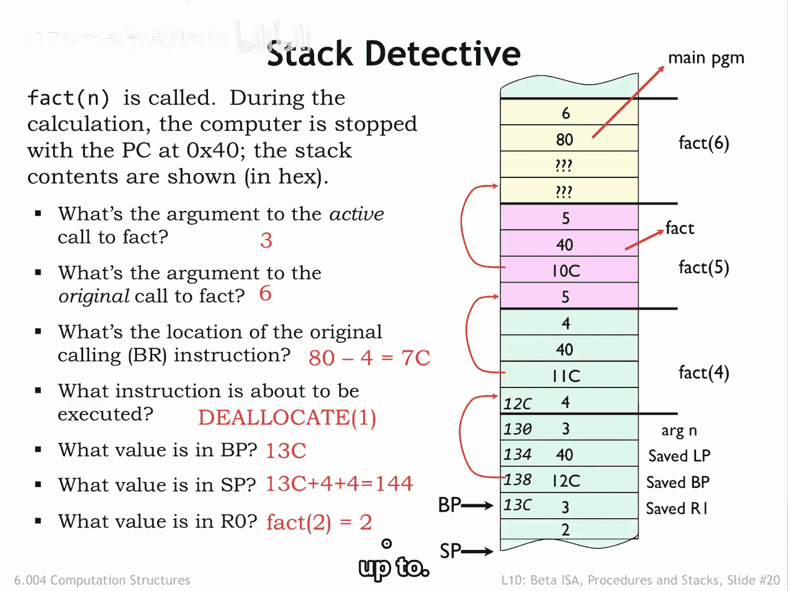
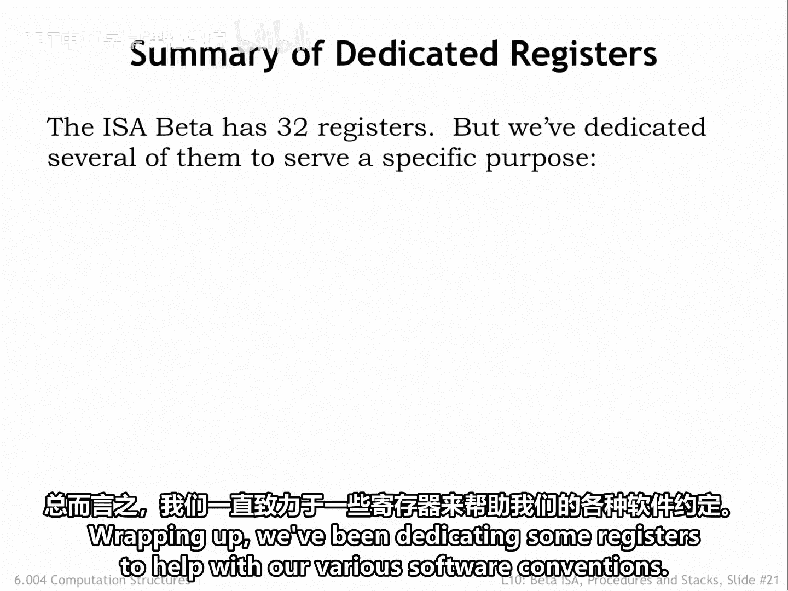
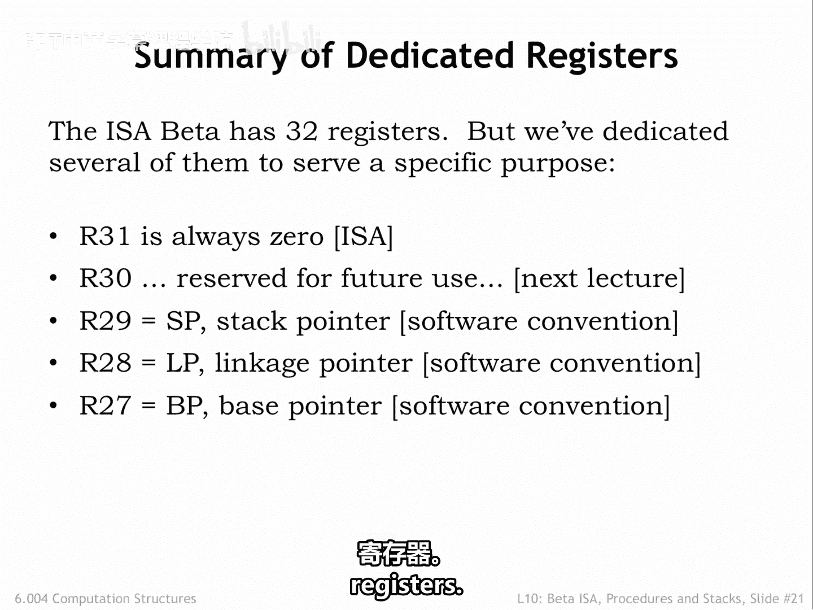
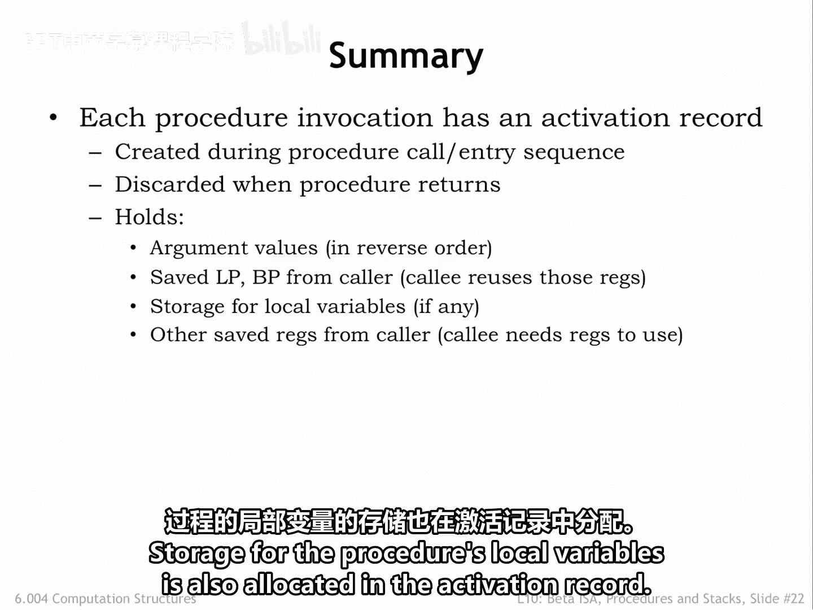
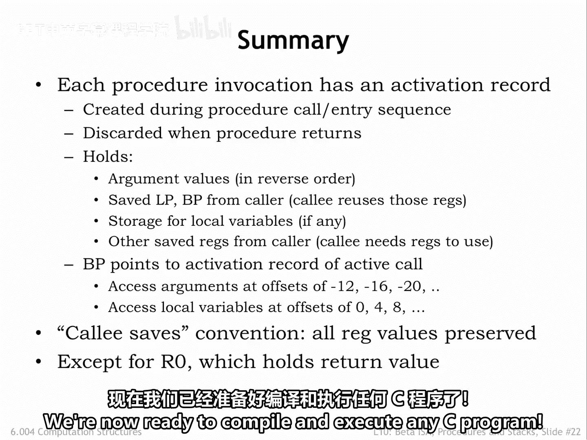

# 【数字系统与计算机架构P2 6.004 2017】麻省理工学院—中英字幕 p11 12.2.5 Stack Detective -BV19m41127Kj_p11-

Let's practice our new foundund skill and see what we can determine about a running program。

 which we've stopped somewhere in the middle of its execution。

We're told that a computation of fact is in progress and that the PC of the next instruction to be executed is Hex 40。

Were also given the stacked dump shown on the right。Since we're in the middle of a fact computation。

 we know that the current stack frame and possibly others is an activation record for the fact function。

Using the code on the previous slide， we can determine the layout of the stack frame and generate the annotations shown on the right of the stack dump。

With the annotations， it's easy to see that the argument to the current Act call is the value3。Now。

 we want to know the argument to the original called effect。

We'll have to label the other stack frames using the save toBP values。

Looking at the saved LP values for each frame， always found at offset minus 8 from the framesB。

We see that many of the saved values are hex40， which must be the return address for the recursive fact calls。

Looking through the stack frames， we find the first return address that's not Hex40。

 which must be a return address to code that's not part of the fact procedure。

This means we found the stack frame created by the original cult effect。

And can see that the argument to the original call is6。

What's the location of the branch that made the original call。Well。

 the saved LP and the stack frame of the original call to fact is HeX 80。

That's the address of the instruction following the original call so the branch that made the original call is one instruction earlier at location He 7 c。

To answer these questions， you have to be good at hex arithmetic。

What instruction is about to be executed。We were told this address is Hex40。

 which we notice is the saved LP value for all the recursive fact calls。

 so Hex 40 must be the address of the instruction following the branch fact comm LP instruction in the fact code。

Looking back a few slides at the fact code， we see that say dealcate one instruction。

What value is inBP？Hm。😊，We know that BP is the address of the stack location containing the saved R1 value in the current stack frame。

So the saved BPP value in the current stack frame is the address of the saved R1 value in the previous stack frame。

So the saved BPP value gives us the address of a particular stack location from which we can derive the addresses of all other locations。

Counting forward， we find that the value in BPP must be hex 13C。What value is in SP？

Since we're about to execute the decate to remove the argument of the nested call from the stack。

 that argument must be still on the stack right after the saved R1 value。

Since S P points to the first unused stack location， it points to the location after that word。

 So it has the value Hex 144。Finally， what value is in R 0？

Since we've just returned from a called a fact of 2。

 the value in R0 must be the result from that recursive call， which is2。Wow。

 you can learn a lot from the stacked activation records and a little deduction。

Since the state of the computation is represented by the values of the PC， the registers。

 and main memory， once we're given that information。

 we can tell exactly what the program has been up to。

Pretty neat。Wrapping up， we've been dedicating some registers to help with our various software conventions to summarize R 31 is O0 as defined by the ISA。

We'll also dedicate R30 to a particular function in the ISA when we discuss the implementation of the beta in the next lecture。

Meanwhile， don't use R 30 in your code。The remaining dedicated registers are connected with our software conventions。

R29 SP is used as the stack pointer。R28 LP is used as the linkage pointer。

 and R27 BP is used as the base pointer。As you practice reading and writing code。

 you'll grow familiar with these dedicated registers。

In thinking about how to implement procedures， we discovered the need for an activation record to store the information needed by any active procedure call。

An activation record is created by the caller and callee at the start of her procedure call。

And the record can be discarded when the procedure is complete。

The activation records hold argument values， saved LP and BP values。

 along with the caller's values in any other of the registers。

Storage for the procedure's local variables is also allocated in the activation record。

We use BP to point to the current activation record。

 giving easy access to the values of the arguments and local variables。

We adopted a callee Sas convention where the called procedure is obligated to preserve the values in all registers except are zero。

Tn together， these conventions allow us to have procedures with arbitrary numbers of arguments and local variables with nested and recursive procedure calls。

We're now ready to compile and execute any EC program。

